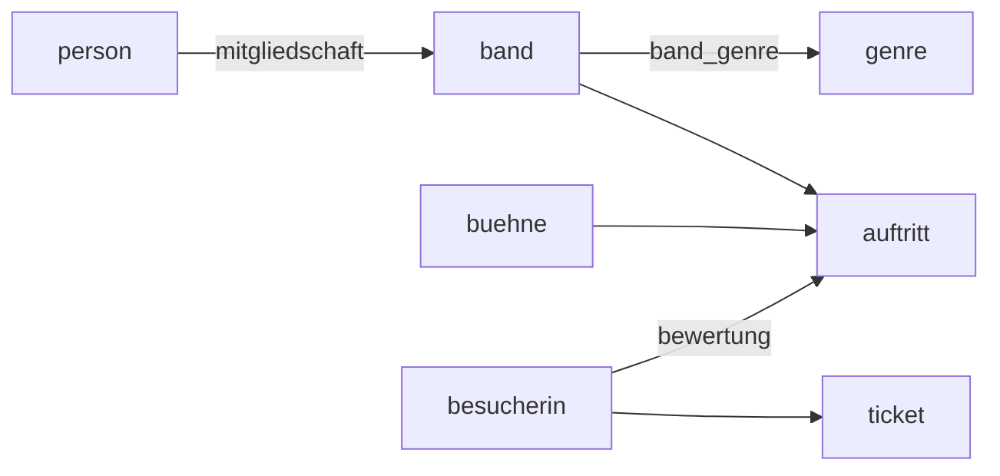

# Die Festivaldatenbank

Mit dieser Datenbank arbeitest du den ganzen Lernpfad über. Es lohnt sich, sie einmal gründlich anzusehen – so, wie man sich in einem fremden Programm zuerst umsieht, bevor man etwas ändert.

## Das Datenbankschema

```
band(band_id, name, gruendungsjahr, herkunftsland)
genre(genre_id, name)
band_genre(band_id, genre_id)
person(person_id, vorname, nachname, geburtsjahr, land)
mitgliedschaft(person_id, band_id, instrument, seit)
buehne(buehne_id, name, kapazitaet, ueberdacht)
auftritt(auftritt_id, band_id, buehne_id, datum, beginn, dauer_min, zuschauer)
besucherin(besucher_id, vorname, nachname, geburtsjahr, plz, email)
ticket(ticket_id, besucher_id, kategorie, preis, kaufdatum)
bewertung(besucher_id, auftritt_id, punkte)
```

Die jeweils ersten Attribute sind die :t[Primärschlüssel]{#primaerschluessel}; bei `band_genre`, `mitgliedschaft` und `bewertung` sind es die ersten **beiden** zusammen.

Und so hängen die Tabellen zusammen:



:::snippet{#merken}
Im Datenbankbaum links in der IDE siehst du dasselbe: alle Tabellen, ihre Spalten, die Datentypen und – hinter den Fremdschlüsseln – auf welche Tabelle sie verweisen. Klapp ihn auf, wann immer du einen Spaltennamen suchst. Das ist schneller als raten.
:::

## Umsehen

:::sqlide{db="/datenbanken/klangwiese.sqlite" height="690px"}

```mysql Umsehen.sql
SELECT * FROM band;

SELECT * FROM buehne;

SELECT * FROM auftritt;

SELECT * FROM genre;
```

:::

:::snippet{#aufgabe}
Setze den Cursor nacheinander in jede der vier Anweisungen und führe sie mit ▷ aus.

a) Wie viele Bands, Bühnen, Auftritte und Genres gibt es?

b) Über wie viele Tage läuft das Festival? Woran erkennst du das?

c) In der Tabelle `buehne` steht in der Spalte `ueberdacht` nur 0 oder 1. Was bedeutet das vermutlich, und warum steht dort nicht „ja" und „nein"?
:::

::::collapsible{title="Tipp: Wo steht die Anzahl?"}

Über der Ergebnistabelle steht *1-22/22* – die Zahl hinter dem Schrägstrich ist die Gesamtzahl. Alternativ zeigt der Datenbankbaum links hinter jedem Tabellennamen die Anzahl der Datensätze.

::::

:::protect{password="db-1-3-1" description="Lösung. Erfrage das Passwort bei deiner Lehrkraft."}

a) 22 Bands, 4 Bühnen, 46 Auftritte, 8 Genres.

b) Vier Tage, vom 16. bis zum 19. Juli 2026. Zu sehen an den verschiedenen Werten in der Spalte `datum` der Tabelle `auftritt`.

c) 0 steht für „nicht überdacht", 1 für „überdacht". SQLite kennt keinen eigenen Wahrheitswert-Datentyp; Wahrheitswerte werden als 0 und 1 gespeichert. Der Vorteil gegenüber „ja"/„nein": Man muss sich nicht auf eine Schreibweise einigen (ja/Ja/JA/yes/true …), und man kann damit rechnen – `SUM(ueberdacht)` liefert direkt die Anzahl der überdachten Bühnen.

:::

## Eine erste eigene Abfrage

Der Grundaufbau jeder Abfrage sieht so aus:

:::snippet{#merken}
```sql
SELECT  spalten        -- was soll im Ergebnis stehen?
  FROM  tabelle        -- woher kommen die Zeilen?
 WHERE  bedingung      -- welche Zeilen kommen ins Ergebnis?
```

Das Ergebnis einer Abfrage ist selbst wieder eine **Tabelle**. Die ursprüngliche Tabelle bleibt unverändert.
:::

:::sqlide{db="/datenbanken/klangwiese.sqlite" height="450px"}

```mysql Aufgabe.sql
-- Vorlage. Ersetze die Platzhalter.
SELECT name, gruendungsjahr
  FROM band
 WHERE herkunftsland = 'Deutschland';
```

:::

:::snippet{#aufgabe}
a) Sag zuerst voraus, wie viele Zeilen die Abfrage liefert. Führe sie dann aus.

b) Ändere sie so ab, dass sie alle Bands zeigt, die **nicht** aus Deutschland kommen.

c) Zeige alle Bühnen mit einer Kapazität über 1000, mit Namen und Kapazität.

d) Zeige alle Auftritte am 19. Juli 2026.
:::

::::collapsible{title="Tipp 1: ungleich"}

Für „ist nicht gleich" schreibt man in SQL `<>` (oder `!=`).

::::

::::collapsible{title="Tipp 2: Texte und Zahlen"}

Texte stehen in einfachen Anführungszeichen: `'Deutschland'`. Zahlen stehen ohne: `1000`. Ein Datum wird hier als Text gespeichert, kommt also ebenfalls in Anführungszeichen: `'2026-07-19'`.

::::

:::protect{password="db-1-3-2" description="Lösung. Erfrage das Passwort bei deiner Lehrkraft."}

a) 15 Bands.

b)

```sql Loesung_b.sql
SELECT name, gruendungsjahr
  FROM band
 WHERE herkunftsland <> 'Deutschland';
```

7 Bands.

c)

```sql Loesung_c.sql
SELECT name, kapazitaet
  FROM buehne
 WHERE kapazitaet > 1000;
```

3 Bühnen: Hauptbuehne, Waldbuehne, Zeltbuehne.

d)

```sql Loesung_d.sql
SELECT *
  FROM auftritt
 WHERE datum = '2026-07-19';
```

11 Auftritte.

:::

:::snippet{#brain}
In der Datenbank stehen keine Umlaute – die Bühne heißt `Hauptbuehne`, das Land `Oesterreich`. Das ist keine Schlampigkeit, sondern eine bewusste Entscheidung des Festivalteams: Die Daten sollen sich zwischen verschiedenen Systemen austauschen lassen, ohne dass die Zeichenkodierung Ärger macht.

Überlege: Welchen Preis zahlt man dafür? Was passiert, wenn jemand nach `Österreich` sucht?
:::

<!--
KLP QPh, Formale Sprachen und Automaten: verwenden eine Datenbanksprache zum
Abfragen von Daten (I). Erster Kontakt; systematisch in Kapitel 2.
-->

---

## Selbsttest

::::multievent

**1. Wie viele Tabellen hat die Festivaldatenbank?**

{z{10}}

{h{Zähle die Zeilen im Datenbankschema oben nach.}}
{H{Richtig!}}

**2. Was ist das Ergebnis einer SELECT-Abfrage?**

{r1{Eine einzelne Zahl.}}

{r1{!Wieder eine Tabelle.}}

{r1{Eine Änderung an der ursprünglichen Tabelle.}}

{r1{Eine Liste von Spaltennamen.}}

{h{Was hast du im Ergebnisbereich der IDE gesehen?}}
{H{Genau. Und die ursprüngliche Tabelle bleibt dabei unverändert.}}

**3. Welcher Teil einer Abfrage entscheidet, welche Zeilen ins Ergebnis kommen?**

{r2{SELECT}}

{r2{FROM}}

{r2{!WHERE}}

{r2{ORDER BY}}

{h{SELECT wählt Spalten aus. Gesucht ist der Teil für die Zeilen.}}
{H{Richtig. SELECT wählt Spalten, WHERE wählt Zeilen.}}

**4. Wie schreibt man in einer Bedingung einen Text?**

{r3{ohne Anführungszeichen}}

{r3{!in einfachen Anführungszeichen}}

{r3{in doppelten Anführungszeichen}}

{r3{in eckigen Klammern}}

{h{Erinnere dich an Deutschland in der Beispielabfrage.}}
{H{Richtig. Zahlen dagegen stehen ohne Anführungszeichen.}}

**5. Welche Tabellen brauchst du, um herauszufinden, welche Person welches Instrument in welcher Band spielt?** (Mehrfachauswahl)

{c1{!person}}

{c1{!mitgliedschaft}}

{c1{!band}}

{c1{auftritt}}

{h{Das Instrument steht nicht bei der Person und nicht bei der Band, sondern dazwischen.}}
{H{Richtig. Wie man solche Tabellen verbindet, lernst du in Kapitel 3.}}

::::
