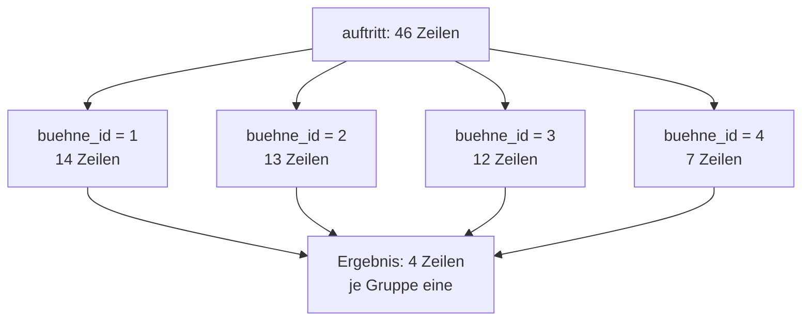

# Gruppieren mit GROUP BY

Eine Aggregatfunktion allein liefert **eine** Zahl für die ganze Tabelle. Meistens will man aber eine Zahl **je Gruppe**: je Bühne, je Band, je Tag.

## Die Idee

:::sqlide{db="/datenbanken/klangwiese.sqlite" height="610px"}

```mysql Gruppieren.sql
SELECT COUNT(*) AS auftritte FROM auftritt;

SELECT buehne_id, COUNT(*) AS auftritte
  FROM auftritt
 GROUP BY buehne_id
 ORDER BY buehne_id;
```

:::

:::snippet{#definition}
`GROUP BY spalte` teilt die Zeilen in **Gruppen** auf: Alle Zeilen mit demselben Wert in dieser Spalte bilden eine Gruppe. Danach wird jede Aggregatfunktion **je Gruppe** ausgerechnet.

Das Ergebnis hat so viele Zeilen, wie es Gruppen gibt.
:::

So kann man sich das vorstellen:



## Die goldene Regel

:::snippet{#merken}
Jede Spalte in der `SELECT`-Liste muss entweder

- im `GROUP BY` stehen **oder**
- in einer Aggregatfunktion stecken.

Der Grund ist derselbe wie in der letzten Lektion: Eine Gruppe steht für viele Zeilen. Ein einzelner Spaltenwert daneben wäre nicht eindeutig – es sei denn, nach dieser Spalte wurde gerade gruppiert, dann ist er in der ganzen Gruppe gleich.
:::

:::sqlide{db="/datenbanken/klangwiese.sqlite" height="760px"}

```mysql Regel.sql
-- Erlaubt: buehne_id steht im GROUP BY, alles andere ist aggregiert.
SELECT buehne_id,
       COUNT(*) AS auftritte,
       SUM(zuschauer) AS zuschauer_gesamt,
       ROUND(AVG(dauer_min), 1) AS mittlere_dauer
  FROM auftritt
 GROUP BY buehne_id;

-- Gefährlich: datum steht weder im GROUP BY noch in einer Funktion.
SELECT buehne_id, datum, COUNT(*)
  FROM auftritt
 GROUP BY buehne_id;
```

:::

:::snippet{#aufgabe}
Führe beide Abfragen aus.

a) Was liefert die zweite in der Spalte `datum`? Woher stammt dieser Wert?

b) Warum ist das Ergebnis trotzdem gefährlich, obwohl keine Fehlermeldung erscheint?

c) Ergänze die zweite Abfrage so, dass sie sinnvoll wird – und zwar auf **zwei** verschiedene Arten.
:::

:::protect{password="db-4-2-1" description="Lösung. Erfrage das Passwort bei deiner Lehrkraft."}

a) SQLite liefert das Datum irgendeiner Zeile aus der Gruppe. Welche das ist, ist nicht festgelegt.

b) Weil das Ergebnis so aussieht, als gehöre das Datum zur ganzen Gruppe. Tatsächlich fanden auf jeder Bühne an vier verschiedenen Tagen Auftritte statt. Wer die Tabelle liest, zieht einen falschen Schluss – und nichts weist ihn darauf hin. Andere Datenbanksysteme, etwa PostgreSQL, lehnen diese Abfrage ab.

c) Erste Möglichkeit: `datum` mit ins `GROUP BY` nehmen. Dann gibt es eine Gruppe je Kombination aus Bühne und Tag.

```sql Variante_1.sql
SELECT buehne_id, datum, COUNT(*) AS auftritte
  FROM auftritt
 GROUP BY buehne_id, datum
 ORDER BY buehne_id, datum;
```

Zweite Möglichkeit: `datum` aggregieren, wenn man wirklich nur einen Wert will.

```sql Variante_2.sql
SELECT buehne_id, MIN(datum) AS erster_tag, COUNT(*) AS auftritte
  FROM auftritt
 GROUP BY buehne_id;
```

Jetzt ist klar, was die Spalte bedeutet: der früheste Tag, an dem auf dieser Bühne gespielt wurde.

:::

## Gruppieren nach mehreren Spalten

:::sqlide{db="/datenbanken/klangwiese.sqlite" height="450px"}

```mysql Mehrfach.sql
SELECT datum, buehne_id, COUNT(*) AS auftritte, SUM(dauer_min) AS minuten
  FROM auftritt
 GROUP BY datum, buehne_id
 ORDER BY datum, buehne_id;
```

:::

:::snippet{#merken}
Bei mehreren Spalten bildet jede **Kombination** von Werten eine eigene Gruppe. Aus 4 Tagen und 4 Bühnen werden hier 16 Gruppen.
:::

## Gruppieren mit Verbund

Das ist der Regelfall: Erst verbinden, dann gruppieren.

:::sqlide{db="/datenbanken/klangwiese.sqlite" height="760px"}

```mysql MitVerbund.sql
SELECT s.name AS buehne, COUNT(*) AS auftritte, SUM(a.zuschauer) AS zuschauer
  FROM auftritt AS a
  JOIN buehne AS s ON a.buehne_id = s.buehne_id
 GROUP BY s.name
 ORDER BY zuschauer DESC;

SELECT b.name AS band, COUNT(*) AS auftritte
  FROM auftritt AS a
  JOIN band AS b ON b.band_id = a.band_id
 GROUP BY b.name
 ORDER BY auftritte DESC, b.name;

SELECT g.name AS genre, COUNT(*) AS bands
  FROM band_genre AS bg
  JOIN genre AS g ON g.genre_id = bg.genre_id
 GROUP BY g.name
 ORDER BY bands DESC;
```

:::

## Aufgaben

:::sqlide{db="/datenbanken/klangwiese.sqlite" height="760px"}

```mysql Uebung.sql
-- UNGEPRUEFT: Platz für deine Lösungen.
-- a)

-- b)

-- c)

-- d)

```

:::

:::snippet{#aufgabe}
a) Wie viele Tickets wurden je Kategorie verkauft, und wie hoch ist der Umsatz je Kategorie? Absteigend nach Umsatz.

b) Wie viele Auftritte gab es an jedem Festivaltag?

c) Wie viele Menschen spielen je Instrument? Absteigend sortiert.

d) Wie hoch ist die durchschnittliche Bewertung je Band? Zeige Bandname und Durchschnitt auf zwei Nachkommastellen, beste zuerst.
:::

::::collapsible{title="Tipp 1: zu d)"}

Die Punkte stehen in `bewertung`, der Bandname in `band`. Dazwischen liegt `auftritt` – eine Bewertung gehört zu einem *Auftritt*, nicht direkt zu einer Band. Also drei Tabellen.

::::

::::collapsible{title="Tipp 2: Wonach gruppiere ich?"}

Die Frage „je …?" verrät es immer: „je Kategorie" → `GROUP BY kategorie`, „je Band" → `GROUP BY b.name`.

::::

:::protect{password="db-4-2-2" description="Lösung. Erfrage das Passwort bei deiner Lehrkraft."}

```sql Loesungen.sql
-- a) 4 Zeilen, Wochenendticket mit Camping liegt mit 12824.0 vorn
SELECT kategorie, COUNT(*) AS anzahl, SUM(preis) AS umsatz
  FROM ticket
 GROUP BY kategorie
 ORDER BY umsatz DESC;

-- b) 4 Zeilen: 10, 12, 13 und 11 Auftritte
SELECT datum, COUNT(*) AS auftritte
  FROM auftritt
 GROUP BY datum
 ORDER BY datum;

-- c) 12 Zeilen, Gesang liegt mit 19 vorn
SELECT instrument, COUNT(*) AS anzahl
  FROM mitgliedschaft
 GROUP BY instrument
 ORDER BY anzahl DESC, instrument;

-- d) 22 Zeilen
SELECT b.name AS band, ROUND(AVG(w.punkte), 2) AS schnitt
  FROM bewertung AS w
  JOIN auftritt AS a ON a.auftritt_id = w.auftritt_id
  JOIN band AS b ON b.band_id = a.band_id
 GROUP BY b.name
 ORDER BY schnitt DESC;
```

Bei d) lohnt ein zweiter Blick: Ganz oben stehen Bands mit sehr wenigen Bewertungen. Ein Schnitt aus drei Stimmen sagt wenig aus. Wie man solche Gruppen aussortiert, zeigt die [nächste Lektion](./03-gruppen-filtern-mit-having).

:::

<!--
KLP QPh, Formale Sprachen und Automaten: verwenden eine Datenbanksprache zum
Abfragen von Daten (I).
-->

---

## Selbsttest

::::multievent

**1. Wie viele Zeilen liefert eine Abfrage mit GROUP BY?**

{r1{immer eine}}

{r1{so viele wie die Ausgangstabelle}}

{r1{!so viele, wie es Gruppen gibt}}

{r1{das hängt von der Aggregatfunktion ab}}

{h{Denk an das Bild mit den vier Bühnen.}}
{H{Richtig. Jede Gruppe wird zu genau einer Ergebniszeile.}}

**2. Welche Spalten dürfen in der SELECT-Liste stehen, wenn gruppiert wird?** (Mehrfachauswahl)

{c1{!Spalten, die im GROUP BY stehen.}}

{c1{!Spalten innerhalb einer Aggregatfunktion.}}

{c1{beliebige Spalten der Tabelle}}

{c1{nur der Primärschlüssel}}

{h{Warum war datum in der zweiten Beispielabfrage problematisch?}}
{H{Richtig. Alles andere ist innerhalb einer Gruppe nicht eindeutig.}}

**3. Du gruppierst nach zwei Spalten mit 4 bzw. 4 verschiedenen Werten. Wie viele Gruppen können höchstens entstehen?**

{z{16}}

{h{Jede Kombination bildet eine eigene Gruppe.}}
{H{Richtig – höchstens so viele, tatsächlich oft weniger.}}

**4. Was liefert SQLite für eine Spalte, die weder gruppiert noch aggregiert ist?**

{r2{eine Fehlermeldung}}

{r2{den Wert NULL}}

{r2{!einen Wert aus irgendeiner Zeile der Gruppe}}

{r2{den häufigsten Wert der Gruppe}}

{h{Du hast es in der zweiten Beispielabfrage gesehen.}}
{H{Richtig – und genau deshalb ist es so tückisch: Es sieht aus wie ein Ergebnis.}}

**5. Wonach musst du gruppieren, wenn du die Anzahl der Auftritte je Band wissen willst?**

{r3{nach auftritt_id}}

{r3{!nach der Band}}

{r3{nach dem Datum}}

{r3{gar nicht}}

{h{Die Formulierung „je …" nennt immer die Gruppierungsspalte.}}
{H{Richtig. Gruppiert wird nach dem, was hinter „je" steht.}}

::::
