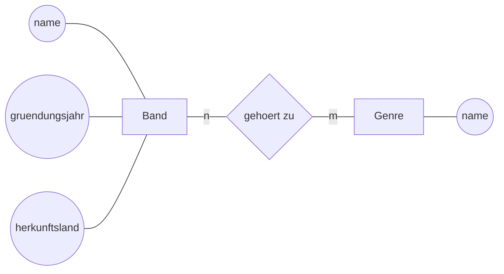
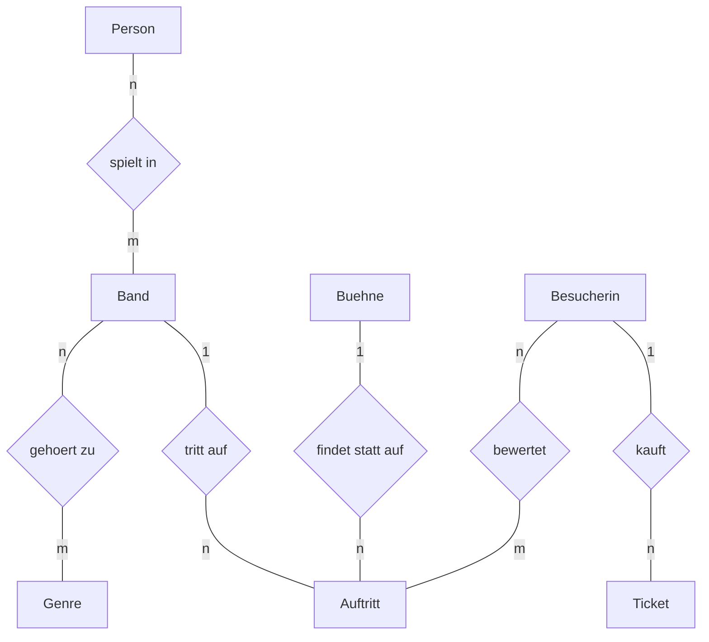
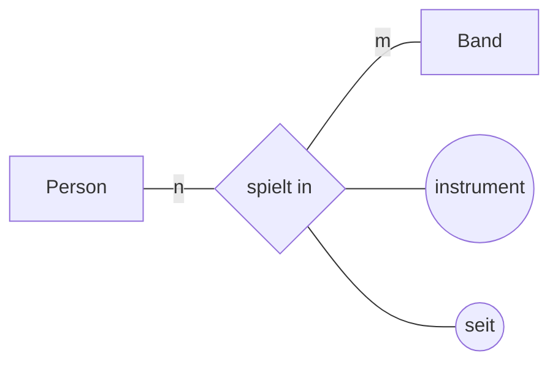
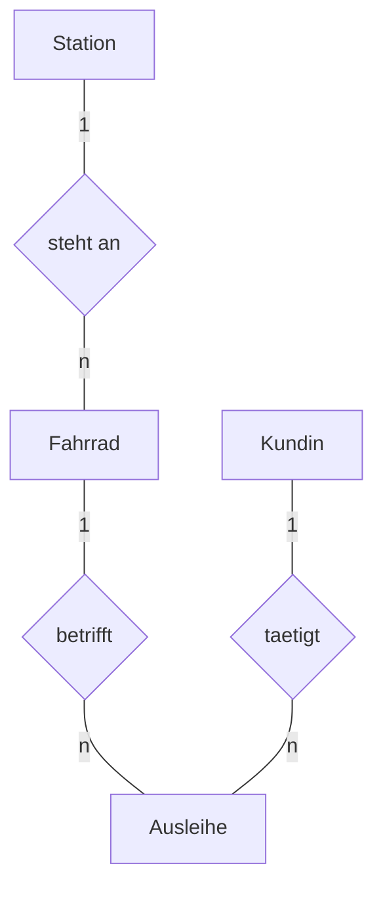
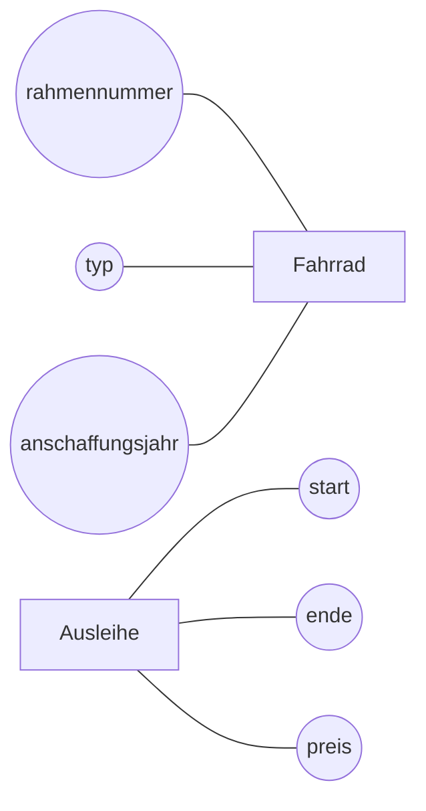

# Entity-Relationship-Diagramme

Ein **:t[Entity-Relationship-Diagramm]{#entity-relationship-diagramm}** (kurz ER-Diagramm) zeichnet auf, was du in den letzten beiden Lektionen herausgearbeitet hast. Der Vorteil gegenüber dem Text: Man sieht Lücken und Widersprüche sofort.

## Die Bausteine

:::snippet{#definition}
| Form | Bedeutung |
| --- | --- |
| **Rechteck** | Entitätstyp |
| **Raute** | Beziehungstyp |
| **Ellipse** | Attribut |
| unterstrichenes Attribut | Schlüsselattribut |
| Beschriftung an der Kante | :t[Kardinalität]{#kardinalitaet} |

Diese Darstellung geht auf Peter Chen zurück (1976) und heißt deshalb **Chen-Notation**.
:::

Ein kleines Beispiel:

## Das ER-Diagramm der Klangwiese

Der Übersicht halber sind die Attribute hier weggelassen – bei größeren Diagrammen ist das üblich.

:::snippet{#merken}
Am Beziehungstyp *spielt in* hängt das Attribut `instrument`. Ein Beziehungsattribut wird an die **Raute** gehängt, nicht an eines der Rechtecke – genau darin liegt seine Aussage.

:::

## Ein Diagramm lesen

:::snippet{#aufgabe}
Beantworte allein anhand des Diagramms oben – ohne in die Datenbank zu sehen:

a) Kann eine Band mehrere Auftritte haben?

b) Kann ein Auftritt auf zwei Bühnen gleichzeitig stattfinden?

c) Kann eine Person in zwei Bands spielen?

d) Kann eine Besucherin denselben Auftritt zweimal bewerten?

e) Woran erkennst du in einem ER-Diagramm, dass eine Zuordnungstabelle nötig sein wird?
:::

:::protect{password="db-5-3-1" description="Lösung. Erfrage das Passwort bei deiner Lehrkraft."}

a) Ja. An der Kante zu *Auftritt* steht `n`.

b) Nein. An der Kante von *Buehne* zu *findet statt auf* steht `1`, also gehört zu jedem Auftritt genau eine Bühne.

c) Ja. *spielt in* ist mit `n` und `m` beschriftet.

d) Nein – jedenfalls nicht im Modell. Eine Beziehung zwischen zwei bestimmten Entitäten gibt es entweder oder nicht; sie kann nicht doppelt vorkommen. Genau das setzt der zusammengesetzte :t[Primärschlüssel]{#primaerschluessel} `(besucher_id, auftritt_id)` in der Tabelle `bewertung` durch. Wollte man mehrere Bewertungen erlauben, bräuchte man ein zusätzliches Schlüsselattribut, etwa das Datum.

e) An einer Raute, an der auf **beiden** Seiten `n` bzw. `m` steht.

:::

## Ein Diagramm zeichnen

:::snippet{#aufgabe}
Zeichne das ER-Diagramm für den **Fahrradverleih** aus den letzten beiden Lektionen. Nimm Papier oder ein Zeichenprogramm.

Achte darauf:

- alle vier Entitätstypen als Rechtecke
- die Beziehungen als Rauten mit sprechenden Namen
- alle Kardinalitäten an den Kanten
- die Attribute als Ellipsen, Schlüsselattribute unterstrichen
:::

::::collapsible{title="Tipp 1: Wie benenne ich eine Beziehung?"}

Nimm das Verb aus dem Ausgangstext und formuliere so, dass sich der Satz von links nach rechts lesen lässt: *Kundin* — **leiht** — *Fahrrad*.

::::

::::collapsible{title="Tipp 2: Wohin mit der Ausleihe?"}

Die Ausleihe hat eigene Attribute (Start, Ende, Preis) und hängt an *zwei* anderen Typen. Behandle sie als eigenen Entitätstyp mit zwei 1:n-Beziehungen – so wie den Auftritt im Festivalmodell.

::::

:::protect{password="db-5-3-2" description="Lösung. Erfrage das Passwort bei deiner Lehrkraft."}

Mit Attributen, hier nur für *Fahrrad* und *Ausleihe*:

Schlüsselattribute: `rahmennummer` bei *Fahrrad* (sie ist von Haus aus eindeutig), bei *Ausleihe* eine eigene Nummer.

**Alle Beziehungen sind 1:n.** Das ist typisch: Eine n:m-Beziehung entsteht erst, wenn beide Seiten mehrere Partner haben können – hier nicht.

:::

## Wozu das Ganze?

:::snippet{#brain}
Man könnte die Tabellen doch gleich hinschreiben. Warum der Umweg über ein Diagramm?

- Ein Diagramm ist **kürzer** als der Text und **vollständiger** als eine Tabellenliste: Kardinalitäten stehen im Schema später nirgends mehr explizit.
- Es ist **verhandelbar**. Ein ER-Diagramm kann man dem Festivalteam vorlegen, ein `CREATE TABLE` nicht.
- Fehler fallen **früher** auf. Eine vergessene Kardinalität sieht man im Bild; in einer fertigen Datenbank merkt man sie erst, wenn Daten nicht hineinpassen.

Genau denselben Zweck erfüllen in der objektorientierten Modellierung die [Klassendiagramme](/oberstufe/oom).
:::

<!--
KLP QPh, Daten und ihre Strukturierung: modellieren relationale Datenbanken (M);
stellen Datenstrukturen grafisch dar und erläutern ihren Aufbau (DI);
inhaltlicher Schwerpunkt Entity-Relationship-Diagramme.
-->

---

## Selbsttest

::::multievent

**1. Welche Form steht in der Chen-Notation für einen Beziehungstyp?**

{r1{Rechteck}}

{r1{!Raute}}

{r1{Ellipse}}

{r1{Kreis mit doppeltem Rand}}

{h{Das Rechteck ist für Entitätstypen reserviert.}}
{H{Richtig. Ellipsen sind die Attribute.}}

**2. Woran erkennt man im ER-Diagramm ein Schlüsselattribut?**

{r2{an der Farbe}}

{r2{!daran, dass es unterstrichen ist}}

{r2{daran, dass es zuerst steht}}

{r2{an einer doppelten Linie}}

{h{Dieselbe Konvention gilt auch im Relationenschema.}}
{H{Richtig.}}

**3. Wo wird ein Beziehungsattribut angehängt?**

{r3{an das linke Rechteck}}

{r3{an das rechte Rechteck}}

{r3{!an die Raute}}

{r3{an beide Rechtecke}}

{h{Das Instrument gehört zur Verbindung, nicht zu einer der beiden Seiten.}}
{H{Richtig – und genau das drückt die Zeichnung aus.}}

**4. Woran erkennst du im Diagramm, dass eine Zuordnungstabelle nötig wird?**

{r4{an einem Beziehungsattribut}}

{r4{!an einer Raute mit n auf der einen und m auf der anderen Seite}}

{r4{an einer 1:1-Beziehung}}

{r4{an einem unterstrichenen Attribut}}

{h{Welche Kardinalität ließ sich mit einem einfachen Fremdschlüssel nicht abbilden?}}
{H{Richtig.}}

**5. Warum zeichnet man überhaupt ein ER-Diagramm, statt direkt die Tabellen anzulegen?** (Mehrfachauswahl)

{c1{!Kardinalitäten sind im Schema später nicht mehr direkt ablesbar.}}

{c1{!Ein Diagramm kann man mit Nicht-Fachleuten besprechen.}}

{c1{!Modellierungsfehler fallen früher auf.}}

{c1{Das Datenbanksystem verlangt ein ER-Diagramm.}}

{h{Kein Datenbanksystem hat je nach einem Diagramm gefragt.}}
{H{Richtig. Das Diagramm hilft den Menschen, nicht dem Rechner.}}

::::
