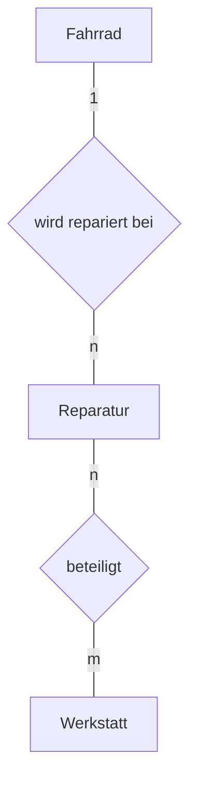

# Vom Diagramm zum Schema

Der Schritt vom ER-Diagramm zum Datenbankschema folgt festen Regeln. Wenn du sie kennst, ist er mechanisch – und genau das ist beabsichtigt: Über die Modellierung soll man nachdenken, über die Umsetzung nicht mehr.

## Die vier Regeln

:::snippet{#merken}
**Regel 1 – Entitätstypen.**
Jeder Entitätstyp wird eine eigene :t[Relation]{#relation}. Seine Attribute werden Attribute der Relation, das Schlüsselattribut wird :t[Primärschlüssel]{#primaerschluessel}. Hat der Typ keinen natürlichen Schlüssel, führt man einen künstlichen ein.

**Regel 2 – 1:n-Beziehungen.**
Der :t[Fremdschlüssel]{#fremdschluessel} kommt auf die **n-Seite**. Die Relation auf der n-Seite bekommt ein zusätzliches Attribut, das auf den Primärschlüssel der 1-Seite verweist. Es entsteht **keine** neue Relation.

**Regel 3 – n:m-Beziehungen.**
Es entsteht eine **neue Relation**. Sie enthält die Primärschlüssel beider Seiten als Fremdschlüssel; beide zusammen bilden ihren Primärschlüssel. Beziehungsattribute kommen ebenfalls hierher.

**Regel 4 – 1:1-Beziehungen.**
Der Fremdschlüssel kommt auf eine der beiden Seiten – am besten auf die, die optional ist. Alternativ verschmilzt man beide Relationen zu einer.
:::

## Warum der Fremdschlüssel auf die n-Seite muss

:::snippet{#aufgabe}
Zwischen *Bühne* und *Auftritt* besteht eine 1:n-Beziehung. Versuche einmal, den Fremdschlüssel **falsch herum** zu legen: `buehne` bekommt eine Spalte `auftritt_id`.

a) Was passiert mit der Hauptbühne, auf der 14 Auftritte stattfinden?

b) Formuliere die Regel in einem Satz, der auch begründet, warum sie so lautet.
:::

::::collapsible{title="Auflösung"}

a) In die eine Spalte `auftritt_id` passt genau eine Nummer. Für die 14 Auftritte der Hauptbühne bräuchte man 14 Werte in einer Zelle – das verstößt gegen die Regel, dass Attributwerte atomar sind.

b) Der Fremdschlüssel gehört auf die Seite, die **genau einen** Partner hat. Das ist die n-Seite: Ein Auftritt hat genau eine Bühne, eine Bühne hat viele Auftritte. Ein Attribut kann nur einen Wert aufnehmen – also muss es dort stehen, wo nur ein Wert gebraucht wird.

::::

## Die Klangwiese, Schritt für Schritt

:::snippet{#beispiel}
**Regel 1** auf alle sechs Entitätstypen angewendet:

```
band(band_id, name, gruendungsjahr, herkunftsland)
genre(genre_id, name)
person(person_id, vorname, nachname, geburtsjahr, land)
buehne(buehne_id, name, kapazitaet, ueberdacht)
auftritt(auftritt_id, datum, beginn, dauer_min, zuschauer)
besucherin(besucher_id, vorname, nachname, geburtsjahr, plz, email)
ticket(ticket_id, kategorie, preis, kaufdatum)
```

**Regel 2** auf die drei 1:n-Beziehungen. Der Fremdschlüssel kommt jeweils auf die n-Seite:

```
auftritt(auftritt_id, band_id, buehne_id, datum, beginn, dauer_min, zuschauer)
ticket(ticket_id, besucher_id, kategorie, preis, kaufdatum)
```

**Regel 3** auf die drei n:m-Beziehungen. Je eine neue Relation:

```
band_genre(band_id, genre_id)
mitgliedschaft(person_id, band_id, instrument, seit)
bewertung(besucher_id, auftritt_id, punkte)
```

Bei `mitgliedschaft` sind `instrument` und `seit` die Beziehungsattribute – sie landen nach Regel 3 in der neuen Relation.

Damit ist das Schema der Klangwiese vollständig. Es ist genau das, das du seit Kapitel 1 benutzt.
:::

## Übung: der Fahrradverleih

:::snippet{#aufgabe}
Überführe dein ER-Diagramm des Fahrradverleihs in ein Datenbankschema.

a) Schreibe alle Relationenschemata auf. Kennzeichne Primärschlüssel durch Unterstreichen und Fremdschlüssel durch einen Pfeil auf die Zieltabelle.

b) Notiere zu jedem Fremdschlüssel, aus welcher Regel er stammt.

c) Wie viele Relationen sind es geworden? Vergleiche mit der Zahl der Entitätstypen und erkläre die Differenz.
:::

:::protect{password="db-5-4-1" description="Lösung. Erfrage das Passwort bei deiner Lehrkraft."}

a) und b)

```
station(station_id, name, adresse, stellplaetze)

fahrrad(rahmennummer, typ, anschaffungsjahr, station_id→station)
                                             Regel 2, n-Seite von Station–Fahrrad

kundin(kundin_id, name, geburtsdatum, email)

ausleihe(ausleihe_id, rahmennummer→fahrrad, kundin_id→kundin,
         start, ende, preis)
         Regel 2, zweimal: n-Seite von Fahrrad–Ausleihe und von Kundin–Ausleihe
```

c) Vier Relationen bei vier Entitätstypen – kein Unterschied. Es gab **keine** n:m-Beziehung, also entstand nach Regel 3 auch keine zusätzliche Relation.

Zum Vergleich: Bei der Klangwiese wurden aus sieben Entitätstypen zehn Relationen, weil drei n:m-Beziehungen je eine eigene Relation brauchten.

:::

## Eine Erweiterung

:::snippet{#aufgabe}
Der Fahrradverleih führt **Reparaturen** ein: „Ein Fahrrad wird von Zeit zu Zeit repariert. Jede Reparatur hat ein Datum, eine Beschreibung und Kosten. An einer Reparatur können mehrere **Werkstätten** beteiligt sein, und eine Werkstatt repariert viele Räder. Zu jeder Werkstatt merken wir uns Name und Adresse."

a) Ergänze das ER-Diagramm um die neuen Entitätstypen und Beziehungen mit Kardinalitäten.

b) Überführe die Ergänzung ins Schema.

c) Eine Werkstatt möchte pro Reparatur ihren Anteil an den Kosten festhalten. Wo gehört diese Angabe hin?
:::

::::collapsible{title="Tipp zu c)"}

Der Anteil hängt weder allein von der Reparatur noch allein von der Werkstatt ab.

::::

:::protect{password="db-5-4-2" description="Lösung. Erfrage das Passwort bei deiner Lehrkraft."}

a)



b)

```
reparatur(reparatur_id, rahmennummer→fahrrad, datum, beschreibung, kosten)
werkstatt(werkstatt_id, name, adresse)
beteiligung(reparatur_id→reparatur, werkstatt_id→werkstatt, anteil)
```

c) Der Anteil ist ein **Beziehungsattribut** und gehört nach Regel 3 in die Zuordnungstabelle `beteiligung` – genau wie das Instrument in `mitgliedschaft`.

:::

## Was das Schema nicht mehr weiß

:::snippet{#brain}
Vergleiche das fertige Schema mit dem ER-Diagramm. Zwei Informationen sind unterwegs verloren gegangen:

1. **Die Minimalangaben.** Ob eine Bühne mindestens einen Auftritt tragen muss, steht im Schema nirgends. Man kann es nur teilweise nachbilden, etwa durch `NOT NULL` auf einem Fremdschlüssel.
2. **Die Namen der Beziehungen.** Aus *tritt auf* wird eine Spalte `band_id` – dass die Beziehung einmal „tritt auf" hieß, sieht man ihr nicht mehr an.

Deshalb wirft man das ER-Diagramm nicht weg, wenn die Datenbank steht. Es ist die Dokumentation, aus der später jemand versteht, warum das Schema so aussieht, wie es aussieht.
:::

<!--
KLP QPh, Daten und ihre Strukturierung: entwerfen zu Datenbankmodellierungen
relationale Datenbankschemata (M).
-->

---

## Selbsttest

::::multievent

**1. Auf welcher Seite einer 1:n-Beziehung steht der Fremdschlüssel?**

{r1{auf der 1-Seite}}

{r1{!auf der n-Seite}}

{r1{auf beiden Seiten}}

{r1{in einer neuen Relation}}

{h{Ein Attribut kann nur einen Wert aufnehmen. Welche Seite hat genau einen Partner?}}
{H{Richtig. Auf der 1-Seite bräuchte man viele Werte in einer Zelle.}}

**2. Was entsteht aus einer n:m-Beziehung?**

{r2{ein Fremdschlüssel auf der linken Seite}}

{r2{ein Fremdschlüssel auf der rechten Seite}}

{r2{!eine neue Relation mit beiden Fremdschlüsseln}}

{r2{gar nichts}}

{h{Erinnere dich an band_genre.}}
{H{Richtig. Beide Fremdschlüssel zusammen sind dort der Primärschlüssel.}}

**3. Ein Modell hat 5 Entitätstypen, 3 Beziehungen vom Typ 1:n und 2 vom Typ n:m. Wie viele Relationen entstehen?**

{z{7}}

{h{1:n-Beziehungen erzeugen keine neue Relation, n:m-Beziehungen je eine.}}
{H{Richtig: 5 + 2 = 7.}}

**4. Wohin gehören Beziehungsattribute einer n:m-Beziehung?**

{r3{in die linke Relation}}

{r3{in die rechte Relation}}

{r3{!in die neue Zuordnungsrelation}}

{r3{sie gehen verloren}}

{h{Denk an instrument und seit.}}
{H{Richtig.}}

**5. Welche Informationen des ER-Diagramms stehen im Schema nicht mehr?** (Mehrfachauswahl)

{c1{!die Minimalangaben der Kardinalitäten}}

{c1{!die Namen der Beziehungen}}

{c1{die Attribute der Entitätstypen}}

{c1{die Primärschlüssel}}

{h{Attribute und Schlüssel wandern eins zu eins ins Schema.}}
{H{Richtig – deshalb bleibt das Diagramm als Dokumentation wichtig.}}

::::
