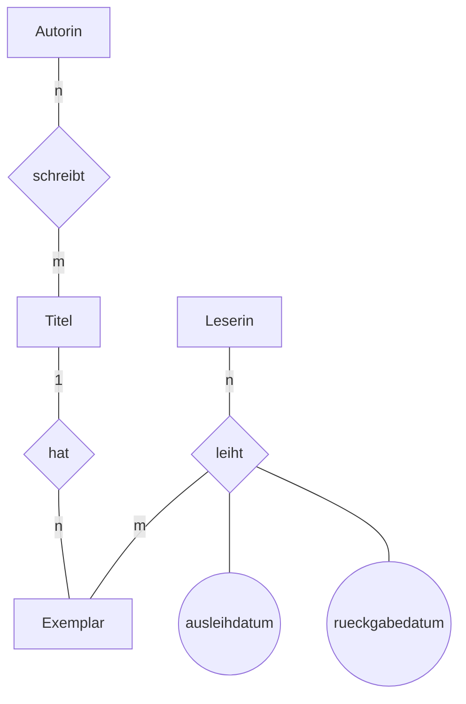

# Rückblick

Modellieren ist die Tätigkeit, bei der die meisten Fehler entstehen – und die einzige, bei der Fehler richtig teuer werden. Ein schlechtes Schema lässt sich später kaum noch reparieren, weil bereits Daten darin stehen.

## Das kann ich jetzt

- [ ] Ich kann aus einem Text **Entitätstypen** herauslesen und von Attributen unterscheiden. ([5.1](./01-entitaetstypen-und-attribute))
- [ ] Ich kann begründen, wann etwas ein eigener Entitätstyp wird und wann nicht. ([5.1](./01-entitaetstypen-und-attribute))
- [ ] Ich kann **Kardinalitäten** bestimmen – in der 1:n-Schreibweise und in der (min, max)-Schreibweise. ([5.2](./02-beziehungen-und-kardinalitaeten))
- [ ] Ich kann ein :t[Entity-Relationship-Diagramm]{#entity-relationship-diagramm} lesen und selbst zeichnen. ([5.3](./03-entity-relationship-diagramme))
- [ ] Ich kann ein Diagramm mit den **vier Regeln** in Relationenschemata überführen. ([5.4](./04-vom-diagramm-zum-schema))
- [ ] Ich kann zwei Entwürfe vergleichen und meine Wahl begründen. ([5.5](./05-modellierungen-beurteilen))

## Gemischte Aufgaben

:::snippet{#aufgabe}
**Aufgabe 1: Die Stadtbibliothek**

> Die Stadtbibliothek verwaltet ihren Bestand. Zu jedem **Titel** sind ISBN, Titel, Erscheinungsjahr und der Verlag bekannt; ein Titel hat eine oder mehrere Autorinnen, und eine Autorin kann mehrere Titel geschrieben haben. Von einem Titel besitzt die Bibliothek mehrere **Exemplare**, die sich durch eine Inventarnummer unterscheiden und in einem bestimmten Zustand sind. **Leserinnen** haben einen Ausweis mit Nummer, Name und Geburtsjahr. Eine Leserin kann mehrere Exemplare gleichzeitig ausleihen; jede **Ausleihe** hat ein Ausleihdatum und ein Rückgabedatum. Über die Jahre kann dasselbe Exemplar von derselben Leserin mehrfach ausgeliehen werden.

a) Nenne alle Entitätstypen mit ihren Attributen. Unterstreiche die Schlüsselattribute.

b) Nenne alle Beziehungstypen mit ihren Kardinalitäten.

c) Zeichne das ER-Diagramm.

d) Begründe: Warum sind *Titel* und *Exemplar* zwei verschiedene Entitätstypen und nicht einer?

e) Der letzte Satz des Textes macht eine Aussage, die für die Modellierung entscheidend ist. Welche, und was folgt daraus für den Schlüssel der Ausleihe?
:::

::::collapsible{title="Tipp 1: Wie finde ich die Entitätstypen?"}

Unterstreiche im Text alle **Hauptwörter**, über die etwas ausgesagt wird. Frag dann für jedes: Hat dieses Ding **eigene Eigenschaften**, oder ist es selbst nur eine Eigenschaft von etwas anderem?

*Verlag* zum Beispiel: Im Text steht nur der Name. Solange nichts weiter über Verlage gesagt wird, genügt ein Attribut.

::::

::::collapsible{title="Tipp 2: zu e)"}

Wenn dasselbe Exemplar von derselben Leserin **mehrfach** ausgeliehen werden kann – reicht dann das Paar aus Exemplar und Leserin, um eine Ausleihe eindeutig zu bestimmen?

::::

:::protect{password="db-5-6-1" description="Lösung. Erfrage das Passwort bei deiner Lehrkraft."}

a)

```
titel(isbn, titel, erscheinungsjahr, verlag)
autorin(autorin_id, name)
exemplar(inventarnummer, zustand)
leserin(ausweisnummer, name, geburtsjahr)
```

Schlüssel sind `isbn`, `autorin_id`, `inventarnummer` und `ausweisnummer`. Für *Autorin* nennt der Text keinen natürlichen Schlüssel – also führt man einen künstlichen ein. Namen taugen nicht als Schlüssel, weil es sie doppelt gibt.

b)

- *Autorin* **schreibt** *Titel*: **n:m** – ein Titel hat mehrere Autorinnen, eine Autorin mehrere Titel.
- *Titel* **hat** *Exemplar*: **1:n** – ein Titel hat viele Exemplare, ein Exemplar gehört zu genau einem Titel.
- *Leserin* **leiht** *Exemplar*: **n:m** mit den Beziehungsattributen `ausleihdatum` und `rueckgabedatum`.

c)



d) Weil sich die Aussagen auf verschiedene Dinge beziehen. ISBN, Erscheinungsjahr und Verlag gelten für **den Titel** – sie wären bei jedem Exemplar gleich und damit redundant. Inventarnummer und Zustand gelten dagegen für **ein bestimmtes Buch im Regal**. Würde man beides in eine Relation legen, stünde der Verlag bei fünf Exemplaren fünfmal da: genau die Redundanz aus Kapitel 1.

e) „Über die Jahre kann dasselbe Exemplar von derselben Leserin mehrfach ausgeliehen werden." Damit ist das Paar aus Inventarnummer und Ausweisnummer **nicht** eindeutig. Der Schlüssel muss das Ausleihdatum einschließen – oder man führt eine künstliche `ausleihe_id` ein. Das ist der sauberere Weg, weil *Ausleihe* dadurch zu einem eigenen Entitätstyp mit eigener Identität wird.

:::

:::snippet{#aufgabe}
**Aufgabe 2: Vom Diagramm zum Schema**

Setze dein Modell aus Aufgabe 1 in Relationenschemata um.

a) Wende die vier Regeln an und schreib alle Relationen auf. Kennzeichne Primärschlüssel und Fremdschlüssel.

b) Bei welcher Beziehung entsteht eine **neue** Relation, bei welcher nicht? Begründe mit der Regel.

c) Was passiert, wenn man den Fremdschlüssel zwischen *Titel* und *Exemplar* falsch herum legt – also `titel` eine Spalte `inventarnummer` gibt? Beschreibe die Folge konkret.

d) Welche Information des ER-Diagramms lässt sich im fertigen Schema **nicht** mehr ablesen?
:::

:::protect{password="db-5-6-2" description="Lösung. Erfrage das Passwort bei deiner Lehrkraft."}

a)

```
titel(isbn, titel, erscheinungsjahr, verlag)
autorin(autorin_id, name)
schreibt(isbn → titel, autorin_id → autorin)
exemplar(inventarnummer, zustand, isbn → titel)
leserin(ausweisnummer, name, geburtsjahr)
ausleihe(ausleihe_id, inventarnummer → exemplar, ausweisnummer → leserin,
         ausleihdatum, rueckgabedatum)
```

b) Bei den beiden n:m-Beziehungen entsteht je eine neue Relation (`schreibt` und `ausleihe`) – Regel 3. Bei der 1:n-Beziehung zwischen Titel und Exemplar entsteht **keine**; dort genügt der Fremdschlüssel `isbn` auf der n-Seite – Regel 2.

c) Dann könnte jeder Titel auf **genau ein** Exemplar verweisen. Die Bibliothek könnte von einem Buch nur ein einziges Exemplar führen – oder man müsste denselben Titel mehrfach eintragen, mit allen Folgen für die Redundanz. Der Fremdschlüssel gehört immer auf die Seite, von der es viele gibt.

d) Die **Kardinalitäten in ihrer genauen Form**. Dass ein Titel mindestens eine Autorin hat, steht nirgends mehr; das Schema erlaubt einen Titel ohne Eintrag in `schreibt`. Ebenso ist nicht mehr sichtbar, dass `schreibt` aus einer n:m-Beziehung entstanden ist und nicht selbst ein Entitätstyp war. Genau deshalb bewahrt man das Diagramm auf – es ist die Dokumentation des Schemas.

:::

:::snippet{#aufgabe}
**Aufgabe 3: Zwei Entwürfe beurteilen**

Für die Ausleihe schlagen zwei Gruppen unterschiedliche Lösungen vor.

**Entwurf A**

```
ausleihe(ausleihe_id, inventarnummer → exemplar, ausweisnummer → leserin,
         ausleihdatum, rueckgabedatum)
```

**Entwurf B**

```
exemplar(inventarnummer, zustand, isbn → titel,
         ausgeliehen_an → leserin, ausleihdatum)
```

a) Was leistet Entwurf B, was Entwurf A auch leistet?

b) Nenne zwei Fragen, die sich mit A beantworten lassen und mit B nicht.

c) Welchen Entwurf wählst du? Begründe mit einem Kriterium für gute Modelle.

d) Gibt es eine Situation, in der B trotzdem die bessere Wahl wäre?
:::

:::protect{password="db-5-6-3" description="Lösung. Erfrage das Passwort bei deiner Lehrkraft."}

a) Beide können sagen, **welches Exemplar gerade bei wem** ist. Für den Alltag an der Ausleihtheke reicht B also aus.

b) Mit B nicht beantwortbar:

- „Wie oft wurde dieses Exemplar insgesamt ausgeliehen?"
- „Welche Bücher hatte diese Leserin im vergangenen Jahr?"
- „Wie lange bleibt ein Buch im Schnitt ausgeliehen?"

Der Grund: B speichert nur den **aktuellen** Zustand. Bei der Rückgabe wird das Feld geleert, und die Ausleihe ist spurlos verschwunden. A speichert dagegen **Ereignisse**, und Ereignisse sammeln sich an.

c) Entwurf A. Das Kriterium ist die **Vollständigkeit gegenüber dem Zweck**: Eine Bibliothek will ihren Bestand auswerten, nicht nur ausgeben. Dazu kommt, dass A die Wirklichkeit besser abbildet – eine Ausleihe *ist* ein Vorgang mit eigener Identität, kein Attribut eines Buches.

d) Ja, wenn die Historie ausdrücklich **nicht** gespeichert werden soll. Genau das kann aus Datenschutzgründen geboten sein: Wer welches Buch gelesen hat, ist eine besonders heikle Angabe. Eine Bibliothek, die nach dem Grundsatz der Datenminimierung arbeitet, löscht die Ausleihe bei der Rückgabe – und dann ist B ehrlicher als ein A, dessen Daten man zu löschen vergisst. Mehr dazu in [Kapitel 8](../08-datenschutz-und-datensicherheit/01-grundprinzipien-des-datenschutzes).

:::

<!--
Rückblick zum Inhaltsfeld Daten und ihre Strukturierung: Modellierung mit ER,
Kardinalitäten, Umsetzung ins Relationenschema, Beurteilung von Modellen (A).
Aufgabe 3d) verknüpft die Modellierung mit dem Datenschutzkapitel.
-->

---

## Selbsttest

::::multievent

**1. Woran erkennt man, dass etwas ein eigener Entitätstyp sein sollte?**

{r1{Es kommt im Text häufig vor.}}

{r1{!Es hat eigene Eigenschaften, über die etwas ausgesagt wird.}}

{r1{Es ist ein Hauptwort.}}

{r1{Es steht im ersten Satz.}}

{h{Ein Verlag, von dem man nur den Namen kennt, braucht keine eigene Tabelle.}}
{H{Richtig.}}

**2. Ein Titel hat mehrere Exemplare, ein Exemplar gehört zu genau einem Titel. Welche Kardinalität ist das?**

{r2{1:1}}

{r2{!1:n}}

{r2{n:m}}

{r2{n:1 von Titel aus gesehen}}

{h{Von der einen Seite genau eines, von der anderen viele.}}
{H{Richtig.}}

**3. Wohin kommt bei einer 1:n-Beziehung der Fremdschlüssel?**

{r3{auf die 1-Seite}}

{r3{!auf die n-Seite}}

{r3{in eine neue Relation}}

{r3{auf beide Seiten}}

{h{In einer Spalte steht genau ein Wert – auf welcher Seite passt das?}}
{H{Richtig.}}

**4. Was entsteht bei der Umsetzung einer n:m-Beziehung?**

{r4{ein zusätzliches Attribut}}

{r4{!eine neue Relation mit beiden Schlüsseln als zusammengesetztem Primärschlüssel}}

{r4{nichts, sie wird weggelassen}}

{r4{zwei neue Relationen}}

{h{Regel 3.}}
{H{Richtig – und Beziehungsattribute kommen ebenfalls dorthin.}}

**5. Was bedeutet die Angabe (1, n) an einer Beziehung?**

{r5{Es gibt genau ein und höchstens n Vorkommen.}}

{r5{!Jede Entität dieses Typs nimmt mindestens einmal an der Beziehung teil, nach oben ohne feste Grenze.}}

{r5{Die Beziehung ist optional.}}

{r5{Es handelt sich um eine 1:1-Beziehung.}}

{h{Die erste Zahl ist das Minimum, die zweite das Maximum.}}
{H{Richtig – die Mindestangabe ist gerade das, was die 1:n-Schreibweise verschweigt.}}

**6. Welche Angaben gehen bei der Überführung eines Diagramms ins Schema verloren? Wähle alle zutreffenden aus.**

{c1{!die Mindestkardinalitäten}}

{c1{!die Namen der Beziehungstypen}}

{c1{die Attribute}}

{c1{die Primärschlüssel}}

{h{Sieh dir ein fertiges Schema an: Was davon kannst du nicht mehr ablesen?}}
{H{Richtig – deshalb bleibt das Diagramm die Dokumentation des Schemas.}}

**7. Ein Entwurf speichert nur den aktuellen Ausleihzustand statt einzelner Ausleihvorgänge. Was ist die Folge?**

{r6{Die Datenbank wird größer.}}

{r6{!Auswertungen über die Vergangenheit sind unmöglich, weil bei der Rückgabe alles verschwindet.}}

{r6{Die Abfragen werden langsamer.}}

{r6{Der Primärschlüssel wird ungültig.}}

{h{Was passiert beim Zurückgeben mit dem Eintrag?}}
{H{Richtig. Ob das ein Nachteil ist, hängt vom Zweck ab – aus Datenschutzsicht kann es sogar erwünscht sein.}}

::::
