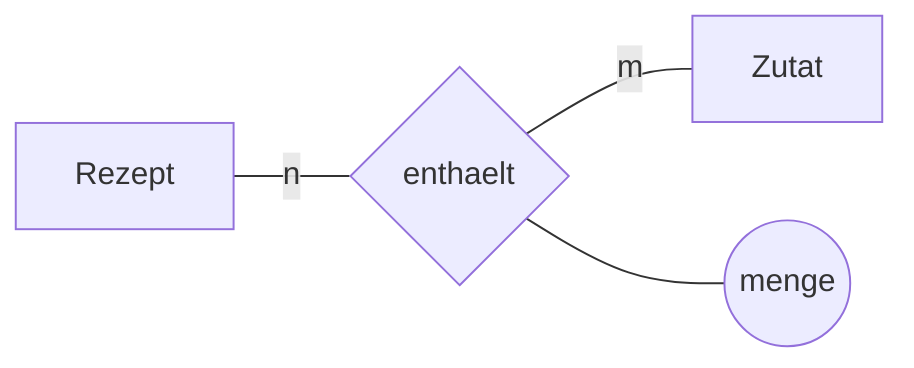

# Projekt: Eine eigene Datenbank

In diesem Projekt geht ihr den ganzen Weg noch einmal – diesmal für einen Gegenstand, den ihr selbst wählt: von der Beschreibung über das Modell zum Schema, zur Umsetzung und zu den Abfragen.

Gearbeitet wird in Gruppen von **drei bis vier Personen**.

## Ein Thema wählen

:::snippet{#aufgabe}
Sucht euch einen Gegenstand, den ihr kennt und über den ihr Auskunft geben könnt. Er muss vier Bedingungen erfüllen:

- mindestens **fünf** Entitätstypen
- mindestens eine **n:m-Beziehung**
- mindestens eine Beziehung mit einem **Beziehungsattribut**
- genug Inhalt für mindestens **zehn interessante Abfragen**
:::

:::snippet{#beispiel}
**Vorschläge, falls euch nichts einfällt:**

| Thema | n:m-Beziehung darin |
| --- | --- |
| Die Schulbibliothek | Buch ↔ Autor, Ausleihe als eigener Entitätstyp |
| Ein Sportverein mit Mannschaften und Spielen | Person ↔ Mannschaft (mit Position und Rückennummer) |
| Ein Kino mit Vorstellungen und Reservierungen | Film ↔ Genre, Reservierung als eigener Entitätstyp |
| Ein Rezeptportal | Rezept ↔ Zutat (mit Menge und Einheit) |
| Ein Musikstreamingdienst | Titel ↔ Wiedergabeliste, Titel ↔ Mitwirkende |
| Der Stundenplan eurer Schule | Lehrkraft ↔ Fach (Lehrbefähigung), Kurs ↔ Raum ↔ Zeit |
| Ein Onlineshop | Bestellung ↔ Artikel (mit Menge und Einzelpreis) |
| Eine Spielesammlung mit Ausleihe unter Freunden | Spiel ↔ Kategorie, Partie ↔ Mitspielende (mit Punktzahl) |
:::

## Die fünf Bausteine

### 1. Beschreibung

:::snippet{#aufgabe}
Schreibt einen Text von etwa einer halben Seite, der euren Gegenstand beschreibt – so, wie das Organisationsteam der Klangwiese es in [Kapitel 5](../05-datenbanken-modellieren/01-entitaetstypen-und-attribute) getan hat.

Wichtig: Der Text muss **vollständig** sein. Alles, was später in der Datenbank steht, muss darin vorkommen. Und er muss die Kardinalitäten erkennen lassen: „Ein Rezept braucht mehrere Zutaten, eine Zutat kommt in vielen Rezepten vor."

**Tauscht die Beschreibung mit einer anderen Gruppe.** Was die andere Gruppe nicht versteht, ist eine Lücke im Text – nicht ihr Problem.
:::

### 2. ER-Diagramm

:::snippet{#aufgabe}
Zeichnet das ER-Diagramm in Chen-Notation:

- Entitätstypen als Rechtecke, Beziehungstypen als Rauten, Attribute als Ellipsen
- Schlüsselattribute unterstrichen
- **alle** Kardinalitäten, am besten in der (min, max)-Notation
- Beziehungsattribute an der Raute

Begründet in zwei bis drei Sätzen, warum ihr euch bei mindestens einer Beziehung so und nicht anders entschieden habt.
:::

::::collapsible{title="Wie zeichnen?"}

Auf Papier fotografieren ist völlig in Ordnung. Wer digital arbeiten will, kann Mermaid nutzen – so sind die Diagramme im Kapitel 5 gemacht:

````

````

::::

### 3. Datenbankschema

:::snippet{#aufgabe}
Überführt das Diagramm mit den vier Regeln aus [Kapitel 5](../05-datenbanken-modellieren/04-vom-diagramm-zum-schema) in Relationenschemata.

Prüft anschließend jede Relation einzeln:

- Ist sie in der 1. Normalform? In der 2.? In der 3.?
- Falls nicht: Normalisiert sie und schreibt auf, welche Abhängigkeit das Problem war.

Notiert das Ergebnis als vollständige Liste mit Primär- und Fremdschlüsseln.
:::

### 4. Umsetzung

:::snippet{#aufgabe}
Legt die Tabellen mit `CREATE TABLE` an und füllt sie mit Daten.

- Wählt für jedes Attribut einen **passenden Datentyp** ([Kapitel 7](../07-datenbanken-erstellen/01-tabellen-anlegen)).
- Setzt **alle** Integritätsbedingungen: `PRIMARY KEY`, `FOREIGN KEY`, `NOT NULL` überall dort, wo die Minimalangabe 1 war.
- Legt **mindestens 10 Zeilen je Tabelle** an – weniger ergibt keine interessanten Abfragen.

Beachtet die Reihenfolge: Erst die Tabellen, auf die verwiesen wird.
:::

:::sqlide{db="/datenbanken/klangwiese-leer.sqlite" height="420px"}

```mysql Schema.sql
-- UNGEPRUEFT: Hier entsteht eure Datenbank.
-- Legt zuerst die Tabellen an, auf die verwiesen wird.

```

```mysql Daten.sql
-- UNGEPRUEFT: Hier kommen eure INSERT-Anweisungen hin.

```

```mysql Abfragen.sql
-- UNGEPRUEFT: Hier kommen eure Abfragen hin.

```

:::

:::alert{info}
Die IDE speichert eure Arbeit im Browser. Sichert den Quelltext trotzdem regelmäßig in einer Datei – ein geleerter Browserspeicher hat schon manches Projekt gekostet.

Solange eine Tabelle noch nicht angelegt ist, markiert die IDE jeden Verweis darauf als Fehler. Das verschwindet, sobald ihr das `CREATE TABLE` einmal ausgeführt habt.
:::

### 5. Abfragen

:::snippet{#aufgabe}
Formuliert **zehn** Fragen an eure Datenbank – zuerst auf Deutsch, dann als SQL. Darunter müssen sein:

- mindestens zwei mit einem :t[Verbund]{#verbund} über **drei oder mehr** Tabellen
- mindestens zwei mit `GROUP BY`, davon eine mit `HAVING`
- mindestens eine mit einer **Unterabfrage**
- mindestens eine, die über die **n:m-Beziehung** geht

Zu jeder Frage gehört: die deutsche Formulierung, die SQL-Anweisung und die Zahl der gelieferten Zeilen.
:::

## Abgabe

:::snippet{#merken}
Die Gruppe gibt ab:

1. die **Beschreibung** (halbe Seite)
2. das **ER-Diagramm** mit Kardinalitäten
3. das **Datenbankschema** mit einer Begründung der :t[Normalform]{#normalform}
4. den **SQL-Quelltext** für Tabellen und Daten
5. die **zehn Abfragen** mit deutscher Formulierung und Ergebnisumfang
6. eine **Datenschutzbetrachtung**: Enthält eure Datenbank personenbezogene Daten? Welche Prinzipien aus [Kapitel 8](../08-datenschutz-und-datensicherheit) sind berührt? Was würdet ihr anders machen, wenn die Datenbank wirklich in Betrieb ginge?
:::

## Bewertungskriterien

:::snippet{#merken}
| Kriterium | Worauf geachtet wird |
| --- | --- |
| **Modellierung** | Sind alle Entitätstypen, Beziehungen und Kardinalitäten richtig erfasst? Passt das Modell zur Beschreibung? |
| **Schema** | Sind Primär- und :t[Fremdschlüssel]{#fremdschluessel} richtig gesetzt? Ist die 3. Normalform erreicht – oder die Abweichung begründet? |
| **Umsetzung** | Passen die Datentypen? Sind die Integritätsbedingungen vollständig? Läuft alles? |
| **Abfragen** | Decken sie die geforderte Bandbreite ab? Liefern sie, was die deutsche Formulierung verspricht? |
| **Begründung** | Werden Entscheidungen erklärt, nicht nur getroffen? |
| **Zusammenarbeit** | Ist die Arbeit erkennbar aufgeteilt und zusammengeführt worden? |

Ein sauber begründetes einfaches Modell ist mehr wert als ein aufwendiges, das niemand erklären kann.
:::

## Arbeitsteilung

:::snippet{#brain}
Die Bausteine 1 bis 3 solltet ihr **gemeinsam** machen. Wer beim Modell nicht dabei war, versteht das Schema nicht.

Ab Baustein 4 lässt sich aufteilen:

- eine Person legt die Tabellen an und pflegt das Schema
- zwei Personen erfinden und erfassen Daten
- eine Person schreibt Abfragen und meldet zurück, was am Schema unpraktisch ist

Diese Rückmeldung ist der wertvollste Teil. Fast immer stellt sich beim Abfragen heraus, dass im Modell etwas fehlt – und genau dann lernt man am meisten über Modellierung.
:::

<!--
KLP QPh, Daten und ihre Strukturierung: modellieren relationale Datenbanken (M);
entwerfen zu Datenbankmodellierungen relationale Datenbankschemata (M);
überführen Datenbankschemata in die 1. bis 3. Normalform (M); beurteilen
Datenbankmodellierungen und Datenbankschemata (A); im LK zusätzlich: setzen ein
relationales Datenbankschema mit geeigneten Datentypen in einem Datenbanksystem
um (I).

Kommunizieren und Kooperieren: vereinbaren zur kooperativen, informatischen
Problemlösung Schnittstellenbeschreibungen und Aufgabenverantwortlichkeiten.

Informatik, Mensch und Gesellschaft: beurteilen Fallbeispiele auf Grundlage der
Grundprinzipien der Datensicherheit und des Datenschutzes (A) - Baustein 6 der
Abgabe.

Im Grundkurs kann Baustein 4 entfallen; die Gruppen geben dann das Schema mit
Datentypen auf Papier ab.
-->
