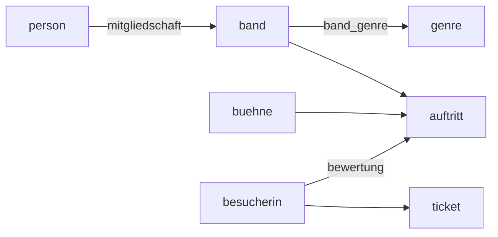

# Referenz

Zum Nachschlagen. Alles hier funktioniert in der SQL-IDE dieses Lernpfads.

## Abfragen

### Aufbau

```sql
SELECT   spalten
  FROM   tabelle
  JOIN   tabelle2 ON bedingung
 WHERE   bedingung
 GROUP BY spalten
HAVING   bedingung
 ORDER BY spalten
 LIMIT   n OFFSET k;
```

**Ausgewertet** wird in dieser Reihenfolge: `FROM`/`JOIN` → `WHERE` → `GROUP BY` → `HAVING` → Aggregatfunktionen → `SELECT` → `ORDER BY` → `LIMIT`.

### Spalten auswählen

| Schreibweise | Wirkung |
| --- | --- |
| `SELECT *` | alle Spalten |
| `SELECT a, b` | nur diese Spalten |
| `SELECT a AS neu` | Spalte umbenennen |
| `SELECT DISTINCT a` | doppelte Ergebniszeilen entfernen |
| `SELECT t.a` | Spalte `a` der Tabelle `t` |

### Bedingungen

| Operator | Bedeutung |
| --- | --- |
| `=` `<>` `!=` `<` `>` `<=` `>=` | Vergleiche |
| `AND` `OR` `NOT` | Verknüpfungen; `AND` bindet stärker als `OR` |
| `BETWEEN a AND b` | im Bereich, Grenzen eingeschlossen |
| `IN (a, b, c)` | einer der Werte |
| `IN (SELECT …)` | in der Ergebnismenge einer Unterabfrage |
| `LIKE 'B%'` | Muster: `%` beliebig viele Zeichen, `_` genau eines |

### Sortieren und begrenzen

```sql
ORDER BY spalte ASC          -- aufsteigend, Voreinstellung
ORDER BY spalte DESC         -- absteigend
ORDER BY a, b DESC           -- mehrstufig
LIMIT 10                     -- höchstens 10 Zeilen
LIMIT 10 OFFSET 20           -- Zeilen 21 bis 30
```

### Verbund

```sql
-- Neue Schreibweise (empfohlen)
SELECT b.name, s.name
  FROM auftritt AS a
  JOIN band AS b ON b.band_id = a.band_id
  JOIN buehne AS s ON s.buehne_id = a.buehne_id;

-- Alte Schreibweise, gleichwertig
SELECT band.name, buehne.name
  FROM auftritt, band, buehne
 WHERE auftritt.band_id = band.band_id
   AND auftritt.buehne_id = buehne.buehne_id;

-- Selbstverbund: Paare bilden
SELECT p1.nachname, p2.nachname
  FROM person AS p1
  JOIN person AS p2 ON p1.geburtsjahr = p2.geburtsjahr
                   AND p1.person_id < p2.person_id;
```

Faustregel: **eine Verbundbedingung weniger als Tabellen**.

### Gruppieren

| Funktion | Ergebnis |
| --- | --- |
| `COUNT(*)` | Anzahl der Zeilen |
| `COUNT(spalte)` | Anzahl der Zeilen mit Wert |
| `COUNT(DISTINCT spalte)` | Anzahl verschiedener Werte |
| `SUM` `AVG` `MIN` `MAX` | Summe, Mittelwert, Minimum, Maximum |

```sql
SELECT s.name, COUNT(*) AS anzahl
  FROM auftritt AS a
  JOIN buehne AS s ON s.buehne_id = a.buehne_id
 WHERE a.dauer_min >= 60      -- filtert Zeilen, vor dem Gruppieren
 GROUP BY s.name
HAVING COUNT(*) >= 3          -- filtert Gruppen, nach dem Gruppieren
 ORDER BY anzahl DESC;
```

Jede Spalte im `SELECT` muss im `GROUP BY` stehen oder in einer Aggregatfunktion.

### Unterabfragen

```sql
-- als einzelner Wert
WHERE zuschauer > (SELECT AVG(zuschauer) FROM auftritt)

-- als Wertemenge
WHERE band_id IN (SELECT band_id FROM auftritt WHERE buehne_id = 1)

-- korreliert, in der SELECT-Liste
SELECT b.name,
       (SELECT COUNT(*) FROM auftritt AS a WHERE a.band_id = b.band_id) AS n
  FROM band AS b;

-- als Tabelle im FROM (Aliasname ist Pflicht)
SELECT AVG(n) FROM (SELECT band_id, COUNT(*) AS n
                      FROM auftritt GROUP BY band_id) AS x;
```

### Rechnen und Funktionen

| Ausdruck | Wirkung |
| --- | --- |
| `+ - * /` | Grundrechenarten; bei zwei ganzen Zahlen wird **ganzzahlig** geteilt |
| `a \|\| b` | Texte verketten |
| `ROUND(x, n)` | auf `n` Nachkommastellen runden |
| `ABS(x)` | Betrag |
| `UPPER(t)` `LOWER(t)` | Groß-/Kleinschreibung |
| `LENGTH(t)` | Zeichenzahl |
| `strftime('%Y', datum)` | Teil eines Datums, hier das Jahr |

## Daten ändern

```sql
INSERT INTO tabelle (spalte1, spalte2) VALUES (wert1, wert2);
INSERT INTO tabelle (spalte1) VALUES (a), (b), (c);

UPDATE tabelle SET spalte = wert WHERE bedingung;

DELETE FROM tabelle WHERE bedingung;
```

:::alert{warn}
Ohne `WHERE` treffen `UPDATE` und `DELETE` **jede** Zeile. Schreibe die Bedingung zuerst als `SELECT` und sieh nach, was sie trifft.
:::

## Tabellen anlegen

```sql
CREATE TABLE ausleihe (
    ausleih_id   INTEGER PRIMARY KEY,
    rahmennummer VARCHAR(20) NOT NULL,
    kundin_id    INTEGER     NOT NULL,
    start        DATETIME    NOT NULL,
    ende         DATETIME,
    preis        DECIMAL(6,2) DEFAULT 0,
    UNIQUE (rahmennummer, start),
    FOREIGN KEY (rahmennummer) REFERENCES fahrrad(rahmennummer),
    FOREIGN KEY (kundin_id) REFERENCES kundin(kundin_id)
);

ALTER TABLE fahrrad ADD COLUMN farbe VARCHAR(20);
DROP TABLE probe;

CREATE VIEW spielplan AS
SELECT a.datum, b.name FROM auftritt AS a JOIN band AS b ON b.band_id = a.band_id;
```

### Datentypen

| Typ | wofür |
| --- | --- |
| `INTEGER`, `INT` | ganze Zahlen, Schlüssel, Wahrheitswerte (0/1) |
| `REAL` | Kommazahlen |
| `DECIMAL(p,s)` | Kommazahlen mit fester Stellenzahl – für Geld |
| `TEXT` | Text beliebiger Länge |
| `VARCHAR(n)`, `CHAR(n)` | Text bis bzw. genau `n` Zeichen |
| `DATE`, `DATETIME` | Datum, Datum mit Uhrzeit |
| `BOOLEAN` | Wahrheitswert |

Prüffrage für die Typwahl: **Rechnet man damit?** Postleitzahlen, Telefonnummern und ISBN sind Text, obwohl sie aus Ziffern bestehen.

### Integritätsbedingungen

| Bedingung | Garantie |
| --- | --- |
| `PRIMARY KEY` | eindeutig und nie leer – Entitätsintegrität |
| `FOREIGN KEY … REFERENCES …` | der Wert existiert in der Zieltabelle – referenzielle Integrität |
| `NOT NULL` | der Wert fehlt nie |
| `UNIQUE (spalte)` | der Wert kommt höchstens einmal vor |

## Modellierung

### Vom Text zum Diagramm

| im Text | im Modell |
| --- | --- |
| Substantiv, über das mehreres gespeichert wird | Entitätstyp (Rechteck) |
| Eigenschaft davon | Attribut (Ellipse) |
| Verb zwischen zwei Substantiven | Beziehungstyp (Raute) |
| Eigenschaft der Verbindung | Beziehungsattribut, an der Raute |

:t[Kardinalität]{#kardinalitaet} immer **in beide Richtungen** bestimmen: „Zu einem X – wie viele Y?" und „Zu einem Y – wie viele X?"

### Vom Diagramm zum Schema

| im Diagramm | im Schema |
| --- | --- |
| Entitätstyp | eigene :t[Relation]{#relation} |
| Schlüsselattribut | :t[Primärschlüssel]{#primaerschluessel} |
| 1:n-Beziehung | :t[Fremdschlüssel]{#fremdschluessel} auf der **n-Seite** |
| n:m-Beziehung | **neue Relation** mit beiden Fremdschlüsseln als Primärschlüssel |
| 1:1-Beziehung | Fremdschlüssel auf der optionalen Seite |
| Beziehungsattribut einer n:m-Beziehung | Attribut der neuen Relation |
| Minimalangabe 1 | `NOT NULL` |

### Normalformen

| Form | Bedingung | Beseitigt |
| --- | --- | --- |
| **1NF** | alle Attributwerte atomar | mehrere Werte in einer Zelle |
| **2NF** | 1NF und keine partielle Abhängigkeit vom Schlüssel | Attribute, die schon von einem Teil des Schlüssels abhängen |
| **3NF** | 2NF und keine transitive Abhängigkeit | Attribute, die über ein Nichtschlüsselattribut abhängen |

Merksatz: *Jedes Nichtschlüsselattribut hängt ab vom Schlüssel, vom ganzen Schlüssel und von nichts als dem Schlüssel.*

Bei einem **einteiligen** Primärschlüssel ist die 2NF automatisch erfüllt.

## Datenschutz und Datensicherheit

| Grundprinzipien des Datenschutzes | Kurzfassung |
| --- | --- |
| Verbot mit Erlaubnisvorbehalt | verboten, außer es gibt Gesetz oder Einwilligung |
| Datenminimierung | nur das Nötige erheben |
| Zweckbindung | nur für den Erhebungszweck verwenden |
| Transparenz | Betroffene wissen Bescheid |
| Erforderlichkeit | nur so viel und so lange wie nötig |

| Schutzziele der Datensicherheit | Kurzfassung |
| --- | --- |
| Vertraulichkeit | nur Befugte können lesen |
| Integrität | die Daten sind unverfälscht |
| Verfügbarkeit | Befugte kommen heran, wenn sie es brauchen |

## Die Datenbanken dieses Lernpfads

| Datei | Inhalt |
| --- | --- |
| `/datenbanken/klangwiese.sqlite` | die Festivaldatenbank mit Fremdschlüsselbedingungen |
| `/datenbanken/klangwiese-uebung.sqlite` | dieselben Daten ohne Fremdschlüsselbedingungen |
| `/datenbanken/klangwiese-roh.sqlite` | eine einzige unnormalisierte Tabelle `auftrittsliste` |
| `/datenbanken/klangwiese-leer.sqlite` | leer, für eigene Tabellen |

### Schema der Festivaldatenbank

```
band(band_id, name, gruendungsjahr, herkunftsland)
genre(genre_id, name)
band_genre(band_id→band, genre_id→genre)
person(person_id, vorname, nachname, geburtsjahr, land)
mitgliedschaft(person_id→person, band_id→band, instrument, seit)
buehne(buehne_id, name, kapazitaet, ueberdacht)
auftritt(auftritt_id, band_id→band, buehne_id→buehne, datum, beginn, dauer_min, zuschauer)
besucherin(besucher_id, vorname, nachname, geburtsjahr, plz, email)
ticket(ticket_id, besucher_id→besucherin, kategorie, preis, kaufdatum)
bewertung(besucher_id→besucherin, auftritt_id→auftritt, punkte)
```



## Was die IDE dieses Lernpfads **nicht** kann

Der eingebaute Übersetzer lehnt diese Konstrukte ab; die Anweisung läuft dann gar nicht erst.

| Nicht verwendbar | Ausweg |
| --- | --- |
| `IS NULL`, `IS NOT NULL` | – die Datenbanken enthalten deshalb keine fehlenden Werte |
| `IFNULL`, `COALESCE` | – |
| `NOT IN (…)` | Bedingung mit `<>` und `AND` umformulieren |
| `EXISTS (…)` | `IN (Unterabfrage)` |
| `CASE WHEN … END` | zwei Abfragen mit `UNION` |
| `JOIN … USING (spalte)` | `JOIN … ON a.spalte = b.spalte` |
| `substr(…)`, `CAST(…)` | `strftime`; durch `1.0` teilen statt `CAST` |
| `GROUP_CONCAT(…)` | – |
| `CREATE TABLE … AS SELECT` | `CREATE TABLE`, danach `INSERT … SELECT` |
| `UNIQUE` direkt hinter einer Spalte | `UNIQUE (spalte)` als eigene Zeile |
| `CHECK (…)` | – |

In einem ausgewachsenen Datenbanksystem stehen all diese Möglichkeiten zur Verfügung. Merkt euch die Einschränkungen also als Eigenart dieses Werkzeugs, nicht als Eigenschaft von SQL.
