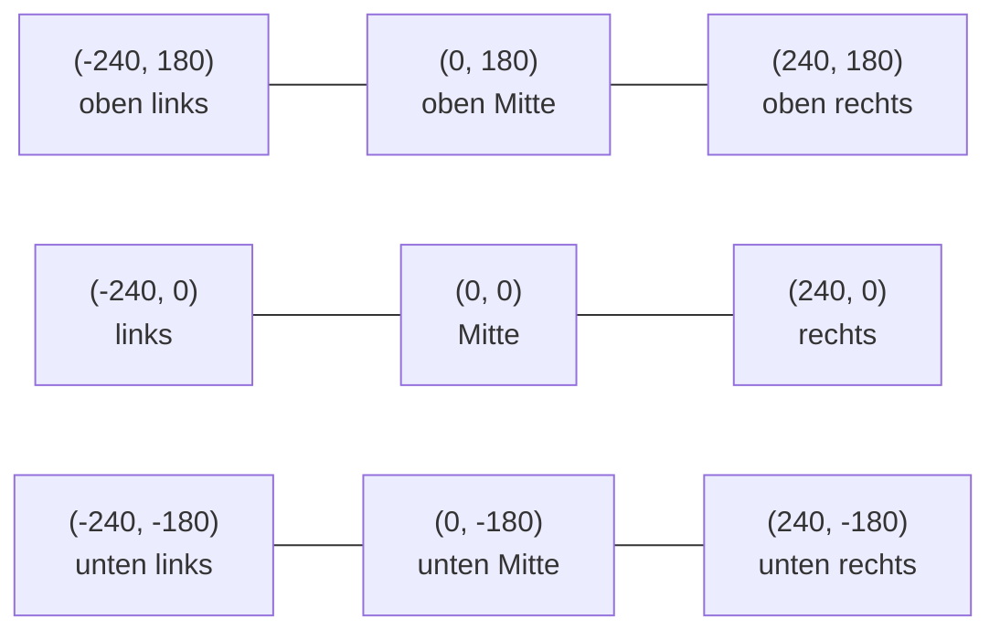

# Die erste Grafik

Text auf der Konsole ist praktisch, aber man sieht wenig. Für alles Grafische verwenden wir in diesem Lernpfad die Bibliothek **Scratch for Java**. Wenn du Scratch aus der Mittelstufe kennst, kommt dir vieles bekannt vor: Es gibt eine **Bühne** (`Stage`) und darauf **Figuren** (`Sprite`).

## Die Bühne

:::onlineide{libraries="scratch" height="520px"}

```java Main.java
void main() {
    new Buehne();
}
```

```java Buehne.java
public class Buehne extends Stage {

    public Buehne() {
        Sprite hase = new Sprite();
        hase.addCostume("bunny1_stand");
        hase.setPosition(0, 0);
        this.add(hase);
    }
}
```

:::

:::snippet{#merken}
- `public class Buehne extends Stage` – wir bauen eine **eigene Bühne** auf Grundlage der fertigen Bühne aus der Bibliothek.
- Alles zwischen `public Buehne() {` und der zugehörigen `}` wird ausgeführt, wenn die Bühne entsteht.
- `new Sprite()` erzeugt eine neue Figur, `addCostume("bunny1_stand")` gibt ihr ein Aussehen (ein **Kostüm**), `this.add(hase)` stellt sie auf die Bühne.
- Ohne `this.add(...)` bleibt die Figur unsichtbar – ein häufiger Anfängerfehler.
:::

## Das Koordinatensystem

Die Bühne ist **480 Pixel breit und 360 Pixel hoch**. Der Punkt (0, 0) liegt in der **Mitte**. Die x-Achse zeigt nach rechts, die y-Achse nach **oben**.



:::snippet{#aufgabe}
Verändere im Programm oben die Zeile `hase.setPosition(0, 0);`.

a) Wohin musst du den Hasen setzen, damit er **oben rechts** steht?

b) Sage vorher, was bei `setPosition(0, -150)` passiert – und prüfe es dann.
:::

::::collapsible{title="Auflösung"}

a) Zum Beispiel `hase.setPosition(180, 120);`. Alles mit positivem x und positivem y liegt oben rechts.

b) Der Hase rutscht nach **unten**, denn negative y-Werte liegen unterhalb der Mitte. Wer das Koordinatensystem aus dem Matheunterricht kennt, ist hier im Vorteil – am Bildschirm ist es nämlich oft andersherum.

::::

## Mehrere Figuren

:::onlineide{libraries="scratch" height="520px"}

```java Main.java
void main() {
    new Buehne();
}
```

```java Buehne.java
public class Buehne extends Stage {

    public Buehne() {
        Sprite hase = new Sprite();
        hase.addCostume("bunny1_stand");
        hase.setPosition(-120, -60);
        this.add(hase);

        Sprite muenze = new Sprite();
        muenze.addCostume("coin_gold");
        muenze.setPosition(120, 60);
        muenze.setSize(150);
        this.add(muenze);

        Text titel = new Text("Sammle die Münze!", -200, 140, 400);
        this.add(titel);
    }
}
```

:::

:::snippet{#merken}
| Anweisung | Wirkung |
| --- | --- |
| `setPosition(x, y)` | setzt die Figur an die Stelle (x, y) |
| `setSize(150)` | skaliert die Figur auf 150 % ihrer Originalgröße |
| `say("Hallo")` | lässt die Figur in einer Sprechblase sprechen |
| `new Text(text, x, y, breite)` | erzeugt eine Textanzeige auf der Bühne |

Die Bibliothek bringt über 1700 fertige Kostüme mit – du brauchst keine eigenen Bilddateien.
:::

## Zeichnen mit dem Stift

Neben Figuren gibt es einen **Stift** (`Pen`). Er zeichnet eine Linie, solange er abgesenkt ist.

:::onlineide{libraries="scratch" height="520px"}

```java Main.java
void main() {
    new Buehne();
}
```

```java Buehne.java
public class Buehne extends Stage {

    public Buehne() {
        Pen stift = new Pen();
        this.add(stift);
        stift.setColor(0, 150, 0);
        stift.setSize(4);

        stift.setPosition(-100, -100);
        stift.down();
        stift.setPosition(100, -100);
        stift.setPosition(100, 100);
        stift.setPosition(-100, 100);
        stift.setPosition(-100, -100);
        stift.up();
    }
}
```

:::

:::snippet{#merken}
Der Stift ist **keine Turtle**. Er kennt kein „gehe 100 Schritt vorwärts“ und kein „drehe dich um 90 Grad“. Du gibst ihm immer die **Zielkoordinaten**:

1. `setPosition(x, y)` – dorthin bewegen
2. `down()` – Stift absenken, ab jetzt wird gezeichnet
3. jedes weitere `setPosition(x, y)` zieht eine Linie
4. `up()` – Stift anheben
:::

## Aufgabe 1: Ein Haus

:::snippet{#aufgabe}
Zeichne mit dem Stift ein einfaches Haus: ein Quadrat mit einem Dreieck als Dach.

a) Zeichne das Haus **zuerst auf Papier** in ein Koordinatensystem und trage die Koordinaten aller Eckpunkte ein.

b) Setze es danach im Programm um.
:::

:::onlineide{libraries="scratch" height="520px"}

```java Main.java
void main() {
    new Buehne();
}
```

```java Buehne.java
public class Buehne extends Stage {

    public Buehne() {
        Pen stift = new Pen();
        this.add(stift);
        stift.setSize(3);

        // Dein Code hier

    }
}
```

:::

::::collapsible{title="Tipp 1: Welche Eckpunkte brauche ich?"}

Ein Quadrat mit der Seitenlänge 120, mittig auf der Bühne, hat die Ecken (-60, -80), (60, -80), (60, 40) und (-60, 40).

Die Dachspitze liegt genau darüber in der Mitte, also bei x = 0 und einem y-Wert oberhalb von 40.

::::

::::collapsible{title="Tipp 2: In einem Zug"}

Du kommst mit einem einzigen `down()` aus, wenn du eine Reihenfolge findest, bei der du kein Stück doppelt fahren musst. Fang unten links an, umrunde das Quadrat, und hänge das Dach an, sobald du wieder oben angekommen bist.

::::

:::protect{password="java-ef-1-3-1" description="Lösung. Erfrage das Passwort bei deiner Lehrkraft."}

```java Buehne.java
public class Buehne extends Stage {

    public Buehne() {
        Pen stift = new Pen();
        this.add(stift);
        stift.setSize(3);

        stift.setPosition(-60, -80);
        stift.down();
        stift.setPosition(60, -80);
        stift.setPosition(60, 40);
        stift.setPosition(0, 110);
        stift.setPosition(-60, 40);
        stift.setPosition(-60, -80);
        stift.setPosition(60, 40);
        stift.up();
    }
}
```

Die vorletzte Zeile zieht die obere Kante des Quadrats nach – ohne sie fehlt der Balken zwischen Wand und Dach.

:::

## Aufgabe 2: Figuren anordnen

:::snippet{#aufgabe}
Stelle **fünf** Münzen nebeneinander auf die Bühne, mit gleichem Abstand, alle auf derselben Höhe.

Was fällt dir beim Schreiben des Programms auf? Notiere, was dich daran stört.
:::

:::onlineide{libraries="scratch" height="520px"}

```java Main.java
void main() {
    new Buehne();
}
```

```java Buehne.java
public class Buehne extends Stage {

    public Buehne() {
        // Dein Code hier

    }
}
```

:::

::::collapsible{title="Auflösung zur zweiten Frage"}

Du musst denselben Block viermal zusätzlich abtippen und dabei jedes Mal nur eine einzige Zahl ändern. Das ist mühsam, fehleranfällig und unübersichtlich.

Genau dafür gibt es **Variablen** (Kapitel 2) und **Schleifen** (Kapitel 3). Merk dir dieses Gefühl – es ist der Grund, warum es diese Werkzeuge gibt.

::::

:::protect{password="java-ef-1-3-2" description="Lösung. Erfrage das Passwort bei deiner Lehrkraft."}

```java Buehne.java
public class Buehne extends Stage {

    public Buehne() {
        Sprite m1 = new Sprite();
        m1.addCostume("coin_gold");
        m1.setPosition(-160, 0);
        this.add(m1);

        Sprite m2 = new Sprite();
        m2.addCostume("coin_gold");
        m2.setPosition(-80, 0);
        this.add(m2);

        Sprite m3 = new Sprite();
        m3.addCostume("coin_gold");
        m3.setPosition(0, 0);
        this.add(m3);

        Sprite m4 = new Sprite();
        m4.addCostume("coin_gold");
        m4.setPosition(80, 0);
        this.add(m4);

        Sprite m5 = new Sprite();
        m5.addCostume("coin_gold");
        m5.setPosition(160, 0);
        this.add(m5);
    }
}
```

:::

## Zusatzaufgabe

:::snippet{#brain}
Zeichne mit dem Stift ein **Koordinatensystem**: eine waagerechte und eine senkrechte Achse durch den Punkt (0, 0), jeweils über die ganze Bühne, in unterschiedlichen Farben. Setze an die Enden der Achsen Textanzeigen mit den Koordinaten.
:::

---

## Selbsttest

::::multievent

**1. Wo liegt der Punkt (0, 0) auf der Bühne?**

{r1{oben links}}

{r1{unten links}}

{r1{!in der Mitte}}

{r1{unten rechts}}

{h{Die Bühne ist 480 mal 360 Pixel groß, und x geht von -240 bis 240.}}
{H{Richtig! Der Ursprung liegt in der Mitte der Bühne.}}

**2. In welche Richtung zeigt die y-Achse?**

{r2{!nach oben}}

{r2{nach unten}}

{r2{nach rechts}}

{h{Wie im Matheunterricht – und anders als bei vielen anderen Grafikbibliotheken.}}
{H{Richtig! Positive y-Werte liegen oberhalb der Mitte.}}

**3. Welche Schritte braucht eine Figur, damit man sie sieht?** (Mehrfachauswahl)

{c1{!Sie muss erzeugt werden.}}

{c1{!Sie braucht ein Kostüm.}}

{c1{!Sie muss der Bühne hinzugefügt werden.}}

{c1{Sie muss vorher als Bilddatei hochgeladen werden.}}

{h{Die Bibliothek bringt über 1700 Kostüme schon mit.}}
{H{Richtig! Erzeugen, Kostüm geben, zur Bühne hinzufügen – mehr braucht es nicht.}}

**4. Was zeichnet der Stift, solange er oben ist?**

{r3{eine gestrichelte Linie}}

{r3{!gar nichts}}

{r3{einen Punkt pro Bewegung}}

{h{Denk an einen echten Stift, den du vom Papier abhebst.}}
{H{Genau. Nur bei abgesenktem Stift entsteht eine Linie.}}

**5. Wie breit ist die Bühne in Pixeln?**

{z{480}}

{h{Die Bühne ist breiter als hoch.}}
{H{Richtig: 480 mal 360 Pixel.}}

::::
