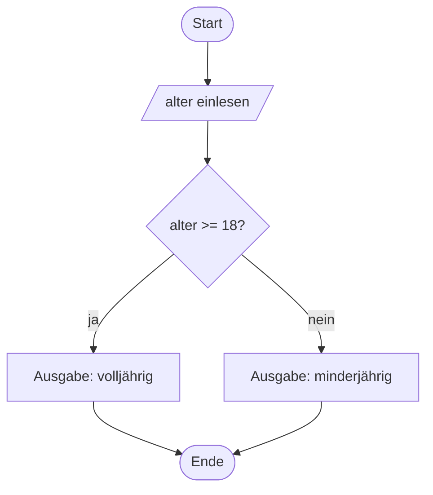

# Verzweigungen

Bisher lief jedes deiner Programme stur von oben nach unten. Mit einer **Verzweigung** entscheidet das Programm selbst, welchen Weg es nimmt.

## Der Ablauf als Flussdiagramm

Bevor wir programmieren, planen wir. Ein **Flussdiagramm** – genauer: ein :t[Programmablaufplan]{#programmablaufplan} – stellt den Ablauf grafisch dar.



:::snippet{#merken}
| Symbol | Bedeutung |
| --- | --- |
| abgerundetes Rechteck | Start oder Ende |
| Rechteck | eine Anweisung |
| Parallelogramm | Ein- oder Ausgabe |
| **Raute** | eine **Bedingung** – hier verzweigt sich der Ablauf |
| Pfeil | zeigt, wie es weitergeht |
:::

## Die if-else-Anweisung

:::onlineide{height="420px"}

```java Main.java
void main() {
    int alter = Integer.parseInt(IO.readln("Wie alt bist du? "));

    if (alter >= 18) {
        IO.println("Du bist volljährig.");
    } else {
        IO.println("Du bist minderjährig.");
    }

    IO.println("Fertig.");
}
```

:::

:::snippet{#merken}
```java
if (Bedingung) {
    // wird ausgeführt, wenn die Bedingung wahr ist
} else {
    // wird sonst ausgeführt
}
```

- Die **Bedingung** steht in runden Klammern und ist ein Ausdruck vom Typ `boolean`.
- Nach der schließenden runden Klammer steht **kein** Semikolon.
- Der `else`-Teil ist optional.
- Nach der Verzweigung geht es für beide Wege gemeinsam weiter.
:::

## Vergleichsoperatoren

:::snippet{#merken}
| Operator | Bedeutung |
| --- | --- |
| `==` | ist gleich |
| `!=` | ist ungleich |
| `<` `>` | kleiner, größer |
| `<=` `>=` | kleiner oder gleich, größer oder gleich |

Das doppelte Gleichheitszeichen `==` ist der **Vergleich**. Das einfache `=` ist die **Zuweisung**. Sie zu verwechseln ist der wohl häufigste Anfängerfehler.

Bei Zeichenketten gilt weiterhin: `equals` statt `==`.
:::

:::snippet{#aufgabe}
Sage **ohne Rechner** voraus, was das folgende Programm ausgibt. Erkläre danach, warum die Ausgabe so aussieht.
:::

:::onlineide{height="400px"}

```java Main.java
void main() {
    int punkte = 7;

    if (punkte > 10) {
        IO.println("A");
    }
    if (punkte > 5) {
        IO.println("B");
    }
    if (punkte > 3) {
        IO.println("C");
    }
}
```

:::

::::collapsible{title="Auflösung"}

Ausgegeben wird:

```
B
C
```

Es handelt sich um **drei einzelne, voneinander unabhängige** Verzweigungen. Jede wird geprüft, egal wie die vorherige ausgegangen ist. 7 ist nicht größer als 10, aber größer als 5 und größer als 3.

::::

## Mehrere Fälle: else if

:::onlineide{height="470px"}

```java Main.java
void main() {
    int punkte = Integer.parseInt(IO.readln("Notenpunkte (0 bis 15): "));

    if (punkte >= 13) {
        IO.println("Note 1");
    } else if (punkte >= 10) {
        IO.println("Note 2");
    } else if (punkte >= 7) {
        IO.println("Note 3");
    } else if (punkte >= 4) {
        IO.println("Note 4");
    } else if (punkte >= 1) {
        IO.println("Note 5");
    } else {
        IO.println("Note 6");
    }
}
```

:::

:::snippet{#merken}
Bei einer `else if`-Kette wird **genau ein** Zweig ausgeführt – der erste, dessen Bedingung zutrifft. Alle folgenden werden dann gar nicht mehr geprüft.

Deshalb ist die **Reihenfolge entscheidend**. Stünde `punkte >= 1` ganz oben, bekämen alle die Note 5.
:::

:::snippet{#aufgabe}
Schreibe die Notenkette so um, dass sie mit der **kleinsten** Grenze beginnt. Was musst du an den Bedingungen ändern, damit sie trotzdem richtig arbeitet?
:::

::::collapsible{title="Auflösung"}

Du musst die Vergleiche umdrehen:

```java
if (punkte < 1) {
    IO.println("Note 6");
} else if (punkte < 4) {
    IO.println("Note 5");
} else if (punkte < 7) {
    IO.println("Note 4");
} ...
```

Beide Fassungen sind korrekt. Die erste liest sich für die meisten natürlicher, weil sie mit der besten Note beginnt.

::::

## Die switch-Anweisung

Wenn du **einen Wert** gegen mehrere feste Möglichkeiten prüfst, gibt es eine kompaktere Schreibweise.

:::onlineide{height="470px"}

```java Main.java
void main() {
    int note = Integer.parseInt(IO.readln("Note (1 bis 6): "));

    switch (note) {
        case 1:
            IO.println("sehr gut");
            break;
        case 2:
            IO.println("gut");
            break;
        case 3:
            IO.println("befriedigend");
        case 4:
            IO.println("ausreichend");
            break;
        case 5:
            IO.println("mangelhaft");
            break;
        default:
            IO.println("ungültig oder ungenügend");
    }
}
```

:::

:::snippet{#aufgabe}
In diesem Programm steckt Absicht: Bei einem `case` fehlt das `break`.

a) Finde ihn und sage voraus, was bei der Eingabe 3 passiert.

b) Probiere es aus und repariere den Fehler.
:::

::::collapsible{title="Auflösung"}

Bei `case 3` fehlt das `break`. Die Eingabe 3 gibt deshalb aus:

```
befriedigend
ausreichend
```

Ohne `break` läuft die Ausführung einfach in den nächsten Fall hinein. Das nennt man *Durchfallen*. Meistens ist es ein Fehler – gelegentlich nutzt man es absichtlich, um mehrere Fälle gleich zu behandeln.

`default` fängt alle Werte ab, für die es keinen `case` gibt.

::::

## Aufgabe 1: Größte von drei Zahlen

:::snippet{#aufgabe}
Schreibe ein Programm, das drei Zahlen einliest und die größte ausgibt.

a) Entwickle **zuerst auf Papier** ein Flussdiagramm.

b) Setze es danach um.
:::

:::onlineide{height="440px"}

```java Main.java
void main() {
    int a = Integer.parseInt(IO.readln("Erste Zahl:  "));
    int b = Integer.parseInt(IO.readln("Zweite Zahl: "));
    int c = Integer.parseInt(IO.readln("Dritte Zahl: "));

    // Dein Code hier

}
```

:::

::::collapsible{title="Tipp 1: Nicht alle Fälle auf einmal"}

Fang mit **zwei** Zahlen an: Merke dir die größere in einer Variablen `groesste`. Vergleiche dann diese eine Variable mit der dritten Zahl.

::::

::::collapsible{title="Tipp 2: Das Gerüst"}

```java
int groesste = a;
if (b > groesste) {
    groesste = b;
}
// und jetzt dasselbe noch einmal mit c
```

Dieses Muster – „merke dir den bisher besten Wert und vergleiche weiter“ – begegnet dir in Kapitel 5 und 7 wieder.

::::

:::protect{password="java-ef-3-1-1" description="Lösung. Erfrage das Passwort bei deiner Lehrkraft."}

```java Main.java
void main() {
    int a = Integer.parseInt(IO.readln("Erste Zahl:  "));
    int b = Integer.parseInt(IO.readln("Zweite Zahl: "));
    int c = Integer.parseInt(IO.readln("Dritte Zahl: "));

    int groesste = a;
    if (b > groesste) {
        groesste = b;
    }
    if (c > groesste) {
        groesste = c;
    }

    IO.println("Die größte Zahl ist " + groesste);
}
```

:::

## Aufgabe 2: Schaltjahr

:::snippet{#aufgabe}
Ein Jahr ist ein Schaltjahr, wenn es durch 4 teilbar ist – **außer** es ist durch 100 teilbar, dann ist es keines – **außer** es ist durch 400 teilbar, dann doch.

Schreibe ein Programm, das ein Jahr einliest und ausgibt, ob es ein Schaltjahr ist.

Teste mit 2024 (ja), 1900 (nein), 2000 (ja) und 2023 (nein).
:::

:::onlineide{height="440px"}

```java Main.java
void main() {
    int jahr = Integer.parseInt(IO.readln("Jahr: "));

    // Dein Code hier

}
```

:::

::::collapsible{title="Tipp 1: Teilbarkeit prüfen"}

`jahr % 4 == 0` ist wahr, wenn `jahr` ohne Rest durch 4 teilbar ist.

::::

::::collapsible{title="Tipp 2: Die Reihenfolge der Regeln"}

Die Regeln sind ineinander verschachtelt. Prüfe von der **speziellsten** zur allgemeinsten: erst durch 400, dann durch 100, dann durch 4.

::::

:::protect{password="java-ef-3-1-2" description="Lösung. Erfrage das Passwort bei deiner Lehrkraft."}

```java Main.java
void main() {
    int jahr = Integer.parseInt(IO.readln("Jahr: "));

    if (jahr % 400 == 0) {
        IO.println(jahr + " ist ein Schaltjahr.");
    } else if (jahr % 100 == 0) {
        IO.println(jahr + " ist kein Schaltjahr.");
    } else if (jahr % 4 == 0) {
        IO.println(jahr + " ist ein Schaltjahr.");
    } else {
        IO.println(jahr + " ist kein Schaltjahr.");
    }
}
```

Im nächsten Abschnitt lernst du, wie man dieselbe Regel mit einer einzigen Bedingung formuliert.

:::

## Zusatzaufgabe

:::snippet{#brain}
Erweitere den Zeitrechner aus Kapitel 2 so, dass er sprachlich sauber ausgibt:

- bei 0 Sekunden: „keine Zeit“
- bei weniger als einer Minute: nur die Sekunden
- bei weniger als einer Stunde: nur Minuten und Sekunden
- sonst: Stunden, Minuten und Sekunden

Und wenn du magst: Setze auch die Einzahl richtig („1 Minute“ statt „1 Minuten“).
:::

---

## Selbsttest

::::multievent

**1. Welches Symbol steht im Flussdiagramm für eine Bedingung?**

{r1{ein Rechteck}}

{r1{!eine Raute}}

{r1{ein Parallelogramm}}

{r1{ein abgerundetes Rechteck}}

{h{An dieser Stelle teilt sich der Ablauf in zwei Wege.}}
{H{Richtig!}}

**2. Wie viele Zweige einer else-if-Kette werden höchstens ausgeführt?**

{z{1}}

{h{Sobald eine Bedingung zutrifft, wird der Rest übersprungen.}}
{H{Richtig! Genau ein Zweig, danach geht es dahinter weiter.}}

**3. Was passiert in einer switch-Anweisung, wenn das break fehlt?**

{r2{Der Fall wird übersprungen.}}

{r2{!Die Ausführung läuft in den nächsten Fall hinein.}}

{r2{Es gibt einen Übersetzungsfehler.}}

{h{Denk an das Notenbeispiel mit der Eingabe 3.}}
{H{Richtig! Das nennt man Durchfallen.}}

**4. Welche Aussagen stimmen?** (Mehrfachauswahl)

{c1{!Das doppelte Gleichheitszeichen ist ein Vergleich.}}

{c1{!Das einfache Gleichheitszeichen ist eine Zuweisung.}}

{c1{!Zeichenketten vergleicht man mit equals.}}

{c1{Nach der Bedingung in runden Klammern steht ein Semikolon.}}

{h{Ein Semikolon direkt hinter der Bedingung würde den Rumpf abtrennen.}}
{H{Richtig! Dort gehört kein Semikolon hin.}}

**5. Welcher Zweig einer Verzweigung wird ausgeführt, wenn die Bedingung falsch ist und kein else-Teil vorhanden ist?**

{r3{der if-Zweig}}

{r3{!keiner, es geht dahinter weiter}}

{r3{das Programm bricht ab}}

{h{Der else-Teil ist optional.}}
{H{Richtig!}}

::::
