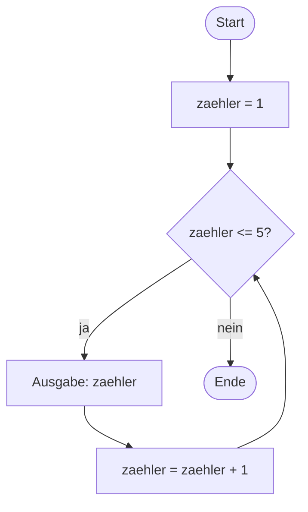

# Kopfgesteuerte Schleifen

Fünf Münzen auf die Bühne zu setzen kostete dich fünf fast identische Blöcke. Eine **Schleife** wiederholt einen Block, solange eine Bedingung erfüllt ist – egal ob fünfmal oder fünftausendmal.

## Der Ablauf als Flussdiagramm



Der Pfeil von `zaehler = zaehler + 1` zurück zur Raute macht die Schleife aus. Die Bedingung wird **vor** jedem Durchlauf geprüft – daher der Name **kopfgesteuert**.

## Die while-Schleife

:::onlineide{height="400px" speed="1000000"}

```java Main.java
void main() {
    int zaehler = 1;

    while (zaehler <= 5) {
        IO.println(zaehler);
        zaehler = zaehler + 1;
    }

    IO.println("Fertig.");
}
```

:::

:::snippet{#merken}
```java
while (Bedingung) {
    // Schleifenrumpf
}
```

Jede Schleife braucht drei Dinge – vergiss eines, und sie funktioniert nicht:

1. eine **Initialisierung** vor der Schleife (`int zaehler = 1;`)
2. eine **Bedingung** im Kopf (`zaehler <= 5`)
3. eine **Veränderung** im Rumpf, die die Bedingung irgendwann falsch macht (`zaehler = zaehler + 1;`)
:::

## Endlosschleifen

:::snippet{#aufgabe}
Was passiert, wenn du im Programm oben die Zeile `zaehler = zaehler + 1;` löschst?

Sage es voraus, probiere es dann aus – und halte das Programm mit dem Stopp-Knopf in der Werkzeugleiste wieder an.
:::

::::collapsible{title="Auflösung"}

`zaehler` bleibt für immer 1, die Bedingung `zaehler <= 5` bleibt für immer wahr: eine **Endlosschleife**. Das Programm läuft, bis du es abbrichst.

Endlosschleifen sind kein exotischer Sonderfall. Sie sind der häufigste Schleifenfehler überhaupt. Wenn dein Programm nicht mehr reagiert, ist fast immer die Veränderung im Rumpf vergessen worden oder sie zielt in die falsche Richtung.

::::

## Erst denken, dann Rechner

:::snippet{#aufgabe}
Sage für jedes der drei Programme voraus, was ausgegeben wird. Notiere deine Vorhersage. Führe sie erst danach aus.

Bei einem der drei musst du aufpassen.
:::

:::onlineide{height="470px" speed="1000000"}

```java Main.java
void main() {
    IO.println("--- A ---");
    int i = 0;
    while (i < 3) {
        IO.println(i);
        i++;
    }

    IO.println("--- B ---");
    int j = 10;
    while (j > 6) {
        IO.println(j);
        j = j - 2;
    }

    IO.println("--- C ---");
    int k = 1;
    while (k < 100) {
        IO.println(k);
        k = k * 3;
    }
}
```

:::

::::collapsible{title="Auflösung"}

```
--- A ---
0
1
2
--- B ---
10
8
--- C ---
1
3
9
27
81
```

Bei **A** ist die Falle die Startbelegung: Die Schleife beginnt bei 0 und läuft dreimal, aber die ausgegebenen Zahlen sind 0, 1, 2.

Bei **B** wird nach der Ausgabe von 8 der Wert 6 erreicht – und 6 ist nicht größer als 6. Deshalb erscheint 6 nicht mehr.

Bei **C** wächst der Zähler multiplikativ. Nach 81 wäre der nächste Wert 243, damit ist die Bedingung falsch.

::::

## Schleifen in der Grafik

Jetzt lösen wir das Münzproblem endgültig.

:::onlineide{libraries="scratch" height="520px"}

```java Main.java
void main() {
    new Buehne();
}
```

```java Buehne.java
public class Buehne extends Stage {

    public Buehne() {
        int x = -160;

        while (x <= 160) {
            Sprite muenze = new Sprite();
            muenze.addCostume("coin_gold");
            muenze.setPosition(x, 0);
            this.add(muenze);

            x = x + 80;
        }
    }
}
```

:::

:::snippet{#aufgabe}
a) Ändere die Schrittweite von 80 auf 40. Wie viele Münzen liegen jetzt auf der Bühne?

b) Baue das Programm so um, dass die Münzen nicht waagerecht, sondern **diagonal** von unten links nach oben rechts liegen.
:::

::::collapsible{title="Tipp zu b)"}

Du brauchst eine zweite Variable für die y-Koordinate, die sich in jedem Durchlauf mitverändert. Oder du berechnest y aus x – bei einer Diagonalen ist das besonders einfach.

::::

:::protect{password="java-ef-3-3-1" description="Lösung. Erfrage das Passwort bei deiner Lehrkraft."}

```java Buehne.java
public class Buehne extends Stage {

    public Buehne() {
        int x = -160;
        int y = -120;

        while (x <= 160) {
            Sprite muenze = new Sprite();
            muenze.addCostume("coin_gold");
            muenze.setPosition(x, y);
            this.add(muenze);

            x = x + 40;
            y = y + 30;
        }
    }
}
```

:::

## Aufgabe 1: Summe und Produkt

:::snippet{#aufgabe}
Schreibe ein Programm, das eine Zahl `n` einliest und

a) die Summe aller Zahlen von 1 bis `n` ausgibt,

b) die Fakultät von `n` ausgibt, also das Produkt aller Zahlen von 1 bis `n`.

Entwickle für a) zuerst ein Flussdiagramm auf Papier.
:::

:::onlineide{height="450px" speed="1000000"}

```java Main.java
void main() {
    int n = Integer.parseInt(IO.readln("n = "));

    // Dein Code hier

}
```

:::

::::collapsible{title="Tipp 1: Der Sammler"}

Du brauchst eine Variable, in der du das Zwischenergebnis sammelst. Bei der Summe startet sie bei **0**, beim Produkt bei **1** – überlege dir, warum.

::::

::::collapsible{title="Tipp 2: Das Muster"}

```java
int summe = 0;
int i = 1;
while (i <= n) {
    summe = summe + i;
    i++;
}
```

Dieses Muster heißt **Akkumulator**. Es begegnet dir in Kapitel 5 bei den Feldern wieder.

::::

:::protect{password="java-ef-3-3-2" description="Lösung. Erfrage das Passwort bei deiner Lehrkraft."}

```java Main.java
void main() {
    int n = Integer.parseInt(IO.readln("n = "));

    int summe = 0;
    int i = 1;
    while (i <= n) {
        summe = summe + i;
        i++;
    }

    int produkt = 1;
    int j = 1;
    while (j <= n) {
        produkt = produkt * j;
        j++;
    }

    IO.println("Summe:    " + summe);
    IO.println("Fakultät: " + produkt);
}
```

Beim Produkt muss die Sammelvariable bei 1 starten. Startete sie bei 0, wäre das Ergebnis immer 0.

:::

## Aufgabe 2: Palindromtest

:::snippet{#aufgabe}
Jetzt kannst du den Palindromtest aus Kapitel 2 zu Ende bringen.

Schreibe ein Programm, das ein Wort einliest und ausgibt, ob es ein Palindrom ist – ob es sich also vorwärts wie rückwärts liest.

Teste mit `otto`, `rentner`, `informatik` und `a`.
:::

:::onlineide{height="470px" speed="1000000"}

```java Main.java
void main() {
    String wort = IO.readln("Gib ein Wort ein: ");

    // Dein Code hier

}
```

:::

::::collapsible{title="Tipp 1: Zwei Zeiger"}

Du brauchst zwei Positionen: eine, die vorne beginnt und nach rechts wandert, und eine, die hinten beginnt und nach links wandert.

::::

::::collapsible{title="Tipp 2: Wann ist es kein Palindrom?"}

Sobald **ein** Paar nicht übereinstimmt, steht das Ergebnis fest. Merke dir das in einer `boolean`-Variablen, die du auf `true` setzt und nur im Fehlerfall auf `false` änderst.

::::

::::collapsible{title="Tipp 3: Wann hört die Schleife auf?"}

Wenn sich die beiden Positionen treffen oder überkreuzen, hast du alle Paare geprüft: `while (links < rechts)`.

::::

:::protect{password="java-ef-3-3-3" description="Lösung. Erfrage das Passwort bei deiner Lehrkraft."}

```java Main.java
void main() {
    String wort = IO.readln("Gib ein Wort ein: ");

    int links = 0;
    int rechts = wort.length() - 1;
    boolean palindrom = true;

    while (links < rechts) {
        if (wort.charAt(links) != wort.charAt(rechts)) {
            palindrom = false;
        }
        links++;
        rechts--;
    }

    if (palindrom) {
        IO.println(wort + " ist ein Palindrom.");
    } else {
        IO.println(wort + " ist kein Palindrom.");
    }
}
```

Bei einem einzelnen Buchstaben ist `links` gleich `rechts`, die Schleife läuft gar nicht – und das Ergebnis `true` ist richtig.

:::

## Zusatzaufgabe

:::snippet{#brain}
Schreibe ein Programm, das prüft, ob eine eingelesene Zahl eine **Primzahl** ist.

Erste Fassung: Probiere alle Teiler von 2 bis `n - 1` durch.

Zweite Fassung: Überlege, ab welchem Wert du aufhören kannst zu suchen. Wie viele Durchläufe sparst du damit bei `n = 1000`?

Diese Frage – wie viele Schritte braucht ein Verfahren? – nehmen wir in Kapitel 7 systematisch auf.
:::

---

## Selbsttest

::::multievent

**1. Wann wird bei einer kopfgesteuerten Schleife die Bedingung geprüft?**

{r1{!vor jedem Durchlauf}}

{r1{nach jedem Durchlauf}}

{r1{nur einmal am Anfang}}

{h{Der Name kopfgesteuert verrät es.}}
{H{Richtig! Deshalb kann der Rumpf auch gar nicht ausgeführt werden.}}

**2. Welche drei Bestandteile braucht jede Schleife?** (Mehrfachauswahl)

{c1{!eine Initialisierung vor der Schleife}}

{c1{!eine Bedingung}}

{c1{!eine Veränderung im Rumpf}}

{c1{eine feste Anzahl von Durchläufen}}

{h{Eine while-Schleife weiß vorher nicht unbedingt, wie oft sie läuft.}}
{H{Richtig! Fehlt die Veränderung, entsteht eine Endlosschleife.}}

**3. Wie oft läuft der Rumpf bei Startwert 0, Bedingung kleiner 3 und Erhöhung um 1?**

{z{3}}

{h{Die Werte sind 0, 1 und 2.}}
{H{Richtig!}}

**4. Womit muss eine Sammelvariable für ein Produkt starten?**

{r2{mit 0}}

{r2{!mit 1}}

{r2{mit der Zahl n}}

{h{Was passiert, wenn du bei 0 startest und dann multiplizierst?}}
{H{Richtig! Bei 0 wäre das Ergebnis immer 0.}}

**5. Was ist die häufigste Ursache einer Endlosschleife?**

{r3{eine falsche Startbelegung}}

{r3{!die vergessene Veränderung im Rumpf}}

{r3{ein fehlendes Semikolon}}

{h{Die Bedingung muss irgendwann falsch werden können.}}
{H{Richtig!}}

::::
