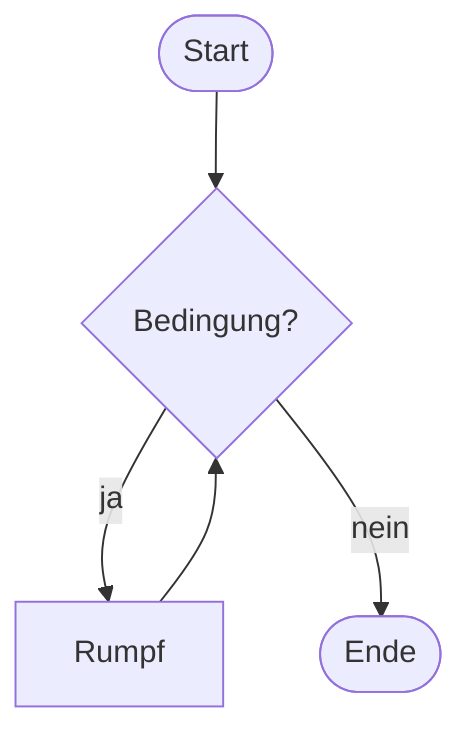
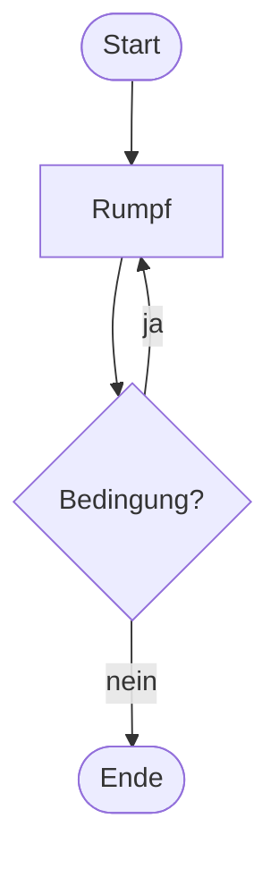

# Fußgesteuerte Schleifen

Manchmal soll der Rumpf **mindestens einmal** laufen, bevor überhaupt entschieden werden kann, ob es weitergeht. Dafür gibt es die **fußgesteuerte** Schleife: Die Bedingung steht am Ende.

## Der Unterschied im Flussdiagramm

**Kopfgesteuert** – der Rumpf kann übersprungen werden:



**Fußgesteuert** – der Rumpf läuft garantiert mindestens einmal:



## Die do-while-Schleife

:::onlineide{height="420px" speed="1000000"}

```java Main.java
void main() {
    String eingabe;

    do {
        eingabe = IO.readln("Gib das Passwort ein: ");
    } while (!eingabe.equals("java"));

    IO.println("Zugang gewährt.");
}
```

:::

:::snippet{#merken}
```java
do {
    // Schleifenrumpf
} while (Bedingung);
```

- Der Rumpf läuft **immer mindestens einmal**.
- Hinter der Bedingung steht hier ein **Semikolon** – anders als bei `while` und `for`.
- Die Variable `eingabe` muss **vor** der Schleife deklariert werden, sonst kennt sie das `while` im Fuß nicht.
:::

## Der Unterschied in Zahlen

:::snippet{#aufgabe}
Beide Schleifen haben dieselbe Bedingung und denselben Rumpf. Sage voraus, wie oft jede von ihnen etwas ausgibt.
:::

:::onlineide{height="440px" speed="1000000"}

```java Main.java
void main() {
    IO.println("--- kopfgesteuert ---");
    int i = 100;
    while (i < 5) {
        IO.println("Durchlauf " + i);
        i++;
    }

    IO.println("--- fußgesteuert ---");
    int j = 100;
    do {
        IO.println("Durchlauf " + j);
        j++;
    } while (j < 5);
}
```

:::

::::collapsible{title="Auflösung"}

```
--- kopfgesteuert ---
--- fußgesteuert ---
Durchlauf 100
```

Die `while`-Schleife prüft zuerst: 100 ist nicht kleiner als 5, der Rumpf läuft **gar nicht**.

Die `do-while`-Schleife führt den Rumpf zuerst aus und prüft danach: also **genau einmal**.

Genau darin besteht der ganze Unterschied.

::::

## Wann nimmt man was?

:::snippet{#merken}
**Faustregel:** Nimm `do-while` nur, wenn es sachlich richtig ist, dass der Rumpf mindestens einmal läuft.

Typische Fälle:

- eine Eingabe abfragen und prüfen (man muss erst fragen, bevor man prüfen kann)
- ein Spiel, das mindestens eine Runde dauert
- ein Menü, das mindestens einmal angezeigt wird

In allen anderen Fällen ist `while` oder `for` die bessere Wahl.
:::

## Aufgabe 1: Zahlenraten

:::snippet{#aufgabe}
Schreibe ein Zahlenratespiel:

1. Das Programm denkt sich eine Zufallszahl zwischen 1 und 100.
2. Es fragt so lange nach einer Zahl, bis geraten wurde.
3. Nach jeder Eingabe gibt es einen Hinweis aus: „zu klein“ oder „zu groß“.
4. Am Ende meldet es, wie viele Versuche gebraucht wurden.

Entwickle zuerst ein Flussdiagramm auf Papier.
:::

:::onlineide{height="480px" speed="1000000"}

```java Main.java
void main() {
    int gesucht = Random.randint(1, 100);
    int versuche = 0;

    // Dein Code hier

}
```

:::

::::collapsible{title="Tipp 1: Warum passt hier do-while?"}

Bevor du prüfen kannst, ob geraten wurde, musst du gefragt haben. Der Rumpf muss also mindestens einmal laufen.

::::

::::collapsible{title="Tipp 2: Das Gerüst"}

```java
int geraten;
do {
    geraten = Integer.parseInt(IO.readln("Deine Zahl: "));
    versuche++;
    // hier den Hinweis ausgeben
} while (geraten != gesucht);
```

::::

:::protect{password="java-ef-3-5-1" description="Lösung. Erfrage das Passwort bei deiner Lehrkraft."}

```java Main.java
void main() {
    int gesucht = Random.randint(1, 100);
    int versuche = 0;
    int geraten;

    do {
        geraten = Integer.parseInt(IO.readln("Deine Zahl: "));
        versuche++;

        if (geraten < gesucht) {
            IO.println("zu klein");
        } else if (geraten > gesucht) {
            IO.println("zu groß");
        }
    } while (geraten != gesucht);

    IO.println("Richtig! Du hast " + versuche + " Versuche gebraucht.");
}
```

:::

## Aufgabe 2: Robuste Eingabe

:::snippet{#aufgabe}
In Kapitel 2 ist dein Programm abgestürzt, als jemand statt einer Zahl ein Wort eingegeben hat. Jetzt kannst du das abfangen – zumindest teilweise.

Schreibe ein Programm, das so lange nach einer Zahl zwischen 1 und 6 fragt, bis eine gültige Eingabe kommt. Nicht-Zahlen musst du dabei noch nicht behandeln, nur Zahlen außerhalb des Bereichs.
:::

:::onlineide{height="440px" speed="1000000"}

```java Main.java
void main() {
    int wurf;

    // Dein Code hier

}
```

:::

:::protect{password="java-ef-3-5-2" description="Lösung. Erfrage das Passwort bei deiner Lehrkraft."}

```java Main.java
void main() {
    int wurf;

    do {
        wurf = Integer.parseInt(IO.readln("Würfelwurf (1 bis 6): "));
        if (wurf < 1 || wurf > 6) {
            IO.println("Das ist kein gültiger Wurf. Bitte noch einmal.");
        }
    } while (wurf < 1 || wurf > 6);

    IO.println("Danke, gewürfelt wurde eine " + wurf);
}
```

Dass die Bedingung zweimal dasteht, ist unschön. In Kapitel 4 lernst du, wie man solche Prüfungen in eine eigene Methode auslagert und damit nur noch einmal formuliert.

:::

## Zusatzaufgabe

:::snippet{#brain}
Baue das Zahlenraten zu einem Spiel für **zwei Personen** um:

Eine Person gibt zu Beginn die gesuchte Zahl ein, die andere rät. Damit die ratende Person nichts sieht, soll das Programm nach der Eingabe der gesuchten Zahl den Bildschirm leeren – dafür gibt es `SystemTools.clearScreen()`.

Überlege außerdem: Wie viele Versuche braucht man im schlimmsten Fall, wenn man geschickt rät? Diese Frage führt direkt zur **binären Suche**, die du im Lernpfad *Erweiterungen* kennenlernst.
:::

---

## Selbsttest

::::multievent

**1. Wie oft läuft der Rumpf einer fußgesteuerten Schleife mindestens?**

{z{1}}

{h{Die Bedingung wird erst am Ende geprüft.}}
{H{Richtig! Genau darin liegt der Unterschied zur kopfgesteuerten Schleife.}}

**2. Wo steht bei der do-while-Schleife ein Semikolon, das die anderen Schleifen nicht haben?**

{r1{hinter dem Wort do}}

{r1{!hinter der Bedingung am Ende}}

{r1{hinter der öffnenden geschweiften Klammer}}

{h{Es ist die letzte Zeile der Schleife.}}
{H{Richtig!}}

**3. In welchen Fällen ist eine fußgesteuerte Schleife die richtige Wahl?** (Mehrfachauswahl)

{c1{!eine Eingabe abfragen und danach prüfen}}

{c1{!ein Spiel, das mindestens eine Runde dauert}}

{c1{alle Zeichen eines Wortes durchlaufen}}

{c1{alle Zahlen von 1 bis 100 ausgeben}}

{h{Der Rumpf muss sachlich mindestens einmal laufen dürfen.}}
{H{Richtig! Bei den anderen beiden ist eine Zählschleife passender.}}

**4. Eine kopfgesteuerte und eine fußgesteuerte Schleife haben dieselbe Bedingung, die von Anfang an falsch ist. Wie oft läuft der Rumpf jeweils?**

{r2{beide null Mal}}

{r2{!kopfgesteuert null Mal, fußgesteuert einmal}}

{r2{beide einmal}}

{h{Denk an das Beispiel mit dem Startwert 100.}}
{H{Richtig!}}

**5. Warum muss die Variable für die Eingabe vor der do-while-Schleife deklariert werden?**

{r3{weil Java das immer so verlangt}}

{r3{!weil die Bedingung im Fuß sonst die Variable nicht kennt}}

{r3{weil sie sonst nicht verändert werden könnte}}

{h{Eine im Rumpf deklarierte Variable existiert nur innerhalb der geschweiften Klammern.}}
{H{Richtig!}}

::::
