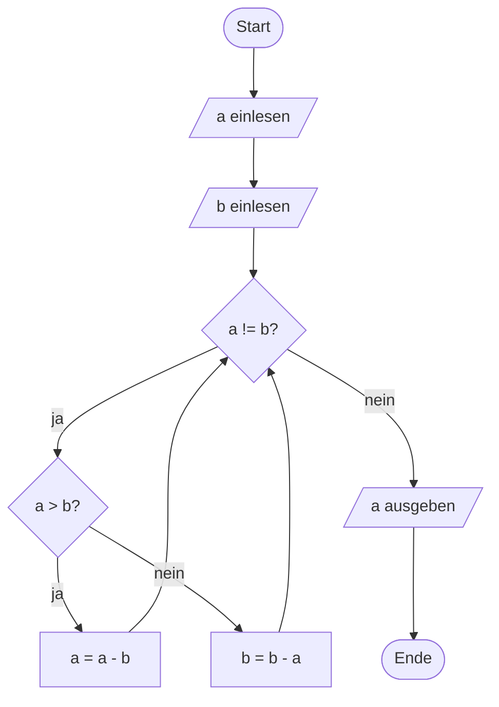

# Struktogramme

Flussdiagramme haben einen Nachteil: Mit ihren Pfeilen kann man Sprünge kreuz und quer zeichnen – auch solche, die sich gar nicht sauber programmieren lassen. :t[Struktogramme]{#struktogramm} (nach ihren Erfindern auch *Nassi-Shneiderman-Diagramme*) verhindern das durch ihre Bauweise: Sie bestehen nur aus ineinandergeschachtelten Kästen und kennen überhaupt keine Pfeile.

<!-- KLP EF, Algorithmen: Iterative Algorithmen ... Struktogramme; stellen Algorithmen sprachlich und grafisch dar (DI) -->

## Die Bausteine

:::snippet{#merken}
| Baustein | Aussehen | in Java |
| --- | --- | --- |
| **Anweisung** | ein Kasten mit Text | eine Anweisung |
| **Eingabe** | Kasten mit `▶` davor | einlesen |
| **Ausgabe** | Kasten mit `◀` davor | ausgeben |
| **Sequenz** | Kästen untereinander | nacheinander |
| **Verzweigung** | Kasten mit Schrägen, darunter zwei Spalten | `if` / `else` |
| **Zählergesteuerte Schleife** | Kasten, der oben und links um den Rumpf greift | `for` |
| **Kopfgesteuerte Schleife** | genauso – nur steht oben eine Bedingung statt eines Zählers | `while` |
| **Fußgesteuerte Schleife** | Kasten, der unten und links um den Rumpf greift | `do-while` |

Die beiden Spalten einer Verzweigung sind mit **Wahr** und **Falsch** beschriftet. Bleibt eine von beiden leer, wird sie trotzdem gezeichnet – sie bleibt einfach leer. So ist zu sehen, dass der Fall bedacht und nicht vergessen wurde.

Die Zuweisung schreibt man mit `=`, so wie in Java.
:::

:::alert{info}
Die Struktogramme auf dieser Seite sind mit [StruktoLab](https://struktolab.openpatch.org) gezeichnet. Dort kannst du deine eigenen bauen – und sie am Ende in Java übersetzen lassen.
:::

## Eine Sequenz

Das einfachste Struktogramm ist eine Folge von Kästen:

:::struktolab{fontSize=15}
```
eingabe("radius")
flaeche = PI * radius * radius
ausgabe(flaeche)
```
:::

Ein- und Ausgabe erkennst du an den kleinen Dreiecken am Kastenrand.

## Eine Verzweigung

:::struktolab{fontSize=15}
```
eingabe("alter")
falls alter >= 18:
    ausgabe("volljährig")
sonst:
    ausgabe("minderjährig")
ausgabe("fertig")
```
:::

Die beiden Spalten stehen **nebeneinander**, weil immer nur eine von beiden ausgeführt wird. Darunter läuft es wieder in einem Kasten zusammen – genau wie im Programm.

## Eine Schleife

:::struktolab{fontSize=15}
```
summe = 0
i = 1
wiederhole solange i <= n:
    summe = summe + i
    i = i + 1
ausgabe(summe)
```
:::

Der Schleifenkasten **umschließt** seinen Rumpf. Dadurch sieht man sofort, was wiederholt wird und was nicht – bei einem Flussdiagramm muss man dafür den Pfeilen folgen.

## Aufgabe 1: Struktogramm lesen

:::snippet{#aufgabe}
Gegeben ist das folgende Struktogramm.

a) Beschreibe **in Worten**, was der Algorithmus tut.

b) Verfolge ihn **auf Papier** für die Eingabe `n = 4`. Notiere nach jedem Durchlauf die Werte von `i` und `erg`.

c) Setze ihn danach in Java um und prüfe deine Handrechnung.
:::

:::struktolab{fontSize=15}
```
eingabe("Zahl n")
erg = 1
i = 1
wiederhole solange i <= n:
    erg = erg * 2
    i = i + 1
ausgabe(erg)
```
:::

:::onlineide{height="400px" speed="1000000"}

```java Main.java
void main() {
    int n = Integer.parseInt(IO.readln("n = "));

    // Dein Code hier

}
```

:::

::::collapsible{title="Auflösung zu a) und b)"}

a) Der Algorithmus berechnet **2 hoch n**. Er startet bei 1 und verdoppelt `n`-mal.

b) Für `n = 4`:

| nach Durchlauf | i | erg |
| --- | --- | --- |
| (Start) | 1 | 1 |
| 1 | 2 | 2 |
| 2 | 3 | 4 |
| 3 | 4 | 8 |
| 4 | 5 | 16 |

Die Schleife endet, weil 5 nicht mehr kleiner oder gleich 4 ist. Ausgegeben wird 16.

::::

:::protect{password="java-ef-3-7-1" description="Lösung. Erfrage das Passwort bei deiner Lehrkraft."}

```java Main.java
void main() {
    int n = Integer.parseInt(IO.readln("n = "));

    int erg = 1;
    int i = 1;
    while (i <= n) {
        erg = erg * 2;
        i = i + 1;
    }

    IO.println("2 hoch " + n + " = " + erg);
}
```

:::

## Aufgabe 2: Struktogramm entwickeln

:::snippet{#aufgabe}
Entwickle **auf Papier** ein Struktogramm für den folgenden Algorithmus:

> Lies eine Zahl `n` ein. Gib alle Zahlen von 1 bis `n` aus. Bei jeder Zahl, die durch 3 teilbar ist, gib zusätzlich das Wort „Fizz“ aus.

Setze es danach in Java um.
:::

:::onlineide{height="420px" speed="1000000"}

```java Main.java
void main() {
    int n = Integer.parseInt(IO.readln("n = "));

    // Dein Code hier

}
```

:::

::::collapsible{title="Tipp: Wo steckt die Verzweigung?"}

Die Verzweigung liegt **innerhalb** der Schleife. Im Struktogramm heißt das: Der Verzweigungskasten steht im Rumpf des Schleifenkastens.

Und: Die Falsch-Spalte bleibt leer. Zeichne sie trotzdem – weglassen darfst du sie nicht.

::::

:::protect{password="java-ef-3-7-2" description="Lösung. Erfrage das Passwort bei deiner Lehrkraft."}

```java Main.java
void main() {
    int n = Integer.parseInt(IO.readln("n = "));

    for (int i = 1; i <= n; i++) {
        IO.print(i);
        if (i % 3 == 0) {
            IO.print(" Fizz");
        }
        IO.println();
    }
}
```

Das zugehörige Struktogramm:

:::struktolab{fontSize=15}
```
eingabe("Zahl n")
wiederhole für i = 1 bis n:
    ausgabe(i)
    falls i mod 3 = 0:
        ausgabe("Fizz")
    sonst:
    Zeilenumbruch
```
:::

:::

## Aufgabe 3: Darstellungen überführen

Denselben Ablauf in einer anderen Darstellungsform aufzuschreiben, ist eine eigene Fähigkeit. Genau die übst du hier.

<!-- KLP EF, übergeordnet DI: überführen unterschiedliche Darstellungen (textuell, grafisch) informatischer Zusammenhänge in eine andere Darstellungsform -->

:::snippet{#aufgabe}
Gegeben ist dieses Flussdiagramm.

a) Überführe es in ein **Struktogramm**.

b) Überführe es in ein **Java-Programm**.

c) Beschreibe in einem Satz, was der Algorithmus berechnet.
:::



:::onlineide{height="440px" speed="1000000"}

```java Main.java
void main() {
    int a = Integer.parseInt(IO.readln("a = "));
    int b = Integer.parseInt(IO.readln("b = "));

    // Dein Code hier

}
```

:::

::::collapsible{title="Tipp: Erst die Struktur erkennen"}

Es gibt eine **äußere Schleife** (die Raute mit `a != b`, zu der zwei Pfeile zurückführen) und darin eine **Verzweigung** (die Raute mit `a > b`).

::::

:::protect{password="java-ef-3-7-3" description="Lösung. Erfrage das Passwort bei deiner Lehrkraft."}

```java Main.java
void main() {
    int a = Integer.parseInt(IO.readln("a = "));
    int b = Integer.parseInt(IO.readln("b = "));

    while (a != b) {
        if (a > b) {
            a = a - b;
        } else {
            b = b - a;
        }
    }

    IO.println("Ergebnis: " + a);
}
```

Als Struktogramm:

:::struktolab{fontSize=15}
```
eingabe("Zahl a")
eingabe("Zahl b")
wiederhole solange a != b:
    falls a > b:
        a = a - b
    sonst:
        b = b - a
ausgabe(a)
```
:::

Der Algorithmus berechnet den **größten gemeinsamen Teiler** von `a` und `b`. Er heißt **euklidischer Algorithmus** und ist über 2000 Jahre alt. Teste ihn mit 48 und 18 – heraus kommt 6.

:::

## Zusatzaufgabe

:::snippet{#brain}
Der euklidische Algorithmus in der Fassung oben zieht immer nur ab. Bei den Zahlen 1000 und 3 braucht er dafür über 300 Durchläufe.

a) Überlege, wie man das Abziehen durch **eine** Rechenoperation ersetzen kann, die alle Subtraktionen auf einmal erledigt.

b) Zeichne das Struktogramm der schnelleren Fassung.

c) Was passiert bei deiner Fassung, wenn eine der beiden Zahlen 0 ist?
:::

---

## Selbsttest

::::multievent

**1. Was gibt es in einem Struktogramm nicht?**

{r1{Kästen}}

{r1{!Pfeile}}

{r1{Verzweigungen}}

{r1{Schleifen}}

{h{Genau das unterscheidet es vom Flussdiagramm.}}
{H{Richtig! Struktogramme bestehen nur aus ineinander geschachtelten Kästen.}}

**2. Wie erkennt man im Struktogramm, was zu einer Schleife gehört?**

{r2{an einem Pfeil, der zurückführt}}

{r2{!daran, dass der Schleifenkasten den Rumpf umschließt}}

{r2{an der Einrückung des Textes}}

{h{Der Rumpf steckt sichtbar im Schleifenkasten.}}
{H{Richtig! Deshalb kann man dort nichts durcheinanderbringen.}}

**3. Ein Zweig einer Verzweigung bleibt leer. Was zeichnest du?**

{r3{gar nichts, die Spalte fällt weg}}

{r3{!die Spalte, aber ohne Inhalt}}

{r3{einen Pfeil, der die Verzweigung überspringt}}

{h{Man muss sehen können, dass der Fall bedacht wurde.}}
{H{Richtig! Die leere Spalte zeigt, dass der Fall nicht vergessen wurde.}}

**4. Welche Aussagen stimmen?** (Mehrfachauswahl)

{c1{!Eine Eingabe ist im Kasten durch ein besonderes Zeichen kenntlich gemacht.}}

{c1{!Die beiden Zweige einer Verzweigung stehen nebeneinander.}}

{c1{!Der euklidische Algorithmus berechnet den größten gemeinsamen Teiler.}}

{c1{Struktogramme können auch Sprünge quer durch den Ablauf darstellen.}}

{h{Genau solche Sprünge sollen durch die Bauweise verhindert werden.}}
{H{Richtig!}}

**5. Was berechnet der Algorithmus, der so lange die kleinere von der größeren Zahl abzieht, bis beide gleich sind?**

{r4{das kleinste gemeinsame Vielfache}}

{r4{!den größten gemeinsamen Teiler}}

{r4{die Differenz}}

{h{Teste ihn im Kopf mit 48 und 18.}}
{H{Richtig! Das ist der euklidische Algorithmus.}}

::::
