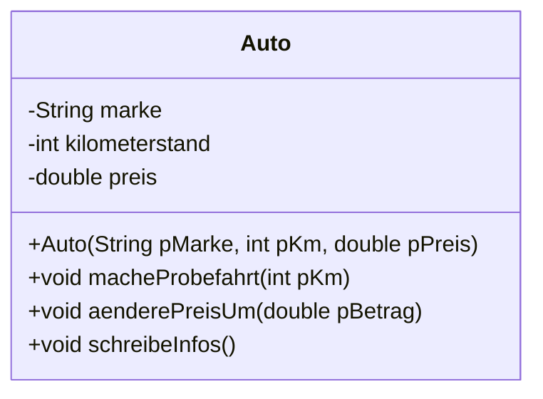

# Klassen und Objekte

Am Ende des letzten Kapitels standen Name und Punktzahl in zwei getrennten Feldern – und nichts im Programm sicherte, dass sie zusammenblieben. Das ist der Moment, in dem man aufhört, Abläufe zu programmieren, und anfängt, **die Dinge selbst zu modellieren**.

## Objekte in der Welt und im Programm

Du hast längst mit Objekten gearbeitet: `hase` war ein `Sprite`-Objekt, `stift` ein `Pen`-Objekt. Beide hatten **Eigenschaften** (Position, Farbe, Größe) und **Fähigkeiten** (`setPosition`, `down`, `say`).

:::snippet{#definition}
Eine :t[Klasse]{#klasse} ist der **Bauplan**. Sie legt fest, welche Eigenschaften und Fähigkeiten alle Objekte dieser Art haben.

Ein :t[Objekt]{#objekt} ist ein konkretes **Exemplar** nach diesem Bauplan. Es hat eigene Werte für die Eigenschaften.

Die Eigenschaften heißen :t[Attribute]{#attribut}, die Fähigkeiten :t[Methoden]{#methode}.
:::

Ein Bauplan „Auto“ legt fest, dass jedes Auto eine Marke, einen Kilometerstand und einen Preis hat. Das rote Auto vor der Tür und das blaue in der Garage sind zwei **Objekte** derselben **Klasse** – mit unterschiedlichen Werten.

## Die erste eigene Klasse

Zuerst der Bauplan als Diagramm. So ein **Implementationsdiagramm** liest man von oben nach unten: Name, Attribute, Methoden.



Und jetzt derselbe Bauplan in Java:

:::onlineide{height="620px" speed="1000000"}

```java Main.java
void main() {
    Auto ersterWagen = new Auto("VW", 84000, 7500.0);
    Auto zweiterWagen = new Auto("Fiat", 12000, 14900.0);

    ersterWagen.schreibeInfos();
    zweiterWagen.schreibeInfos();

    ersterWagen.macheProbefahrt(35);
    ersterWagen.aenderePreisUm(-500.0);

    IO.println("--- nach der Probefahrt ---");
    ersterWagen.schreibeInfos();
    zweiterWagen.schreibeInfos();
}
```

```java Auto.java
public class Auto {

    // Attribute
    private String marke;
    private int kilometerstand;
    private double preis;

    /**
     * Erzeugt ein neues Auto.
     * @param pMarke die Marke
     * @param pKm der aktuelle Kilometerstand
     * @param pPreis der Verkaufspreis in Euro
     */
    public Auto(String pMarke, int pKm, double pPreis) {
        marke = pMarke;
        kilometerstand = pKm;
        preis = pPreis;
    }

    /** Erhöht den Kilometerstand um die gefahrene Strecke. */
    public void macheProbefahrt(int pKm) {
        kilometerstand = kilometerstand + pKm;
    }

    /** Ändert den Preis um den angegebenen Betrag. */
    public void aenderePreisUm(double pBetrag) {
        preis = preis + pBetrag;
    }

    /** Gibt alle Daten des Autos aus. */
    public void schreibeInfos() {
        IO.println(marke + ", " + kilometerstand + " km, " + preis + " Euro");
    }
}
```

:::

:::snippet{#merken}
| Begriff | im Beispiel |
| --- | --- |
| **Klasse** | `Auto` – steht in einer eigenen Datei `Auto.java` |
| **Attribut** | `marke`, `kilometerstand`, `preis` |
| :t[Konstruktor]{#konstruktor} | `public Auto(...)` – heißt genau wie die Klasse und hat **keinen** Rückgabetyp |
| **Methode** | `macheProbefahrt`, `aenderePreisUm`, `schreibeInfos` |
| **Objekt erzeugen** | `new Auto("VW", 84000, 7500.0)` |
| **Methode aufrufen** | `ersterWagen.macheProbefahrt(35)` |

Der Klassenname beginnt **groß**, der Dateiname muss damit übereinstimmen.
:::

## Jedes Objekt hat eigene Werte

:::snippet{#aufgabe}
Im Programm oben wird nur `ersterWagen` verändert.

a) Sage voraus, was nach der Probefahrt für **beide** Autos ausgegeben wird.

b) Erkläre, warum sich `zweiterWagen` nicht mitverändert – obwohl beide dieselben Attribute haben.
:::

::::collapsible{title="Auflösung"}

a)
```
VW, 84035 km, 7000.0 Euro
Fiat, 12000 km, 14900.0 Euro
```

b) Die **Klasse** legt fest, *dass* es ein Attribut `kilometerstand` gibt. Die **Werte** gehören aber jedem Objekt einzeln. `ersterWagen` und `zweiterWagen` haben je einen eigenen Satz Attributwerte.

Genau das ist der Fortschritt gegenüber den parallelen Feldern: Marke, Kilometerstand und Preis eines Autos können gar nicht mehr auseinanderlaufen, weil sie in **einem** Objekt stecken.

::::

## Objekte im Feld

:::onlineide{height="560px" speed="1000000"}

```java Main.java
void main() {
    Auto[] flotte = new Auto[3];
    flotte[0] = new Auto("VW", 84000, 7500.0);
    flotte[1] = new Auto("Fiat", 12000, 14900.0);
    flotte[2] = new Auto("Opel", 45000, 9900.0);

    for (int i = 0; i < flotte.length; i++) {
        flotte[i].schreibeInfos();
    }

    IO.println("--- alle Preise um 5 Prozent senken ---");
    for (int i = 0; i < flotte.length; i++) {
        flotte[i].aenderePreisUm(-flotte[i].getPreis() * 0.05);
        flotte[i].schreibeInfos();
    }
}
```

```java Auto.java
public class Auto {

    private String marke;
    private int kilometerstand;
    private double preis;

    public Auto(String pMarke, int pKm, double pPreis) {
        marke = pMarke;
        kilometerstand = pKm;
        preis = pPreis;
    }

    public void macheProbefahrt(int pKm) {
        kilometerstand = kilometerstand + pKm;
    }

    public void aenderePreisUm(double pBetrag) {
        preis = preis + pBetrag;
    }

    /** Liefert den aktuellen Preis. */
    public double getPreis() {
        return preis;
    }

    public void schreibeInfos() {
        IO.println(marke + ", " + kilometerstand + " km, " + preis + " Euro");
    }
}
```

:::

:::snippet{#merken}
`new Auto[3]` legt ein Feld für **drei Verweise** an – aber noch **kein einziges Auto**. Auf allen drei Plätzen steht zunächst `null`, das heißt „kein Objekt“.

Erst `flotte[0] = new Auto(...)` erzeugt ein Auto und trägt den Verweis ein. Wer das vergisst und trotzdem `flotte[0].schreibeInfos()` aufruft, bekommt einen Laufzeitfehler.
:::

## Aufgabe 1: Klasse Schueler

:::snippet{#aufgabe}
Modelliere eine Klasse `Schueler`.

a) Zeichne **zuerst auf Papier** das Implementationsdiagramm: Welche Attribute braucht ein Schüler-Objekt, welche Methoden?

b) Setze es dann um, sodass alle Tests grün werden.
:::

:::onlineide{height="620px" speed="1000000"}

```java Main.java
void main() {
    IO.println("Führe die Tests über den Reiter Testrunner aus.");
}
```

```java Schueler.java
public class Schueler {

    // Deine Attribute hier

    /**
     * Erzeugt einen neuen Schüler.
     * @param pName der Name
     * @param pPunkte die aktuellen Notenpunkte
     */
    public Schueler(String pName, int pPunkte) {
        // Dein Code hier
    }

    /** Liefert den Namen. */
    public String getName() {
        return ""; // ersetze diese Zeile
    }

    /** Liefert die aktuellen Notenpunkte. */
    public int getPunkte() {
        return 0; // ersetze diese Zeile
    }

    /** Ändert die Notenpunkte um den angegebenen Betrag. */
    public void aenderePunkteUm(int pBetrag) {
        // Dein Code hier
    }

    /** Liefert true, wenn die Punkte mindestens 5 betragen. */
    public boolean istBestanden() {
        return false; // ersetze diese Zeile
    }
}
```

```java SchuelerTest.java
@Test
class SchuelerTest {

    @Test
    void testKonstruktorUndGetter() {
        Schueler s = new Schueler("Ada", 12);
        assertEquals("Ada", s.getName(), "Der Name muss Ada sein.");
        assertEquals(12, s.getPunkte(), "Die Punkte müssen 12 sein.");
    }

    @Test
    void testAenderePunkte() {
        Schueler s = new Schueler("Alan", 8);
        s.aenderePunkteUm(3);
        assertEquals(11, s.getPunkte(), "Nach plus 3 sind es 11 Punkte.");
        s.aenderePunkteUm(-5);
        assertEquals(6, s.getPunkte(), "Nach minus 5 sind es 6 Punkte.");
    }

    @Test
    void testEigeneWerte() {
        Schueler a = new Schueler("Ada", 12);
        Schueler b = new Schueler("Grace", 15);
        a.aenderePunkteUm(-2);
        assertEquals(10, a.getPunkte(), "Ada hat jetzt 10 Punkte.");
        assertEquals(15, b.getPunkte(), "Grace ist davon nicht betroffen.");
    }

    @Test
    void testIstBestanden() {
        assertTrue(new Schueler("Ada", 5).istBestanden(), "5 Punkte reichen.");
        assertTrue(new Schueler("Ada", 15).istBestanden(), "15 Punkte reichen.");
        assertFalse(new Schueler("Ada", 4).istBestanden(), "4 Punkte reichen nicht.");
    }
}
```

:::

::::collapsible{title="Tipp: Attribut und Parameter unterscheiden"}

Im Konstruktor stehen zwei Dinge mit ähnlicher Bedeutung nebeneinander: der **Parameter** `pName` (kommt von außen) und das **Attribut** `name` (gehört zum Objekt).

Deshalb das `p` vor den Parametern: `name = pName;` ist eindeutig lesbar.

::::

:::protect{password="java-ef-6-1-1" description="Lösung. Erfrage das Passwort bei deiner Lehrkraft."}

```java Schueler.java
public class Schueler {

    private String name;
    private int punkte;

    public Schueler(String pName, int pPunkte) {
        name = pName;
        punkte = pPunkte;
    }

    public String getName() {
        return name;
    }

    public int getPunkte() {
        return punkte;
    }

    public void aenderePunkteUm(int pBetrag) {
        punkte = punkte + pBetrag;
    }

    public boolean istBestanden() {
        return punkte >= 5;
    }
}
```

:::

## Aufgabe 2: Eine eigene Klasse modellieren

:::snippet{#aufgabe}
Such dir einen Gegenstand aus deiner Umgebung aus – ein Smartphone, ein Fahrrad, ein Buch, ein Getränkeautomat.

a) Ermittle bei der Analyse: Welche **Eigenschaften** hat er? Welche **Operationen** kann man mit ihm ausführen?

b) Zeichne das Implementationsdiagramm.

c) Setze die Klasse um und erzeuge im Hauptprogramm mindestens zwei Objekte davon.

d) Beurteile deinen eigenen Entwurf: Hast du Eigenschaften aufgenommen, die man gar nicht braucht? Fehlt etwas?
:::

:::onlineide{height="520px" speed="1000000"}

```java Main.java
void main() {
    // Erzeuge hier deine Objekte

}
```

```java MeineKlasse.java
public class MeineKlasse {
    // Dein Bauplan hier
}
```

:::

## Zusatzaufgabe

:::snippet{#brain}
Die Klasse `Auto` hat eine Schwachstelle: `macheProbefahrt(-100)` verringert den Kilometerstand. Das wäre in der Praxis Betrug.

a) Probiere es aus und überzeuge dich, dass es tatsächlich funktioniert.

b) Ändere die Methode so, dass negative Angaben wirkungslos bleiben.

c) Überlege: Reicht das? Kann man den Kilometerstand jetzt noch auf anderem Weg manipulieren?

Die Antwort auf c) führt direkt in die nächste Lektion.
:::

---

## Selbsttest

::::multievent

**1. Was ist eine Klasse?**

{r1{ein einzelner Gegenstand im Programm}}

{r1{!ein Bauplan für Objekte}}

{r1{eine besondere Art von Feld}}

{h{Nach ihr kann man beliebig viele Exemplare herstellen.}}
{H{Richtig!}}

**2. Woran erkennst du einen Konstruktor?** (Mehrfachauswahl)

{c1{!Er heißt genau wie die Klasse.}}

{c1{!Er hat keinen Rückgabetyp.}}

{c1{!Er wird beim Erzeugen mit new aufgerufen.}}

{c1{Er muss immer void heißen.}}

{h{Ein void stünde an der Stelle, wo beim Konstruktor gar nichts steht.}}
{H{Richtig!}}

**3. Zwei Objekte derselben Klasse werden erzeugt. Was teilen sie sich?**

{r2{ihre Attributwerte}}

{r2{!nur den Bauplan, nicht die Werte}}

{r2{gar nichts}}

{h{Denk an die beiden Autos nach der Probefahrt.}}
{H{Richtig! Jedes Objekt hat eigene Attributwerte.}}

**4. Was steht direkt nach dem Anlegen eines Feldes von Objekten auf allen Plätzen?**

{r3{leere Objekte}}

{r3{!der Wert null, also kein Objekt}}

{r3{Nullen}}

{h{Ein Feld von Objekten legt noch keine Objekte an.}}
{H{Richtig! Die muss man einzeln mit new erzeugen.}}

**5. Ergänze: Die Eigenschaften einer Klasse heißen {t{Attribute}}.**

::::
