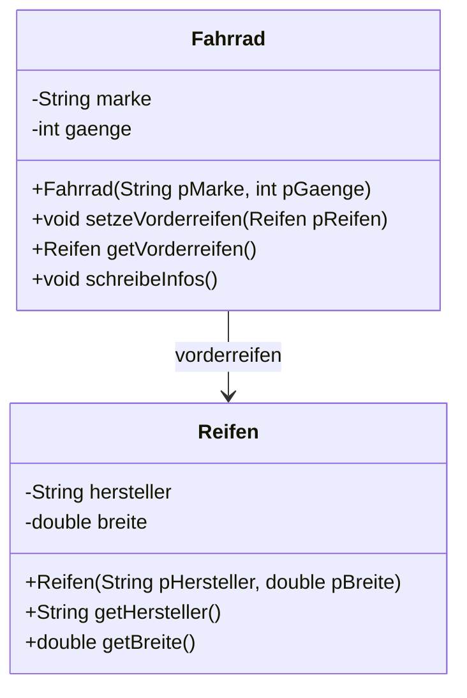
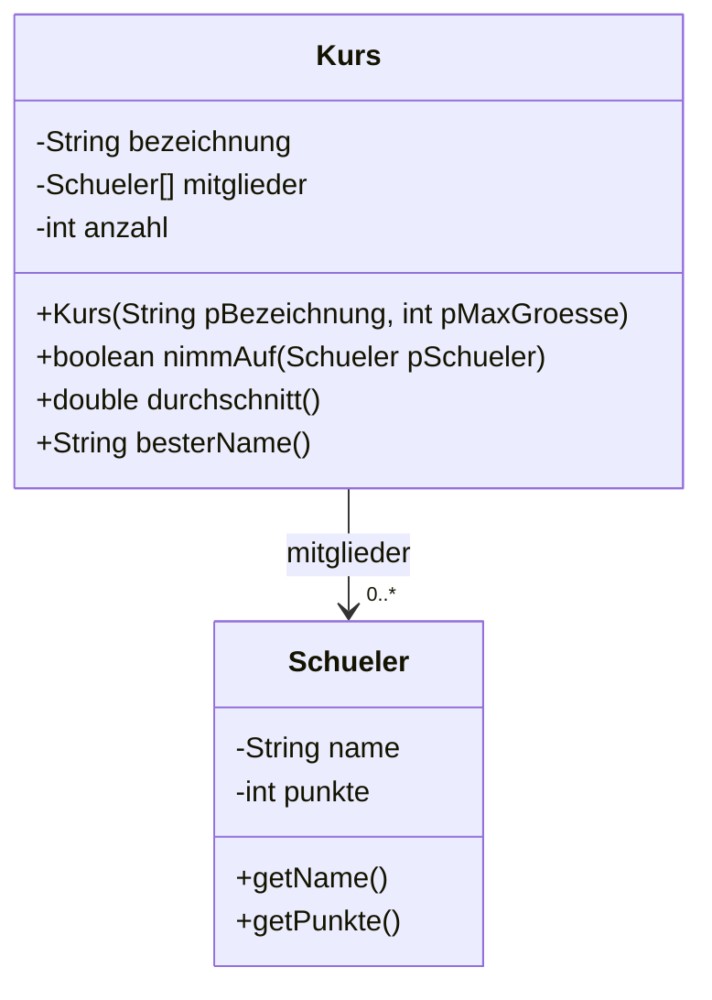

# Assoziation

Bisher standen in deinen Objekten nur Zahlen und Zeichenketten. Jetzt darf ein Objekt ein **anderes Objekt** kennen. Diese Beziehung zwischen zwei Klassen heißt **Assoziation**.

## Ein Fahrrad hat Reifen



Der Pfeil bedeutet: **Ein Fahrrad kennt einen Reifen.** Die Beschriftung am Pfeil ist der Name des Attributs.

:::onlineide{height="680px" speed="1000000"}

```java Main.java
void main() {
    Reifen guterReifen = new Reifen("Schwalbe", 3.7);

    Fahrrad rad = new Fahrrad("Cube", 21);
    rad.schreibeInfos();

    rad.setzeVorderreifen(guterReifen);
    rad.schreibeInfos();
}
```

```java Fahrrad.java
public class Fahrrad {

    private String marke;
    private int gaenge;
    private Reifen vorderreifen;

    public Fahrrad(String pMarke, int pGaenge) {
        marke = pMarke;
        gaenge = pGaenge;
        vorderreifen = null;
    }

    /** Setzt den Vorderreifen. */
    public void setzeVorderreifen(Reifen pReifen) {
        vorderreifen = pReifen;
    }

    /** Liefert den Vorderreifen, oder null, wenn keiner montiert ist. */
    public Reifen getVorderreifen() {
        return vorderreifen;
    }

    public void schreibeInfos() {
        IO.print(marke + " mit " + gaenge + " Gängen, ");
        if (vorderreifen == null) {
            IO.println("ohne Vorderreifen");
        } else {
            IO.println("Vorderreifen von " + vorderreifen.getHersteller()
                       + " (" + vorderreifen.getBreite() + " cm breit)");
        }
    }
}
```

```java Reifen.java
public class Reifen {

    private String hersteller;
    private double breite;

    public Reifen(String pHersteller, double pBreite) {
        hersteller = pHersteller;
        breite = pBreite;
    }

    public String getHersteller() {
        return hersteller;
    }

    public double getBreite() {
        return breite;
    }
}
```

:::

:::snippet{#merken}
- Ein **Attribut vom Typ einer anderen Klasse** stellt die Assoziation her: `private Reifen vorderreifen;`
- Solange kein Objekt zugewiesen wurde, steht dort `null` – das heißt „kein Objekt“.
- Über das Attribut ruft man Methoden des anderen Objekts auf: `vorderreifen.getHersteller()`.
- Die Prüfung `if (vorderreifen == null)` ist wichtig. Ohne sie stürzt das Programm ab, sobald kein Reifen montiert ist.
:::

:::snippet{#aufgabe}
Hier ist `==` einmal richtig, obwohl wir bei Zeichenketten immer `equals` verlangt haben.

Erkläre, warum `vorderreifen == null` korrekt ist.
:::

::::collapsible{title="Auflösung"}

`==` vergleicht bei Objekten die **Verweise**. Und genau das wollen wir hier wissen: Zeigt das Attribut auf irgendein Objekt – oder auf gar keines?

`equals` würde nicht funktionieren: Man müsste dafür eine Methode auf einem Objekt aufrufen, das es womöglich gar nicht gibt.

Merke: `== null` ist die einzige Stelle, an der `==` bei Objekten die richtige Wahl ist.

::::

## Ein Objekt kennt mehrere

Ein Fahrrad hat zwei Reifen, ein Kurs viele Schüler. Für „mehrere“ nimmt man ein Feld.



Die Beschriftung `0..*` am Pfeil heißt **Kardinalität**: Ein Kurs kennt beliebig viele Schüler – auch keinen.

## Aufgabe: Der Kurs

:::snippet{#aufgabe}
Setze die Klasse `Kurs` so um, dass alle Tests grün werden.

Das ist die Aufgabe aus Kapitel 5 – nur dass Name und Punktzahl jetzt nicht mehr auseinanderlaufen können.
:::

:::onlineide{height="720px" speed="1000000"}

```java Main.java
void main() {
    IO.println("Führe die Tests über den Reiter Testrunner aus.");
}
```

```java Kurs.java
public class Kurs {

    private String bezeichnung;
    private Schueler[] mitglieder;
    private int anzahl;

    /**
     * Erzeugt einen leeren Kurs.
     * @param pBezeichnung der Kursname
     * @param pMaxGroesse wie viele Mitglieder höchstens aufgenommen werden
     */
    public Kurs(String pBezeichnung, int pMaxGroesse) {
        // Dein Code hier
    }

    /** Liefert die aktuelle Mitgliederzahl. */
    public int getAnzahl() {
        return 0; // ersetze diese Zeile
    }

    /**
     * Nimmt einen Schüler auf, wenn noch Platz ist.
     * @return true, wenn die Aufnahme geklappt hat
     */
    public boolean nimmAuf(Schueler pSchueler) {
        return false; // ersetze diese Zeile
    }

    /** Liefert den Punktedurchschnitt. Bei leerem Kurs 0. */
    public double durchschnitt() {
        return 0; // ersetze diese Zeile
    }

    /**
     * Liefert den Namen des Mitglieds mit den meisten Punkten.
     * Bei leerem Kurs die leere Zeichenkette.
     */
    public String besterName() {
        return ""; // ersetze diese Zeile
    }
}
```

```java Schueler.java
public class Schueler {

    private String name;
    private int punkte;

    public Schueler(String pName, int pPunkte) {
        name = pName;
        punkte = pPunkte;
    }

    public String getName() {
        return name;
    }

    public int getPunkte() {
        return punkte;
    }
}
```

```java KursTest.java
@Test
class KursTest {

    @Test
    void testLeererKurs() {
        Kurs k = new Kurs("Q1 Informatik", 3);
        assertEquals(0, k.getAnzahl(), "Ein neuer Kurs ist leer.");
        assertEquals(0.0, k.durchschnitt(), "Der Durchschnitt eines leeren Kurses ist 0.");
        assertEquals("", k.besterName(), "Im leeren Kurs gibt es keinen Besten.");
    }

    @Test
    void testAufnehmen() {
        Kurs k = new Kurs("Q1 Informatik", 2);
        assertTrue(k.nimmAuf(new Schueler("Ada", 14)), "Der erste passt hinein.");
        assertEquals(1, k.getAnzahl(), "Jetzt ist ein Mitglied im Kurs.");
        assertTrue(k.nimmAuf(new Schueler("Alan", 10)), "Der zweite passt auch.");
        assertFalse(k.nimmAuf(new Schueler("Grace", 15)), "Der dritte passt nicht mehr.");
        assertEquals(2, k.getAnzahl(), "Es bleiben zwei Mitglieder.");
    }

    @Test
    void testDurchschnitt() {
        Kurs k = new Kurs("Q1 Informatik", 5);
        k.nimmAuf(new Schueler("Ada", 9));
        k.nimmAuf(new Schueler("Alan", 10));
        k.nimmAuf(new Schueler("Grace", 11));
        assertEquals(10.0, k.durchschnitt(), "Der Durchschnitt von 9, 10, 11 ist 10.");
    }

    @Test
    void testBesterName() {
        Kurs k = new Kurs("Q1 Informatik", 5);
        k.nimmAuf(new Schueler("Ada", 9));
        k.nimmAuf(new Schueler("Grace", 15));
        k.nimmAuf(new Schueler("Alan", 11));
        assertEquals("Grace", k.besterName(), "Grace hat die meisten Punkte.");
    }
}
```

:::

::::collapsible{title="Tipp 1: Warum ein zusätzliches Attribut anzahl?"}

Das Feld hat von Anfang an `pMaxGroesse` Plätze – die meisten davon leer, also `null`. `mitglieder.length` sagt dir also nur, wie viele Plätze es gibt, nicht wie viele belegt sind.

Deshalb zählst du in `anzahl` mit, wie weit das Feld gefüllt ist. Alle Schleifen laufen dann bis `anzahl`, nicht bis `mitglieder.length`.

::::

::::collapsible{title="Tipp 2: Aufnehmen"}

```java
if (anzahl < mitglieder.length) {
    mitglieder[anzahl] = pSchueler;
    anzahl++;
    return true;
}
return false;
```

Der neue Schüler kommt genau auf den ersten freien Platz – und dessen Index ist die bisherige Anzahl.

::::

::::collapsible{title="Tipp 3: besterName"}

Merke dir wie in Kapitel 5 den **Index** des Besten, nicht die Punktzahl. Nur so kommst du am Ende an den Namen.

Und denke an den Sonderfall: Bei `anzahl == 0` darfst du gar nicht erst auf `mitglieder[0]` zugreifen.

::::

:::protect{password="java-ef-6-3-1" description="Lösung. Erfrage das Passwort bei deiner Lehrkraft."}

```java Kurs.java
public class Kurs {

    private String bezeichnung;
    private Schueler[] mitglieder;
    private int anzahl;

    public Kurs(String pBezeichnung, int pMaxGroesse) {
        bezeichnung = pBezeichnung;
        mitglieder = new Schueler[pMaxGroesse];
        anzahl = 0;
    }

    public int getAnzahl() {
        return anzahl;
    }

    public boolean nimmAuf(Schueler pSchueler) {
        if (anzahl < mitglieder.length) {
            mitglieder[anzahl] = pSchueler;
            anzahl++;
            return true;
        }
        return false;
    }

    public double durchschnitt() {
        if (anzahl == 0) {
            return 0.0;
        }
        int summe = 0;
        for (int i = 0; i < anzahl; i++) {
            summe = summe + mitglieder[i].getPunkte();
        }
        return (double) summe / anzahl;
    }

    public String besterName() {
        if (anzahl == 0) {
            return "";
        }
        int bester = 0;
        for (int i = 1; i < anzahl; i++) {
            if (mitglieder[i].getPunkte() > mitglieder[bester].getPunkte()) {
                bester = i;
            }
        }
        return mitglieder[bester].getName();
    }
}
```

:::

## Aufgabe 2: Modellieren

:::snippet{#aufgabe}
Modelliere eine **Bibliothek**.

a) Ermittle die beteiligten Klassen und ihre Beziehungen. Wer kennt wen?

b) Zeichne das Diagramm mit Attributen, Methoden und Kardinalitäten.

c) Setze mindestens zwei der Klassen um.

Denk darüber nach: Kennt ein Buch seinen Ausleiher, oder kennt eine Person ihre ausgeliehenen Bücher? Oder beides? Begründe deine Entscheidung.
:::

::textinput{placeholder="Klassen: ... Beziehungen: ... Begründung: ..."}

## Zusatzaufgabe

:::snippet{#brain}
Ein Fahrrad hat zwei Reifen: einen vorne und einen hinten.

a) Erweitere `Fahrrad` entsprechend.

b) Was passiert, wenn du **dasselbe** Reifen-Objekt vorne **und** hinten montierst? Probiere es aus, ändere über eine Setter-Methode die Breite des Vorderreifens und schau, was mit dem Hinterreifen passiert.

c) Erkläre die Beobachtung. Ist das ein Fehler in deinem Programm oder eine Eigenschaft von Objektvariablen?
:::

---

## Selbsttest

::::multievent

**1. Wie stellt man eine Assoziation zwischen zwei Klassen her?**

{r1{durch eine Methode mit demselben Namen}}

{r1{!durch ein Attribut vom Typ der anderen Klasse}}

{r1{durch Vererbung}}

{h{Das Fahrrad hatte ein Attribut vom Typ Reifen.}}
{H{Richtig!}}

**2. Was bedeutet der Wert null bei einer Objektvariablen?**

{r2{das Objekt ist leer}}

{r2{!die Variable verweist auf gar kein Objekt}}

{r2{das Objekt hat den Wert 0}}

{h{Beim neuen Fahrrad war noch kein Reifen montiert.}}
{H{Richtig!}}

**3. Warum ist der Vergleich mit null die einzige Stelle, an der man bei Objekten das doppelte Gleichheitszeichen benutzt?**

{r3{weil null eine Zahl ist}}

{r3{!weil man dort tatsächlich wissen will, ob überhaupt ein Objekt vorhanden ist}}

{r3{weil equals bei null verboten ist}}

{h{Bei allen anderen Vergleichen geht es um den Inhalt.}}
{H{Richtig! Und equals ginge dort auch gar nicht, weil man es auf einem nicht vorhandenen Objekt aufrufen müsste.}}

**4. Wozu braucht der Kurs ein eigenes Attribut für die Anzahl?** (Mehrfachauswahl)

{c1{!weil das Feld von Anfang an alle Plätze hat, aber nicht alle belegt sind}}

{c1{!weil die Schleifen sonst über leere Plätze laufen würden}}

{c1{weil Felder keine Länge haben}}

{c1{weil Java das bei Objektfeldern verlangt}}

{h{Die Länge des Feldes sagt nur, wie viele Plätze es gibt.}}
{H{Richtig!}}

**5. Was bedeutet die Kardinalität 0 bis Stern an einer Beziehung?**

{r4{genau ein Objekt}}

{r4{!beliebig viele Objekte, auch keines}}

{r4{mindestens ein Objekt}}

{h{Der Stern steht für beliebig viele.}}
{H{Richtig!}}

::::
