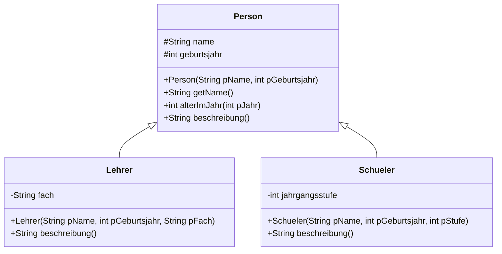

# Vererbung

Eine Lehrerin ist eine Person. Ein Schüler ist eine Person. Beide haben einen Namen und ein Geburtsjahr – und darüber hinaus jeweils etwas Eigenes.

Man könnte beide Klassen unabhängig voneinander schreiben. Dann stünde der gemeinsame Teil zweimal da – und du weißt inzwischen, warum das eine schlechte Idee ist.

## Die Oberklasse



Der Pfeil mit dem leeren Dreieck zeigt **von der Unterklasse zur Oberklasse** und bedeutet „ist ein“: Ein Lehrer **ist eine** Person.

:::onlineide{height="720px" speed="1000000"}

```java Main.java
void main() {
    Person p = new Person("Max Mustermann", 1990);
    Lehrer l = new Lehrer("Ada Lovelace", 1815, "Informatik");
    Schueler s = new Schueler("Alan Turing", 2008, 11);

    IO.println(p.beschreibung());
    IO.println(l.beschreibung());
    IO.println(s.beschreibung());

    IO.println("Alter im Jahr 2026: " + s.alterImJahr(2026));
}
```

```java Person.java
public class Person {

    protected String name;
    protected int geburtsjahr;

    public Person(String pName, int pGeburtsjahr) {
        name = pName;
        geburtsjahr = pGeburtsjahr;
    }

    public String getName() {
        return name;
    }

    /** Liefert das Alter in dem angegebenen Jahr. */
    public int alterImJahr(int pJahr) {
        return pJahr - geburtsjahr;
    }

    /** Liefert eine Beschreibung der Person. */
    public String beschreibung() {
        return name + ", geboren " + geburtsjahr;
    }
}
```

```java Lehrer.java
public class Lehrer extends Person {

    private String fach;

    public Lehrer(String pName, int pGeburtsjahr, String pFach) {
        super(pName, pGeburtsjahr);
        fach = pFach;
    }

    public String beschreibung() {
        return super.beschreibung() + ", unterrichtet " + fach;
    }
}
```

```java Schueler.java
public class Schueler extends Person {

    private int jahrgangsstufe;

    public Schueler(String pName, int pGeburtsjahr, int pStufe) {
        super(pName, pGeburtsjahr);
        jahrgangsstufe = pStufe;
    }

    public String beschreibung() {
        return super.beschreibung() + ", Jahrgangsstufe " + jahrgangsstufe;
    }
}
```

:::

:::snippet{#merken}
| Schreibweise | Bedeutung |
| --- | --- |
| `class Lehrer extends Person` | `Lehrer` **erbt** von `Person` und bekommt alle Attribute und Methoden |
| `super(pName, pGeburtsjahr)` | ruft den Konstruktor der Oberklasse auf – muss die **erste** Anweisung im Konstruktor sein |
| `super.beschreibung()` | ruft die Methode der Oberklasse auf |
| `protected` | sichtbar in der eigenen Klasse **und** in allen Unterklassen |

Die Unterklasse **überschreibt** `beschreibung()`: Sie hat eine eigene Fassung, die die geerbte ersetzt. Innerhalb der neuen Fassung kommt man mit `super.` noch an die alte heran – so muss der gemeinsame Teil nicht noch einmal getippt werden.
:::

:::snippet{#aufgabe}
Die Klassen `Lehrer` und `Schueler` haben keine Methode `alterImJahr` – und trotzdem funktioniert `s.alterImJahr(2026)`.

Erkläre, warum.
:::

::::collapsible{title="Auflösung"}

Weil `Schueler` sie **geerbt** hat. Alles, was `Person` kann, kann jeder Schüler und jeder Lehrer auch – ohne dass es noch einmal geschrieben werden muss.

Genau das ist der Gewinn: Der gemeinsame Teil steht an **einer** Stelle. Ändert sich die Berechnung des Alters, ändert man `Person` – und alle Unterklassen ziehen mit.

::::

## Was in die Oberklasse gehört

:::snippet{#merken}
**Faustregel:** In die Oberklasse gehört, was für **alle** Unterklassen gilt.

Prüfe deinen Entwurf mit dem Satz „**ist ein**“:

- „Ein Lehrer ist eine Person.“ ✓ Vererbung passt.
- „Ein Fahrrad ist ein Reifen.“ ✗ Vererbung passt nicht – hier gehört eine Assoziation hin („ein Fahrrad **hat** einen Reifen“).

Diese Unterscheidung – *ist ein* gegenüber *hat ein* – ist die wichtigste Entscheidung beim Modellieren.
:::

:::snippet{#aufgabe}
Entscheide für jedes Paar: Vererbung oder Assoziation? Begründe mit dem Satztest.

a) Quadrat – Rechteck

b) Auto – Motor

c) Sparbuch – Bankkonto

d) Kurs – Schüler

e) Smartphone – Mobiltelefon
:::

::::collapsible{title="Auflösung"}

a) **Vererbung**: Ein Quadrat *ist ein* Rechteck (mit gleichen Seiten).

b) **Assoziation**: Ein Auto *hat einen* Motor. Es *ist* kein Motor.

c) **Vererbung**: Ein Sparbuch *ist ein* Bankkonto mit besonderen Regeln.

d) **Assoziation**: Ein Kurs *hat* Schüler. Ein Kurs *ist* kein Schüler.

e) **Vererbung**: Ein Smartphone *ist ein* Mobiltelefon – mit zusätzlichen Fähigkeiten.

::::

## Aufgabe 1: Konten mit Vererbung

:::snippet{#aufgabe}
Ein **Girokonto** darf bis zu einem vereinbarten Dispolimit ins Minus gehen. Ein **Sparkonto** darf das nicht, bekommt dafür aber Zinsen.

Beides sind Bankkonten. Setze die Vererbungshierarchie so um, dass alle Tests grün werden.
:::

:::onlineide{height="760px" speed="1000000"}

```java Main.java
void main() {
    IO.println("Führe die Tests über den Reiter Testrunner aus.");
}
```

```java Konto.java
public class Konto {

    protected String besitzer;
    protected double kontostand;

    public Konto(String pBesitzer) {
        besitzer = pBesitzer;
        kontostand = 0.0;
    }

    public String getBesitzer() {
        return besitzer;
    }

    public double getKontostand() {
        return kontostand;
    }

    public void zahleEin(double pBetrag) {
        if (pBetrag > 0) {
            kontostand = kontostand + pBetrag;
        }
    }

    /**
     * Hebt einen Betrag ab, wenn er positiv ist und Deckung besteht.
     * @return true, wenn die Auszahlung geklappt hat
     */
    public boolean hebeAb(double pBetrag) {
        if (pBetrag > 0 && pBetrag <= kontostand) {
            kontostand = kontostand - pBetrag;
            return true;
        }
        return false;
    }
}
```

```java Girokonto.java
public class Girokonto extends Konto {

    private double dispolimit;

    /**
     * Erzeugt ein Girokonto mit dem angegebenen Dispolimit.
     */
    public Girokonto(String pBesitzer, double pDispolimit) {
        super(pBesitzer);
        // Ergänze hier das Setzen des Dispolimits.
    }

    /**
     * Hebt einen Betrag ab. Das Konto darf bis zum Dispolimit
     * ins Minus gehen.
     */
    public boolean hebeAb(double pBetrag) {
        return false; // ersetze diese Zeile
    }
}
```

```java Sparkonto.java
public class Sparkonto extends Konto {

    private double zinssatz;

    /**
     * Erzeugt ein Sparkonto mit dem angegebenen Zinssatz,
     * zum Beispiel 0.02 für zwei Prozent.
     */
    public Sparkonto(String pBesitzer, double pZinssatz) {
        super(pBesitzer);
        // Ergänze hier das Setzen des Zinssatzes.
    }

    /** Schreibt die Zinsen auf den aktuellen Kontostand gut. */
    public void schreibeZinsenGut() {
        // Dein Code hier
    }
}
```

```java KontenTest.java
@Test
class KontenTest {

    @Test
    void testGirokontoErbt() {
        Girokonto g = new Girokonto("Ada", 500.0);
        assertEquals("Ada", g.getBesitzer(), "Der Besitzer wird geerbt.");
        g.zahleEin(200.0);
        assertEquals(200.0, g.getKontostand(), "Einzahlen wird geerbt.");
    }

    @Test
    void testGirokontoDispo() {
        Girokonto g = new Girokonto("Ada", 500.0);
        g.zahleEin(100.0);
        assertTrue(g.hebeAb(400.0), "Bis zum Dispolimit klappt die Auszahlung.");
        assertEquals(-300.0, g.getKontostand(), "Danach sind es minus 300 Euro.");
        assertFalse(g.hebeAb(300.0), "Über das Dispolimit hinaus nicht.");
        assertEquals(-300.0, g.getKontostand(), "Der Kontostand bleibt unverändert.");
    }

    @Test
    void testSparkontoKeinDispo() {
        Sparkonto s = new Sparkonto("Grace", 0.02);
        s.zahleEin(100.0);
        assertFalse(s.hebeAb(150.0), "Ein Sparkonto darf nicht ins Minus.");
        assertEquals(100.0, s.getKontostand(), "Der Kontostand bleibt unverändert.");
        assertTrue(s.hebeAb(50.0), "Mit Deckung klappt es.");
        assertEquals(50.0, s.getKontostand(), "Danach sind noch 50 Euro da.");
    }

    @Test
    void testZinsen() {
        Sparkonto s = new Sparkonto("Grace", 0.02);
        s.zahleEin(1000.0);
        s.schreibeZinsenGut();
        assertEquals(1020.0, s.getKontostand(), "Zwei Prozent auf 1000 Euro sind 20 Euro.");
    }
}
```

:::

::::collapsible{title="Tipp 1: Der Konstruktor der Unterklasse"}

Er muss zuerst den Konstruktor der Oberklasse aufrufen und danach sein eigenes Attribut setzen:

```java
super(pBesitzer);
dispolimit = pDispolimit;
```

::::

::::collapsible{title="Tipp 2: Warum hat Sparkonto keine eigene hebeAb-Methode?"}

Weil die geerbte Fassung aus `Konto` schon genau das Richtige tut: Sie erlaubt nur Auszahlungen bis zum Kontostand.

Vererbung heißt nicht, dass man alles überschreiben muss – nur das, was anders sein soll.

::::

::::collapsible{title="Tipp 3: Die neue Grenze beim Girokonto"}

Statt `pBetrag <= kontostand` gilt jetzt `pBetrag <= kontostand + dispolimit`.

::::

:::protect{password="java-ef-6-4-1" description="Lösung. Erfrage das Passwort bei deiner Lehrkraft."}

```java Girokonto.java
public class Girokonto extends Konto {

    private double dispolimit;

    public Girokonto(String pBesitzer, double pDispolimit) {
        super(pBesitzer);
        dispolimit = pDispolimit;
    }

    public boolean hebeAb(double pBetrag) {
        if (pBetrag > 0 && pBetrag <= kontostand + dispolimit) {
            kontostand = kontostand - pBetrag;
            return true;
        }
        return false;
    }
}
```

```java Sparkonto.java
public class Sparkonto extends Konto {

    private double zinssatz;

    public Sparkonto(String pBesitzer, double pZinssatz) {
        super(pBesitzer);
        zinssatz = pZinssatz;
    }

    public void schreibeZinsenGut() {
        kontostand = kontostand + kontostand * zinssatz;
    }
}
```

Beachte, dass `Girokonto` direkt auf `kontostand` zugreift. Das geht nur, weil das Attribut in `Konto` als `protected` deklariert ist. Wäre es `private`, müsste die Unterklasse über Getter und Setter gehen.

:::

## Aufgabe 2: Eine eigene Hierarchie

:::snippet{#aufgabe}
Modelliere eine Vererbungshierarchie für **Gebäude**.

a) Überlege, welche Eigenschaften alle Gebäude haben und was ein Wohnhaus, ein Bürogebäude und eine Schule jeweils zusätzlich auszeichnet.

b) Zeichne das Diagramm.

c) Prüfe jede Beziehung mit dem Satztest „ist ein“.

d) Setze mindestens die Oberklasse und eine Unterklasse um.
:::

::textinput{placeholder="Oberklasse mit ... / Wohnhaus zusätzlich ... / Bürogebäude zusätzlich ... / Schule zusätzlich ..."}

## Zusatzaufgabe

:::snippet{#brain}
Ein Feld vom Typ `Konto[]` kann Girokonten **und** Sparkonten aufnehmen – schließlich sind beide Konten.

a) Lege ein solches Feld an, fülle es mit beiden Sorten und berechne die Summe aller Kontostände.

b) Rufe in einer Schleife `hebeAb(100)` auf allen Konten auf. Beobachte: Bei welchen Objekten klappt es, bei welchen nicht?

c) Erkläre, welche der beiden Fassungen von `hebeAb` jeweils ausgeführt wird – und woher Java das zur Laufzeit weiß.

Dieses Verhalten heißt **Polymorphie** und ist eines der Hauptthemen im Lernpfad *Erweiterungen*.
:::

---

## Selbsttest

::::multievent

**1. Welches Schlüsselwort stellt eine Vererbungsbeziehung her?**

{r1{implements}}

{r1{!extends}}

{r1{super}}

{h{Es steht hinter dem Klassennamen der Unterklasse.}}
{H{Richtig!}}

**2. Welchen Satztest benutzt man, um Vererbung von Assoziation zu unterscheiden?**

{r2{hat ein}}

{r2{!ist ein}}

{r2{kennt ein}}

{h{Ein Lehrer ist eine Person, ein Fahrrad hat einen Reifen.}}
{H{Richtig! Passt ist ein, ist es Vererbung.}}

**3. Wo muss der Aufruf des Oberklassenkonstruktors stehen?**

{r3{irgendwo im Konstruktor}}

{r3{!als erste Anweisung im Konstruktor}}

{r3{am Ende des Konstruktors}}

{h{Erst muss der geerbte Teil aufgebaut werden.}}
{H{Richtig!}}

**4. Welche Aussagen zur Vererbung stimmen?** (Mehrfachauswahl)

{c1{!Die Unterklasse erbt alle Attribute und Methoden der Oberklasse.}}

{c1{!Die Unterklasse kann geerbte Methoden überschreiben.}}

{c1{!Mit super kommt man an die überschriebene Fassung heran.}}

{c1{Die Unterklasse muss alle geerbten Methoden überschreiben.}}

{h{Das Sparkonto hat die geerbte Auszahlmethode unverändert übernommen.}}
{H{Richtig! Überschrieben wird nur, was anders sein soll.}}

**5. Was bedeutet die Sichtbarkeit protected?**

{r4{nur in der eigenen Klasse sichtbar}}

{r4{!in der eigenen Klasse und in allen Unterklassen sichtbar}}

{r4{von überall sichtbar}}

{h{Sie liegt zwischen private und public.}}
{H{Richtig!}}

::::
