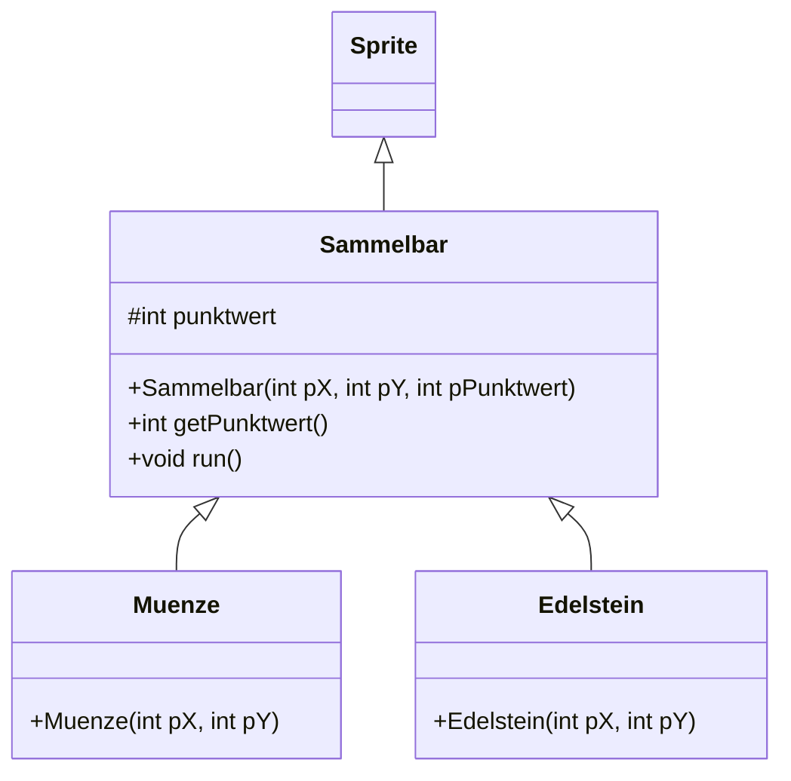

# Eigene Sprites

Jetzt kommt alles zusammen. `Sprite` ist eine Klasse aus der Bibliothek – und du kannst von ihr erben, genau wie `Lehrer` von `Person`. Damit baust du dir eigene Figuren mit eigenem Verhalten.

## Eine Figur mit eigenem Verhalten

:::onlineide{libraries="scratch" height="560px"}

```java Main.java
void main() {
    new Buehne();
}
```

```java Buehne.java
public class Buehne extends Stage {

    public Buehne() {
        this.add(new Hase());
    }
}
```

```java Hase.java
public class Hase extends Sprite {

    public Hase() {
        this.addCostume("bunny1_stand");
        this.setPosition(0, -100);
    }

    /** Wird von der Bühne etwa 60-mal pro Sekunde aufgerufen. */
    public void run() {
        if (this.isKeyPressed(KeyCode.RIGHT)) {
            this.changeX(3);
        }
        if (this.isKeyPressed(KeyCode.LEFT)) {
            this.changeX(-3);
        }
        this.ifOnEdgeBounce();
    }
}
```

:::

:::snippet{#aufgabe}
Klicke in den Ausgabebereich und steuere den Hasen mit den Pfeiltasten.

a) Welche Methoden hat `Hase` selbst, welche sind geerbt?

b) Was passiert, wenn du `run()` löschst? Sage es voraus und probiere es aus.
:::

::::collapsible{title="Auflösung"}

a) Selbst geschrieben sind nur der Konstruktor und `run()`. Alles andere – `addCostume`, `setPosition`, `changeX`, `isKeyPressed`, `ifOnEdgeBounce` – ist von `Sprite` **geerbt**.

Das ist genau der Vorteil, den du bei `Person` und `Lehrer` gesehen hast: Der ganze gemeinsame Teil steht schon in der Oberklasse.

b) Der Hase erscheint, bewegt sich aber nicht mehr. `run()` ist in `Sprite` bereits vorhanden – dort tut sie nichts. Deine Fassung **überschreibt** sie.

::::

:::snippet{#merken}
| Methode | wann wird sie aufgerufen |
| --- | --- |
| Konstruktor | einmal, beim Erzeugen |
| `run()` | in jedem Bild, etwa 60-mal pro Sekunde |
| `whenKeyPressed(KeyCode k)` | einmal beim Drücken einer Taste |
| `whenClicked()` | beim Anklicken der Figur |

`run()` überschreibst du für Dauerverhalten (Bewegung, Prüfungen). Für einmalige Reaktionen nimmst du die `when`-Methoden.
:::

## Mehrere Figuren derselben Klasse

:::onlineide{libraries="scratch" height="580px"}

```java Main.java
void main() {
    new Buehne();
}
```

```java Buehne.java
public class Buehne extends Stage {

    public Buehne() {
        for (int i = 0; i < 8; i++) {
            Muenze m = new Muenze(this.pickRandom(-200, 200), this.pickRandom(-140, 140));
            this.add(m);
        }
    }
}
```

```java Muenze.java
public class Muenze extends Sprite {

    private int drehrichtung;

    public Muenze(int pX, int pY) {
        this.addCostume("coin_gold");
        this.setPosition(pX, pY);
        this.setSize(this.pickRandom(60, 140));
        drehrichtung = this.pickRandom(1, 4);
    }

    public void run() {
        this.turnRight(drehrichtung);
    }
}
```

:::

:::snippet{#aufgabe}
Acht Objekte, eine Klasse – und jedes verhält sich anders.

a) Erkläre, warum sich die Münzen unterschiedlich schnell drehen, obwohl sie alle dieselbe `run()`-Methode ausführen.

b) Was müsstest du ändern, damit sich alle **gleich** schnell drehen?
:::

::::collapsible{title="Auflösung"}

a) Weil `drehrichtung` ein **Attribut** ist. Jedes Münzobjekt hat einen eigenen Wert dafür, gesetzt im Konstruktor. Die Methode ist dieselbe – die Daten, mit denen sie arbeitet, sind es nicht.

Das ist derselbe Punkt wie bei den beiden Autos in Lektion 1, jetzt nur sichtbar in Bewegung.

b) Statt `drehrichtung` würde man direkt eine feste Zahl schreiben – oder den Wert nicht mehr zufällig setzen.

::::

## Vererbung in der Grafik

Jetzt bauen wir eine echte Hierarchie: Gegenstände, die eingesammelt werden können.



:::onlineide{libraries="scratch" height="700px"}

```java Main.java
void main() {
    new Buehne();
}
```

```java Buehne.java
public class Buehne extends Stage {

    public Buehne() {
        this.add(new Muenze(-150, 80));
        this.add(new Muenze(0, 80));
        this.add(new Muenze(150, 80));
        this.add(new Edelstein(-80, -20));
        this.add(new Edelstein(80, -20));
    }
}
```

```java Sammelbar.java
public class Sammelbar extends Sprite {

    protected int punktwert;

    /**
     * Erzeugt einen einsammelbaren Gegenstand.
     * @param pX x-Koordinate
     * @param pY y-Koordinate
     * @param pPunktwert wie viele Punkte er einbringt
     */
    public Sammelbar(int pX, int pY, int pPunktwert) {
        this.setPosition(pX, pY);
        punktwert = pPunktwert;
    }

    public int getPunktwert() {
        return punktwert;
    }

    /** Alle Sammelgegenstände schweben auf und ab. */
    public void run() {
        this.changeY(Math.sin(Timer.millis() / 300.0) * 1.2);
    }
}
```

```java Muenze.java
public class Muenze extends Sammelbar {

    public Muenze(int pX, int pY) {
        super(pX, pY, 10);
        this.addCostume("coin_gold");
    }
}
```

```java Edelstein.java
public class Edelstein extends Sammelbar {

    public Edelstein(int pX, int pY) {
        super(pX, pY, 50);
        this.addCostume("gemBlue");
        this.setSize(80);
    }
}
```

:::

:::snippet{#merken}
Beachte, wie wenig in `Muenze` und `Edelstein` steht: nur das Kostüm, der Punktwert und gegebenenfalls die Größe. Position, Punktwert-Verwaltung und Schwebeverhalten stehen **einmal** in `Sammelbar`.

Soll das Schweben schneller werden, änderst du eine Methode in einer Klasse – und beide Gegenstandsarten ziehen mit.
:::

## Aufgabe 1: Ein Sammelspiel

:::snippet{#aufgabe}
Baue aus den Bausteinen ein kleines Spiel:

1. Eine steuerbare Figur (wie der Hase oben).
2. Mehrere Sammelgegenstände auf der Bühne.
3. Berührt die Figur einen Gegenstand, verschwindet er und die Punktzahl steigt um seinen Punktwert.
4. Die Punktzahl wird auf der Bühne angezeigt.
:::

:::onlineide{libraries="scratch" height="700px"}

```java Main.java
void main() {
    new Buehne();
}
```

```java Buehne.java
public class Buehne extends Stage {

    private int punkte;
    private Text anzeige;

    public Buehne() {
        punkte = 0;
        anzeige = new Text("Punkte: 0", -220, 150, 300);
        this.add(anzeige);

        this.add(new Spieler());
        this.add(new Muenze(-150, 0));
        this.add(new Muenze(150, 0));
        this.add(new Edelstein(0, -80));
    }

    /** Erhöht die Punktzahl und aktualisiert die Anzeige. */
    public void zaehlePunkte(int pWert) {
        punkte = punkte + pWert;
        anzeige.showText("Punkte: " + punkte);
    }
}
```

```java Spieler.java
public class Spieler extends Sprite {

    public Spieler() {
        this.addCostume("bunny1_stand");
        this.setPosition(0, -130);
    }

    public void run() {
        if (this.isKeyPressed(KeyCode.RIGHT)) {
            this.changeX(4);
        }
        if (this.isKeyPressed(KeyCode.LEFT)) {
            this.changeX(-4);
        }
        if (this.isKeyPressed(KeyCode.UP)) {
            this.changeY(4);
        }
        if (this.isKeyPressed(KeyCode.DOWN)) {
            this.changeY(-4);
        }

        // Dein Code hier: Berührung prüfen und einsammeln

    }
}
```

```java Sammelbar.java
public class Sammelbar extends Sprite {

    protected int punktwert;

    public Sammelbar(int pX, int pY, int pPunktwert) {
        this.setPosition(pX, pY);
        punktwert = pPunktwert;
    }

    public int getPunktwert() {
        return punktwert;
    }
}
```

```java Muenze.java
public class Muenze extends Sammelbar {

    public Muenze(int pX, int pY) {
        super(pX, pY, 10);
        this.addCostume("coin_gold");
    }
}
```

```java Edelstein.java
public class Edelstein extends Sammelbar {

    public Edelstein(int pX, int pY) {
        super(pX, pY, 50);
        this.addCostume("gemBlue");
        this.setSize(80);
    }
}
```

:::

::::collapsible{title="Tipp 1: Berührung erkennen"}

`this.getTouchingSprite(Sammelbar.class)` liefert den berührten Gegenstand – oder `null`, wenn keiner berührt wird.

Der Zusatz `.class` bedeutet: „ein Objekt von dieser Art“. Weil `Muenze` und `Edelstein` beide **Sammelbar sind**, findet dieser eine Aufruf beide Sorten.

::::

::::collapsible{title="Tipp 2: Einsammeln"}

```java
Sammelbar gefunden = this.getTouchingSprite(Sammelbar.class);
if (gefunden != null) {
    // Punkte melden und den Gegenstand entfernen
}
```

Zum Melden brauchst du die Bühne: `Buehne b = (Buehne) this.getStage();` – die Umwandlung ist nötig, weil `getStage()` allgemein eine `Stage` liefert.

Zum Entfernen gibt es `gefunden.remove()`.

::::

:::protect{password="java-ef-6-5-1" description="Lösung. Erfrage das Passwort bei deiner Lehrkraft."}

```java Spieler.java
public class Spieler extends Sprite {

    public Spieler() {
        this.addCostume("bunny1_stand");
        this.setPosition(0, -130);
    }

    public void run() {
        if (this.isKeyPressed(KeyCode.RIGHT)) {
            this.changeX(4);
        }
        if (this.isKeyPressed(KeyCode.LEFT)) {
            this.changeX(-4);
        }
        if (this.isKeyPressed(KeyCode.UP)) {
            this.changeY(4);
        }
        if (this.isKeyPressed(KeyCode.DOWN)) {
            this.changeY(-4);
        }

        Sammelbar gefunden = this.getTouchingSprite(Sammelbar.class);
        if (gefunden != null) {
            Buehne b = (Buehne) this.getStage();
            b.zaehlePunkte(gefunden.getPunktwert());
            gefunden.remove();
        }
    }
}
```

Der Aufruf `getTouchingSprite(Sammelbar.class)` findet Münzen **und** Edelsteine, ohne dass der Spieler die beiden Klassen unterscheiden müsste. Er weiß nur: „Ich habe etwas Einsammelbares berührt, und das hat einen Punktwert.“

Genau das ist der Kern der Vererbung – und ein erster Vorgeschmack auf die **Polymorphie**, die im Lernpfad *Erweiterungen* systematisch drankommt.

:::

## Zusatzaufgabe

:::snippet{#brain}
Erweitere das Spiel:

a) Ergänze eine dritte Sorte Sammelgegenstand – etwa einen Schlüssel (`keyGreen`), der 100 Punkte bringt. Wie viel Code musst du dafür schreiben?

b) Ergänze eine Klasse `Gegner`, die sich von allein bewegt und bei Berührung Punkte abzieht.

c) Beende das Spiel, wenn alle Gegenstände eingesammelt sind. Mit `this.find(Sammelbar.class)` bekommst du eine Liste aller noch vorhandenen Gegenstände.
:::

---

## Selbsttest

::::multievent

**1. Welche Methode einer eigenen Sprite-Klasse wird in jedem Bild aufgerufen?**

{r1{der Konstruktor}}

{r1{!die Methode run}}

{r1{die Methode whenClicked}}

{h{Der Konstruktor läuft nur einmal beim Erzeugen.}}
{H{Richtig! Etwa 60-mal pro Sekunde.}}

**2. Warum drehen sich acht Münzen derselben Klasse unterschiedlich schnell?**

{r2{weil jede eine eigene run-Methode hat}}

{r2{!weil jede einen eigenen Wert im Attribut hat}}

{r2{weil Java das zufällig entscheidet}}

{h{Die Methode ist dieselbe, die Daten sind es nicht.}}
{H{Richtig!}}

**3. Was steht in einer gut entworfenen Oberklasse wie Sammelbar?** (Mehrfachauswahl)

{c1{!was für alle Unterklassen gilt}}

{c1{!gemeinsames Verhalten}}

{c1{!gemeinsame Attribute}}

{c1{das Kostüm jeder einzelnen Unterklasse}}

{h{Münze und Edelstein hatten unterschiedliche Kostüme.}}
{H{Richtig! Das Besondere gehört in die Unterklasse.}}

**4. Was liefert die Suche nach einem berührten Sprite, wenn nichts berührt wird?**

{r3{ein leeres Sprite}}

{r3{!den Wert null}}

{r3{einen Laufzeitfehler}}

{h{Deshalb muss man das Ergebnis prüfen, bevor man es benutzt.}}
{H{Richtig!}}

**5. Warum findet die Suche nach einem Sammelbar-Objekt auch Münzen und Edelsteine?**

{r4{weil sie zufällig ähnlich heißen}}

{r4{!weil beide von Sammelbar erben und damit Sammelbar sind}}

{r4{weil sie auf derselben Bühne stehen}}

{h{Denk an den Satztest ist ein.}}
{H{Richtig! Eine Münze ist ein Sammelbar.}}

::::
