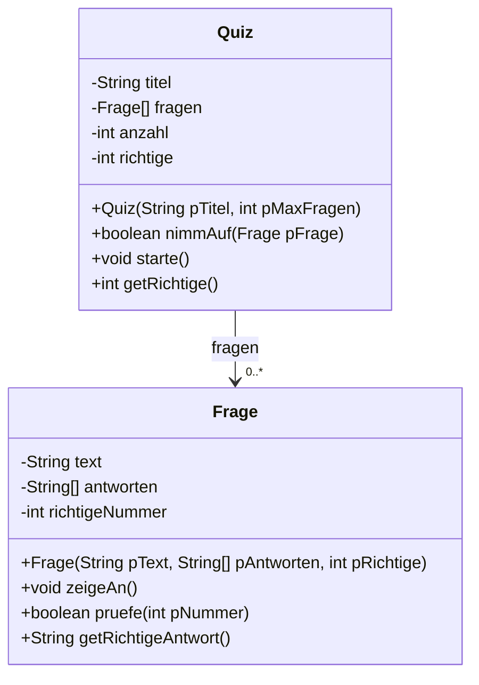

# Quiz

Ein Projekt ohne Grafik – dafür mit allem, was du über Klassen, Felder und Kontrollstrukturen gelernt hast. Am Ende habt ihr ein lauffähiges Quizprogramm, dessen Fragen ihr selbst schreibt.

## Das Ziel

Das Programm stellt nacheinander mehrere Fragen mit je vier Antwortmöglichkeiten, liest die Antwort ein, gibt Rückmeldung und wertet am Ende aus.

```
Frage 1 von 5
Welchen Index hat das erste Element eines Feldes?
  1) 1
  2) 0
  3) -1
  4) die Länge minus 1
Deine Antwort: 2
Richtig!

...

Ergebnis: 4 von 5 richtig (80 Prozent) - gut gemacht!
```

## Die Modellierung

:::snippet{#aufgabe}
Bevor ihr programmiert: Modelliert das Problem.

a) Welche Klassen braucht ihr? Ermittelt die beteiligten Objekte, ihre Eigenschaften und ihre Operationen.

b) Zeichnet das Implementationsdiagramm mit Attributen, Methoden und Beziehungen.

c) Legt die Kardinalitäten fest: Wie viele Fragen kennt ein Quiz?
:::

::::collapsible{title="Auflösung: ein tragfähiger Entwurf"}



Zwei Klassen genügen. `Frage` weiß alles über eine einzelne Frage, `Quiz` verwaltet die Sammlung und den Ablauf.

Wichtig: **`Frage` gibt nicht selbst aus, welche Antwort richtig war** – sie beantwortet nur die Frage „stimmt Nummer x?“. So bleibt der Ablauf in einer Hand.

::::

## Das Gerüst

:::onlineide{height="740px" speed="1000000"}

```java Main.java
void main() {
    Quiz q = new Quiz("Java-Grundlagen", 10);

    q.nimmAuf(new Frage(
        "Welchen Index hat das erste Element eines Feldes?",
        new String[]{"1", "0", "-1", "die Länge minus 1"},
        2));

    q.nimmAuf(new Frage(
        "Womit vergleicht man zwei Zeichenketten auf gleichen Inhalt?",
        new String[]{"mit ==", "mit equals", "mit compareTo", "mit ="},
        2));

    q.nimmAuf(new Frage(
        "Wie oft läuft der Rumpf einer fußgesteuerten Schleife mindestens?",
        new String[]{"null Mal", "einmal", "zweimal", "das hängt ab"},
        2));

    q.starte();
}
```

```java Quiz.java
/**
 * Verwaltet eine Sammlung von Fragen und führt durch das Quiz.
 */
public class Quiz {

    private String titel;
    private Frage[] fragen;
    private int anzahl;
    private int richtige;

    /**
     * Erzeugt ein leeres Quiz.
     * @param pTitel der Titel
     * @param pMaxFragen wie viele Fragen höchstens aufgenommen werden
     */
    public Quiz(String pTitel, int pMaxFragen) {
        titel = pTitel;
        fragen = new Frage[pMaxFragen];
        anzahl = 0;
        richtige = 0;
    }

    /**
     * Nimmt eine Frage auf, wenn noch Platz ist.
     * @return true, wenn die Aufnahme geklappt hat
     */
    public boolean nimmAuf(Frage pFrage) {
        // Aufgabe 1: ergänze diese Methode
        return false;
    }

    /** Führt durch alle Fragen und wertet am Ende aus. */
    public void starte() {
        IO.println("=== " + titel + " ===");
        // Aufgabe 2: ergänze diese Methode
    }

    public int getRichtige() {
        return richtige;
    }
}
```

```java Frage.java
/**
 * Eine einzelne Quizfrage mit vier Antwortmöglichkeiten.
 */
public class Frage {

    private String text;
    private String[] antworten;
    private int richtigeNummer;

    /**
     * Erzeugt eine Frage.
     * @param pText der Fragetext
     * @param pAntworten die Antwortmöglichkeiten
     * @param pRichtige die Nummer der richtigen Antwort, beginnend bei 1
     */
    public Frage(String pText, String[] pAntworten, int pRichtige) {
        text = pText;
        antworten = pAntworten;
        richtigeNummer = pRichtige;
    }

    /** Gibt Fragetext und nummerierte Antwortmöglichkeiten aus. */
    public void zeigeAn() {
        // Aufgabe 3: ergänze diese Methode
    }

    /**
     * Prüft, ob die angegebene Nummer die richtige Antwort ist.
     * @param pNummer die getippte Nummer, beginnend bei 1
     */
    public boolean pruefe(int pNummer) {
        // Aufgabe 4: ergänze diese Methode
        return false;
    }

    /** Liefert den Text der richtigen Antwort. */
    public String getRichtigeAntwort() {
        return antworten[richtigeNummer - 1];
    }
}
```

:::

## Die Teilaufgaben

:::snippet{#aufgabe}
**Aufgabe 1 – `nimmAuf`**
Wie bei der Klasse `Kurs` aus Kapitel 6: Nimm die Frage auf den nächsten freien Platz, wenn noch Platz ist.

**Aufgabe 2 – `starte`**
Der Kern des Programms. Für jede Frage:
1. Nummer der Frage anzeigen („Frage 2 von 5“)
2. Die Frage anzeigen lassen
3. Antwort einlesen
4. Prüfen, Rückmeldung geben, bei einer richtigen Antwort mitzählen

Am Ende: Anzahl richtiger Antworten, Prozentsatz und eine passende Bemerkung.

**Aufgabe 3 – `zeigeAn`**
Fragetext ausgeben, danach die Antworten nummeriert von 1 an. Denk an den Versatz zwischen Nummer und Index.

**Aufgabe 4 – `pruefe`**
Eine Zeile.
:::

::::collapsible{title="Tipp zu Aufgabe 2: das Gerüst"}

```java
for (int i = 0; i < anzahl; i++) {
    IO.println("");
    IO.println("Frage " + (i + 1) + " von " + anzahl);
    fragen[i].zeigeAn();
    int antwort = Integer.parseInt(IO.readln("Deine Antwort: "));
    if (fragen[i].pruefe(antwort)) {
        // ...
    } else {
        // ...
    }
}
```

::::

::::collapsible{title="Tipp zu Aufgabe 3: der Versatz"}

Die erste Antwort steht an Index 0, soll aber als „1)“ angezeigt werden. Also `IO.println("  " + (i + 1) + ") " + antworten[i]);`

Denselben Versatz brauchst du in `pruefe` – dort in die andere Richtung.

::::

:::protect{password="java-ef-8-2-1" description="Lösung. Erfrage das Passwort bei deiner Lehrkraft."}

```java Quiz.java
public boolean nimmAuf(Frage pFrage) {
    if (anzahl < fragen.length) {
        fragen[anzahl] = pFrage;
        anzahl++;
        return true;
    }
    return false;
}

public void starte() {
    IO.println("=== " + titel + " ===");
    richtige = 0;

    for (int i = 0; i < anzahl; i++) {
        IO.println("");
        IO.println("Frage " + (i + 1) + " von " + anzahl);
        fragen[i].zeigeAn();

        int antwort = Integer.parseInt(IO.readln("Deine Antwort: "));

        if (fragen[i].pruefe(antwort)) {
            IO.println("Richtig!");
            richtige++;
        } else {
            IO.println("Leider falsch. Richtig wäre: " + fragen[i].getRichtigeAntwort());
        }
    }

    int prozent = richtige * 100 / anzahl;
    IO.println("");
    IO.println("Ergebnis: " + richtige + " von " + anzahl + " richtig (" + prozent + " Prozent)");

    if (prozent >= 80) {
        IO.println("Sehr gut!");
    } else if (prozent >= 50) {
        IO.println("Das geht noch besser.");
    } else {
        IO.println("Schau dir die Kapitel noch einmal an.");
    }
}
```

```java Frage.java
public void zeigeAn() {
    IO.println(text);
    for (int i = 0; i < antworten.length; i++) {
        IO.println("  " + (i + 1) + ") " + antworten[i]);
    }
}

public boolean pruefe(int pNummer) {
    return pNummer == richtigeNummer;
}
```

:::

## Erweiterungen

:::snippet{#brain}
Wenn das Grundgerüst läuft, wählt aus:

**Zufällige Reihenfolge.** Mischt die Fragen vor dem Start. Der Algorithmus dafür: Gehe das Feld von hinten nach vorne durch und vertausche jedes Element mit einem zufällig gewählten aus dem Bereich davor.

**Falsche Fragen wiederholen.** Sammelt die falsch beantworteten Fragen und stellt sie am Ende noch einmal.

**Eingaben absichern.** Was passiert bei der Eingabe `abc` oder `7`? Fangt beides ab.

**Punkte statt Anzahl.** Gebt jeder Frage einen Schwierigkeitsgrad und damit unterschiedlich viele Punkte. Welches Attribut kommt dafür wo dazu?

**Fragenkatalog arbeitsteilig.** Jede Gruppe schreibt fünf Fragen zu einem Kapitel dieses Lernpfads. Am Ende habt ihr ein Quiz über den gesamten Stoff – und könnt euch damit auf die Klausur vorbereiten.
:::

## Beurteilung

:::snippet{#merken}
| Kriterium | Frage |
| --- | --- |
| Modellierung | Sind Zuständigkeiten sauber getrennt? Weiß jede Klasse nur, was sie wissen muss? |
| Kapselung | Sind alle Attribute privat? Gibt es nur die Getter, die wirklich gebraucht werden? |
| Robustheit | Was passiert bei unsinnigen Eingaben? |
| Dokumentation | Ist jede Methode kommentiert – mit Bedeutung der Parameter und der Rückgabe? |
| Sonderfälle | Was macht das Programm bei einem Quiz ohne Fragen? |
:::
