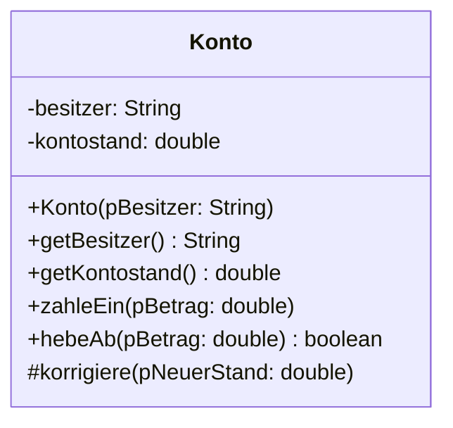
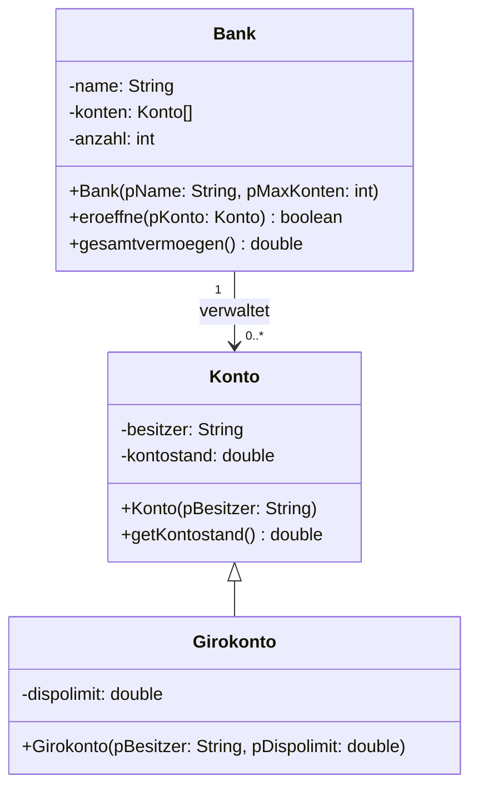
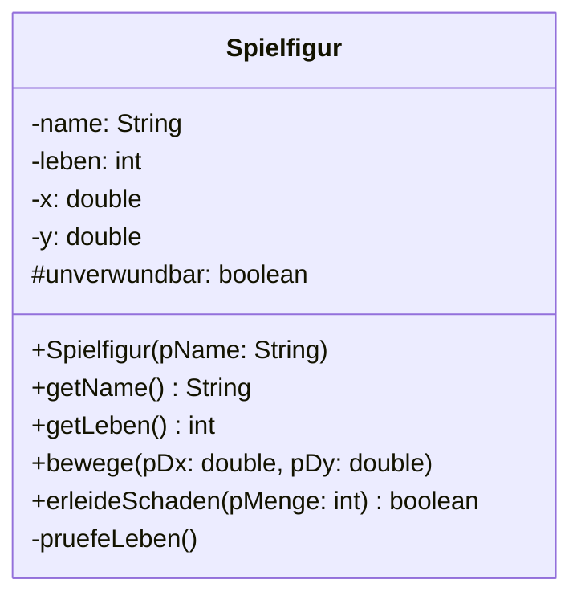
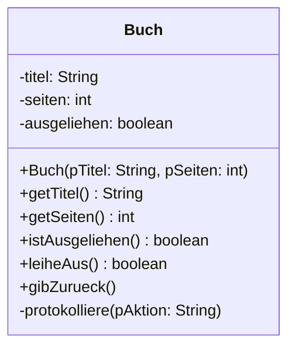
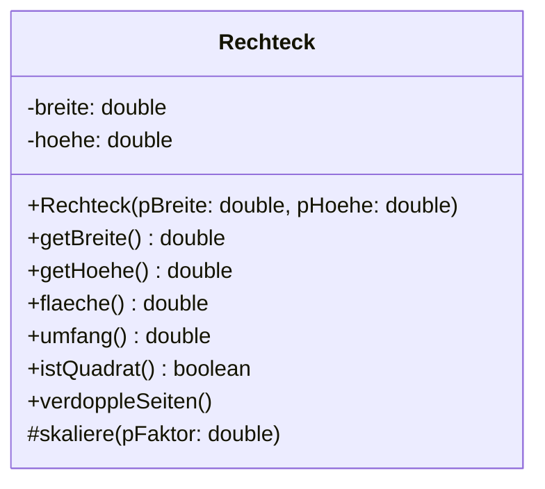

# Implementationsdiagramme

In der Einführungsphase hast du Klassendiagramme gezeichnet, um deine Entwürfe festzuhalten. Sie waren eine Skizze: „Es gibt ein Konto, das hat einen Besitzer und einen Kontostand."

Für eine Skizze reicht das. Für eine Klassenarbeit nicht – und für jemanden, der deinen Entwurf umsetzen soll, auch nicht. Denn aus „hat einen Kontostand" folgt weder, ob der Kontostand ein `int` oder ein `double` ist, noch ob man ihn von außen verändern darf.

<!-- KLP QPh, Daten und ihre Strukturierung: Klassenmodellierungen ... Implementationsdiagramme; stellen objektorientierte Modellierungen mit Klassen und ihren Beziehungen in Diagrammen grafisch dar (DI); dokumentieren Klassen durch Beschreibung der Funktionalitaet der Methoden (A) -->

## Zwei Stufen der Genauigkeit

:::snippet{#merken}
- Ein :t[Entwurfsdiagramm]{#entwurfsdiagramm} entsteht **früh** im Modellierungsprozess. Es nennt Klassen und Beziehungen, oft ohne Datentypen und ohne Sichtbarkeiten. Es beantwortet die Frage: *Woraus besteht das System?*
- Ein :t[Implementationsdiagramm]{#implementationsdiagramm} ist **vollständig**. Es nennt zu jedem Attribut den Datentyp, zu jeder Methode die Parameter mit Typ und den Rückgabetyp, und zu jedem Element die Sichtbarkeit. Es beantwortet die Frage: *Wie sieht der Quelltext aus?*

Aus einem Implementationsdiagramm lässt sich das Klassengerüst **ohne Rückfragen** schreiben – und umgekehrt. Genau das ist der Prüfstein: Wer beim Übersetzen ins Java noch etwas erfinden muss, hat kein Implementationsdiagramm vor sich.
:::

Weitere Darstellungsformen findest du unter [Objektorientierte Modellierung](../../../oom).

## Die Notation



:::snippet{#merken}
Ein Klassenkasten hat **drei Felder**: Name, Attribute, Methoden.

| Zeichen | Bedeutung | in Java |
| --- | --- | --- |
| `-` | nur in dieser Klasse sichtbar | `private` |
| `#` | auch in den Unterklassen sichtbar | `protected` |
| `+` | überall sichtbar | `public` |

Geschrieben wird

- ein Attribut als `sichtbarkeit name: typ`,
- eine Methode als `sichtbarkeit name(parameter: typ): rückgabetyp`.

Der Datentyp steht also immer **hinter** dem Doppelpunkt – beim Attribut, beim Parameter und beim Rückgabewert.

Ein **Konstruktor** heißt wie die Klasse und hat keinen Rückgabetyp. Eine Methode ohne Rückgabewert bekommt auch keinen: Bei ihr endet die Zeile hinter der Klammer, das `void` aus dem Java-Quelltext taucht im Diagramm nicht auf.
:::

:::alert{info}
Die Reihenfolge `name: typ` ist die in Nordrhein-Westfalen übliche und zugleich die der UML. In manchen Büchern steht stattdessen `typ name` – so herum, wie es im Java-Quelltext aussieht. Beides meint dasselbe; halte dich an die Schreibweise, die deine Lehrkraft benutzt, und **mische sie nicht**.
:::

## Beziehungen gehören dazu

Ein Diagramm mit einer einzigen Klasse ist selten. Sobald mehrere Klassen zusammenspielen, gehören auch die Beziehungen hinein.



:::snippet{#merken}
| Linie | Bedeutung | im Quelltext |
| --- | --- | --- |
| durchgezogener Pfeil mit offener Spitze | **Assoziation** – „kennt", „hat" | ein Attribut vom Typ der anderen Klasse |
| durchgezogener Pfeil mit leerem Dreieck | **Vererbung** – „ist ein" | `extends` |

An eine Assoziation schreibt man die **Kardinalität**: `1` an das eine Ende, `0..*` an das andere heißt „eine Bank verwaltet beliebig viele Konten, jedes Konto gehört zu genau einer Bank".

Geerbte Attribute und Methoden werden im Unterklassenkasten **nicht wiederholt** – dafür ist der Pfeil da. Im Kasten steht nur das, was neu dazukommt oder überschrieben wird.
:::

## Vom Diagramm zum Quelltext

Das Diagramm oben ergibt Zeile für Zeile diesen Quelltext. Vergleiche beim Lesen jede Java-Zeile mit ihrer Entsprechung im Kasten.

:::onlineide{height="620px" speed="1000000"}

```java Main.java
void main() {
    Konto k = new Konto("Ada");
    k.zahleEin(250.0);
    IO.println(k.getBesitzer() + ": " + k.getKontostand());
    IO.println("Abheben von 400: " + k.hebeAb(400.0));
    IO.println("Abheben von 100: " + k.hebeAb(100.0));
    IO.println("Stand: " + k.getKontostand());
}
```

```java Konto.java
/**
 * Ein Konto mit Besitzer und Kontostand.
 * Abgehoben werden kann nur, was auch da ist.
 */
public class Konto {

    private String besitzer;
    private double kontostand;

    /** Legt ein Konto mit dem Kontostand 0 an. */
    public Konto(String pBesitzer) {
        besitzer = pBesitzer;
        kontostand = 0.0;
    }

    public String getBesitzer() {
        return besitzer;
    }

    public double getKontostand() {
        return kontostand;
    }

    /** Zahlt pBetrag ein. Negative Beträge werden ignoriert. */
    public void zahleEin(double pBetrag) {
        if (pBetrag > 0) {
            kontostand = kontostand + pBetrag;
        }
    }

    /** Hebt ab, wenn der Betrag positiv ist und Deckung besteht. */
    public boolean hebeAb(double pBetrag) {
        if (pBetrag > 0 && pBetrag <= kontostand) {
            kontostand = kontostand - pBetrag;
            return true;
        }
        return false;
    }

    /** Setzt den Kontostand direkt. Nur für Unterklassen gedacht. */
    protected void korrigiere(double pNeuerStand) {
        kontostand = pNeuerStand;
    }
}
```

:::

:::snippet{#merken}
**Was das Diagramm nicht sagen kann.** Dass negative Beträge ignoriert werden und dass nur abgehoben werden darf, was da ist, steht nirgends im Kasten – nur im Quelltext und im **Kommentar darüber**.

Deshalb gehört zu einem Entwurf immer beides: das Diagramm für den **Aufbau** und eine kurze Beschreibung je Methode für die **Bedeutung**. Genau das nennt der Lehrplan „Klassen dokumentieren".
:::

---

## Teil 1: Lesen

### Aufgabe 1: Vom Quelltext zum Diagramm

:::snippet{#aufgabe}
*Ohne Rechner.* Zeichne auf Papier das vollständige Implementationsdiagramm zur folgenden Klasse. Trage alles ein, was hineingehört – und nur, was hineingehört.
:::

```java
public class Spielfigur {

    private String name;
    private int leben;
    private double x;
    private double y;
    protected boolean unverwundbar;

    public Spielfigur(String pName) {
        name = pName;
        leben = 3;
        unverwundbar = false;
    }

    public String getName() {
        return name;
    }

    public int getLeben() {
        return leben;
    }

    public void bewege(double pDx, double pDy) {
        x = x + pDx;
        y = y + pDy;
    }

    public boolean erleideSchaden(int pMenge) {
        if (unverwundbar) {
            return false;
        }
        leben = leben - pMenge;
        pruefeLeben();
        return true;
    }

    private void pruefeLeben() {
        if (leben < 0) {
            leben = 0;
        }
    }
}
```

::::collapsible{title="Tipp: die vier Stolpersteine"}

Geh die Klasse Zeile für Zeile durch und frag dich bei jeder Zeile: *Steht das schon in meinem Kasten?*

Vier Dinge werden regelmäßig vergessen: eine Methode, ein Sichtbarkeitszeichen, ein paar Datentypen und die Klammern hinter einem Namen.

::::

:::protect{password="java-q-1-1-1" description="Lösung. Erfrage das Passwort bei deiner Lehrkraft."}



Die vier häufigsten Fehler bei dieser Aufgabe:

| Fehler | Warum er einer ist |
| --- | --- |
| `pruefeLeben` fehlt | Ein Implementationsdiagramm zeigt **alles**, nicht nur das Öffentliche. Sonst könnte man den Quelltext daraus nicht schreiben. |
| `unverwundbar` bekommt `-` statt `#` | `protected` ist eine eigene Sichtbarkeit mit eigenem Zeichen – und eine bewusste Entscheidung, keine Nachlässigkeit. |
| bei `bewege` fehlen die Parametertypen | Ohne sie steht nicht fest, ob man `bewege(1, 2)` oder `bewege(1.5, 2.5)` schreiben darf. |
| `getName` steht ohne Klammern da | Dann wäre es ein Attribut. Klammern unterscheiden Methode von Attribut. |

Beachte außerdem: `x` und `y` stehen im Diagramm, obwohl sie nirgends ausgelesen werden. Das Diagramm bildet den Quelltext ab – auch dessen Schwächen.

:::

### Aufgabe 2: Diagramm und Quelltext passen nicht zusammen

:::snippet{#aufgabe}
*Ohne Rechner.* Jemand hat zuerst das Diagramm gezeichnet und dann den Quelltext geschrieben – dabei sind **fünf** Abweichungen entstanden.

Finde alle fünf. Notiere zu jeder: *Was steht im Diagramm, was im Quelltext?* Entscheide danach für jede Abweichung, **welche der beiden Seiten** du ändern würdest, und begründe es in einem Satz.
:::



```java
public class Buch {

    private String titel;
    public int seiten;
    private boolean ausgeliehen;

    public Buch(String pTitel, int pSeiten) {
        titel = pTitel;
        seiten = pSeiten;
        ausgeliehen = false;
    }

    public String getTitel() {
        return titel;
    }

    public boolean istAusgeliehen() {
        return ausgeliehen;
    }

    public boolean leiheAus() {
        if (ausgeliehen) {
            return false;
        }
        ausgeliehen = true;
        return true;
    }

    public void gibZurueck(String pName) {
        ausgeliehen = false;
    }

    public void protokolliere(String pAktion) {
        IO.println(pAktion);
    }
}
```

::::collapsible{title="Tipp: geh in vier Runden vor"}

Vergleiche nicht alles auf einmal, sondern viermal die ganze Klasse:

1. Gibt es **jedes** Element beider Seiten auf der anderen Seite auch?
2. Stimmen die **Sichtbarkeiten**?
3. Stimmen die **Datentypen** – bei Attributen, Rückgaben und Parametern?
4. Stimmen die **Parameterlisten**?

::::

:::protect{password="java-q-1-1-2" description="Lösung. Erfrage das Passwort bei deiner Lehrkraft."}

| # | Im Diagramm | Im Quelltext | Was ändern? |
| --- | --- | --- | --- |
| 1 | `-seiten: int` | `public int seiten` | **Den Quelltext.** Ein öffentliches Attribut durchbricht das Geheimnisprinzip: Jeder könnte die Seitenzahl von außen verändern. |
| 2 | `+getSeiten(): int` | fehlt | **Den Quelltext.** Die Methode ist der vorgesehene Weg an die Seitenzahl – und ohne sie ist Nummer 1 auch nicht zu beheben. |
| 3 | `+gibZurueck()` | `gibZurueck(String pName)` | **Den Quelltext.** Der Parameter wird nirgends benutzt. Ein Parameter, der nichts tut, ist irreführend. |
| 4 | `-protokolliere(pAktion: String)` | `public void protokolliere(...)` | **Den Quelltext.** Protokollieren ist eine interne Angelegenheit der Klasse. |
| 5 | `protokolliere` wird gebraucht | wird nirgends aufgerufen | **Beide.** Entweder rufst du sie in `leiheAus` und `gibZurueck` auf – oder du streichst sie aus beiden Darstellungen. Toter Code gehört in keinen Entwurf. |

Die eigentliche Frage dieser Aufgabe steht in der letzten Spalte: **Bei einer Abweichung ist nicht automatisch das Diagramm veraltet.** Viermal war der Quelltext im Unrecht, und zwar jedes Mal aus demselben Grund – er hat mehr geöffnet, als nötig war. Ein Diagramm ist auch dazu da, solche Nachlässigkeiten sichtbar zu machen.

:::

---

## Teil 2: Schreiben

### Aufgabe 3: Vom Diagramm zum Quelltext

:::snippet{#aufgabe}
Setze das folgende Implementationsdiagramm um, bis alle Tests grün sind. Achte auf **jede** Angabe: Sichtbarkeiten, Datentypen, Rückgabetypen.
:::



Was ein Diagramm nicht sagen kann und deshalb hier danebensteht:

- Der Konstruktor setzt Seiten, die kleiner oder gleich 0 sind, auf 1.
- `istQuadrat` liefert `true`, wenn beide Seiten gleich lang sind.
- `skaliere` multipliziert beide Seiten mit dem Faktor – aber nur, wenn dieser positiv ist.
- `verdoppleSeiten` benutzt `skaliere` mit dem Faktor 2 und rechnet **nicht** selbst.

:::onlineide{height="680px" speed="1000000"}

```java Main.java
void main() {
    IO.println("Führe die Tests über den Reiter Testrunner aus.");
}
```

```java Rechteck.java
public class Rechteck {

    // Ergänze hier die Attribute aus dem Diagramm.

    public Rechteck(double pBreite, double pHoehe) {
        // Dein Code hier
    }

    public double getBreite() {
        return 0.0; // ersetze diese Zeile
    }

    public double getHoehe() {
        return 0.0; // ersetze diese Zeile
    }

    public double flaeche() {
        return 0.0; // ersetze diese Zeile
    }

    public double umfang() {
        return 0.0; // ersetze diese Zeile
    }

    public boolean istQuadrat() {
        return false; // ersetze diese Zeile
    }

    public void verdoppleSeiten() {
        // Dein Code hier
    }

    protected void skaliere(double pFaktor) {
        // Dein Code hier
    }
}
```

```java RechteckTest.java
@Test
class RechteckTest {

    @Test
    void testKonstruktorUndGetter() {
        Rechteck r = new Rechteck(4.0, 3.0);
        assertEquals(4.0, r.getBreite(), "Die Breite muss 4 sein.");
        assertEquals(3.0, r.getHoehe(), "Die Höhe muss 3 sein.");
    }

    @Test
    void testMindestseite() {
        Rechteck r = new Rechteck(0.0, -2.0);
        assertEquals(1.0, r.getBreite(), "Eine Breite von 0 wird auf 1 gesetzt.");
        assertEquals(1.0, r.getHoehe(), "Eine negative Höhe ebenso.");
    }

    @Test
    void testFlaecheUndUmfang() {
        Rechteck r = new Rechteck(4.0, 3.0);
        assertEquals(12.0, r.flaeche(), "Die Fläche muss 12 sein.");
        assertEquals(14.0, r.umfang(), "Der Umfang muss 14 sein.");
    }

    @Test
    void testIstQuadrat() {
        assertTrue(new Rechteck(3.0, 3.0).istQuadrat(), "Gleiche Seiten ergeben ein Quadrat.");
        assertFalse(new Rechteck(4.0, 3.0).istQuadrat(), "Ungleiche Seiten nicht.");
    }

    @Test
    void testVerdoppeln() {
        Rechteck r = new Rechteck(4.0, 3.0);
        r.verdoppleSeiten();
        assertEquals(8.0, r.getBreite(), "Verdoppelt sind es 8.");
        assertEquals(6.0, r.getHoehe(), "Und 6.");
    }
}
```

:::

::::collapsible{title="Tipp 1: die Attribute"}

Im Diagramm stehen zwei Zeilen mit `-`. Daraus wird im Quelltext:

```java
private double breite;
```

Die zweite schreibst du selbst.

::::

::::collapsible{title="Tipp 2: skaliere ist protected"}

`#` im Diagramm heißt `protected`. Das Gerüst gibt das schon so vor – **ändere es nicht auf `public`**.

Genau deshalb ruft der Test `skaliere` auch nicht direkt auf: Von außen ist die Methode gar nicht sichtbar. Er geht über `verdoppleSeiten()`, und diese Methode ruft von **innen** auf:

```java
skaliere(2.0);
```

Das ist der übliche Umgang mit `protected` und `private`: Solche Methoden sind Werkzeuge der Klasse für sich selbst und für ihre Unterklassen.

::::

::::collapsible{title="Tipp 3: die Mindestseite"}

Für jede Seite dieselbe Prüfung, zweimal hingeschrieben:

```java
if (pBreite <= 0) {
    breite = 1.0;
} else {
    breite = pBreite;
}
```

::::

:::protect{password="java-q-1-1-3" description="Lösung. Erfrage das Passwort bei deiner Lehrkraft."}

```java Rechteck.java
public class Rechteck {

    private double breite;
    private double hoehe;

    /**
     * Erzeugt ein Rechteck.
     * Seiten kleiner oder gleich 0 werden auf 1 gesetzt.
     */
    public Rechteck(double pBreite, double pHoehe) {
        if (pBreite <= 0) {
            breite = 1.0;
        } else {
            breite = pBreite;
        }

        if (pHoehe <= 0) {
            hoehe = 1.0;
        } else {
            hoehe = pHoehe;
        }
    }

    public double getBreite() {
        return breite;
    }

    public double getHoehe() {
        return hoehe;
    }

    /** Liefert den Flächeninhalt. */
    public double flaeche() {
        return breite * hoehe;
    }

    /** Liefert den Umfang. */
    public double umfang() {
        return 2 * breite + 2 * hoehe;
    }

    /** Liefert true, wenn beide Seiten gleich lang sind. */
    public boolean istQuadrat() {
        return breite == hoehe;
    }

    /** Verdoppelt beide Seiten. */
    public void verdoppleSeiten() {
        skaliere(2.0);
    }

    /** Skaliert beide Seiten, wenn der Faktor positiv ist. */
    protected void skaliere(double pFaktor) {
        if (pFaktor > 0) {
            breite = breite * pFaktor;
            hoehe = hoehe * pFaktor;
        }
    }
}
```

Drei Dinge, auf die es ankam:

- **`istQuadrat` liefert direkt den Vergleich.** `return breite == hoehe;` genügt – ein `if` mit `return true;` und `return false;` sagt dasselbe in fünf Zeilen. Der Vergleich **ist** schon ein `boolean`.
- **Die Prüfung steckt im Konstruktor**, nicht in den Gettern. Ein Objekt soll von Anfang an gültig sein, nicht erst beim Auslesen.
- **`skaliere` prüft den Faktor selbst.** Die Klasse verlässt sich nicht darauf, dass nur sinnvolle Werte hereinkommen.
- **`verdoppleSeiten` rechnet nicht selbst**, sondern ruft `skaliere(2.0)` auf. Die Rechnung steht damit an einer Stelle – und die Prüfung auf einen positiven Faktor gilt automatisch mit.

:::

---

## Zum Weiterdenken

### Vertiefung 1: Was ein Diagramm verschweigt

:::snippet{#brain}
Zwei Programmiererinnen bekommen dasselbe Implementationsdiagramm von `Rechteck` – ohne die drei Sätze, die in Aufgabe 3 danebenstanden. Beide setzen es korrekt um, und ihre Klassen verhalten sich trotzdem verschieden.

a) Nenne **drei** Stellen, an denen die beiden Umsetzungen auseinandergehen können, obwohl beide zum Diagramm passen.

b) Ein Diagramm kann diese Lücke grundsätzlich nicht schließen. Warum nicht? Was wäre der Preis, wenn man es versuchte?

c) Womit schließt man sie stattdessen? Nenne zwei Mittel, die du in diesem Lernpfad schon benutzt hast.

d) Beurteile: Wenn man die Lücke ohnehin anders schließen muss – wozu dann überhaupt ein Diagramm?
:::

:::protect{password="java-q-1-1-4" description="Lösung. Erfrage das Passwort bei deiner Lehrkraft."}

a) Zum Beispiel:

- **Sonderfälle:** Was passiert bei einer Seitenlänge von 0 oder −5? Abfangen, auf einen Ersatzwert setzen, oder einfach übernehmen?
- **Rundung und Genauigkeit:** Liefert `flaeche()` den exakten Wert oder einen gerundeten?
- **Zustandsänderung:** Verändert `skaliere` das Objekt, oder gibt es ein neues zurück? Der Rückgabetyp `void` verrät es hier – bei einem anderen Rückgabetyp wäre es offen.
- **Reihenfolge:** Darf `skaliere` vor dem Setzen der Seiten aufgerufen werden? Muss vorher etwas anderes passiert sein?

b) Ein Diagramm beschreibt **Struktur**, nicht **Verhalten**. Es sagt, welche Teile es gibt und wie sie zusammenhängen – nicht, was bei welcher Eingabe herauskommt. Der Preis wäre die Übersichtlichkeit: Ein Diagramm, das jedes Verhalten mit aufführt, ist so lang wie der Quelltext und damit als Übersicht wertlos. Man hätte den Quelltext dann zweimal, nur einmal umständlicher.

c) **Kommentare über den Methoden** (`/** ... */`), die sagen, was die Methode leistet und was in den Sonderfällen gilt – und **Tests**, die dasselbe noch einmal in ausführbarer Form sagen. Der Unterschied zwischen beiden: Der Kommentar wird nicht geprüft, der Test schon. Deshalb braucht man beide.

d) Vertretbare Antwort: Das Diagramm beantwortet die Frage, die man **zuerst** hat – *woraus besteht das System und wer hängt womit zusammen?* Diese Frage beantwortet der Quelltext gerade nicht gut, weil er alle Klassen nacheinander zeigt statt nebeneinander. Verhalten dagegen liest man im Quelltext genau dort, wo man es braucht. Beide Darstellungen sind stark, wo die andere schwach ist – deshalb ersetzt keine die andere.

:::

### Vertiefung 2: Der eigene Entwurf im Rückspiegel

:::snippet{#brain}
Nimm dir das Spiel oder das Projekt vor, das du am Ende der Einführungsphase gebaut hast.

a) Zeichne nachträglich das **vollständige** Implementationsdiagramm – mit allen privaten Methoden, allen Datentypen und allen Beziehungen zwischen den Klassen.

b) Vergleiche es mit dem Entwurf von damals. Was ist beim Programmieren dazugekommen, was hast du weggelassen?

c) Suche im Diagramm nach den Stellen, die dir jetzt nicht mehr gefallen: ein `public`, das `private` sein könnte; eine Klasse, die zu viel weiß; eine Methode, die in der falschen Klasse steht.

d) Beurteile: Hätte ein genaueres Diagramm dir Arbeit erspart – oder wärst du damit nur langsamer losgekommen? Es gibt auf diese Frage keine allgemein richtige Antwort, aber eine begründete.
:::

---

## Selbsttest

::::multievent

**1. Was unterscheidet ein Implementationsdiagramm von einem Entwurfsdiagramm?**

{r1{Es hat mehr Klassen.}}

{r1{!Es nennt Datentypen, Parameter und Sichtbarkeiten vollständig.}}

{r1{Es wird nach dem Programmieren gezeichnet.}}

{r1{Es enthält keine Beziehungen.}}

{h{Aus ihm soll sich der Quelltext ohne Rückfrage schreiben lassen.}}
{H{Richtig!}}

**2. Welches Zeichen steht für protected?**

{r2{ein Minuszeichen}}

{r2{!eine Raute}}

{r2{ein Pluszeichen}}

{r2{ein Sternchen}}

{h{Minus ist private, Plus ist public.}}
{H{Richtig!}}

**3. Gehören private Methoden ins Implementationsdiagramm?**

{r3{!ja, alle}}

{r3{nein, nur öffentliche}}

{r3{nur wenn sie aufgerufen werden}}

{h{Das Diagramm soll den vollständigen Quelltext abbilden.}}
{H{Richtig!}}

**4. Was bedeutet ein durchgezogener Pfeil mit leerem Dreieck?**

{r4{eine Assoziation}}

{r4{!eine Vererbung}}

{r4{einen Methodenaufruf}}

{r4{ein privates Attribut}}

{h{Er zeigt von der Unterklasse zur Oberklasse.}}
{H{Richtig – im Quelltext steht dort extends.}}

**5. Eine Unterklasse erbt getName von der Oberklasse. Wo steht die Methode im Diagramm?**

{r5{in beiden Kästen}}

{r5{!nur im Kasten der Oberklasse}}

{r5{nur im Kasten der Unterklasse}}

{h{Wofür ist der Vererbungspfeil da?}}
{H{Richtig – wiederholt wird nur, was überschrieben wird.}}

**6. Was kann ein Implementationsdiagramm NICHT ausdrücken?** (Mehrfachauswahl)

{c1{!was bei einer negativen Eingabe passiert}}

{c1{!in welcher Reihenfolge Methoden aufgerufen werden müssen}}

{c1{den Datentyp eines Attributs}}

{c1{die Sichtbarkeit einer Methode}}

{h{Zwei der vier Angaben stehen ausdrücklich in jedem Kasten.}}
{H{Richtig – Struktur ja, Verhalten nein. Dafür gibt es Kommentare und Tests.}}

::::
