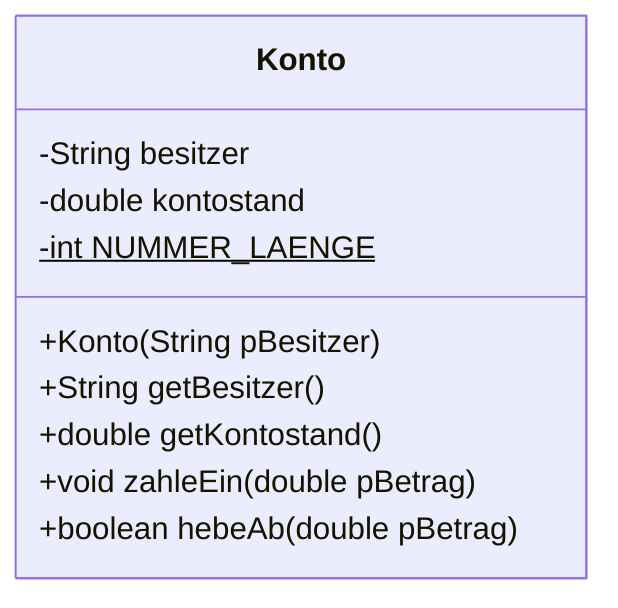
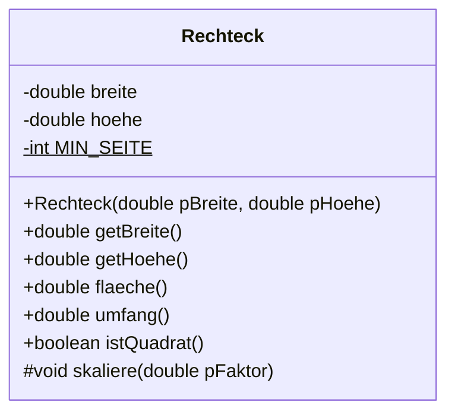
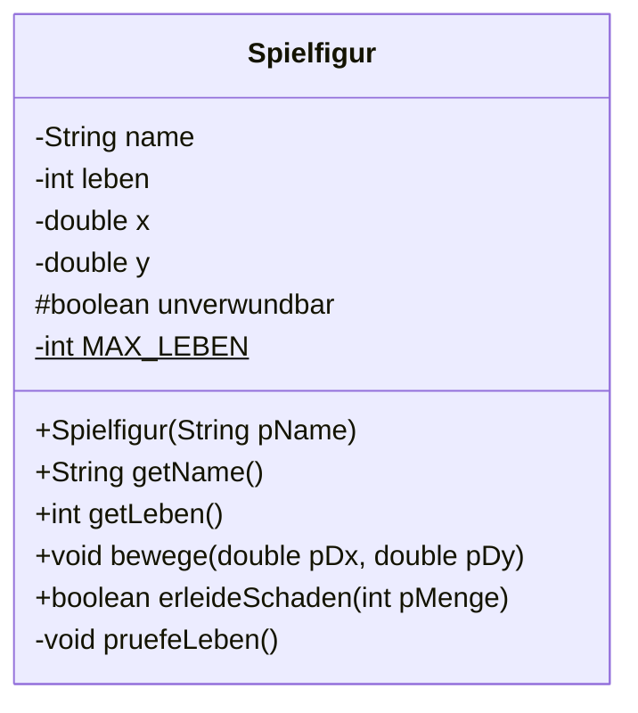

# Implementationsdiagramme

In der Einführungsphase hast du Klassendiagramme gezeichnet, um deine Entwürfe festzuhalten. Jetzt wird die Darstellung genauer – und verbindlich.

<!-- KLP QPh, Daten und ihre Strukturierung: Klassenmodellierungen ... Implementationsdiagramme; stellen objektorientierte Modellierungen mit Klassen und ihren Beziehungen in Diagrammen grafisch dar (DI) -->

## Entwurf und Implementation

:::snippet{#merken}
Man unterscheidet zwei Stufen:

- Ein **Entwurfsdiagramm** entsteht früh im Modellierungsprozess. Es nennt Klassen und Beziehungen, oft ohne Datentypen und ohne Sichtbarkeiten. Es beantwortet die Frage: *Woraus besteht das System?*
- Ein **Implementationsdiagramm** ist vollständig. Es nennt zu jedem Attribut den Datentyp, zu jeder Methode die Parameter mit Typ und den Rückgabetyp, und zu jedem Element die Sichtbarkeit. Es beantwortet die Frage: *Wie sieht der Quelltext aus?*

Aus einem Implementationsdiagramm lässt sich das Klassengerüst ohne Rückfragen schreiben – und umgekehrt.
:::

Weitere Darstellungsformen findest du unter [Objektorientierte Modellierung](../../../oom).

## Der Aufbau



:::snippet{#merken}
| Zeichen | Bedeutung |
| --- | --- |
| `-` | `private` |
| `#` | `protected` |
| `+` | `public` |
| unterstrichen | Klassenattribut oder Klassenmethode (`static`) |
| `GROSS_MIT_UNTERSTRICH` | eine **Konstante** (`final`) |

Attribute stehen im mittleren Feld in der Form `sichtbarkeit typ name`, Methoden im unteren Feld in der Form `sichtbarkeit rückgabetyp name(typ parameter)`.
:::

## Konstanten

Neu in der Qualifikationsphase: **Konstanten**. Ein Wert, der sich nie ändert, wird mit `final` gekennzeichnet.

:::onlineide{height="520px" speed="1000000"}

```java Main.java
void main() {
    Kreis k = new Kreis(5.0);
    IO.println("Fläche: " + k.flaeche());
    IO.println("Umfang: " + k.umfang());

    IO.println("Größter erlaubter Radius: " + Kreis.MAX_RADIUS);
}
```

```java Kreis.java
public class Kreis {

    /** Der größte Radius, den ein Kreis annehmen darf. */
    public static final double MAX_RADIUS = 1000.0;

    private double radius;

    public Kreis(double pRadius) {
        if (pRadius > MAX_RADIUS) {
            radius = MAX_RADIUS;
        } else {
            radius = pRadius;
        }
    }

    public double flaeche() {
        return Math.PI * radius * radius;
    }

    public double umfang() {
        return 2 * Math.PI * radius;
    }
}
```

:::

:::snippet{#merken}
- `final` bedeutet: Der Wert kann nach der Zuweisung nicht mehr geändert werden.
- `static` bedeutet: Der Wert gehört zur **Klasse**, nicht zu einzelnen Objekten. Es gibt ihn genau einmal, unabhängig davon, wie viele Kreise existieren.
- Zusammen ergibt das eine **Konstante**. Sie wird `GROSS_MIT_UNTERSTRICH` geschrieben und über den Klassennamen angesprochen: `Kreis.MAX_RADIUS`.

Konstanten sind kein Selbstzweck. Sie geben einer Zahl einen **Namen** – und damit eine Erklärung. `if (pRadius > MAX_RADIUS)` sagt mehr als `if (pRadius > 1000.0)`.
:::

## Aufgabe 1: Vom Diagramm zum Quelltext

:::snippet{#aufgabe}
Setze das folgende Implementationsdiagramm um. Achte auf **jede** Angabe: Sichtbarkeiten, Datentypen, Rückgabetypen.

Das Gerüst gibt die Signaturen schon vor – die Attribute, die Konstante und die Rümpfe musst du selbst aus dem Diagramm ableiten.
:::



Zusätzliche Angaben, die im Diagramm nicht stehen können:

- `MIN_SEITE` ist eine Konstante mit dem Wert 1.
- Der Konstruktor setzt Seiten unterhalb von `MIN_SEITE` auf `MIN_SEITE`.
- `istQuadrat` liefert `true`, wenn beide Seiten gleich sind.
- `skaliere` multipliziert beide Seiten mit dem Faktor, aber nur bei positivem Faktor.

:::onlineide{height="640px" speed="1000000"}

```java Main.java
void main() {
    IO.println("Führe die Tests über den Reiter Testrunner aus.");
}
```

```java Rechteck.java
public class Rechteck {

    // Ergänze hier die Konstante aus dem Diagramm.
    public static final int MIN_SEITE = 0;

    // Ergänze hier die Attribute aus dem Diagramm.

    public Rechteck(double pBreite, double pHoehe) {
        // Dein Code hier
    }

    public double getBreite() {
        return 0.0; // ersetze diese Zeile
    }

    public double getHoehe() {
        return 0.0; // ersetze diese Zeile
    }

    public double flaeche() {
        return 0.0; // ersetze diese Zeile
    }

    public double umfang() {
        return 0.0; // ersetze diese Zeile
    }

    public boolean istQuadrat() {
        return false; // ersetze diese Zeile
    }

    protected void skaliere(double pFaktor) {
        // Dein Code hier
    }
}
```

```java RechteckTest.java
@Test
class RechteckTest {

    @Test
    void testKonstruktorUndGetter() {
        Rechteck r = new Rechteck(4.0, 3.0);
        assertEquals(4.0, r.getBreite(), "Die Breite muss 4 sein.");
        assertEquals(3.0, r.getHoehe(), "Die Höhe muss 3 sein.");
    }

    @Test
    void testMindestseite() {
        Rechteck r = new Rechteck(0.5, -2.0);
        assertEquals(1.0, r.getBreite(), "Zu kleine Breiten werden auf 1 gesetzt.");
        assertEquals(1.0, r.getHoehe(), "Zu kleine Höhen ebenso.");
    }

    @Test
    void testFlaecheUndUmfang() {
        Rechteck r = new Rechteck(4.0, 3.0);
        assertEquals(12.0, r.flaeche(), "Die Fläche muss 12 sein.");
        assertEquals(14.0, r.umfang(), "Der Umfang muss 14 sein.");
    }

    @Test
    void testIstQuadrat() {
        assertTrue(new Rechteck(3.0, 3.0).istQuadrat(), "Gleiche Seiten ergeben ein Quadrat.");
        assertFalse(new Rechteck(4.0, 3.0).istQuadrat(), "Ungleiche Seiten nicht.");
    }

    @Test
    void testKonstante() {
        assertEquals(1, Rechteck.MIN_SEITE, "Die Konstante MIN_SEITE muss 1 sein.");
    }
}
```

:::

::::collapsible{title="Tipp: Wie erkennt man die Konstante im Diagramm?"}

`MIN_SEITE` ist **unterstrichen** – das bedeutet `static`. Und der Name in Großbuchstaben mit Unterstrich ist die Konvention für `final`.

Damit der Test `Rechteck.MIN_SEITE` lesen kann, muss die Konstante außerdem `public` sein.

::::

:::protect{password="java-q-1-1-1" description="Lösung. Erfrage das Passwort bei deiner Lehrkraft."}

```java Rechteck.java
public class Rechteck {

    /** Die kleinste erlaubte Seitenlänge. */
    public static final int MIN_SEITE = 1;

    private double breite;
    private double hoehe;

    /**
     * Erzeugt ein Rechteck. Zu kleine Seiten werden auf MIN_SEITE gesetzt.
     * @param pBreite die gewünschte Breite
     * @param pHoehe die gewünschte Höhe
     */
    public Rechteck(double pBreite, double pHoehe) {
        if (pBreite < MIN_SEITE) {
            breite = MIN_SEITE;
        } else {
            breite = pBreite;
        }

        if (pHoehe < MIN_SEITE) {
            hoehe = MIN_SEITE;
        } else {
            hoehe = pHoehe;
        }
    }

    public double getBreite() {
        return breite;
    }

    public double getHoehe() {
        return hoehe;
    }

    /** Liefert den Flächeninhalt. */
    public double flaeche() {
        return breite * hoehe;
    }

    /** Liefert den Umfang. */
    public double umfang() {
        return 2 * breite + 2 * hoehe;
    }

    /** Liefert true, wenn beide Seiten gleich lang sind. */
    public boolean istQuadrat() {
        return breite == hoehe;
    }

    /** Skaliert beide Seiten mit dem Faktor, wenn dieser positiv ist. */
    protected void skaliere(double pFaktor) {
        if (pFaktor > 0) {
            breite = breite * pFaktor;
            hoehe = hoehe * pFaktor;
        }
    }
}
```

:::

## Aufgabe 2: Vom Quelltext zum Diagramm

:::snippet{#aufgabe}
Zeichne **auf Papier** das Implementationsdiagramm zur folgenden Klasse. Trage alles ein, was in ein Implementationsdiagramm gehört.
:::

```java
public class Spielfigur {

    public static final int MAX_LEBEN = 3;

    private String name;
    private int leben;
    private double x;
    private double y;
    protected boolean unverwundbar;

    public Spielfigur(String pName) {
        name = pName;
        leben = MAX_LEBEN;
        unverwundbar = false;
    }

    public String getName() {
        return name;
    }

    public int getLeben() {
        return leben;
    }

    public void bewege(double pDx, double pDy) {
        x = x + pDx;
        y = y + pDy;
    }

    public boolean erleideSchaden(int pMenge) {
        if (unverwundbar) {
            return false;
        }
        leben = leben - pMenge;
        return true;
    }

    private void pruefeLeben() {
        if (leben < 0) {
            leben = 0;
        }
    }
}
```

::::collapsible{title="Auflösung"}



Häufige Fehler bei dieser Aufgabe:

- Die **private** Methode `pruefeLeben` wird vergessen. Sie gehört ins Diagramm – ein Implementationsdiagramm zeigt alles, nicht nur das Öffentliche.
- Bei `unverwundbar` wird `-` statt `#` eingetragen.
- Die Konstante wird nicht unterstrichen.
- Bei `bewege` fehlen die Parametertypen.

::::

## Aufgabe 3: Beurteilen

:::snippet{#aufgabe}
Die Klasse `Spielfigur` hat einen Entwurfsfehler: Die private Methode `pruefeLeben` wird nirgends aufgerufen.

a) Wo müsste sie aufgerufen werden?

b) Warum ist sie überhaupt `private`?

c) Nenne einen weiteren Schwachpunkt des Entwurfs.
:::

::textinput{placeholder="a) ... b) ... c) ..."}

::::collapsible{title="Auflösung"}

a) Am Ende von `erleideSchaden`, bevor `true` zurückgegeben wird. Sonst kann die Lebenszahl negativ werden.

b) Weil sie eine **interne Aufräumarbeit** ist. Von außen soll niemand die Lebenszahl korrigieren können – das wäre wieder ein Loch in der Kapselung. Private Methoden sind Hilfsmethoden der Klasse für sich selbst.

c) Mehrere Antworten sind vertretbar:

- Die Attribute `x` und `y` haben keine Getter – man kann die Position nicht auslesen.
- `unverwundbar` ist `protected`, ohne dass es eine Unterklasse gäbe. Ohne konkreten Grund gehört es auf `private`.
- Es gibt keine Möglichkeit, Leben zurückzubekommen.
- `erleideSchaden` prüft nicht auf negative Mengen – damit könnte man sich heilen.

::::

## Zusatzaufgabe

:::snippet{#brain}
Nimm dir das Spiel vor, das du am Ende der Einführungsphase gebaut hast.

a) Zeichne nachträglich das **vollständige** Implementationsdiagramm – mit allen privaten Methoden und allen Datentypen.

b) Vergleiche es mit dem Entwurfsdiagramm von damals. Was ist beim Programmieren dazugekommen, was hast du weggelassen?

c) Beurteile: Hätte ein genaueres Diagramm dir Arbeit erspart – oder wärst du nur langsamer losgekommen? Begründe.
:::

---

## Selbsttest

::::multievent

**1. Was unterscheidet ein Implementationsdiagramm von einem Entwurfsdiagramm?**

{r1{Es hat mehr Klassen.}}

{r1{!Es nennt Datentypen, Parameter und Sichtbarkeiten vollständig.}}

{r1{Es wird nach dem Programmieren gezeichnet.}}

{h{Aus ihm soll sich der Quelltext ohne Rückfrage schreiben lassen.}}
{H{Richtig!}}

**2. Welches Zeichen steht für protected?**

{r2{ein Minuszeichen}}

{r2{!eine Raute}}

{r2{ein Pluszeichen}}

{h{Minus ist private, Plus ist public.}}
{H{Richtig!}}

**3. Wie erkennt man im Diagramm ein Klassenattribut?**

{r3{an der Raute davor}}

{r3{!daran, dass es unterstrichen ist}}

{r3{an den Großbuchstaben}}

{h{Die Großbuchstaben deuten auf eine Konstante hin, das ist etwas anderes.}}
{H{Richtig! Unterstrichen bedeutet static.}}

**4. Was bewirken die beiden Schlüsselwörter einer Konstanten?** (Mehrfachauswahl)

{c1{!final verhindert spätere Änderungen.}}

{c1{!static sorgt dafür, dass es den Wert nur einmal gibt.}}

{c1{final macht das Attribut privat.}}

{c1{static macht das Attribut öffentlich.}}

{h{Sichtbarkeit ist eine dritte, unabhängige Angabe.}}
{H{Richtig!}}

**5. Gehören private Methoden ins Implementationsdiagramm?**

{r4{!ja, alle}}

{r4{nein, nur öffentliche}}

{r4{nur wenn sie aufgerufen werden}}

{h{Das Diagramm soll den vollständigen Quelltext abbilden.}}
{H{Richtig!}}

::::
