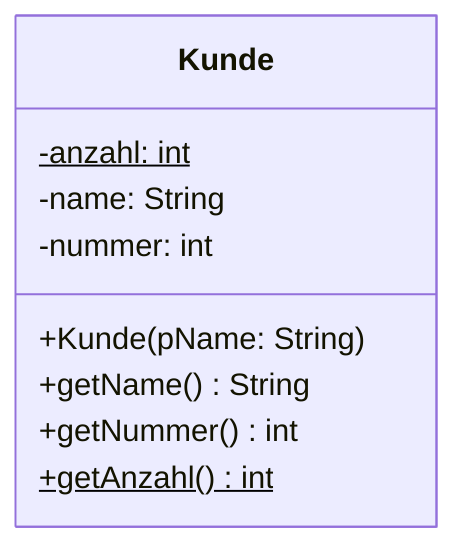
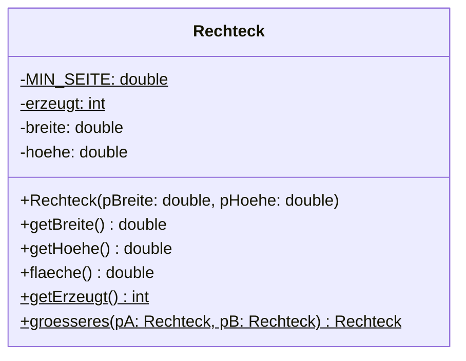

# Klassenattribute und Konstanten

„Wie viele Konten hat diese Bank bisher eröffnet?"

Diese Frage kann kein einzelnes Konto beantworten. Jedes Konto kennt nur sich selbst – seinen Besitzer und seinen Kontostand. Die Zahl aller Konten gehört zu keinem von ihnen. Sie gehört zur **Klasse**.

<!-- KLP QPh, Daten und ihre Strukturierung: Klassenmodellierungen ... Implementationsdiagramme; ordnen Attributen ... Datentypen zu (M). Klassenattribute und Konstanten sind Voraussetzung fuer die Notation im Implementationsdiagramm (unterstrichen) und fuer Kapitel 4 und 5. -->

## Ein Wert für die ganze Klasse

:::snippet{#definition}
Ein **Objektattribut** gibt es **einmal pro Objekt**. Jedes Objekt hat seinen eigenen Wert.

Ein **Klassenattribut** gibt es **genau einmal**, unabhängig davon, wie viele Objekte existieren. Alle Objekte sehen denselben Wert. Gekennzeichnet wird es mit dem Schlüsselwort `static`.
:::

:::onlineide{height="620px" speed="1000000"}

```java Main.java
void main() {
    IO.println("Bisher erzeugt: " + Kunde.getAnzahl());

    Kunde ada = new Kunde("Ada");
    Kunde alan = new Kunde("Alan");

    IO.println("Bisher erzeugt: " + Kunde.getAnzahl());
    IO.println(ada.getName() + " hat die Nummer " + ada.getNummer());
    IO.println(alan.getName() + " hat die Nummer " + alan.getNummer());
}
```

```java Kunde.java
public class Kunde {

    /** Gehört zur Klasse: Es gibt diesen Zähler genau einmal. */
    private static int anzahl = 0;

    /** Gehören zum Objekt: Jeder Kunde hat eigene Werte. */
    private String name;
    private int nummer;

    public Kunde(String pName) {
        name = pName;
        anzahl = anzahl + 1;
        nummer = anzahl;
    }

    public String getName() {
        return name;
    }

    public int getNummer() {
        return nummer;
    }

    /** Eine Klassenmethode: Sie braucht kein Objekt, um zu antworten. */
    public static int getAnzahl() {
        return anzahl;
    }
}
```

:::

:::snippet{#merken}
- `private static int anzahl` gehört zur Klasse. Der Konstruktor erhöht ihn bei **jedem** neuen Kunden – und weil es ihn nur einmal gibt, zählt er über alle Objekte hinweg.
- `private int nummer` gehört zum Objekt. Der Konstruktor **kopiert** den aktuellen Zählerstand hinein. Ändert sich der Zähler später, bleibt die einmal vergebene Nummer, wie sie ist.
- `public static int getAnzahl()` ist eine **Klassenmethode**. Sie wird über den **Klassennamen** aufgerufen: `Kunde.getAnzahl()`. Ein Objekt braucht sie nicht – und darf deshalb auch keins voraussetzen.

**Die Faustregel:** Beantworte die Frage *„Wovon gibt es das einmal – pro Objekt oder pro Klasse?"* Erst danach schreibst du `static` hin oder nicht.
:::

:::alert{info}
Eine Klassenmethode darf **nicht** auf Objektattribute zugreifen. Das ist keine Schikane, sondern Logik: `Kunde.getAnzahl()` wird ohne jedes Objekt aufgerufen – *wessen* `name` sollte sie dann lesen?

Umgekehrt geht es sehr wohl: Eine Objektmethode darf Klassenattribute lesen und ändern.
:::

## Konstanten

Manche Werte ändern sich nie: die Zahl π, die Höchstpunktzahl einer Arbeit, der größte erlaubte Radius. Für sie gibt es `final`.

:::onlineide{height="560px" speed="1000000"}

```java Main.java
void main() {
    Kreis k = new Kreis(5.0);
    IO.println("Fläche: " + k.flaeche());

    Kreis zuGross = new Kreis(5000.0);
    IO.println("Radius nach Deckelung: " + zuGross.getRadius());

    IO.println("Größter erlaubter Radius: " + Kreis.MAX_RADIUS);

    // Die folgende Zeile lässt sich nicht übersetzen.
    // Entferne die Schrägstriche und lies die Fehlermeldung.
    // Kreis.MAX_RADIUS = 2000;
}
```

```java Kreis.java
public class Kreis {

    /** Der größte Radius, den ein Kreis annehmen darf. */
    public static final double MAX_RADIUS = 1000.0;

    private double radius;

    public Kreis(double pRadius) {
        if (pRadius > MAX_RADIUS) {
            radius = MAX_RADIUS;
        } else {
            radius = pRadius;
        }
    }

    public double getRadius() {
        return radius;
    }

    public double flaeche() {
        return Math.PI * radius * radius;
    }
}
```

:::

:::snippet{#merken}
- `final` bedeutet: Der Wert kann nach der Zuweisung **nicht mehr geändert** werden. Der Versuch ist schon ein Übersetzungsfehler.
- `static` bedeutet: Der Wert gehört zur **Klasse**.
- Zusammen ergibt das eine **Konstante**. Sie wird `GROSS_MIT_UNTERSTRICH` geschrieben und über den Klassennamen angesprochen: `Kreis.MAX_RADIUS`.

Konstanten sind kein Selbstzweck. Sie geben einer Zahl einen **Namen** – und damit eine Erklärung:

```java
if (pRadius > MAX_RADIUS)      // sagt, warum
if (pRadius > 1000.0)          // sagt nur, was
```

Und sie stehen an **einer** Stelle. Wer den Höchstwert ändern will, ändert eine Zeile statt sieben – und übersieht keine.
:::

:::alert{info}
Die Online-IDE schreibt eine Kommazahl ohne Nachkommastellen **ohne** das `.0`: Aus `100.0` wird in der Ausgabe `100`. In echtem Java stünde dort `100.0`. Am Rechenergebnis ändert das nichts.
:::

## Im Implementationsdiagramm



:::snippet{#merken}
Damit ist die Notation aus [1.1](./01-implementationsdiagramme) vollständig:

| Schreibweise | Bedeutung |
| --- | --- |
| `-`, `#`, `+` | `private`, `protected`, `public` |
| **unterstrichen** | Klassenattribut oder Klassenmethode (`static`) |
| `GROSS_MIT_UNTERSTRICH` | eine Konstante (`final`) |

Ein Wert, der beides ist – unterstrichen **und** in Großbuchstaben –, ist eine Konstante der Klasse. Genau das ist der Normalfall: Fast jede Konstante ist `static final`.
:::

---

## Teil 1: Lesen

### Aufgabe 1: Wer zählt was?

:::snippet{#aufgabe}
*Ohne Rechner.* Lies die beiden Dateien und sag die vier Ausgabezeilen voraus. Führ eine Tabelle mit einer Spalte für `anzahl` und je einer für die `nummer` der drei Objekte.
:::

```java Main.java
void main() {
    IO.println("A: " + Kunde.getAnzahl());

    Kunde ada = new Kunde("Ada");
    Kunde alan = new Kunde("Alan");

    IO.println("B: " + Kunde.getAnzahl());
    IO.println("C: " + ada.getNummer() + " " + alan.getNummer());

    Kunde grace = new Kunde("Grace");

    IO.println("D: " + Kunde.getAnzahl() + " " + grace.getNummer() + " " + ada.getNummer());
}
```

```java Kunde.java
public class Kunde {

    private static int anzahl = 0;

    private String name;
    private int nummer;

    public Kunde(String pName) {
        name = pName;
        anzahl = anzahl + 1;
        nummer = anzahl;
    }

    public int getNummer() {
        return nummer;
    }

    public static int getAnzahl() {
        return anzahl;
    }
}
```

a) Welche vier Zeilen gibt das Programm aus?

b) In Zeile D steht `ada.getNummer()` – und liefert nicht dasselbe wie `Kunde.getAnzahl()`, obwohl der Konstruktor die beiden gleichgesetzt hat. Erkläre, warum.

c) Jemand schreibt versehentlich `private static int nummer;` statt `private int nummer;`. Was gibt das Programm dann in den Zeilen C und D aus?

d) Wozu ist die Nummer, die dieser Konstruktor vergibt, brauchbar – und wozu nicht? Denk an einen Kunden, der gelöscht wird.

Prüf deine Vorhersage erst danach im Programmierbereich nach.
:::

:::onlineide{height="560px" speed="1000000"}

```java Main.java
void main() {
    IO.println("A: " + Kunde.getAnzahl());

    Kunde ada = new Kunde("Ada");
    Kunde alan = new Kunde("Alan");

    IO.println("B: " + Kunde.getAnzahl());
    IO.println("C: " + ada.getNummer() + " " + alan.getNummer());

    Kunde grace = new Kunde("Grace");

    IO.println("D: " + Kunde.getAnzahl() + " " + grace.getNummer() + " " + ada.getNummer());
}
```

```java Kunde.java
public class Kunde {

    private static int anzahl = 0;

    private String name;
    private int nummer;

    public Kunde(String pName) {
        name = pName;
        anzahl = anzahl + 1;
        nummer = anzahl;
    }

    public int getNummer() {
        return nummer;
    }

    public static int getAnzahl() {
        return anzahl;
    }
}
```

:::

::::collapsible{title="Tipp: die Zuweisung ist eine Kopie"}

`nummer = anzahl;` **kopiert** den Wert. Danach hat die beiden nichts mehr miteinander zu tun – so wie bei

```java
int a = 5;
int b = a;
a = 99;   // b bleibt 5
```

::::

:::protect{password="java-q-1-2-1" description="Lösung. Erfrage das Passwort bei deiner Lehrkraft."}

a)

```
A: 0
B: 2
C: 1 2
D: 3 3 1
```

| Schritt | `anzahl` | `ada.nummer` | `alan.nummer` | `grace.nummer` |
| --- | --- | --- | --- | --- |
| Start | 0 | – | – | – |
| `new Kunde("Ada")` | 1 | 1 | – | – |
| `new Kunde("Alan")` | 2 | 1 | 2 | – |
| `new Kunde("Grace")` | 3 | 1 | 2 | 3 |

b) `nummer = anzahl;` ist eine **Kopie**, keine Verbindung. Zum Zeitpunkt, an dem Ada erzeugt wurde, stand im Zähler die 1 – diese 1 liegt seitdem in Adas eigenem Attribut. Der Zähler läuft weiter, Adas Nummer nicht. Genau das ist der Unterschied zwischen einem Klassen- und einem Objektattribut.

c) Dann gäbe es die Nummer nur **einmal** für alle Kunden, und jeder neue Konstruktoraufruf überschriebe sie:

```
C: 2 2
D: 3 3 3
```

Alle Kunden hätten dieselbe „eigene" Nummer – ein Widerspruch in sich. Ein `static`, das dort nicht hingehört, macht aus einer Eigenschaft des Objekts eine Eigenschaft der ganzen Klasse.

d) Die Nummer ist brauchbar als **eindeutige Kennung**: Zwei Kunden bekommen nie dieselbe. Sie ist **nicht** brauchbar als Antwort auf „der wievielte Kunde ist das gerade?" – denn wird Alan gelöscht, bleibt Graces Nummer 3, obwohl es nur noch zwei Kunden gibt. Der Zähler zählt die **jemals erzeugten** Objekte, nicht die vorhandenen.

:::

### Aufgabe 2: Objekt, Klasse oder Konstante?

:::snippet{#aufgabe}
*Ohne Rechner.* Ordne jede Angabe einer der drei Spalten zu: **Objektattribut**, **Klassenattribut** oder **Konstante**. Begründe die Zuordnung jeweils mit der Frage *„Wovon gibt es das wie oft, und ändert es sich?"*

a) der Name einer Kundin

b) die Anzahl der bisher eröffneten Konten einer Bank

c) die Kreiszahl π

d) der Kontostand

e) der Zinssatz, den die Bank für **alle** Sparkonten festlegt und einmal im Jahr anpasst

f) die höchste je erreichte Punktzahl in einem Spiel

g) die Anzahl der Leben, mit denen jede Spielfigur startet

h) die Position einer Spielfigur
:::

:::protect{password="java-q-1-2-2" description="Lösung. Erfrage das Passwort bei deiner Lehrkraft."}

| | Angabe | Zuordnung | Begründung |
| --- | --- | --- | --- |
| a) | Name der Kundin | **Objektattribut** | Jede Kundin hat einen eigenen. |
| b) | eröffnete Konten | **Klassenattribut** | Gibt es einmal für die ganze Bank, ändert sich laufend. |
| c) | π | **Konstante** | Gibt es einmal und ändert sich nie – deshalb `static final` (in Java `Math.PI`). |
| d) | Kontostand | **Objektattribut** | Jedes Konto hat seinen eigenen. |
| e) | Zinssatz für alle Sparkonten | **Klassenattribut** | Gilt für alle gemeinsam – aber `final` wäre falsch, er wird ja angepasst. |
| f) | höchste je erreichte Punktzahl | **Klassenattribut** | Eine Bestenliste gibt es einmal, nicht pro Spielfigur. |
| g) | Startleben jeder Figur | **Konstante** | Für alle gleich und unveränderlich: `public static final int START_LEBEN = 3;` |
| h) | Position einer Figur | **Objektattribut** | Sonst stünden alle Figuren übereinander. |

Zwei Fälle sind lehrreich:

- **e) und g) sehen sich ähnlich** und sind es nicht. Beide gelten für alle Objekte – aber der Zinssatz **ändert sich**, die Startleben nicht. `static` sagt „einer für alle", `final` sagt „unveränderlich". Das sind zwei unabhängige Entscheidungen; man braucht nicht immer beide.
- **b) und f) sind Klassenattribute, obwohl sie sich ständig ändern.** Ein Klassenattribut ist keine Konstante. Es ist nur ein Wert, den sich alle Objekte teilen.

:::

---

## Teil 2: Schreiben

### Aufgabe 3: Ein Rechteck, das mitzählt

:::snippet{#aufgabe}
Erweitere das `Rechteck` aus [1.1](./01-implementationsdiagramme) um alles, was im Diagramm **unterstrichen** oder **groß geschrieben** ist, bis alle Tests grün sind.



Dazu, was das Diagramm nicht sagen kann:

- `MIN_SEITE` hat den Wert 1.0. Seiten darunter setzt der Konstruktor auf `MIN_SEITE`.
- `erzeugt` zählt, wie viele Rechtecke bisher erzeugt wurden.
- `groesseres` liefert von zwei Rechtecken das mit der größeren Fläche; bei Gleichstand das erste.
:::

:::onlineide{height="720px" speed="1000000"}

```java Main.java
void main() {
    IO.println("Führe die Tests über den Reiter Testrunner aus.");
}
```

```java Rechteck.java
public class Rechteck {

    // Ergänze hier die Konstante MIN_SEITE.

    // Ergänze hier das Klassenattribut erzeugt.

    private double breite;
    private double hoehe;

    public Rechteck(double pBreite, double pHoehe) {
        // Dein Code hier
    }

    public double getBreite() {
        return 0.0; // ersetze diese Zeile
    }

    public double getHoehe() {
        return 0.0; // ersetze diese Zeile
    }

    public double flaeche() {
        return 0.0; // ersetze diese Zeile
    }

    /** Liefert die Zahl aller bisher erzeugten Rechtecke. */
    public static int getErzeugt() {
        return 0; // ersetze diese Zeile
    }

    /** Liefert das flächengrößere der beiden Rechtecke, bei Gleichstand das erste. */
    public static Rechteck groesseres(Rechteck pA, Rechteck pB) {
        return pA; // ersetze diese Zeile
    }
}
```

```java RechteckTest.java
@Test
class RechteckTest {

    @Test
    void testMindestseite() {
        Rechteck r = new Rechteck(0.5, -2.0);
        assertEquals(1.0, r.getBreite(), "Zu kleine Breiten werden auf MIN_SEITE gesetzt.");
        assertEquals(1.0, r.getHoehe(), "Zu kleine Höhen ebenso.");
    }

    @Test
    void testFlaeche() {
        assertEquals(12.0, new Rechteck(4.0, 3.0).flaeche(), "4 mal 3 ist 12.");
    }

    @Test
    void testZaehler() {
        int vorher = Rechteck.getErzeugt();
        new Rechteck(1.0, 1.0);
        new Rechteck(2.0, 2.0);
        assertEquals(vorher + 2, Rechteck.getErzeugt(), "Zwei neue Rechtecke, zwei mehr.");
    }

    @Test
    void testZaehlerZaehltAuchDieKleinen() {
        int vorher = Rechteck.getErzeugt();
        new Rechteck(0.1, 0.1);
        assertEquals(vorher + 1, Rechteck.getErzeugt(), "Auch ein gedeckeltes Rechteck zählt mit.");
    }

    @Test
    void testGroesseres() {
        Rechteck klein = new Rechteck(2.0, 2.0);
        Rechteck gross = new Rechteck(5.0, 5.0);
        assertEquals(25.0, Rechteck.groesseres(klein, gross).flaeche(), "Das größere ist 25.");
        assertEquals(25.0, Rechteck.groesseres(gross, klein).flaeche(), "Die Reihenfolge ändert nichts.");
    }

    @Test
    void testGroesseresBeiGleichstand() {
        Rechteck a = new Rechteck(3.0, 4.0);
        Rechteck b = new Rechteck(6.0, 2.0);
        assertEquals(3.0, Rechteck.groesseres(a, b).getBreite(), "Bei Gleichstand gewinnt das erste.");
    }
}
```

:::

::::collapsible{title="Tipp 1: Warum steht im Test kein einziges Objekt vor getErzeugt?"}

Weil `getErzeugt` eine **Klassenmethode** ist: `Rechteck.getErzeugt()`. Deshalb steht im Kopf `static` – das gibt das Gerüst schon vor, ebenso bei `groesseres`.

Zu tun bleibt: die beiden unterstrichenen Einträge aus dem Diagramm anlegen (`MIN_SEITE` und `erzeugt`) und die beiden Rümpfe füllen.

::::

::::collapsible{title="Tipp 2: Wo wird gezählt?"}

An der einen Stelle, die bei **jedem** neuen Rechteck durchlaufen wird: im Konstruktor. Und zwar unabhängig davon, ob die Seiten gedeckelt wurden oder nicht – der Test `testZaehlerZaehltAuchDieKleinen` prüft genau das.

::::

::::collapsible{title="Tipp 3: Warum zählen die Tests relativ?"}

`int vorher = Rechteck.getErzeugt();` – und geprüft wird `vorher + 2`. Der Zähler gehört zur Klasse und läuft über **alle** Tests hinweg weiter. Ein Test, der `assertEquals(2, ...)` schriebe, wäre nur grün, wenn er als erster liefe.

Das ist eine Eigenschaft von Klassenattributen, die man kennen sollte: Sie machen Tests voneinander abhängig.

::::

:::protect{password="java-q-1-2-3" description="Lösung. Erfrage das Passwort bei deiner Lehrkraft."}

```java Rechteck.java
public class Rechteck {

    /** Die kleinste erlaubte Seitenlänge. */
    private static final double MIN_SEITE = 1.0;

    /** Zählt alle jemals erzeugten Rechtecke. */
    private static int erzeugt = 0;

    private double breite;
    private double hoehe;

    /**
     * Erzeugt ein Rechteck.
     * Seiten unterhalb von MIN_SEITE werden auf MIN_SEITE gesetzt.
     */
    public Rechteck(double pBreite, double pHoehe) {
        if (pBreite < MIN_SEITE) {
            breite = MIN_SEITE;
        } else {
            breite = pBreite;
        }

        if (pHoehe < MIN_SEITE) {
            hoehe = MIN_SEITE;
        } else {
            hoehe = pHoehe;
        }

        erzeugt = erzeugt + 1;
    }

    public double getBreite() {
        return breite;
    }

    public double getHoehe() {
        return hoehe;
    }

    public double flaeche() {
        return breite * hoehe;
    }

    /** Liefert die Zahl aller bisher erzeugten Rechtecke. */
    public static int getErzeugt() {
        return erzeugt;
    }

    /** Liefert das flächengrößere der beiden Rechtecke, bei Gleichstand das erste. */
    public static Rechteck groesseres(Rechteck pA, Rechteck pB) {
        if (pA.flaeche() >= pB.flaeche()) {
            return pA;
        }
        return pB;
    }
}
```

Worauf es ankam:

- **`erzeugt` wird im Konstruktor erhöht, nicht in `getErzeugt`.** Ein Getter zählt nicht mit – sonst zählte man Abfragen statt Objekte.
- **`groesseres` ist `static`, obwohl sie mit Rechtecken arbeitet.** Sie gehört zu keinem der beiden – sie vergleicht sie. Eine Methode, die zwei gleichberechtigte Objekte behandelt, gehört zur Klasse.
- **`>=` statt `>`** in `groesseres`: Nur so gewinnt bei Gleichstand das erste. Mit `>` käme das zweite heraus – der Test `testGroesseresBeiGleichstand` hätte es gemeldet.
- **Die Konstante ist `private`.** Sie wird nur innerhalb der Klasse gebraucht, und im Diagramm steht `-`. Wäre sie `public`, könnte man sie von außen auslesen – dagegen spräche nichts, nötig ist es hier aber nicht.

:::

---

## Zum Weiterdenken

### Vertiefung 1: Was final wirklich schützt

:::snippet{#brain}
`final` heißt „unveränderlich". Der folgende Programmbereich zeigt, dass das nicht ganz stimmt.

a) Sag voraus, was die drei Zeilen ausgeben.

b) Führ das Programm aus. Was ist passiert – und wieso ist `STUFEN` trotzdem `final`?

c) Formuliere in einem Satz, **was genau** `final` bei einem Objekt- oder Feldverweis festhält.

d) Wie müsste man vorgehen, wenn man wirklich verhindern will, dass jemand die Werte verändert?
:::

:::onlineide{height="560px" speed="1000000"}

```java Main.java
void main() {
    IO.println("vorher:  " + Spielregeln.STUFEN[0]);

    Spielregeln.STUFEN[0] = 99;
    IO.println("nachher: " + Spielregeln.STUFEN[0]);

    IO.println("Punkte für Stufe 2: " + Spielregeln.punkteFuer(2));

    // Die folgende Zeile lässt sich nicht übersetzen.
    // Entferne die Schrägstriche und lies die Fehlermeldung.
    // Spielregeln.STUFEN = new int[3];
}
```

```java Spielregeln.java
public class Spielregeln {

    /** Die Punkte, die es in den Stufen 1 bis 3 gibt. */
    public static final int[] STUFEN = {10, 20, 30};

    /** Liefert die Punkte für eine Stufe, oder 0 bei einer unbekannten Stufe. */
    public static int punkteFuer(int pStufe) {
        if (pStufe < 1 || pStufe > STUFEN.length) {
            return 0;
        }
        return STUFEN[pStufe - 1];
    }
}
```

:::

:::protect{password="java-q-1-2-4" description="Lösung. Erfrage das Passwort bei deiner Lehrkraft."}

a) und b) Ausgegeben wird

```
vorher:  10
nachher: 99
Punkte für Stufe 2: 20
```

Die Zuweisung `STUFEN[0] = 99;` ist **erlaubt**, obwohl `STUFEN` als `final` deklariert ist. Der auskommentierte Versuch `STUFEN = new int[3];` dagegen ist ein Übersetzungsfehler.

c) `final` hält den **Verweis** fest, nicht den **Inhalt**. `STUFEN` zeigt für immer auf dasselbe Feld – aber was in diesem Feld steht, darf sich ändern.

Ein Bild dafür: `final` ist das festgeschraubte Regal, nicht das, was darin steht.

d) Drei Wege, vom schwächsten zum stärksten:

1. Das Feld `private` machen und nur eine Methode wie `punkteFuer(...)` nach außen geben. Dann kommt niemand mehr an das Feld selbst heran – das ist wieder das **Geheimnisprinzip**, diesmal auf der Klassenebene.
2. Eine **Kopie** herausgeben statt des Originals, wenn jemand doch das ganze Feld braucht.
3. Auf das Feld verzichten und jede Stufe als eigene Konstante schreiben – umständlich, aber wasserdicht.

Der erste Weg ist der übliche. Die Aufgabe zeigt damit noch etwas: **`public` ist auch bei einer Konstanten eine Entscheidung.** Ein `public static final` auf einem Feld oder einem Objekt ist nur scheinbar sicher.

:::

### Vertiefung 2: Wann static schadet

:::snippet{#brain}
`static` ist bequem: Man kommt von überall an den Wert heran, ohne ein Objekt zu haben. Genau das ist auch die Gefahr.

a) Die Klasse `Spielstand` speichert die Punkte in einem Klassenattribut `private static int punkte`. Alles funktioniert – bis jemand einen **Zwei-Spieler-Modus** einbauen will. Was passiert?

b) In Aufgabe 3 musstest du die Tests relativ formulieren (`vorher + 2` statt `2`). Erkläre, warum ein Klassenattribut Tests voneinander abhängig macht – und warum das ein grundsätzliches Problem ist und keine Eigenheit dieser Aufgabe.

c) Die Klasse `Math` besteht **ausschließlich** aus Konstanten und Klassenmethoden; `new Math()` ergäbe keinen Sinn. Woran erkennt man solche Klassen, und wie viele davon sollte ein Programm haben?

d) Beurteile: Formuliere eine Regel in einem Satz, wann `static` angebracht ist und wann es ein Warnzeichen ist.
:::

:::protect{password="java-q-1-2-5" description="Lösung. Erfrage das Passwort bei deiner Lehrkraft."}

a) Beide Spieler teilen sich **einen** Punktestand. Wer Punkte sammelt, sammelt sie für alle. Der Fehler fällt zunächst nicht auf, weil es bei einem Spieler keinen Unterschied macht – und ist später nur zu beheben, indem man `static` streicht und **jede** Stelle anfasst, die auf den Punktestand zugreift. Ein `static`, das eigentlich eine Objekteigenschaft ist, ist eine Entwurfsentscheidung, die man teuer zurücknimmt.

b) Ein Klassenattribut ist **gemeinsamer Zustand**, der zwischen Tests bestehen bleibt. Damit hängt das Ergebnis eines Tests davon ab, welche Tests vorher liefen – und in welcher Reihenfolge. Das ist grundsätzlich schlecht, weil ein Test dann nicht mehr **eine** Aussage prüft, sondern die Vorgeschichte mitprüft. Ein roter Test sagt einem dann nicht mehr, wo der Fehler steckt. Mehr dazu in [7.1 Systematisch testen](../07-testen-und-laufzeit/01-systematisch-testen).

c) Man erkennt sie daran, dass sie **keinen Zustand** haben: keine Objektattribute, keinen sinnvollen Konstruktor. Sie sind reine Sammlungen von Werkzeugen – `Math` ist das Musterbeispiel. Ein Programm sollte sehr wenige davon haben: Sobald eine solche Klasse anfängt, sich etwas zu **merken**, ist sie keine Werkzeugsammlung mehr, sondern ein globaler Speicher – und alles, was oben unter a) und b) steht, trifft sie.

d) Eine vertretbare Regel: **`static` ist richtig, wenn die Angabe zur Klasse gehört und nicht zu einem Objekt** – Konstanten, Zähler über alle Objekte, zustandslose Hilfsmethoden. **Es ist ein Warnzeichen, sobald es veränderlichen Zustand aufnimmt, den eigentlich ein Objekt besitzen müsste.** Die Probe aufs Exempel ist immer dieselbe Frage: *Was passiert, wenn es dieses Objekt zweimal gibt?*

:::

---

## Selbsttest

::::multievent

**1. Wie erkennt man im Diagramm ein Klassenattribut?**

{r1{an der Raute davor}}

{r1{!daran, dass es unterstrichen ist}}

{r1{an den Großbuchstaben}}

{r1{am fehlenden Datentyp}}

{h{Die Großbuchstaben deuten auf eine Konstante hin, das ist etwas anderes.}}
{H{Richtig! Unterstrichen bedeutet static.}}

**2. Was bewirken die beiden Schlüsselwörter einer Konstanten?** (Mehrfachauswahl)

{c1{!final verhindert spätere Änderungen.}}

{c1{!static sorgt dafür, dass es den Wert nur einmal gibt.}}

{c1{final macht das Attribut privat.}}

{c1{static macht das Attribut öffentlich.}}

{h{Sichtbarkeit ist eine dritte, unabhängige Angabe.}}
{H{Richtig!}}

**3. Ein Konstruktor erhöht ein Klassenattribut und kopiert es in ein Objektattribut. Was gilt danach?**

{r2{beide ändern sich gemeinsam weiter}}

{r2{!das Objektattribut behält den kopierten Wert}}

{r2{das Klassenattribut wird zurückgesetzt}}

{h{Eine Zuweisung kopiert, sie verbindet nicht.}}
{H{Richtig – deshalb behält jedes Objekt seine einmal vergebene Nummer.}}

**4. Worauf darf eine Klassenmethode NICHT zugreifen?**

{r3{auf Konstanten der Klasse}}

{r3{!auf Objektattribute}}

{r3{auf andere Klassenmethoden}}

{r3{auf ihre eigenen Parameter}}

{h{Sie wird ohne jedes Objekt aufgerufen.}}
{H{Richtig – es gäbe kein Objekt, dessen Attribut sie lesen könnte.}}

**5. Welche Angabe gehört in ein Klassenattribut?**

{r4{der Name einer Kundin}}

{r4{!die Zahl der bisher eröffneten Konten}}

{r4{der Kontostand}}

{r4{die Position einer Spielfigur}}

{h{Wovon gibt es das einmal für alle?}}
{H{Richtig!}}

**6. Ein Feld ist als static final deklariert. Was ist erlaubt?**

{r5{dem Feld ein neues Feld zuweisen}}

{r5{!einen Wert im Feld überschreiben}}

{r5{beides}}

{r5{keines von beiden}}

{h{final hält den Verweis fest, nicht den Inhalt.}}
{H{Richtig – deshalb ist eine öffentliche Feldkonstante nur scheinbar sicher.}}

**7. Warum ist ein veränderliches Klassenattribut ein Warnzeichen?**

{r6{weil es langsamer ist}}

{r6{!weil sich alle Objekte einen Zustand teilen, den oft jedes für sich haben müsste}}

{r6{weil Java es nicht erlaubt}}

{r6{weil es im Diagramm nicht darstellbar ist}}

{h{Was passiert, wenn es das Objekt plötzlich zweimal gibt?}}
{H{Richtig!}}

::::
