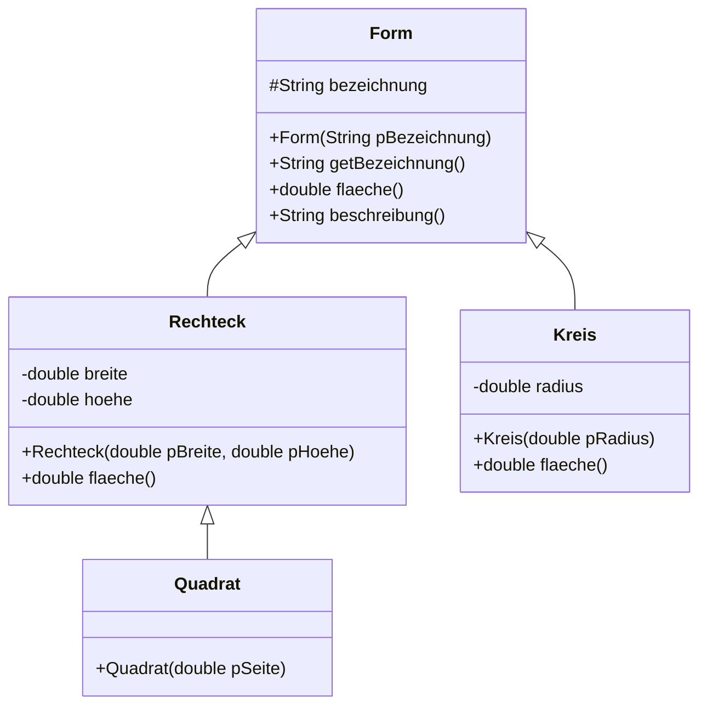

# Polymorphie

Am Ende der Einführungsphase hast du eine Zusatzaufgabe bekommen: Ein Feld vom Typ `Konto[]` aufnehmen zu lassen, und dann `hebeAb(100)` auf allen Konten aufzurufen. Bei den Girokonten klappte es bis zum Dispolimit, bei den Sparkonten nur bis zum Guthaben.

Woher weiß Java zur Laufzeit, welche der beiden Methoden es nehmen muss? Die Antwort heißt **Polymorphie** – Vielgestaltigkeit.

<!-- KLP QPh, Daten und ihre Strukturierung: Vererbungsbeziehungen im Zusammenhang von Generalisierung, Spezialisierung, Polymorphie und abstrakten Klassen -->

## Generalisierung und Spezialisierung

:::snippet{#merken}
Eine Vererbungsbeziehung lässt sich aus zwei Richtungen lesen:

- Von unten nach oben ist es eine **Generalisierung**: Man erkennt, was mehrere Klassen gemeinsam haben, und zieht es in eine Oberklasse. Aus `Girokonto` und `Sparkonto` wird `Konto`.
- Von oben nach unten ist es eine **Spezialisierung**: Man nimmt eine allgemeine Klasse und ergänzt Besonderheiten. Aus `Konto` wird `Girokonto` mit einem Dispolimit.

Beides beschreibt dieselbe Beziehung. Welche Richtung du gehst, hängt davon ab, wie du zu deinem Entwurf kommst.
:::

## Ein Objekt, zwei Typen

:::onlineide{height="700px" speed="1000000"}

```java Main.java
void main() {
    Konto[] konten = new Konto[3];
    konten[0] = new Konto("Ada");
    konten[1] = new Girokonto("Alan", 500.0);
    konten[2] = new Sparkonto("Grace", 0.02);

    for (int i = 0; i < konten.length; i++) {
        konten[i].zahleEin(100.0);
    }

    IO.println("Alle heben 400 Euro ab:");
    for (int i = 0; i < konten.length; i++) {
        boolean geklappt = konten[i].hebeAb(400.0);
        IO.println("  " + konten[i].getBesitzer() + ": " + geklappt
                   + ", Stand " + konten[i].getKontostand());
    }
}
```

```java Konto.java
public class Konto {

    protected String besitzer;
    protected double kontostand;

    public Konto(String pBesitzer) {
        besitzer = pBesitzer;
        kontostand = 0.0;
    }

    public String getBesitzer() {
        return besitzer;
    }

    public double getKontostand() {
        return kontostand;
    }

    public void zahleEin(double pBetrag) {
        if (pBetrag > 0) {
            kontostand = kontostand + pBetrag;
        }
    }

    /** Hebt ab, wenn der Betrag positiv ist und Deckung besteht. */
    public boolean hebeAb(double pBetrag) {
        if (pBetrag > 0 && pBetrag <= kontostand) {
            kontostand = kontostand - pBetrag;
            return true;
        }
        return false;
    }
}
```

```java Girokonto.java
public class Girokonto extends Konto {

    private double dispolimit;

    public Girokonto(String pBesitzer, double pDispolimit) {
        super(pBesitzer);
        dispolimit = pDispolimit;
    }

    /** Hebt ab, das Konto darf bis zum Dispolimit ins Minus. */
    public boolean hebeAb(double pBetrag) {
        if (pBetrag > 0 && pBetrag <= kontostand + dispolimit) {
            kontostand = kontostand - pBetrag;
            return true;
        }
        return false;
    }
}
```

```java Sparkonto.java
public class Sparkonto extends Konto {

    private double zinssatz;

    public Sparkonto(String pBesitzer, double pZinssatz) {
        super(pBesitzer);
        zinssatz = pZinssatz;
    }

    public void schreibeZinsenGut() {
        kontostand = kontostand + kontostand * zinssatz;
    }
}
```

:::

:::snippet{#aufgabe}
Sage die Ausgabe **ohne Rechner** voraus. Erkläre danach für jedes der drei Konten, **welche** Fassung von `hebeAb` ausgeführt wurde.
:::

::::collapsible{title="Auflösung"}

```
  Ada: false, Stand 100.0
  Alan: true, Stand -300.0
  Grace: false, Stand 100.0
```

- **Ada** hat ein `Konto`. Die Fassung aus `Konto` erlaubt nur bis zum Guthaben – 400 sind zu viel.
- **Alan** hat ein `Girokonto`. Die überschriebene Fassung erlaubt bis zum Dispolimit – 400 gehen durch.
- **Grace** hat ein `Sparkonto`. Diese Klasse überschreibt `hebeAb` **nicht**, also gilt die geerbte Fassung aus `Konto`.

::::

:::snippet{#definition}
**Polymorphie:** Eine Variable vom Typ der Oberklasse kann auf Objekte jeder Unterklasse verweisen. Beim Aufruf einer Methode entscheidet nicht der **Typ der Variablen**, sondern der **tatsächliche Typ des Objekts**, welche Fassung ausgeführt wird.

Diese Entscheidung fällt erst zur **Laufzeit**. Man spricht deshalb auch von *dynamischer Bindung* oder *später Bindung*.
:::

## Statischer und dynamischer Typ

:::onlineide{height="560px" speed="1000000"}

```java Main.java
void main() {
    Konto k = new Girokonto("Alan", 500.0);

    k.zahleEin(100.0);
    IO.println("Abheben von 400: " + k.hebeAb(400.0));
    IO.println("Stand: " + k.getKontostand());

    // Die folgende Zeile lässt sich nicht übersetzen.
    // Entferne die Schrägstriche und lies die Fehlermeldung.
    // IO.println(k.getDispolimit());
}
```

```java Konto.java
public class Konto {

    protected String besitzer;
    protected double kontostand;

    public Konto(String pBesitzer) {
        besitzer = pBesitzer;
        kontostand = 0.0;
    }

    public double getKontostand() {
        return kontostand;
    }

    public void zahleEin(double pBetrag) {
        if (pBetrag > 0) {
            kontostand = kontostand + pBetrag;
        }
    }

    public boolean hebeAb(double pBetrag) {
        if (pBetrag > 0 && pBetrag <= kontostand) {
            kontostand = kontostand - pBetrag;
            return true;
        }
        return false;
    }
}
```

```java Girokonto.java
public class Girokonto extends Konto {

    private double dispolimit;

    public Girokonto(String pBesitzer, double pDispolimit) {
        super(pBesitzer);
        dispolimit = pDispolimit;
    }

    public double getDispolimit() {
        return dispolimit;
    }

    public boolean hebeAb(double pBetrag) {
        if (pBetrag > 0 && pBetrag <= kontostand + dispolimit) {
            kontostand = kontostand - pBetrag;
            return true;
        }
        return false;
    }
}
```

:::

:::snippet{#merken}
Die Variable `k` hat zwei Typen:

- Den **statischen Typ** `Konto` – so ist sie deklariert. Er entscheidet, **welche Methoden man aufrufen darf**. Deshalb geht `k.getDispolimit()` nicht: `Konto` kennt diese Methode nicht.
- Den **dynamischen Typ** `Girokonto` – so ist das Objekt tatsächlich beschaffen. Er entscheidet, **welche Fassung ausgeführt wird**. Deshalb greift beim Abheben das Dispolimit.

Kurz: Der statische Typ bestimmt das *Was darf ich?*, der dynamische das *Was passiert?*
:::

:::snippet{#aufgabe}
Entferne im Hauptprogramm die Schrägstriche und lies die Fehlermeldung.

Beschreibe danach, wie man an das Dispolimit trotzdem herankäme – und warum man das nur selten tun sollte.
:::

::::collapsible{title="Auflösung"}

Mit einer **Typumwandlung** nach unten:

```java
Girokonto g = (Girokonto) k;
IO.println(g.getDispolimit());
```

Man sollte das selten tun, weil man damit die Polymorphie gerade aushebelt. Solche Umwandlungen sind außerdem gefährlich: Verweist `k` in Wirklichkeit auf ein `Sparkonto`, bricht das Programm zur Laufzeit ab.

**Faustregel:** Wenn du im Programm anfängst, nach dem konkreten Typ zu fragen und umzuwandeln, stimmt meist der Entwurf nicht. Dann fehlt der Oberklasse eine Methode.

::::

## Der eigentliche Gewinn

:::snippet{#aufgabe}
Angenommen, es kommt eine vierte Kontoart dazu: ein `Festgeldkonto`, von dem gar nicht abgehoben werden darf.

a) Was musst du am Hauptprogramm ändern, das über alle Konten läuft?

b) Was wäre zu ändern gewesen, wenn du das Programm stattdessen mit einer `if`-Kette über die Kontoarten gebaut hättest?
:::

::::collapsible{title="Auflösung"}

a) **Nichts.** Du schreibst die neue Klasse, überschreibst `hebeAb` und legst ein Objekt davon ins Feld. Das Hauptprogramm bleibt unverändert.

b) Bei einer `if`-Kette wie

```java
if (art.equals("giro")) { ... }
else if (art.equals("spar")) { ... }
```

müsstest du **jede** solche Kette im ganzen Programm um einen Fall erweitern. Und wenn du eine übersiehst, merkst du es erst, wenn etwas schiefgeht.

Genau das ist der Gewinn: Polymorphie verlagert die Fallunterscheidung von vielen `if`-Ketten in **eine** Vererbungshierarchie. Neues Verhalten kommt durch eine neue Klasse dazu, nicht durch Änderungen an bestehendem Code.

::::

## Aufgabe: Formen

:::snippet{#aufgabe}
Setze eine Vererbungshierarchie für geometrische Formen um, sodass alle Tests grün werden.

Achte darauf, welche Klassen `flaeche()` überschreiben müssen und welche nicht.
:::



:::onlineide{height="720px" speed="1000000"}

```java Main.java
void main() {
    IO.println("Führe die Tests über den Reiter Testrunner aus.");
}
```

```java Form.java
public class Form {

    protected String bezeichnung;

    public Form(String pBezeichnung) {
        bezeichnung = pBezeichnung;
    }

    public String getBezeichnung() {
        return bezeichnung;
    }

    /** Liefert den Flächeninhalt. Eine allgemeine Form hat keinen. */
    public double flaeche() {
        return 0.0;
    }

    /** Liefert eine Beschreibung mit Bezeichnung und Flächeninhalt. */
    public String beschreibung() {
        return bezeichnung + " mit Fläche " + flaeche();
    }
}
```

```java Rechteck.java
public class Rechteck extends Form {

    private double breite;
    private double hoehe;

    public Rechteck(double pBreite, double pHoehe) {
        super("Rechteck");
        // Dein Code hier
    }

    public double flaeche() {
        return 0.0; // ersetze diese Zeile
    }
}
```

```java Quadrat.java
public class Quadrat extends Rechteck {

    public Quadrat(double pSeite) {
        super(pSeite, pSeite);
        // Dein Code hier: die Bezeichnung soll Quadrat lauten
    }
}
```

```java Kreis.java
public class Kreis extends Form {

    private double radius;

    public Kreis(double pRadius) {
        super("Kreis");
        // Dein Code hier
    }

    public double flaeche() {
        return 0.0; // ersetze diese Zeile
    }
}
```

```java FormenTest.java
@Test
class FormenTest {

    @Test
    void testFlaechen() {
        assertEquals(12.0, new Rechteck(4.0, 3.0).flaeche(), "4 mal 3 ist 12.");
        assertEquals(25.0, new Quadrat(5.0).flaeche(), "5 mal 5 ist 25.");
        assertEquals(Math.PI * 4, new Kreis(2.0).flaeche(), "Pi mal r zum Quadrat.");
    }

    @Test
    void testBezeichnungen() {
        assertEquals("Rechteck", new Rechteck(4.0, 3.0).getBezeichnung(), "Bezeichnung Rechteck.");
        assertEquals("Quadrat", new Quadrat(5.0).getBezeichnung(), "Bezeichnung Quadrat.");
        assertEquals("Kreis", new Kreis(2.0).getBezeichnung(), "Bezeichnung Kreis.");
    }

    @Test
    void testQuadratErbtFlaeche() {
        Quadrat q = new Quadrat(5.0);
        assertEquals(25.0, q.flaeche(),
                     "Das Quadrat braucht keine eigene Flächenmethode.");
    }

    @Test
    void testPolymorphie() {
        Form[] formen = new Form[3];
        formen[0] = new Rechteck(4.0, 3.0);
        formen[1] = new Quadrat(5.0);
        formen[2] = new Kreis(2.0);

        double summe = 0.0;
        for (int i = 0; i < formen.length; i++) {
            summe = summe + formen[i].flaeche();
        }
        assertEquals(12.0 + 25.0 + Math.PI * 4, summe,
                     "Über das Feld summiert kommt die Gesamtfläche heraus.");
    }

    @Test
    void testBeschreibung() {
        Form f = new Quadrat(5.0);
        assertEquals("Quadrat mit Fläche 25.0", f.beschreibung(),
                     "Die geerbte Beschreibung nutzt die überschriebene Flächenmethode.");
    }
}
```

:::

::::collapsible{title="Tipp 1: Warum überschreibt Quadrat die Flächenmethode nicht?"}

Weil ein Quadrat ein Rechteck mit gleichen Seiten **ist**. Der Konstruktor gibt die Seitenlänge zweimal an `Rechteck` weiter – damit stimmt die geerbte Rechnung bereits.

Das ist Spezialisierung in Reinform: Nur das Besondere wird ergänzt, hier die Bezeichnung.

::::

::::collapsible{title="Tipp 2: Die Bezeichnung im Quadrat ändern"}

`bezeichnung` ist in `Form` als `protected` deklariert. Eine Unterklasse darf also direkt darauf schreiben:

```java
bezeichnung = "Quadrat";
```

Das muss **nach** dem `super(...)`-Aufruf stehen – vorher gibt es das Attribut noch nicht.

::::

::::collapsible{title="Tipp 3: Der letzte Test"}

`beschreibung()` steht nur in `Form` und wird nirgends überschrieben. Trotzdem gibt sie beim Quadrat 25.0 aus.

Warum? Weil sie intern `flaeche()` aufruft – und dieser Aufruf wird **dynamisch gebunden**. Auch aus einer geerbten Methode heraus greift die Fassung des tatsächlichen Objekts.

::::

:::protect{password="java-q-1-2-1" description="Lösung. Erfrage das Passwort bei deiner Lehrkraft."}

```java Rechteck.java
public class Rechteck extends Form {

    private double breite;
    private double hoehe;

    public Rechteck(double pBreite, double pHoehe) {
        super("Rechteck");
        breite = pBreite;
        hoehe = pHoehe;
    }

    public double flaeche() {
        return breite * hoehe;
    }
}
```

```java Quadrat.java
public class Quadrat extends Rechteck {

    public Quadrat(double pSeite) {
        super(pSeite, pSeite);
        bezeichnung = "Quadrat";
    }
}
```

```java Kreis.java
public class Kreis extends Form {

    private double radius;

    public Kreis(double pRadius) {
        super("Kreis");
        radius = pRadius;
    }

    public double flaeche() {
        return Math.PI * radius * radius;
    }
}
```

Die Klasse `Quadrat` besteht aus **drei Zeilen** – und kann trotzdem alles, was ein Rechteck kann. Das ist der Punkt.

:::

## Zusatzaufgabe

:::snippet{#brain}
Die Klasse `Form` hat eine Schwachstelle: `flaeche()` liefert dort 0.0. Das ist eine Notlüge – eine „allgemeine Form“ hat gar keinen sinnvollen Flächeninhalt.

a) Schreibe ein Programm, das `new Form("irgendwas")` erzeugt und die Fläche ausgibt. Ist das Ergebnis sinnvoll?

b) Welches Problem entsteht, wenn jemand vergisst, `flaeche()` in einer neuen Unterklasse zu überschreiben?

c) Wie müsste man `Form` gestalten, damit man sie gar nicht erst erzeugen kann und das Überschreiben erzwungen wird?

Die Antwort auf c) ist das Thema der nächsten Lektion.
:::

---

## Selbsttest

::::multievent

**1. Was entscheidet zur Laufzeit, welche Fassung einer überschriebenen Methode ausgeführt wird?**

{r1{der Typ der Variablen}}

{r1{!der tatsächliche Typ des Objekts}}

{r1{die Reihenfolge im Quelltext}}

{h{Beim Girokonto griff das Dispolimit, obwohl die Variable vom Typ Konto war.}}
{H{Richtig! Das nennt man dynamische Bindung.}}

**2. Was entscheidet, welche Methoden man überhaupt aufrufen darf?**

{r2{!der Typ der Variablen}}

{r2{der tatsächliche Typ des Objekts}}

{r2{die Sichtbarkeit}}

{h{Der Aufruf der Dispolimit-Methode ließ sich gar nicht erst übersetzen.}}
{H{Richtig! Das ist der statische Typ.}}

**3. Wie liest man eine Vererbungsbeziehung von unten nach oben?**

{r3{als Spezialisierung}}

{r3{!als Generalisierung}}

{r3{als Assoziation}}

{h{Man zieht das Gemeinsame nach oben.}}
{H{Richtig! Von oben nach unten ist es Spezialisierung.}}

**4. Welche Vorteile bringt Polymorphie?** (Mehrfachauswahl)

{c1{!Eine neue Unterklasse erfordert keine Änderung am bestehenden Code.}}

{c1{!Fallunterscheidungen verlagern sich von if-Ketten in die Vererbungshierarchie.}}

{c1{!Ein Feld der Oberklasse kann Objekte aller Unterklassen aufnehmen.}}

{c1{Alle Objekte verhalten sich gleich.}}

{h{Gerade das Gegenteil ist der Fall - sie verhalten sich unterschiedlich, ohne dass der Aufrufer es wissen muss.}}
{H{Richtig!}}

**5. Was ist ein Warnzeichen für einen schlechten Entwurf?**

{r4{dass eine Unterklasse eine Methode überschreibt}}

{r4{!dass man im Programm nach dem konkreten Typ fragt und umwandelt}}

{r4{dass eine Oberklasse protected-Attribute hat}}

{h{Damit hebelt man die Polymorphie gerade wieder aus.}}
{H{Richtig! Meist fehlt der Oberklasse dann eine Methode.}}

::::
