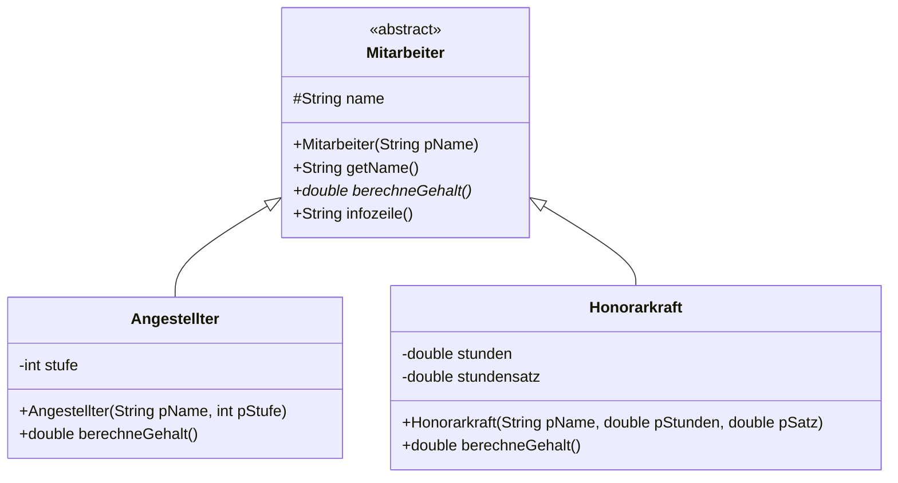

# Abstrakte Klassen

Die Klasse `Form` aus der letzten Lektion hatte ein Problem: `flaeche()` lieferte 0.0. Das ist keine Antwort, sondern eine Notlüge – eine „allgemeine Form“ hat schlicht keinen Flächeninhalt.

Schlimmer noch: Wer eine neue Unterklasse schreibt und das Überschreiben vergisst, bekommt keinen Fehler, sondern lautlos falsche Ergebnisse.

<!-- KLP QPh, Daten und ihre Strukturierung: Vererbungsbeziehungen im Zusammenhang von Generalisierung, Spezialisierung, Polymorphie und abstrakten Klassen -->

## Die Lösung

:::snippet{#definition}
Eine **abstrakte Klasse** kann nicht instanziiert werden – man kann kein Objekt von ihr erzeugen. Sie dient nur als gemeinsame Oberklasse.

Eine **abstrakte Methode** hat keinen Rumpf. Sie legt nur die Signatur fest und verpflichtet jede nicht-abstrakte Unterklasse, sie zu überschreiben.
:::

:::onlineide{height="700px" speed="1000000"}

```java Main.java
void main() {
    Form[] formen = new Form[3];
    formen[0] = new Rechteck(4.0, 3.0);
    formen[1] = new Quadrat(5.0);
    formen[2] = new Kreis(2.0);

    double summe = 0.0;
    for (int i = 0; i < formen.length; i++) {
        IO.println(formen[i].beschreibung());
        summe = summe + formen[i].flaeche();
    }
    IO.println("Gesamtfläche: " + summe);

    // Die folgende Zeile lässt sich nicht übersetzen.
    // Entferne die Schrägstriche und lies die Fehlermeldung.
    // Form f = new Form("irgendwas");
}
```

```java Form.java
/**
 * Gemeinsame Oberklasse aller geometrischen Formen.
 * Kann selbst nicht erzeugt werden.
 */
public abstract class Form {

    protected String bezeichnung;

    public Form(String pBezeichnung) {
        bezeichnung = pBezeichnung;
    }

    public String getBezeichnung() {
        return bezeichnung;
    }

    /**
     * Liefert den Flächeninhalt.
     * Jede konkrete Form muss diese Methode selbst festlegen.
     */
    public abstract double flaeche();

    /** Liefert eine Beschreibung mit Bezeichnung und Flächeninhalt. */
    public String beschreibung() {
        return bezeichnung + " mit Fläche " + flaeche();
    }
}
```

```java Rechteck.java
public class Rechteck extends Form {

    private double breite;
    private double hoehe;

    public Rechteck(double pBreite, double pHoehe) {
        super("Rechteck");
        breite = pBreite;
        hoehe = pHoehe;
    }

    public double flaeche() {
        return breite * hoehe;
    }
}
```

```java Quadrat.java
public class Quadrat extends Rechteck {

    public Quadrat(double pSeite) {
        super(pSeite, pSeite);
        bezeichnung = "Quadrat";
    }
}
```

```java Kreis.java
public class Kreis extends Form {

    private double radius;

    public Kreis(double pRadius) {
        super("Kreis");
        radius = pRadius;
    }

    public double flaeche() {
        return Math.PI * radius * radius;
    }
}
```

:::

:::snippet{#aufgabe}
a) Entferne im Hauptprogramm die Schrägstriche vor `Form f = new Form("irgendwas");` und lies die Fehlermeldung.

b) Kommentiere in `Rechteck` die Methode `flaeche()` aus. Was meldet die IDE jetzt?

c) Beurteile: Was ist an beiden Fehlermeldungen besser als am Verhalten der nicht-abstrakten Fassung aus der letzten Lektion?
:::

::::collapsible{title="Auflösung"}

a) Die IDE lehnt es ab, ein Objekt einer abstrakten Klasse zu erzeugen.

b) Die IDE verlangt, dass `Rechteck` die abstrakte Methode `flaeche()` implementiert – sonst müsste `Rechteck` selbst als `abstract` gekennzeichnet werden.

c) Beide Fehler treten schon beim **Übersetzen** auf, nicht erst zur Laufzeit. In der alten Fassung hätte eine vergessene `flaeche()`-Methode lautlos 0.0 geliefert – und die Gesamtfläche wäre falsch gewesen, ohne dass irgendetwas darauf hinweist.

Ein Fehler, den die Sprache dir abnimmt, ist ein Fehler, den du nicht suchen musst.

::::

:::snippet{#merken}
| | abstrakte Klasse | normale Klasse |
| --- | --- | --- |
| Objekte erzeugbar? | nein | ja |
| darf abstrakte Methoden haben? | ja | nein |
| darf normale Methoden haben? | ja | ja |
| darf Attribute und Konstruktoren haben? | ja | ja |

Im Diagramm wird der Name einer abstrakten Klasse und einer abstrakten Methode *kursiv* geschrieben.

**Der Konstruktor bleibt sinnvoll**, obwohl man keine Objekte erzeugen kann: Die Unterklassen rufen ihn mit `super(...)` auf.
:::

## Wann abstrakt, wann konkret?

:::snippet{#aufgabe}
Entscheide für jede Klasse, ob sie abstrakt sein sollte. Begründe mit der Frage: *Kann es davon ein sinnvolles einzelnes Objekt geben?*

a) `Fahrzeug` mit Unterklassen `Auto`, `Fahrrad`, `LKW`

b) `Rechteck` mit Unterklasse `Quadrat`

c) `Mitarbeiter` mit Unterklassen `Angestellter`, `Honorarkraft`

d) `Konto` mit Unterklassen `Girokonto`, `Sparkonto`
:::

::::collapsible{title="Auflösung"}

a) **abstrakt.** Es gibt kein Fahrzeug, das kein Auto, Fahrrad oder LKW ist.

b) **konkret.** Ein Rechteck ist ein vollwertiges Objekt für sich – nicht jedes Rechteck ist ein Quadrat.

c) **abstrakt.** Jede Person in einer Firma ist entweder angestellt oder Honorarkraft. „Mitarbeiter“ allein legt kein Gehalt fest.

d) **Das ist Auslegungssache.** Wer ein einfaches Guthabenkonto ohne Sonderregeln anbieten will, macht `Konto` konkret. Wer möchte, dass jedes Konto eine der beiden Sorten ist, macht es abstrakt.

Solche Entscheidungen zu begründen ist genau das, was mit *objektorientierte Modellierungen beurteilen* gemeint ist.

::::

## Aufgabe 1: Die Firma

:::snippet{#aufgabe}
Eine Firma beschäftigt **Angestellte** (festes Monatsgehalt nach Gehaltsstufe) und **Honorarkräfte** (Stundenlohn mal geleistete Stunden).

Setze die Hierarchie so um, dass alle Tests grün werden.
:::



:::onlineide{height="740px" speed="1000000"}

```java Main.java
void main() {
    IO.println("Führe die Tests über den Reiter Testrunner aus.");
}
```

```java Mitarbeiter.java
/**
 * Gemeinsame Oberklasse aller Beschäftigten einer Firma.
 */
public abstract class Mitarbeiter {

    protected String name;

    public Mitarbeiter(String pName) {
        name = pName;
    }

    public String getName() {
        return name;
    }

    /**
     * Liefert das Monatsgehalt in Euro.
     * Jede Beschäftigungsart rechnet anders.
     */
    public abstract double berechneGehalt();

    /** Liefert eine Zeile mit Name und Gehalt. */
    public String infozeile() {
        return name + ": " + berechneGehalt() + " Euro";
    }
}
```

```java Angestellter.java
public class Angestellter extends Mitarbeiter {

    private int stufe;

    /**
     * Erzeugt eine angestellte Person.
     * Das Gehalt beträgt Stufe mal 1000 Euro.
     */
    public Angestellter(String pName, int pStufe) {
        super(pName);
        // Dein Code hier
    }

    public double berechneGehalt() {
        return 0.0; // ersetze diese Zeile
    }
}
```

```java Honorarkraft.java
public class Honorarkraft extends Mitarbeiter {

    private double stunden;
    private double stundensatz;

    public Honorarkraft(String pName, double pStunden, double pSatz) {
        super(pName);
        // Dein Code hier
    }

    public double berechneGehalt() {
        return 0.0; // ersetze diese Zeile
    }
}
```

```java Firma.java
public class Firma {

    private Mitarbeiter[] team;
    private int anzahl;

    public Firma(int pMaxGroesse) {
        team = new Mitarbeiter[pMaxGroesse];
        anzahl = 0;
    }

    /** Stellt eine Person ein, wenn noch Platz ist. */
    public boolean stelleEin(Mitarbeiter pPerson) {
        return false; // ersetze diese Zeile
    }

    /** Liefert die Summe aller Monatsgehälter. */
    public double gehaltssumme() {
        return 0.0; // ersetze diese Zeile
    }

    /** Liefert den Namen der Person mit dem höchsten Gehalt, sonst leer. */
    public String bestbezahlt() {
        return ""; // ersetze diese Zeile
    }
}
```

```java FirmaTest.java
@Test
class FirmaTest {

    @Test
    void testAngestellter() {
        Angestellter a = new Angestellter("Ada", 4);
        assertEquals(4000.0, a.berechneGehalt(), "Stufe 4 ergibt 4000 Euro.");
        assertEquals("Ada", a.getName(), "Der Name wird geerbt.");
    }

    @Test
    void testHonorarkraft() {
        Honorarkraft h = new Honorarkraft("Alan", 20.0, 50.0);
        assertEquals(1000.0, h.berechneGehalt(), "20 Stunden zu 50 Euro sind 1000 Euro.");
    }

    @Test
    void testInfozeileNutztUeberschriebeneMethode() {
        Mitarbeiter m = new Angestellter("Grace", 5);
        assertEquals("Grace: 5000.0 Euro", m.infozeile(),
                     "Die geerbte Infozeile nutzt die überschriebene Gehaltsmethode.");
    }

    @Test
    void testGehaltssumme() {
        Firma f = new Firma(5);
        f.stelleEin(new Angestellter("Ada", 4));
        f.stelleEin(new Honorarkraft("Alan", 20.0, 50.0));
        f.stelleEin(new Angestellter("Grace", 5));
        assertEquals(10000.0, f.gehaltssumme(), "4000 plus 1000 plus 5000 sind 10000.");
    }

    @Test
    void testLeereFirma() {
        Firma f = new Firma(3);
        assertEquals(0.0, f.gehaltssumme(), "Ohne Personal ist die Summe 0.");
        assertEquals("", f.bestbezahlt(), "Ohne Personal gibt es keine bestbezahlte Person.");
    }

    @Test
    void testBestbezahlt() {
        Firma f = new Firma(5);
        f.stelleEin(new Angestellter("Ada", 4));
        f.stelleEin(new Honorarkraft("Alan", 20.0, 50.0));
        f.stelleEin(new Angestellter("Grace", 5));
        assertEquals("Grace", f.bestbezahlt(), "Grace verdient am meisten.");
    }

    @Test
    void testVollBesetzt() {
        Firma f = new Firma(2);
        assertTrue(f.stelleEin(new Angestellter("Ada", 4)), "Die erste passt.");
        assertTrue(f.stelleEin(new Angestellter("Alan", 3)), "Die zweite auch.");
        assertFalse(f.stelleEin(new Angestellter("Grace", 5)), "Die dritte nicht mehr.");
    }
}
```

:::

::::collapsible{title="Tipp 1: Warum kann das Feld beide Sorten aufnehmen?"}

Weil beide **Mitarbeiter sind**. Ein `Mitarbeiter[]` nimmt jedes Objekt auf, dessen Klasse von `Mitarbeiter` erbt.

Und beim Aufruf `team[i].berechneGehalt()` greift die dynamische Bindung: Bei einer Angestellten rechnet Java mit der Gehaltsstufe, bei einer Honorarkraft mit den Stunden. Die Klasse `Firma` muss die beiden Sorten überhaupt nicht kennen.

::::

::::collapsible{title="Tipp 2: bestbezahlt"}

Das Muster aus der Einführungsphase: Merke dir den **Index** der bisher bestbezahlten Person, nicht den Betrag – sonst kommst du am Ende nicht an den Namen.

Und denk an den Sonderfall `anzahl == 0`.

::::

:::protect{password="java-q-1-3-1" description="Lösung. Erfrage das Passwort bei deiner Lehrkraft."}

```java Angestellter.java
public class Angestellter extends Mitarbeiter {

    private int stufe;

    public Angestellter(String pName, int pStufe) {
        super(pName);
        stufe = pStufe;
    }

    public double berechneGehalt() {
        return stufe * 1000.0;
    }
}
```

```java Honorarkraft.java
public class Honorarkraft extends Mitarbeiter {

    private double stunden;
    private double stundensatz;

    public Honorarkraft(String pName, double pStunden, double pSatz) {
        super(pName);
        stunden = pStunden;
        stundensatz = pSatz;
    }

    public double berechneGehalt() {
        return stunden * stundensatz;
    }
}
```

```java Firma.java
public class Firma {

    private Mitarbeiter[] team;
    private int anzahl;

    public Firma(int pMaxGroesse) {
        team = new Mitarbeiter[pMaxGroesse];
        anzahl = 0;
    }

    public boolean stelleEin(Mitarbeiter pPerson) {
        if (anzahl < team.length) {
            team[anzahl] = pPerson;
            anzahl++;
            return true;
        }
        return false;
    }

    public double gehaltssumme() {
        double summe = 0.0;
        for (int i = 0; i < anzahl; i++) {
            summe = summe + team[i].berechneGehalt();
        }
        return summe;
    }

    public String bestbezahlt() {
        if (anzahl == 0) {
            return "";
        }
        int bester = 0;
        for (int i = 1; i < anzahl; i++) {
            if (team[i].berechneGehalt() > team[bester].berechneGehalt()) {
                bester = i;
            }
        }
        return team[bester].getName();
    }
}
```

Beachte, dass in `Firma` **kein einziges Mal** `Angestellter` oder `Honorarkraft` vorkommt. Käme morgen eine dritte Beschäftigungsart dazu, müsste an dieser Klasse nichts geändert werden.

:::

## Aufgabe 2: Die Eisdiele

:::snippet{#aufgabe}
Eine Eisdiele verkauft zwei Sorten von Bechern:

- **Standardbecher** zu festen Preisen: klein 6 €, mittel 10 €, groß 15 €.
- **Wunschbecher**, bei denen man die Kugeln selbst wählt: 1,20 € pro Kugel.

a) Modelliere die Hierarchie. Welche Klasse ist abstrakt, welche konkret? Was steht in der Oberklasse?

b) Zeichne das Implementationsdiagramm.

c) Setze es um und schreibe eine Testklasse mit mindestens sechs Testfällen – darunter mindestens zwei Sonderfälle.
:::

:::onlineide{height="600px" speed="1000000"}

```java Main.java
void main() {
    IO.println("Führe die Tests über den Reiter Testrunner aus.");
}
```

```java Eisbecher.java
public abstract class Eisbecher {
    // Dein Entwurf hier
}
```

```java EisbecherTest.java
@Test
class EisbecherTest {
    @Test
    void testPlatzhalter() {
        assertTrue(true, "Ersetze diesen Test durch deine eigenen.");
    }
}
```

:::

::::collapsible{title="Tipp: Was gehört in die Oberklasse?"}

Alles, was für **jeden** Becher gilt: eine Bezeichnung, vielleicht der Name der Sorte, und die abstrakte Methode `preis()`.

Die Frage, aus der man die Antwort ableitet, ist immer dieselbe: *Was ist bei allen gleich, was ist bei jedem anders?* Was anders ist, wird abstrakt.

::::

## Zusatzaufgabe

:::snippet{#brain}
Erinnerst du dich an das Projekt „Unsere kleine Stadt“? Dort gab es die Erweiterungsidee, alle Objekte zwischen Tag und Nacht umzuschalten – und die Frage, wo diese Methode eigentlich hingehört.

Jetzt kannst du sie beantworten.

a) Entwirf eine abstrakte Klasse `Stadtobjekt`, von der `Haus`, `Baum` und `Wolke` erben. Welche Methoden sind abstrakt, welche nicht?

b) Setze es um. Die Stadt soll in einer Schleife über ein `Stadtobjekt[]` laufen und alle auf Nacht umschalten.

c) Beurteile: Wie viele Stellen musst du ändern, wenn eine vierte Objektart dazukommt?
:::

---

## Selbsttest

::::multievent

**1. Was kann man mit einer abstrakten Klasse nicht?**

{r1{von ihr erben}}

{r1{!ein Objekt von ihr erzeugen}}

{r1{ihr Attribute geben}}

{h{Sie dient nur als gemeinsame Oberklasse.}}
{H{Richtig! Erben, Attribute und sogar Konstruktoren sind erlaubt.}}

**2. Was hat eine abstrakte Methode nicht?**

{r2{einen Namen}}

{r2{Parameter}}

{r2{!einen Rumpf}}

{h{Sie legt nur fest, dass es die Methode geben muss.}}
{H{Richtig!}}

**3. Was passiert, wenn eine Unterklasse eine abstrakte Methode nicht überschreibt?**

{r3{sie liefert automatisch null}}

{r3{!die Klasse lässt sich nicht übersetzen, außer sie ist selbst abstrakt}}

{r3{sie wird beim Aufruf übersprungen}}

{h{Genau darin liegt der Vorteil gegenüber einem Rumpf, der 0 zurückgibt.}}
{H{Richtig! Der Fehler wird schon beim Übersetzen gefunden.}}

**4. Welche Frage hilft bei der Entscheidung, ob eine Klasse abstrakt sein sollte?**

{r4{Hat sie viele Unterklassen?}}

{r4{!Kann es davon ein sinnvolles einzelnes Objekt geben?}}

{r4{Hat sie mehr als drei Methoden?}}

{h{Ein Fahrzeug, das kein Auto, Fahrrad oder LKW ist, gibt es nicht.}}
{H{Richtig!}}

**5. Warum kommt in der Klasse Firma weder Angestellter noch Honorarkraft vor?** (Mehrfachauswahl)

{c1{!weil das Feld vom Typ der abstrakten Oberklasse ist}}

{c1{!weil die dynamische Bindung die richtige Gehaltsrechnung auswählt}}

{c1{!weil eine neue Beschäftigungsart deshalb keine Änderung erfordert}}

{c1{weil abstrakte Klassen keine Unterklassen kennen dürfen}}

{h{Das Verbot gibt es nicht - es ist eine Entwurfsentscheidung.}}
{H{Richtig!}}

::::
