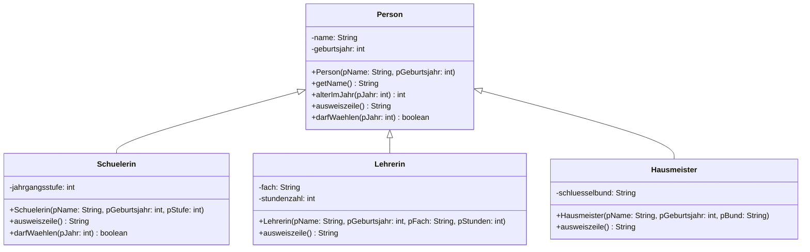

# Generalisierung und Spezialisierung

Eine Mediathek verwaltet Bücher, DVDs und Zeitschriften. Drei Klassen, drei Quelltexte – und in allen dreien stehen dieselben Zeilen für Titel, Signatur und Ausleihe.

Dass das schlecht ist, weißt du seit der Einführungsphase. Die neue Frage lautet nicht *ob* man das zusammenzieht, sondern **was genau** nach oben gehört – und wann eine Vererbung die falsche Antwort ist.

<!-- KLP QPh, Daten und ihre Strukturierung: Vererbungsbeziehungen im Zusammenhang von Generalisierung, Spezialisierung, Polymorphie und abstrakten Klassen; modellieren objektorientierte Entwuerfe mit Klassen und ihren Beziehungen (M); beurteilen objektorientierte Modellierungen (A). Diese Lektion traegt den Anforderungsbereich "beurteilen" - hier wird entschieden und begruendet, nicht implementiert. -->

## Zwei Richtungen, eine Beziehung

:::snippet{#merken}
Eine :t[Vererbungsbeziehung]{#vererbung} lässt sich aus zwei Richtungen lesen:

- Von unten nach oben ist es eine **Generalisierung**: Man erkennt, was mehrere Klassen gemeinsam haben, und zieht es in eine Oberklasse. Aus `Buch`, `Dvd` und `Zeitschrift` wird `Medium`.
- Von oben nach unten ist es eine **Spezialisierung**: Man nimmt eine allgemeine Klasse und ergänzt Besonderheiten. Aus `Medium` wird `Dvd` mit einer Spieldauer.

Beides beschreibt **dieselbe** Beziehung im Diagramm – denselben Pfeil. Welche Richtung du gehst, hängt nur davon ab, wie du zu deinem Entwurf kommst: Wer drei fertige Klassen vor sich hat, generalisiert. Wer bei null anfängt, spezialisiert.
:::

## Was gehört nach oben?

Beim Zusammenziehen entstehen drei Sorten von Bestandteilen. Sie werden verschieden behandelt.

:::snippet{#merken}
| Bestandteil | Beispiel | Wohin? |
| --- | --- | --- |
| bei allen **gleich**, gleiche Bedeutung, gleiche Umsetzung | `titel`, `leiheAus()` | in die **Oberklasse** – einmal geschrieben, dreimal geerbt |
| bei allen **vorhanden**, aber jeweils **anders** | `leihdauerInTagen()` | in die Oberklasse **und** in jeder Unterklasse überschrieben |
| nur bei **einer** vorhanden | `seiten`, `minuten` | bleibt **unten** in der Unterklasse |

Die häufigste Verschlimmbesserung ist, alles in die Oberklasse zu ziehen, was in mindestens zwei Klassen vorkommt. Dann bekommt jede Zeitschrift eine Spieldauer, weil DVD und Hörbuch eine haben. Eine Oberklasse ist kein Sammelbecken – sie ist die Antwort auf die Frage: *Was gilt für **jedes** dieser Objekte?*
:::

:::onlineide{height="740px" speed="1000000"}

```java Main.java
void main() {
    Medium[] bestand = new Medium[3];
    bestand[0] = new Buch("Der Prozess", "B-1042", 250);
    bestand[1] = new Dvd("Metropolis", "D-0007", 153);
    bestand[2] = new Zeitschrift("c't", "Z-2026-19", 19);

    for (int i = 0; i < bestand.length; i++) {
        Medium m = bestand[i];
        IO.println(m.getSignatur() + "  " + m.getTitel()
                   + "  Leihdauer: " + m.leihdauerInTagen() + " Tage");
    }

    IO.println("Ausleihen von B-1042: " + bestand[0].leiheAus());
    IO.println("Noch einmal:          " + bestand[0].leiheAus());
}
```

```java Medium.java
/**
 * Gemeinsame Oberklasse aller Medien der Mediathek.
 * Enthält alles, was für jedes Medium gilt.
 */
public class Medium {

    private String titel;
    private String signatur;
    private boolean ausgeliehen;

    public Medium(String pTitel, String pSignatur) {
        titel = pTitel;
        signatur = pSignatur;
        ausgeliehen = false;
    }

    public String getTitel() {
        return titel;
    }

    public String getSignatur() {
        return signatur;
    }

    public boolean istAusgeliehen() {
        return ausgeliehen;
    }

    /** Leiht aus, wenn das Medium da ist. */
    public boolean leiheAus() {
        if (ausgeliehen) {
            return false;
        }
        ausgeliehen = true;
        return true;
    }

    public void gibZurueck() {
        ausgeliehen = false;
    }

    /** Die übliche Leihdauer. Manche Medienarten weichen davon ab. */
    public int leihdauerInTagen() {
        return 28;
    }
}
```

```java Buch.java
public class Buch extends Medium {

    private int seiten;

    public Buch(String pTitel, String pSignatur, int pSeiten) {
        super(pTitel, pSignatur);
        seiten = pSeiten;
    }

    public int getSeiten() {
        return seiten;
    }
}
```

```java Dvd.java
public class Dvd extends Medium {

    private int minuten;

    public Dvd(String pTitel, String pSignatur, int pMinuten) {
        super(pTitel, pSignatur);
        minuten = pMinuten;
    }

    public int getMinuten() {
        return minuten;
    }

    /** DVDs werden nur eine Woche verliehen. */
    public int leihdauerInTagen() {
        return 7;
    }
}
```

```java Zeitschrift.java
public class Zeitschrift extends Medium {

    private int ausgabe;

    public Zeitschrift(String pTitel, String pSignatur, int pAusgabe) {
        super(pTitel, pSignatur);
        ausgabe = pAusgabe;
    }

    public int getAusgabe() {
        return ausgabe;
    }

    /** Zeitschriften nur drei Tage. */
    public int leihdauerInTagen() {
        return 3;
    }
}
```

:::

:::snippet{#merken}
Drei Beobachtungen an diesem Entwurf:

1. **`Buch` überschreibt `leihdauerInTagen` nicht.** Was nicht überschrieben wird, wird geerbt – und die geerbten 28 Tage sind für Bücher genau richtig. Nichts zu schreiben ist hier die richtige Lösung.
2. **Die Attribute sind `private`**, obwohl es Unterklassen gibt. Die Unterklassen kommen über `getTitel()` heran und brauchen keinen direkten Zugriff.
3. **`Medium[] bestand`** nimmt alle drei Sorten auf, und die Schleife behandelt sie gleich – obwohl `leihdauerInTagen()` bei jedem etwas anderes tut. Warum das funktioniert, ist das Thema der nächsten Lektion.
:::

## Der „ist ein"-Test

Nicht jede Gemeinsamkeit rechtfertigt eine Vererbung. Der Test dafür passt in einen Satz.

:::snippet{#definition}
Eine Vererbung `B extends A` ist nur dann richtig, wenn der Satz **„jedes B ist ein A"** stimmt – und zwar so, dass ein `B` **überall** stehen darf, wo ein `A` erwartet wird.

Stimmt stattdessen **„ein B hat ein A"**, gehört dorthin keine Vererbung, sondern eine **Assoziation**: ein Attribut vom Typ `A`.
:::

:::snippet{#merken}
| Satz | Beziehung | im Quelltext |
| --- | --- | --- |
| Eine DVD **ist ein** Medium. | Vererbung | `class Dvd extends Medium` |
| Ein Auto **hat einen** Motor. | Assoziation | `private Motor motor;` |
| Ein Kreis **hat einen** Mittelpunkt. | Assoziation | `private Punkt mittelpunkt;` |

Der häufigste Fehler ist, Vererbung als Abkürzung zum Wiederverwenden zu benutzen: „Ein Stapel braucht ein Feld, also `class Stapel extends Feld`." Der Satz „ein Stapel **ist ein** Feld" stimmt aber nicht – und die Folge ist, dass jeder von außen an jeder Stelle des Stapels herumfummeln darf. Man erbt eben nicht nur die nützlichen Methoden, sondern **alle**.
:::

## Wie weit macht man auf?

Wer eine Oberklasse baut, entscheidet noch etwas: Ob die Unterklassen an die Attribute herandürfen.

:::snippet{#merken}
| | `private` | `protected` |
| --- | --- | --- |
| Unterklasse kommt direkt heran | nein | ja |
| Oberklasse kann die Speicherung später ändern | ja, ohne Rückfrage | nur, wenn keine Unterklasse mitschreibt |
| Regeln der Oberklasse gelten weiterhin | ja | **nein** – die Unterklasse kann sie umgehen |

**Faustregel: im Zweifel `private`.** `protected` gibt man nur dann, wenn eine Unterklasse den Wert wirklich braucht und ein Getter nicht reicht. Jedes `protected` ist ein Versprechen an alle künftigen Unterklassen – und Versprechen kann man schlecht zurücknehmen.
:::

---

## Teil 1: Lesen

### Aufgabe 1: Sechs Vorschläge beurteilen

:::snippet{#aufgabe}
*Ohne Rechner.* Entscheide für jeden Vorschlag: **Vererbung**, **Assoziation** oder **gar keine Beziehung**? Prüfe mit dem „ist ein"-Satz und schreib ihn jedes Mal auf.
:::

a) `class Sparkonto extends Konto`

b) `class Auto extends Motor`

c) `class Kreis extends Punkt` – ein Kreis hat einen Mittelpunkt

d) `class Lehrerin extends Person`

e) `class Stapel extends Feld` – ein Stapel speichert seine Elemente in einem Feld

f) `class Quadrat extends Rechteck`

::::collapsible{title="Tipp: die Gegenprobe"}

Der „ist ein"-Satz allein reicht nicht immer. Mach die Gegenprobe: Nimm **eine Methode der Oberklasse** und frag, ob sie bei der Unterklasse noch sinnvoll ist.

Bei e) etwa: Ein Feld erlaubt den Zugriff auf jede Stelle. Ein Stapel soll genau das verbieten.

::::

:::protect{password="java-q-1-3-1" description="Lösung. Erfrage das Passwort bei deiner Lehrkraft."}

| | Satz | Entscheidung |
| --- | --- | --- |
| a) | „Jedes Sparkonto ist ein Konto." ✔ | **Vererbung.** Alles, was ein Konto kann, kann auch ein Sparkonto. |
| b) | „Jedes Auto ist ein Motor." ✘ | **Assoziation.** Ein Auto *hat* einen Motor: `private Motor motor;` |
| c) | „Jeder Kreis ist ein Punkt." ✘ | **Assoziation.** Ein Kreis *hat* einen Mittelpunkt. |
| d) | „Jede Lehrerin ist eine Person." ✔ | **Vererbung.** |
| e) | „Jeder Stapel ist ein Feld." ✘ | **Assoziation.** Ein Stapel *hat* ein Feld, in dem er seine Elemente ablegt. |
| f) | „Jedes Quadrat ist ein Rechteck." ✔ | **Vererbung** – mit einem Haken, siehe unten. |

Zu e) genauer: Der Satz klingt beim ersten Hinsehen fast plausibel, und die Vererbung spart tatsächlich Tipparbeit. Sie macht aber die Zusage des Stapels kaputt. Ein Stapel verspricht: *Man kommt nur oben heran.* Erbt er von `Feld`, erbt er auch `gibElementAn(5)` – und jeder Aufrufer darf mitten hineingreifen. Die Klasse kann ihr eigenes Versprechen nicht mehr halten.

Das ist die allgemeine Lehre: **Vererbung erbt alles.** Wer nur eine Umsetzung wiederverwenden will, nimmt ein Attribut, keine Oberklasse.

Zu f): Der Satz stimmt in der Mathematik. Ob er auch im Programm trägt, hängt daran, was `Rechteck` alles anbietet – siehe **Vertiefung 1** am Ende dieser Lektion.

:::

### Aufgabe 2: Was gehört nach oben?

:::snippet{#aufgabe}
*Ohne Rechner.* Eine Schule verwaltet drei Personengruppen. Hier stehen sie – mit allen Wiederholungen.

Entscheide für **jedes** Attribut und **jede** Methode, wohin es gehört: in die Oberklasse `Person`, in die Oberklasse **und** überschrieben, oder unten in der jeweiligen Klasse. Zeichne anschließend das Implementationsdiagramm der aufgeräumten Hierarchie.
:::

```java
public class Schuelerin {
    private String name;
    private int geburtsjahr;
    private int jahrgangsstufe;

    public String getName() { return name; }
    public int alterImJahr(int pJahr) { return pJahr - geburtsjahr; }
    public String ausweiszeile() { return name + ", Stufe " + jahrgangsstufe; }
    public boolean darfWaehlen(int pJahr) { return alterImJahr(pJahr) >= 16; }
}

public class Lehrerin {
    private String name;
    private int geburtsjahr;
    private String fach;
    private int stundenzahl;

    public String getName() { return name; }
    public int alterImJahr(int pJahr) { return pJahr - geburtsjahr; }
    public String ausweiszeile() { return name + ", " + fach; }
    public boolean darfWaehlen(int pJahr) { return true; }
}

public class Hausmeister {
    private String name;
    private int geburtsjahr;
    private String schluesselbund;

    public String getName() { return name; }
    public int alterImJahr(int pJahr) { return pJahr - geburtsjahr; }
    public String ausweiszeile() { return name + " (Hausdienst)"; }
    public boolean darfWaehlen(int pJahr) { return true; }
}
```

::::collapsible{title="Tipp: drei Fragen je Bestandteil"}

1. Kommt es in **allen dreien** vor? Wenn nein → bleibt unten.
2. Ist die Umsetzung in allen dreien **gleich**? Wenn ja → nur in die Oberklasse.
3. Kommt es überall vor, ist aber verschieden → Oberklasse **und** überschreiben.

::::

:::protect{password="java-q-1-3-2" description="Lösung. Erfrage das Passwort bei deiner Lehrkraft."}

| Bestandteil | Wohin | Warum |
| --- | --- | --- |
| `name`, `geburtsjahr` | **nur Oberklasse** | in allen dreien identisch |
| `getName()`, `alterImJahr(...)` | **nur Oberklasse** | überall gleich umgesetzt |
| `ausweiszeile()` | **Oberklasse, überall überschrieben** | überall vorhanden, überall anders |
| `darfWaehlen(...)` | **Oberklasse, einmal überschrieben** | zweimal `true`, einmal anders |
| `jahrgangsstufe` | unten in `Schuelerin` | |
| `fach`, `stundenzahl` | unten in `Lehrerin` | |
| `schluesselbund` | unten in `Hausmeister` | |



Zwei Entscheidungen lohnen die Diskussion:

- **`darfWaehlen` steht in der Oberklasse und liefert dort `true`.** Nur `Schuelerin` überschreibt es. Man könnte auch umgekehrt vorgehen und die Altersprüfung nach oben nehmen – dann müssten `Lehrerin` und `Hausmeister` sie überschreiben, also **zwei** statt einer Klasse. Die Fassung, die seltener überschrieben werden muss, gehört nach oben.
- **`ausweiszeile` steht in der Oberklasse, obwohl sie dort in **jeder** Unterklasse überschrieben wird.** Warum überhaupt hinschreiben? Damit man sie über eine `Person`-Variable aufrufen darf. Ohne die Deklarationen in der Oberklasse gäbe es keinen gemeinsamen Typ, über den man alle drei ansprechen kann. Was die Oberklasse dort als Rumpf hinschreiben soll, ist allerdings eine unangenehme Frage – auf sie antwortet [1.5 Abstrakte Klassen](./05-abstrakte-klassen).

:::

---

## Teil 2: Schreiben

### Aufgabe 3: Drei Klassen zusammenziehen

:::snippet{#aufgabe}
Im Programmierbereich stehen drei Klassen mit viel doppeltem Quelltext. Zieh das Gemeinsame in die vorbereitete Oberklasse `Fahrzeug`, bis alle Tests grün sind.

Die Regeln:

- `Fahrzeug` bekommt alles, was für jedes Fahrzeug gilt: Kennzeichen, Kilometerstand, `fahre(...)`.
- `fahre(pKilometer)` erhöht den Kilometerstand, aber nur bei positiver Angabe.
- `maut()` liefert die Maut pro gefahrenem Kilometer in Cent. Sie ist bei jeder Fahrzeugart anders: PKW 10, LKW 30, Motorrad 5.
- `mautSumme()` steht **nur** in `Fahrzeug` und liefert Kilometerstand mal Maut.
- Was nur eine Klasse hat, bleibt dort.
:::

:::onlineide{height="780px" speed="1000000"}

```java Main.java
void main() {
    IO.println("Führe die Tests über den Reiter Testrunner aus.");
}
```

```java Fahrzeug.java
/**
 * Gemeinsame Oberklasse aller Fahrzeuge.
 */
public class Fahrzeug {

    // Ergänze hier die gemeinsamen Attribute.

    public Fahrzeug(String pKennzeichen) {
        // Dein Code hier
    }

    public String getKennzeichen() {
        return ""; // ersetze diese Zeile
    }

    public int getKilometerstand() {
        return 0; // ersetze diese Zeile
    }

    /** Fährt pKilometer weit. Negative Angaben werden ignoriert. */
    public void fahre(int pKilometer) {
        // Dein Code hier
    }

    /** Die Maut in Cent je Kilometer. */
    public int maut() {
        return 0; // ersetze diese Zeile
    }

    /** Die bisher angefallene Maut in Cent. */
    public int mautSumme() {
        return 0; // ersetze diese Zeile
    }
}
```

```java Pkw.java
public class Pkw extends Fahrzeug {

    private int sitzplaetze;

    public Pkw(String pKennzeichen, int pSitzplaetze) {
        super(pKennzeichen);
        sitzplaetze = pSitzplaetze;
    }

    public int getSitzplaetze() {
        return sitzplaetze;
    }
}
```

```java Lkw.java
public class Lkw extends Fahrzeug {

    private int ladegewicht;

    public Lkw(String pKennzeichen, int pLadegewicht) {
        super(pKennzeichen);
        ladegewicht = pLadegewicht;
    }

    public int getLadegewicht() {
        return ladegewicht;
    }

    // Ergänze hier die Maut für LKW.
}
```

```java Motorrad.java
public class Motorrad extends Fahrzeug {

    private boolean beiwagen;

    public Motorrad(String pKennzeichen, boolean pBeiwagen) {
        super(pKennzeichen);
        beiwagen = pBeiwagen;
    }

    public boolean hatBeiwagen() {
        return beiwagen;
    }

    // Ergänze hier die Maut für Motorräder.
}
```

```java FahrzeugTest.java
@Test
class FahrzeugTest {

    @Test
    void testGeerbteAngaben() {
        Pkw p = new Pkw("K-AB 123", 5);
        assertEquals("K-AB 123", p.getKennzeichen(), "Das Kennzeichen wird geerbt.");
        assertEquals(0, p.getKilometerstand(), "Ein neues Fahrzeug hat 0 Kilometer.");
        assertEquals(5, p.getSitzplaetze(), "Die Sitzplätze bleiben beim PKW.");
    }

    @Test
    void testFahren() {
        Lkw l = new Lkw("K-XY 99", 12000);
        l.fahre(120);
        l.fahre(80);
        assertEquals(200, l.getKilometerstand(), "120 und 80 sind 200.");
        l.fahre(-50);
        assertEquals(200, l.getKilometerstand(), "Negative Angaben werden ignoriert.");
    }

    @Test
    void testMautProKilometer() {
        assertEquals(10, new Pkw("K-A 1", 5).maut(), "PKW zahlen 10 Cent.");
        assertEquals(30, new Lkw("K-B 2", 8000).maut(), "LKW zahlen 30 Cent.");
        assertEquals(5, new Motorrad("K-C 3", false).maut(), "Motorräder zahlen 5 Cent.");
    }

    @Test
    void testMautSumme() {
        Lkw l = new Lkw("K-XY 99", 12000);
        l.fahre(100);
        assertEquals(3000, l.mautSumme(), "100 Kilometer zu 30 Cent sind 3000 Cent.");
    }

    @Test
    void testMautSummeStehtNurObenUndRechnetTrotzdemRichtig() {
        Motorrad m = new Motorrad("K-C 3", true);
        m.fahre(40);
        assertEquals(200, m.mautSumme(), "40 Kilometer zu 5 Cent sind 200 Cent.");
    }

    @Test
    void testAlleGleichBehandeln() {
        Fahrzeug[] flotte = new Fahrzeug[3];
        flotte[0] = new Pkw("K-A 1", 5);
        flotte[1] = new Lkw("K-B 2", 8000);
        flotte[2] = new Motorrad("K-C 3", false);

        int summe = 0;
        for (int i = 0; i < flotte.length; i++) {
            flotte[i].fahre(10);
            summe = summe + flotte[i].mautSumme();
        }
        assertEquals(450, summe, "10 mal 10 plus 10 mal 30 plus 10 mal 5 sind 450 Cent.");
    }
}
```

:::

::::collapsible{title="Tipp 1: Was gehört in Fahrzeug?"}

Alles, was in allen drei Klassen gleich aussähe: `kennzeichen`, `kilometerstand`, der Konstruktor, die beiden Getter, `fahre(...)` und `mautSumme()`.

`maut()` gehört **auch** nach oben – aber nur, damit es die Methode gibt. Der Wert dort ist der des PKW, und die beiden anderen Klassen überschreiben ihn.

::::

::::collapsible{title="Tipp 2: mautSumme steht nur oben"}

`mautSumme()` ruft `maut()` auf – und zwar ohne zu wissen, um welches Fahrzeug es sich handelt:

```java
return getKilometerstand() * maut();
```

Beim Motorrad kommen trotzdem 5 Cent heraus. Warum das funktioniert, ist genau das Thema der nächsten Lektion.

::::

::::collapsible{title="Tipp 3: Wie überschreibt man?"}

In der Unterklasse dieselbe Signatur noch einmal hinschreiben, mit einem anderen Rumpf:

```java
public int maut() {
    return 30;
}
```

Kein `extends` in der Methode, kein Schlüsselwort davor – nur derselbe Kopf.

::::

:::protect{password="java-q-1-3-3" description="Lösung. Erfrage das Passwort bei deiner Lehrkraft."}

```java Fahrzeug.java
public class Fahrzeug {

    private String kennzeichen;
    private int kilometerstand;

    public Fahrzeug(String pKennzeichen) {
        kennzeichen = pKennzeichen;
        kilometerstand = 0;
    }

    public String getKennzeichen() {
        return kennzeichen;
    }

    public int getKilometerstand() {
        return kilometerstand;
    }

    /** Fährt pKilometer weit. Negative Angaben werden ignoriert. */
    public void fahre(int pKilometer) {
        if (pKilometer > 0) {
            kilometerstand = kilometerstand + pKilometer;
        }
    }

    /** Die Maut in Cent je Kilometer. */
    public int maut() {
        return 10;
    }

    /** Die bisher angefallene Maut in Cent. */
    public int mautSumme() {
        return kilometerstand * maut();
    }
}
```

```java Lkw.java
    public int maut() {
        return 30;
    }
```

```java Motorrad.java
    public int maut() {
        return 5;
    }
```

`Pkw` bleibt unverändert – die 10 Cent erbt es.

Worauf es ankam:

- **`mautSumme()` steht genau einmal.** Sie ruft `maut()` auf, und welche Fassung das ist, entscheidet sich beim Aufruf am jeweiligen Objekt. Ohne diesen Mechanismus müsste man `mautSumme()` in jede Unterklasse kopieren – und hätte drei Stellen zu pflegen statt einer.
- **Die Attribute sind `private`.** Keine Unterklasse braucht direkten Zugriff; `getKilometerstand()` genügt. Wer hier `protected` schreibt, öffnet ohne Not.
- **Der Konstruktor setzt `kilometerstand = 0`.** Das ist der Startzustand, den jedes Fahrzeug teilt – also gehört er nach oben und nicht in drei Unterklassenkonstruktoren.
- **`Pkw` überschreibt nichts.** Wer trotzdem `public int maut() { return 10; }` hineinschreibt, hat dieselbe Zahl an zwei Stellen stehen. Ändert sich der PKW-Satz, ändert man eine – und übersieht die andere.

:::

---

## Zum Weiterdenken

### Vertiefung 1: Wenn „ist ein" nicht genügt

:::snippet{#brain}
In der Mathematik ist jedes Quadrat ein Rechteck. Der Programmierbereich zeigt, dass daraus **nicht** folgt, dass `Quadrat extends Rechteck` ein guter Entwurf ist.

a) Sag voraus, was die vier Zeilen ausgeben.

b) Führ das Programm aus. Die Methode `richteAus` bekommt ein `Rechteck` und weiß nichts über Quadrate. Warum liefert sie trotzdem zwei verschiedene Ergebnisse?

c) Wer hat den Fehler gemacht – wer `richteAus` geschrieben hat oder wer `Quadrat` geschrieben hat? Begründe.

d) Formuliere die Regel, die hier verletzt wird, als Erweiterung des „ist ein"-Tests. Sie beginnt mit: *Eine Unterklasse darf …*

e) Nenne zwei Entwürfe, die das Problem vermeiden, und beurteile sie.
:::

:::onlineide{height="640px" speed="1000000"}

```java Main.java
void main() {
    Rechteck r = new Rechteck(1, 1);
    Quadrat q = new Quadrat(1);

    IO.println("Rechteck vorher: " + r.flaeche());
    IO.println("Quadrat  vorher: " + q.flaeche());

    richteAus(r);
    richteAus(q);

    IO.println("Rechteck nachher: " + r.flaeche());
    IO.println("Quadrat  nachher: " + q.flaeche());
}

/** Macht aus einem Rechteck eines mit den Seiten 4 und 5. */
void richteAus(Rechteck pRechteck) {
    pRechteck.setBreite(4);
    pRechteck.setHoehe(5);
}
```

```java Rechteck.java
public class Rechteck {

    protected int breite;
    protected int hoehe;

    public Rechteck(int pBreite, int pHoehe) {
        breite = pBreite;
        hoehe = pHoehe;
    }

    public void setBreite(int pBreite) {
        breite = pBreite;
    }

    public void setHoehe(int pHoehe) {
        hoehe = pHoehe;
    }

    public int flaeche() {
        return breite * hoehe;
    }
}
```

```java Quadrat.java
public class Quadrat extends Rechteck {

    public Quadrat(int pSeite) {
        super(pSeite, pSeite);
    }

    /** Ein Quadrat bleibt ein Quadrat: Beide Seiten ändern sich mit. */
    public void setBreite(int pBreite) {
        breite = pBreite;
        hoehe = pBreite;
    }

    /** Ebenso. */
    public void setHoehe(int pHoehe) {
        breite = pHoehe;
        hoehe = pHoehe;
    }
}
```

:::

:::protect{password="java-q-1-3-4" description="Lösung. Erfrage das Passwort bei deiner Lehrkraft."}

a) und b) Ausgegeben wird

```
Rechteck vorher: 1
Quadrat  vorher: 1
Rechteck nachher: 20
Quadrat  nachher: 25
```

`richteAus` setzt erst die Breite auf 4, dann die Höhe auf 5. Beim Quadrat zieht `setHoehe(5)` die Breite auf 5 mit – aus den erwarteten 4 × 5 werden 5 × 5. Die Methode hat nichts falsch gemacht; sie hat nur geglaubt, was der Typ `Rechteck` verspricht.

c) **Wer `Quadrat` geschrieben hat.** `richteAus` darf sich auf die Zusage von `Rechteck` verlassen – „nach `setBreite(4)` und `setHoehe(5)` ist die Fläche 20" –, denn genau dafür gibt es den Typ. `Quadrat` hält diese Zusage nicht ein und ist deshalb kein brauchbares `Rechteck`, obwohl der Satz „ein Quadrat ist ein Rechteck" stimmt.

Das ist der Kern: Es geht nicht darum, ob der Satz in der **Mathematik** stimmt, sondern ob er für **diese Klasse mit diesen Methoden** stimmt. Hätte `Rechteck` keine Setter, gäbe es kein Problem – und genau so war die Klasse in [1.1](./01-implementationsdiagramme) gebaut.

d) *Eine Unterklasse darf das Verhalten der Oberklasse **erweitern**, aber keine Zusage brechen, auf die sich ein Aufrufer verlassen darf, der nur die Oberklasse kennt.*

Diese Regel heißt **Ersetzbarkeitsprinzip** (nach Barbara Liskov): Überall, wo ein Objekt der Oberklasse steht, muss auch ein Objekt der Unterklasse eingesetzt werden können, ohne dass das Programm anders funktioniert als zugesagt.

e) Zwei Entwürfe:

1. **Keine Setter.** `Rechteck` wird unveränderlich: Breite und Höhe werden im Konstruktor gesetzt und danach nicht mehr geändert. Wer ein anderes Rechteck will, erzeugt eins. Dann kann `Quadrat` nichts mehr kaputtmachen. Das ist der saubere Weg und außerdem einer, der viele andere Fehler mit erledigt – der Preis ist, dass man mehr Objekte erzeugt.
2. **Keine Vererbung.** `Quadrat` steht für sich, mit einer einzigen Seitenlänge, und hat mit `Rechteck` nichts zu tun. Kein gemeinsamer Typ, dafür kein gebrochenes Versprechen. Der Preis ist, dass man Quadrate und Rechtecke nicht mehr in einem Feld gemeinsam verarbeiten kann – es sei denn, man führt eine gemeinsame Oberklasse `Form` ein, die nur `flaeche()` verspricht und keine Setter.

Beide sind vertretbar. Nicht vertretbar ist die Fassung im Programmierbereich, weil dort niemand den Fehler sieht, bevor die Zahlen falsch sind.

:::

### Vertiefung 2: Wie tief darf eine Hierarchie sein?

:::snippet{#brain}
Ein Entwurf für ein Rollenspiel sieht so aus:

```
Spielobjekt
└── Lebewesen
    └── Kaempfer
        └── Magier
            └── Feuermagier
                └── Erzfeuermagier
```

a) Nenne drei praktische Nachteile dieser Tiefe. Denk an jemanden, der `Erzfeuermagier` zum ersten Mal liest.

b) Ein `Erzfeuermagier` soll fliegen können – aber auch ein `Drache`, der kein `Kaempfer` ist. Wo baust du das ein?

c) Die Klasse `Kaempfer` hat `protected int lebenspunkte`. Fünf Ebenen tiefer setzt jemand `lebenspunkte = -5;`. Was ist daran schlimm, und was hätte `private` verhindert?

d) Beurteile: Formuliere eine Faustregel, ab wann eine Hierarchie zu tief ist – und was man stattdessen tut.
:::

:::protect{password="java-q-1-3-5" description="Lösung. Erfrage das Passwort bei deiner Lehrkraft."}

a) Drei Nachteile:

- **Man muss sechs Klassen lesen, um eine zu verstehen.** Wo `angriff()` herkommt, steht irgendwo in der Kette – und wenn drei Ebenen es überschreiben, muss man alle drei kennen.
- **Jede Änderung weit oben trifft alles darunter.** Wer in `Lebewesen` eine Methode ergänzt, kann fünf Ebenen tiefer etwas kaputtmachen, ohne es zu merken.
- **Der Entwurf legt sich früh fest.** Kommt ein Wesen dazu, das kämpft, aber nicht lebt (ein Turm, eine Falle), passt es nirgendwo hin – die Kette lässt nur einen Weg zu.

b) **Nicht in die Kette.** „Fliegen können" ist eine **Fähigkeit**, die quer zu dieser Hierarchie liegt: Manche Kämpfer haben sie, manche nicht, und Wesen außerhalb der Kette auch. Genau für solche Fälle gibt es **Schnittstellen** – nachzulesen in [1.6 Schnittstellen](./06-schnittstellen). Wer sie in die Kette einbaut, muss entweder `Kaempfer` das Fliegen beibringen (dann fliegen auch alle Nichtflieger) oder eine zweite Kette daneben aufmachen.

c) Schlimm ist, dass die Klasse `Kaempfer` ihre eigene Regel „Lebenspunkte werden nie negativ" nicht mehr durchsetzen kann. Sie hat mit `protected` die Kontrolle über ihr Attribut abgegeben – und zwar an **alle** Unterklassen, auch an die, die es noch gar nicht gibt. Mit `private` und einer Methode `erleideSchaden(int)` liefe jede Änderung durch **eine** Stelle, an der die Regel steht. Der Fehler wäre dann nicht möglich, statt nur unwahrscheinlich.

d) Eine vertretbare Regel: **Mehr als drei Ebenen sind ein Warnzeichen.** Was darunter läge, ist fast immer nicht eine weitere *Art* von etwas, sondern eine *Eigenschaft* oder eine *Fähigkeit* – und die drückt man besser als Attribut (ein `Magier` mit einem `element`) oder als Schnittstelle (`Fliegend`) aus. Die Frage, die weiterhilft: *Ist das eine eigene Art – oder nur eine besondere Ausprägung?* Nur für eigene Arten baut man eine Ebene.

:::

---

## Selbsttest

::::multievent

**1. Wie liest man eine Vererbungsbeziehung von unten nach oben?**

{r1{als Spezialisierung}}

{r1{!als Generalisierung}}

{r1{als Assoziation}}

{r1{als Instanziierung}}

{h{Man zieht das Gemeinsame nach oben.}}
{H{Richtig! Von oben nach unten ist es Spezialisierung.}}

**2. Ein Attribut kommt nur in einer der drei Unterklassen vor. Wohin gehört es?**

{r2{in die Oberklasse}}

{r2{!in diese eine Unterklasse}}

{r2{in alle drei Unterklassen}}

{h{Eine Oberklasse sagt, was für jedes Objekt gilt.}}
{H{Richtig!}}

**3. Welcher Satz spricht für eine Assoziation statt einer Vererbung?**

{r3{Jedes B ist ein A.}}

{r3{!Ein B hat ein A.}}

{r3{B und A haben denselben Namen.}}

{h{Ein Auto hat einen Motor - es ist keiner.}}
{H{Richtig!}}

**4. Warum ist ein Stapel, der von einem Feld erbt, ein schlechter Entwurf?**

{r4{weil Felder langsamer sind}}

{r4{!weil der Stapel dann auch alle Zugriffe erbt, die er eigentlich verbieten will}}

{r4{weil Java das nicht erlaubt}}

{r4{weil ein Feld keine Methoden hat}}

{h{Vererbung erbt alles, nicht nur das Nützliche.}}
{H{Richtig!}}

**5. Eine Unterklasse überschreibt eine geerbte Methode nicht. Was passiert beim Aufruf?**

{r5{ein Fehler beim Übersetzen}}

{r5{!es läuft die geerbte Fassung der Oberklasse}}

{r5{es passiert nichts}}

{h{Vererbt wird die nächstgelegene Fassung von unten nach oben.}}
{H{Richtig!}}

**6. Warum ist private im Zweifel besser als protected?** (Mehrfachauswahl)

{c1{!Weil die Oberklasse ihre Regeln dann weiterhin durchsetzen kann.}}

{c1{!Weil sich die Speicherung später ohne Rückfrage ändern lässt.}}

{c1{Weil protected in Java nicht erlaubt ist.}}

{c1{Weil private Attribute weniger Speicher brauchen.}}

{h{Zwei Antworten behaupten etwas, das schlicht nicht stimmt.}}
{H{Richtig - protected ist ein Versprechen an alle künftigen Unterklassen.}}

**7. Was besagt das Ersetzbarkeitsprinzip?**

{r6{Jede Klasse muss ersetzbar sein.}}

{r6{!Wo ein Objekt der Oberklasse steht, muss auch eines der Unterklasse eingesetzt werden können, ohne Zusagen zu brechen.}}

{r6{Unterklassen dürfen keine neuen Methoden haben.}}

{r6{Oberklassen dürfen nicht überschrieben werden.}}

{h{Denk an das Quadrat, das die Zusage des Rechtecks bricht.}}
{H{Richtig!}}

::::
