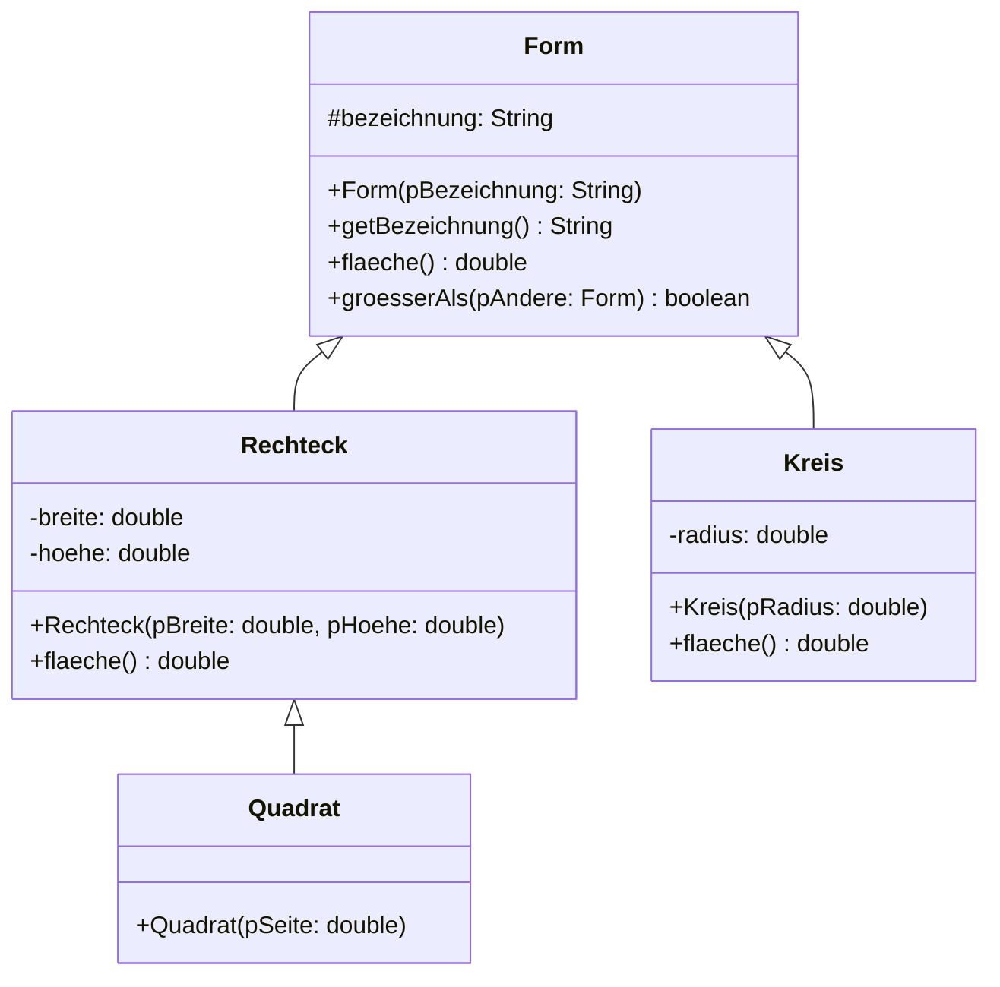

# Polymorphie

In [1.3](./03-generalisierung-und-spezialisierung) hast du `mautSumme()` **einmal** geschrieben – in der Oberklasse `Fahrzeug`. Trotzdem rechnete sie beim Motorrad mit 5 Cent und beim LKW mit 30.

Wie kann das sein? `mautSumme()` steht in `Fahrzeug`, und `Fahrzeug` kennt weder Motorräder noch LKW. Der Mechanismus dahinter hat einen Namen: **Polymorphie** – Vielgestaltigkeit.

<!-- KLP QPh, Daten und ihre Strukturierung: Vererbungsbeziehungen im Zusammenhang von Generalisierung, Spezialisierung, Polymorphie und abstrakten Klassen -->

## Ein Feld, drei Sorten

:::onlineide{height="720px" speed="1000000"}

```java Main.java
void main() {
    Fahrzeug[] flotte = new Fahrzeug[3];
    flotte[0] = new Pkw("K-A 1");
    flotte[1] = new Lkw("K-B 2");
    flotte[2] = new Motorrad("K-C 3");

    int summe = 0;
    for (int i = 0; i < flotte.length; i++) {
        flotte[i].fahre(100);
        IO.println(flotte[i].getKennzeichen() + ": " + flotte[i].mautSumme() + " Cent");
        summe = summe + flotte[i].mautSumme();
    }
    IO.println("Zusammen: " + summe + " Cent");
}
```

```java Fahrzeug.java
public class Fahrzeug {

    private String kennzeichen;
    private int kilometerstand;

    public Fahrzeug(String pKennzeichen) {
        kennzeichen = pKennzeichen;
        kilometerstand = 0;
    }

    public String getKennzeichen() {
        return kennzeichen;
    }

    public void fahre(int pKilometer) {
        if (pKilometer > 0) {
            kilometerstand = kilometerstand + pKilometer;
        }
    }

    /** Die Maut in Cent je Kilometer. */
    public int maut() {
        return 10;
    }

    /** Steht nur hier - und rechnet trotzdem für jedes Fahrzeug richtig. */
    public int mautSumme() {
        return kilometerstand * maut();
    }
}
```

```java Pkw.java
public class Pkw extends Fahrzeug {

    public Pkw(String pKennzeichen) {
        super(pKennzeichen);
    }
}
```

```java Lkw.java
public class Lkw extends Fahrzeug {

    public Lkw(String pKennzeichen) {
        super(pKennzeichen);
    }

    public int maut() {
        return 30;
    }
}
```

```java Motorrad.java
public class Motorrad extends Fahrzeug {

    public Motorrad(String pKennzeichen) {
        super(pKennzeichen);
    }

    public int maut() {
        return 5;
    }
}
```

:::

:::snippet{#definition}
**Polymorphie:** Eine Variable vom Typ der Oberklasse kann auf Objekte jeder Unterklasse verweisen. Beim Aufruf einer überschriebenen Methode entscheidet **nicht** der Typ der Variablen, sondern der **tatsächliche Typ des Objekts**, welche Fassung ausgeführt wird.

Diese Entscheidung fällt erst, wenn das Programm läuft. Man spricht deshalb von **dynamischer Bindung** oder *später Bindung*.
:::

:::snippet{#merken}
Der entscheidende Punkt steckt in `mautSumme()`:

```java
public int mautSumme() {
    return kilometerstand * maut();
}
```

Der Aufruf `maut()` steht in `Fahrzeug`. Ausgeführt wird trotzdem die Fassung des Objekts, an dem `mautSumme()` aufgerufen wurde – beim Motorrad also die 5 Cent.

**Auch aus einer geerbten Methode heraus greift die überschriebene Fassung.** Das ist der Grund, warum man gemeinsame Abläufe genau einmal schreiben kann und trotzdem an den richtigen Stellen etwas Verschiedenes passiert.
:::

## Statischer und dynamischer Typ

Eine Variable hat zwei Typen – und die beiden entscheiden Verschiedenes.

:::onlineide{height="620px" speed="1000000"}

```java Main.java
void main() {
    Fahrzeug f = new Lkw("K-B 2");

    f.fahre(50);
    IO.println("Maut: " + f.mautSumme() + " Cent");

    // Die folgende Zeile lässt sich nicht übersetzen.
    // Entferne die Schrägstriche und lies die Fehlermeldung.
    // IO.println(f.getLadegewicht());

    // So ginge es - mit einer Typumwandlung nach unten.
    Lkw alsLkw = (Lkw) f;
    IO.println("Ladegewicht: " + alsLkw.getLadegewicht());
}
```

```java Fahrzeug.java
public class Fahrzeug {

    private String kennzeichen;
    private int kilometerstand;

    public Fahrzeug(String pKennzeichen) {
        kennzeichen = pKennzeichen;
        kilometerstand = 0;
    }

    public void fahre(int pKilometer) {
        if (pKilometer > 0) {
            kilometerstand = kilometerstand + pKilometer;
        }
    }

    public int maut() {
        return 10;
    }

    public int mautSumme() {
        return kilometerstand * maut();
    }
}
```

```java Lkw.java
public class Lkw extends Fahrzeug {

    private int ladegewicht;

    public Lkw(String pKennzeichen) {
        super(pKennzeichen);
        ladegewicht = 12000;
    }

    public int getLadegewicht() {
        return ladegewicht;
    }

    public int maut() {
        return 30;
    }
}
```

:::

:::snippet{#merken}
Die Variable `f` hat zwei Typen:

| | Typ | entscheidet über |
| --- | --- | --- |
| **statischer Typ** | `Fahrzeug` – so ist sie **deklariert** | welche Methoden man aufrufen **darf** |
| **dynamischer Typ** | `Lkw` – so ist das Objekt **beschaffen** | welche Fassung **ausgeführt** wird |

Deshalb ist `f.getLadegewicht()` ein Übersetzungsfehler: `Fahrzeug` kennt diese Methode nicht. Und deshalb greift beim Rechnen trotzdem die 30-Cent-Fassung.

Kurz: **Der statische Typ bestimmt das *Was darf ich?*, der dynamische das *Was passiert?***
:::

:::alert{warn}
Die **Typumwandlung nach unten** (`(Lkw) f`) ist möglich, aber gefährlich: Verweist `f` in Wirklichkeit auf ein Motorrad, bricht das Programm zur Laufzeit ab. Der Übersetzer kann das nicht prüfen – er sieht nur den statischen Typ.

**Faustregel:** Wenn du im Programm anfängst, nach dem konkreten Typ zu fragen und umzuwandeln, stimmt meist der Entwurf nicht. Dann fehlt der Oberklasse eine Methode.
:::

## Der eigentliche Gewinn

:::snippet{#aufgabe}
**Aufgabe: Eine vierte Fahrzeugart**

Es kommt eine vierte Fahrzeugart dazu: ein `Bus`, der 20 Cent Maut zahlt.

a) Was musst du an der Schleife im Hauptprogramm ändern, die über alle Fahrzeuge läuft?

b) Was wäre zu ändern gewesen, wenn du dasselbe Programm stattdessen mit einer `if`-Kette über eine Zeichenkette `art` gebaut hättest?

c) Nenne einen Fall, in dem du den Fehler aus b) erst Wochen später bemerkst.
:::

::::collapsible{title="Tipp"}

Schreib die `if`-Kette einmal hin:

```java
if (art.equals("pkw")) { ... }
else if (art.equals("lkw")) { ... }
```

Und dann frag dich, wie oft so etwas in einem größeren Programm vorkommt – und was passiert, wenn man eine Stelle übersieht.

::::

:::protect{password="java-q-1-4-1" description="Lösung. Erfrage das Passwort bei deiner Lehrkraft."}

a) **Nichts.** Du schreibst die Klasse `Bus`, überschreibst `maut()` und legst ein Objekt davon ins Feld. Die Schleife bleibt Zeichen für Zeichen dieselbe.

b) Bei einer `if`-Kette müsstest du **jede** solche Kette im ganzen Programm um einen Fall erweitern – und in einem größeren Programm gibt es davon viele: eine beim Rechnen, eine beim Anzeigen, eine beim Speichern.

c) Wenn eine der Ketten einen `else`-Zweig hat, der einen Standardwert liefert. Dann bricht nichts ab – der Bus zahlt nur still 10 Cent statt 20. Auffallen wird das erst, wenn jemand die Zahlen nachrechnet.

**Das ist der Gewinn:** Polymorphie verlagert die Fallunterscheidung aus vielen `if`-Ketten in **eine** Vererbungshierarchie. Neues Verhalten kommt durch eine neue Klasse dazu, nicht durch Änderungen an bestehendem Code. Und was man nicht ändert, kann man auch nicht kaputtmachen.

:::

---

## Teil 1: Lesen

### Aufgabe 1: Welche Fassung läuft?

:::snippet{#aufgabe}
*Ohne Rechner.* Lies die vier Dateien und sag die fünf Ausgabezeilen voraus. Notiere zu jeder Zeile, **aus welcher Klasse** die ausgeführte Methode stammt.
:::

```java Main.java
void main() {
    Alarm[] anlage = new Alarm[4];
    anlage[0] = new Alarm("Flur");
    anlage[1] = new Rauchmelder("Kueche");
    anlage[2] = new Wassermelder("Keller");
    anlage[3] = new Rauchmelder("Bad");

    for (int i = 0; i < anlage.length; i++) {
        IO.println(anlage[i].meldung());
    }

    int summe = 0;
    for (int i = 0; i < anlage.length; i++) {
        summe = summe + anlage[i].lautstaerke();
    }
    IO.println("Summe: " + summe);
}
```

```java Alarm.java
public class Alarm {

    private String ort;

    public Alarm(String pOrt) {
        ort = pOrt;
    }

    public String getOrt() {
        return ort;
    }

    public int lautstaerke() {
        return 60;
    }

    public String meldung() {
        return "Alarm in " + ort + " (" + lautstaerke() + " dB)";
    }
}
```

```java Rauchmelder.java
public class Rauchmelder extends Alarm {

    public Rauchmelder(String pOrt) {
        super(pOrt);
    }

    public int lautstaerke() {
        return 85;
    }
}
```

```java Wassermelder.java
public class Wassermelder extends Alarm {

    public Wassermelder(String pOrt) {
        super(pOrt);
    }

    public String meldung() {
        return "Wasser im " + getOrt() + "!";
    }
}
```

a) Welche fünf Zeilen gibt das Programm aus?

b) `meldung()` steht **nicht** in `Rauchmelder`. Warum erscheint bei der Küche trotzdem 85 dB?

c) Welche `lautstaerke()`-Fassung gilt beim Wassermelder – und warum?

d) Jemand ergänzt eine Klasse `Gasmelder extends Alarm` mit `lautstaerke()` = 100 und legt ein Objekt davon an die Stelle 4 im Feld. Welche Zeilen des Hauptprogramms müssen dafür geändert werden?

Prüf deine Vorhersage erst danach nach.

:::onlineide{height="700px" speed="1000000"}

```java Main.java
void main() {
    Alarm[] anlage = new Alarm[4];
    anlage[0] = new Alarm("Flur");
    anlage[1] = new Rauchmelder("Kueche");
    anlage[2] = new Wassermelder("Keller");
    anlage[3] = new Rauchmelder("Bad");

    for (int i = 0; i < anlage.length; i++) {
        IO.println(anlage[i].meldung());
    }

    int summe = 0;
    for (int i = 0; i < anlage.length; i++) {
        summe = summe + anlage[i].lautstaerke();
    }
    IO.println("Summe: " + summe);
}
```

```java Alarm.java
public class Alarm {

    private String ort;

    public Alarm(String pOrt) {
        ort = pOrt;
    }

    public String getOrt() {
        return ort;
    }

    public int lautstaerke() {
        return 60;
    }

    public String meldung() {
        return "Alarm in " + ort + " (" + lautstaerke() + " dB)";
    }
}
```

```java Rauchmelder.java
public class Rauchmelder extends Alarm {

    public Rauchmelder(String pOrt) {
        super(pOrt);
    }

    public int lautstaerke() {
        return 85;
    }
}
```

```java Wassermelder.java
public class Wassermelder extends Alarm {

    public Wassermelder(String pOrt) {
        super(pOrt);
    }

    public String meldung() {
        return "Wasser im " + getOrt() + "!";
    }
}
```

:::

::::collapsible{title="Tipp zu b)"}

`meldung()` ruft `lautstaerke()` auf. Die Frage ist nicht, in welcher **Klasse die Methode steht**, sondern welches **Objekt** hinter dem Aufruf steckt.

::::

:::protect{password="java-q-1-4-2" description="Lösung. Erfrage das Passwort bei deiner Lehrkraft."}

a)

```
Alarm in Flur (60 dB)
Alarm in Kueche (85 dB)
Wasser im Keller!
Alarm in Bad (85 dB)
Summe: 290
```

| Zeile | ausgeführte Methode | aus |
| --- | --- | --- |
| 1 | `meldung()` → `lautstaerke()` | `Alarm` → `Alarm` |
| 2 | `meldung()` → `lautstaerke()` | `Alarm` → **`Rauchmelder`** |
| 3 | `meldung()` | **`Wassermelder`** |
| 4 | `meldung()` → `lautstaerke()` | `Alarm` → **`Rauchmelder`** |
| 5 | Summe | 60 + 85 + 60 + 85 = 290 |

b) `meldung()` wird von `Rauchmelder` geerbt und ruft `lautstaerke()` auf. Dieser Aufruf wird **dynamisch gebunden**: Er richtet sich nach dem Objekt, an dem `meldung()` aufgerufen wurde – und das ist ein Rauchmelder. Also gilt dessen Fassung mit 85 dB.

Der Aufruf steht in `Alarm`, die ausgeführte Methode steht in `Rauchmelder`. Genau das macht Polymorphie aus.

c) Die geerbte aus `Alarm`, also 60 dB. `Wassermelder` überschreibt nur `meldung()`. **Was nicht überschrieben wird, wird geerbt** – deshalb steht in der Summe für den Keller die 60.

Man sieht es in der Ausgabe nicht, weil die überschriebene `meldung()` die Lautstärke gar nicht erwähnt. Der zweite Durchlauf holt sie trotzdem.

d) **Keine.** Die Schleifen sprechen jedes Element als `Alarm` an; ein Gasmelder ist einer. Nur die Zeile, die das Objekt **erzeugt**, kommt hinzu. Die Summe wäre dann 60 + 85 + 60 + 100 = 305.

:::

### Aufgabe 2: Was darf man aufrufen?

:::snippet{#aufgabe}
*Ohne Rechner.* `Rauchmelder` hat zusätzlich eine Methode `boolean testeBatterie()`, die es in `Alarm` nicht gibt. Gegeben sind drei Variablen:

```java
Alarm a = new Rauchmelder("Kueche");
Rauchmelder r = new Rauchmelder("Bad");
Alarm b = new Alarm("Flur");
```

Entscheide für jede Zeile: **übersetzt sie?** Und wenn ja: **was passiert beim Ausführen?** Begründe jedes Mal mit dem statischen bzw. dem dynamischen Typ.
:::

```java
// 1
IO.println(a.lautstaerke());

// 2
IO.println(a.testeBatterie());

// 3
IO.println(r.meldung());

// 4
Rauchmelder x = a;

// 5
Rauchmelder y = (Rauchmelder) a;
IO.println(y.testeBatterie());

// 6
Alarm c = r;
IO.println(c.lautstaerke());
```

::::collapsible{title="Tipp: zwei Fragen, immer in dieser Reihenfolge"}

1. **Darf ich das?** Diese Frage beantwortet der Übersetzer, und zwar allein am **deklarierten** Typ der Variablen.
2. **Was passiert dann?** Diese Frage beantwortet erst die Laufzeit, und zwar am **tatsächlichen** Objekt.

Frage 2 stellt sich nur, wenn Frage 1 mit ja beantwortet ist.

::::

:::protect{password="java-q-1-4-3" description="Lösung. Erfrage das Passwort bei deiner Lehrkraft."}

| # | übersetzt? | was passiert |
| --- | --- | --- |
| 1 | **ja** | `lautstaerke()` gibt es in `Alarm`, also ist der Aufruf erlaubt. Ausgeführt wird die Fassung des Rauchmelders: **85**. |
| 2 | **nein** | Der statische Typ ist `Alarm`, und `Alarm` kennt `testeBatterie()` nicht. Dass dort tatsächlich ein Rauchmelder liegt, sieht der Übersetzer nicht. |
| 3 | **ja** | Statischer Typ `Rauchmelder`, `meldung()` ist geerbt und damit vorhanden. Ausgeführt wird die geerbte Fassung aus `Alarm`, die intern 85 einsetzt. |
| 4 | **nein** | Zuweisung nach **unten** ohne Umwandlung. Der Übersetzer weiß nur, dass in `a` irgendein `Alarm` liegt – das muss kein Rauchmelder sein. |
| 5 | **ja** | Die Typumwandlung ist die ausdrückliche Zusicherung „ich weiß, dass dort ein Rauchmelder liegt". Hier stimmt sie, also läuft alles. |
| 6 | **ja** | Zuweisung nach **oben** ist immer erlaubt: Jeder Rauchmelder ist ein Alarm. Ausgeführt wird trotzdem **85** – der dynamische Typ hat sich durch die Zuweisung nicht geändert. |

Zwei Dinge zum Mitnehmen:

- Zeile 6 ist der Kern der ganzen Sache: **Eine Zuweisung ändert den Typ der Variablen, nicht den des Objekts.** Man sieht das Objekt danach nur durch eine engere Brille an – es bleibt aber, was es ist.
- Bei Zeile 5 hätte man Glück gehabt. Stünde in `a` ein `Wassermelder`, wäre die Zeile trotzdem übersetzt worden und **zur Laufzeit** abgebrochen. Eine Typumwandlung nach unten verschiebt eine Prüfung vom Übersetzer auf die Laufzeit – und das ist immer die schlechtere von beiden Möglichkeiten.

:::

---

## Teil 2: Schreiben

### Aufgabe 3: Formen

:::snippet{#aufgabe}
Setze die Vererbungshierarchie so um, dass alle Tests grün werden.

Achte darauf, welche Klassen `flaeche()` überschreiben müssen und welche nicht – und schreib keine Methode, die schon richtig geerbt wird.
:::



:::onlineide{height="760px" speed="1000000"}

```java Main.java
void main() {
    IO.println("Führe die Tests über den Reiter Testrunner aus.");
}
```

```java Form.java
public class Form {

    protected String bezeichnung;

    public Form(String pBezeichnung) {
        bezeichnung = pBezeichnung;
    }

    public String getBezeichnung() {
        return bezeichnung;
    }

    /** Liefert den Flächeninhalt. Eine allgemeine Form hat keinen. */
    public double flaeche() {
        return 0.0;
    }

    /** Liefert true, wenn diese Form flächengrößer ist als die andere. */
    public boolean groesserAls(Form pAndere) {
        return flaeche() > pAndere.flaeche();
    }
}
```

```java Rechteck.java
public class Rechteck extends Form {

    private double breite;
    private double hoehe;

    public Rechteck(double pBreite, double pHoehe) {
        super("Rechteck");
        // Dein Code hier
    }

    public double flaeche() {
        return 0.0; // ersetze diese Zeile
    }
}
```

```java Quadrat.java
public class Quadrat extends Rechteck {

    public Quadrat(double pSeite) {
        super(pSeite, pSeite);
        // Dein Code hier: die Bezeichnung soll Quadrat lauten
    }
}
```

```java Kreis.java
public class Kreis extends Form {

    private double radius;

    public Kreis(double pRadius) {
        super("Kreis");
        // Dein Code hier
    }

    public double flaeche() {
        return 0.0; // ersetze diese Zeile
    }
}
```

```java FormenTest.java
@Test
class FormenTest {

    @Test
    void testFlaechen() {
        assertEquals(12.0, new Rechteck(4.0, 3.0).flaeche(), "4 mal 3 ist 12.");
        assertEquals(25.0, new Quadrat(5.0).flaeche(), "5 mal 5 ist 25.");
        assertEquals(Math.PI * 4, new Kreis(2.0).flaeche(), "Pi mal r zum Quadrat.");
    }

    @Test
    void testBezeichnungen() {
        assertEquals("Rechteck", new Rechteck(4.0, 3.0).getBezeichnung(), "Bezeichnung Rechteck.");
        assertEquals("Quadrat", new Quadrat(5.0).getBezeichnung(), "Bezeichnung Quadrat.");
        assertEquals("Kreis", new Kreis(2.0).getBezeichnung(), "Bezeichnung Kreis.");
    }

    @Test
    void testQuadratErbtFlaeche() {
        assertEquals(25.0, new Quadrat(5.0).flaeche(),
                     "Das Quadrat braucht keine eigene Flächenmethode.");
    }

    @Test
    void testPolymorphie() {
        Form[] formen = new Form[3];
        formen[0] = new Rechteck(4.0, 3.0);
        formen[1] = new Quadrat(5.0);
        formen[2] = new Kreis(2.0);

        double summe = 0.0;
        for (int i = 0; i < formen.length; i++) {
            summe = summe + formen[i].flaeche();
        }
        assertEquals(12.0 + 25.0 + Math.PI * 4, summe,
                     "Über das Feld summiert kommt die Gesamtfläche heraus.");
    }

    @Test
    void testGeerbteMethodeNutztUeberschriebene() {
        Form quadrat = new Quadrat(5.0);
        Form rechteck = new Rechteck(4.0, 3.0);
        assertTrue(quadrat.groesserAls(rechteck), "25 ist größer als 12.");
        assertFalse(rechteck.groesserAls(quadrat), "12 ist nicht größer als 25.");
    }

    @Test
    void testVergleichUeberKlassengrenzen() {
        Form kreis = new Kreis(1.0);
        Form rechteck = new Rechteck(1.0, 2.0);
        assertTrue(kreis.groesserAls(rechteck), "Pi ist größer als 2.");
    }
}
```

:::

::::collapsible{title="Tipp 1: Warum überschreibt Quadrat die Flächenmethode nicht?"}

Weil ein Quadrat ein Rechteck mit gleichen Seiten **ist**. Der Konstruktor gibt die Seitenlänge zweimal an `Rechteck` weiter – damit stimmt die geerbte Rechnung bereits.

Das ist Spezialisierung in Reinform: Nur das Besondere wird ergänzt, hier die Bezeichnung.

::::

::::collapsible{title="Tipp 2: Die Bezeichnung im Quadrat ändern"}

`bezeichnung` ist in `Form` als `protected` deklariert. Eine Unterklasse darf also direkt darauf schreiben:

```java
bezeichnung = "Quadrat";
```

Das muss **nach** dem `super(...)`-Aufruf stehen – vorher gibt es das Attribut noch nicht.

::::

::::collapsible{title="Tipp 3: Der vorletzte Test"}

`groesserAls` steht nur in `Form` und wird nirgends überschrieben. Trotzdem vergleicht sie beim Quadrat 25 mit 12.

Sie ruft dafür zweimal `flaeche()` auf – einmal am eigenen Objekt, einmal am übergebenen. **Beide** Aufrufe werden dynamisch gebunden.

::::

:::protect{password="java-q-1-4-4" description="Lösung. Erfrage das Passwort bei deiner Lehrkraft."}

```java Rechteck.java
public class Rechteck extends Form {

    private double breite;
    private double hoehe;

    public Rechteck(double pBreite, double pHoehe) {
        super("Rechteck");
        breite = pBreite;
        hoehe = pHoehe;
    }

    public double flaeche() {
        return breite * hoehe;
    }
}
```

```java Quadrat.java
public class Quadrat extends Rechteck {

    public Quadrat(double pSeite) {
        super(pSeite, pSeite);
        bezeichnung = "Quadrat";
    }
}
```

```java Kreis.java
public class Kreis extends Form {

    private double radius;

    public Kreis(double pRadius) {
        super("Kreis");
        radius = pRadius;
    }

    public double flaeche() {
        return Math.PI * radius * radius;
    }
}
```

Drei Beobachtungen:

- **`Quadrat` besteht aus drei Zeilen** – und kann trotzdem alles, was ein Rechteck kann. Das ist der Punkt der Spezialisierung.
- **`groesserAls` steht einmal in `Form`** und funktioniert für jede Kombination: Kreis gegen Rechteck, Quadrat gegen Kreis. Sie muss keine einzige Unterklasse kennen.
- **`Form.flaeche()` liefert 0.0.** Das ist eine Notlüge – eine „allgemeine Form" hat gar keinen Flächeninhalt, und wer beim Schreiben einer neuen Unterklasse das Überschreiben vergisst, bekommt keinen Fehler, sondern lautlos falsche Zahlen. Wie man das abstellt, steht in [1.5 Abstrakte Klassen](./05-abstrakte-klassen).

:::

---

## Zum Weiterdenken

### Vertiefung 1: Überschreiben ist nicht Überladen

:::snippet{#brain}
Zwei Dinge sehen sich ähnlich und funktionieren gegensätzlich:

- **Überschreiben:** dieselbe Signatur noch einmal, in einer Unterklasse.
- **Überladen:** derselbe Methodenname, aber **andere** Parameter, in derselben Klasse.

a) Sag voraus, was das Programm ausgibt. Die dritte Zeile ist die interessante.

b) Führ es aus. Warum steht in Zeile 3 nicht dasselbe wie in Zeile 2, obwohl in beiden Fällen dasselbe Objekt übergeben wird?

c) Ergänze die Regel: *Überschreiben wird … gebunden, Überladen wird … gebunden.*

d) Beurteile: Warum ist das so gebaut? Was müsste der Übersetzer sonst können?
:::

:::onlineide{height="620px" speed="1000000"}

```java Main.java
void main() {
    Kasse kasse = new Kasse();
    Kunde stammkunde = new Stammkunde();
    Kunde laufkunde = new Kunde();

    IO.println("1: " + kasse.preis(laufkunde));
    IO.println("2: " + kasse.preis(stammkunde));

    Stammkunde alsStammkunde = new Stammkunde();
    IO.println("3: " + kasse.preis(alsStammkunde));

    IO.println("4: " + laufkunde.rabatt() + " " + stammkunde.rabatt());
}
```

```java Kunde.java
public class Kunde {

    /** Rabatt in Prozent. */
    public int rabatt() {
        return 0;
    }
}
```

```java Stammkunde.java
public class Stammkunde extends Kunde {

    public int rabatt() {
        return 10;
    }
}
```

```java Kasse.java
public class Kasse {

    /** Preis für einen beliebigen Kunden: 100 Euro abzüglich Rabatt. */
    public int preis(Kunde pKunde) {
        return 100 - pKunde.rabatt();
    }

    /** Überladene Fassung nur für Stammkunden: zusätzlich 5 Euro Bonus. */
    public int preis(Stammkunde pStammkunde) {
        return 100 - pStammkunde.rabatt() - 5;
    }
}
```

:::

:::protect{password="java-q-1-4-5" description="Lösung. Erfrage das Passwort bei deiner Lehrkraft."}

a) und b) Ausgegeben wird

```
1: 100
2: 90
3: 85
4: 0 10
```

Zeile 2 und 3 übergeben beide ein `Stammkunde`-Objekt – und liefern trotzdem Verschiedenes:

- In Zeile 2 ist die Variable als `Kunde` **deklariert**. Der Übersetzer sucht deshalb die Fassung `preis(Kunde)` heraus. In ihr wird `rabatt()` aufgerufen, und **dieser** Aufruf wird dynamisch gebunden: 10 Prozent. Ergebnis 90.
- In Zeile 3 ist die Variable als `Stammkunde` deklariert. Der Übersetzer nimmt jetzt `preis(Stammkunde)` – mit dem zusätzlichen Bonus. Ergebnis 85.

c) **Überschreiben wird dynamisch gebunden** (nach dem tatsächlichen Objekt), **Überladen wird statisch gebunden** (nach dem deklarierten Typ des Arguments).

d) Damit der Übersetzer die Auswahl treffen kann, muss er die Typen kennen – und er kennt nur die deklarierten. Wollte man Überladen dynamisch auflösen, müsste bei **jedem** Aufruf zur Laufzeit unter allen gleichnamigen Methoden gesucht werden, welche am besten zu den tatsächlichen Objekten passt. Das kostet Zeit, und vor allem wäre nicht mehr vorhersagbar, welche Methode läuft.

Praktische Folge: **Überladen mit Ober- und Unterklasse als Parametertyp ist eine Falle.** Wer beides braucht, benennt die Methoden verschieden – oder verlässt sich auf Überschreiben statt auf Überladen.

:::

### Vertiefung 2: Ein Konstruktor, der zu früh fragt

:::snippet{#brain}
Der folgende Quelltext sieht harmlos aus und ist eine der unangenehmsten Fallen der Objektorientierung.

a) Sag voraus, was `neu.getProtokoll()` und `neu.beschriftung()` liefern.

b) Führ es aus. Erkläre den Unterschied. In welcher Reihenfolge laufen die beiden Konstruktoren, und wann bekommt `stufe` seinen Wert?

c) Warum ist dieser Fehler besonders schwer zu finden? Denk daran, wann er auffällt.

d) Nenne zwei Regeln, mit denen man ihn vermeidet.
:::

:::onlineide{height="620px" speed="1000000"}

```java Main.java
void main() {
    Level neu = new Level(7);
    IO.println("Protokoll:    " + neu.getProtokoll());
    IO.println("Beschriftung: " + neu.beschriftung());
}
```

```java Anzeige.java
public class Anzeige {

    private String protokoll;

    public Anzeige() {
        protokoll = beschriftung();
    }

    /** Wird von den Unterklassen überschrieben. */
    public String beschriftung() {
        return "Anzeige";
    }

    public String getProtokoll() {
        return protokoll;
    }
}
```

```java Level.java
public class Level extends Anzeige {

    private int stufe;

    public Level(int pStufe) {
        super();
        stufe = pStufe;
    }

    public String beschriftung() {
        return "Stufe " + stufe;
    }
}
```

:::

:::protect{password="java-q-1-4-6" description="Lösung. Erfrage das Passwort bei deiner Lehrkraft."}

a) und b) Ausgegeben wird

```
Protokoll:    Stufe 0
Beschriftung: Stufe 7
```

Die Reihenfolge beim `new Level(7)`:

1. `Level(7)` beginnt und ruft als Erstes `super()` auf.
2. `Anzeige()` läuft **vollständig** durch. Dabei ruft es `beschriftung()` auf – und weil das Objekt ein `Level` ist, greift die **überschriebene** Fassung. Sie liest `stufe`.
3. `stufe` hat zu diesem Zeitpunkt noch den Anfangswert **0**, denn die Zuweisung `stufe = pStufe;` steht **nach** `super()`.
4. Erst jetzt kehrt `Anzeige()` zurück, und `stufe` bekommt die 7.

Die dynamische Bindung funktioniert also einwandfrei – sie greift nur zu einem Zeitpunkt, zu dem die Unterklasse noch gar nicht fertig aufgebaut ist.

c) Weil nichts abbricht und nichts gemeldet wird. Das Protokoll enthält eine plausible Zeichenkette, nur mit einer falschen Zahl darin. Und wer die Methode `beschriftung()` **später** aufruft, bekommt das richtige Ergebnis – der Fehler zeigt sich nur an dem Wert, der im Konstruktor eingefroren wurde. Fehler, die zwischen zwei Konstruktoren entstehen, sucht man an ganz anderer Stelle.

d) Zwei Regeln:

1. **Ein Konstruktor ruft keine Methode auf, die überschrieben werden kann.** Braucht er einen Wert, holt er ihn aus einem Parameter oder aus einer Methode, die nicht überschrieben werden kann.
2. **Ein Konstruktor initialisiert, mehr nicht.** Alles, was rechnet, protokolliert oder anzeigt, gehört in eine Methode, die man nach dem Erzeugen aufruft – dann ist das Objekt fertig.

:::

---

## Selbsttest

::::multievent

**1. Was entscheidet zur Laufzeit, welche Fassung einer überschriebenen Methode ausgeführt wird?**

{r1{der Typ der Variablen}}

{r1{!der tatsächliche Typ des Objekts}}

{r1{die Reihenfolge im Quelltext}}

{r1{die Sichtbarkeit}}

{h{Beim Motorrad griffen 5 Cent, obwohl die Variable vom Typ Fahrzeug war.}}
{H{Richtig! Das nennt man dynamische Bindung.}}

**2. Was entscheidet, welche Methoden man überhaupt aufrufen darf?**

{r2{!der Typ der Variablen}}

{r2{der tatsächliche Typ des Objekts}}

{r2{das Objekt, das zuletzt erzeugt wurde}}

{h{Der Aufruf der Ladegewicht-Methode ließ sich gar nicht erst übersetzen.}}
{H{Richtig! Das ist der statische Typ.}}

**3. Eine geerbte Methode der Oberklasse ruft eine überschriebene Methode auf. Welche Fassung läuft?**

{r3{immer die der Oberklasse, weil der Aufruf dort steht}}

{r3{!die des tatsächlichen Objekts}}

{r3{beide nacheinander}}

{h{Deshalb genügt es, mautSumme einmal zu schreiben.}}
{H{Richtig!}}

**4. Welche Vorteile bringt Polymorphie?** (Mehrfachauswahl)

{c1{!Eine neue Unterklasse erfordert keine Änderung am bestehenden Code.}}

{c1{!Fallunterscheidungen verlagern sich von if-Ketten in die Vererbungshierarchie.}}

{c1{!Ein Feld der Oberklasse kann Objekte aller Unterklassen aufnehmen.}}

{c1{Alle Objekte verhalten sich gleich.}}

{h{Gerade das Gegenteil ist der Fall - sie verhalten sich unterschiedlich, ohne dass der Aufrufer es wissen muss.}}
{H{Richtig!}}

**5. Was ist ein Warnzeichen für einen schlechten Entwurf?**

{r4{dass eine Unterklasse eine Methode überschreibt}}

{r4{!dass man im Programm nach dem konkreten Typ fragt und umwandelt}}

{r4{dass eine Oberklasse protected-Attribute hat}}

{h{Damit hebelt man die Polymorphie gerade wieder aus.}}
{H{Richtig! Meist fehlt der Oberklasse dann eine Methode.}}

**6. Eine Variable vom Typ der Unterklasse wird einer Variablen vom Typ der Oberklasse zugewiesen. Was ändert sich am Objekt?**

{r5{es wird in die Oberklasse umgewandelt}}

{r5{!nichts - nur die Sicht auf das Objekt wird enger}}

{r5{es verliert seine überschriebenen Methoden}}

{h{Eine Zuweisung ändert den Typ der Variablen, nicht den des Objekts.}}
{H{Richtig!}}

**7. Wie wird Überladen gebunden?**

{r6{dynamisch, wie Überschreiben}}

{r6{!statisch, nach dem deklarierten Typ des Arguments}}

{r6{gar nicht, es wird immer die erste Fassung genommen}}

{h{Der Übersetzer trifft die Auswahl - und er kennt nur die deklarierten Typen.}}
{H{Richtig - deshalb ist Überladen mit Ober- und Unterklasse eine Falle.}}

::::
