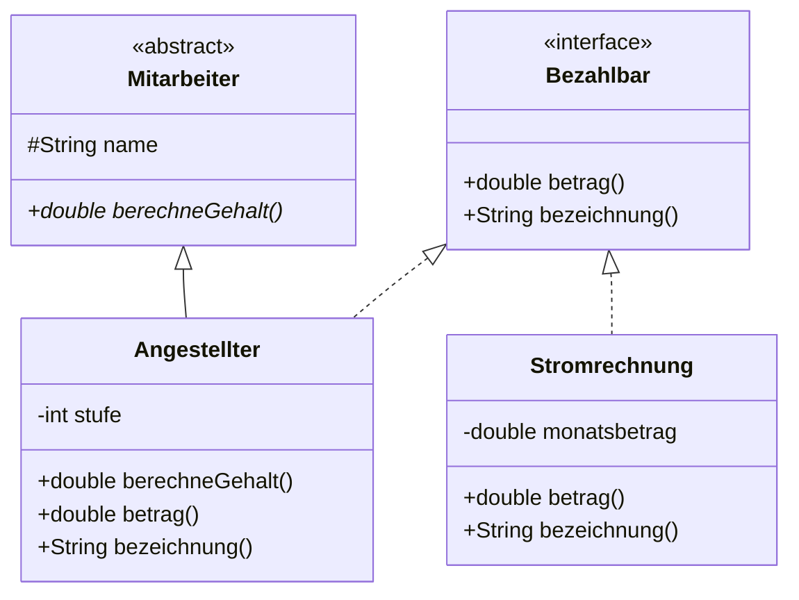

# Schnittstellen

:::alert{info}
**Nur Leistungskurs.** Diese Lektion gehört zu den zusätzlichen Anforderungen des Leistungskurses. Im Grundkurs kannst du sie überspringen.
:::

<!-- KLP QPh LK, Daten und ihre Strukturierung: Klassenbeziehungen ... Schnittstellen; modellieren objektorientierte Entwürfe mit Klassen, Schnittstellen und ihren Beziehungen (M); implementieren Klassen und Schnittstellen (I) -->

## Das Problem

Eine abstrakte Klasse löst ein Problem: Sie erzwingt, dass alle Unterklassen eine bestimmte Methode anbieten. Aber sie hat eine harte Grenze.

:::snippet{#aufgabe}
In deinem Spiel gibt es Klassen, die sich bewegen können: `Spieler`, `Gegner`, `Geschoss`. Sie alle erben bereits von `Sprite`.

Du möchtest zusätzlich erzwingen, dass jede von ihnen eine Methode `beschleunige(double pFaktor)` anbietet.

Warum kannst du dafür **keine** abstrakte Klasse `Beweglich` einsetzen?
:::

::::collapsible{title="Auflösung"}

Weil eine Klasse in Java nur von **einer** Oberklasse erben kann. `Spieler` erbt schon von `Sprite` – für `Beweglich` ist kein Platz mehr.

Man könnte `Beweglich` zwischen `Sprite` und `Spieler` schieben. Das geht aber nur, wenn wirklich **alle** beweglichen Dinge auch Sprites sind. Sobald ein bewegliches Objekt kein Sprite ist – etwa eine Kamerafahrt –, bricht der Entwurf.

::::

## Die Lösung

:::snippet{#definition}
Eine **Schnittstelle** (englisch *interface*) legt fest, welche Methoden eine Klasse anbieten muss – **ohne** etwas über deren Umsetzung zu sagen und **ohne** in die Vererbungshierarchie einzugreifen.

Eine Klasse kann von **einer** Klasse erben, aber **beliebig viele** Schnittstellen implementieren.
:::

:::onlineide{height="700px" speed="1000000"}

```java Main.java
void main() {
    Bezahlbar[] posten = new Bezahlbar[3];
    posten[0] = new Angestellter("Ada", 4);
    posten[1] = new Stromrechnung(240.50);
    posten[2] = new Angestellter("Alan", 3);

    double summe = 0.0;
    for (int i = 0; i < posten.length; i++) {
        IO.println(posten[i].bezeichnung() + ": " + posten[i].betrag() + " Euro");
        summe = summe + posten[i].betrag();
    }
    IO.println("Monatliche Ausgaben: " + summe + " Euro");
}
```

```java Bezahlbar.java
/**
 * Etwas, das monatlich Geld kostet.
 */
public interface Bezahlbar {

    /** Liefert den monatlichen Betrag in Euro. */
    double betrag();

    /** Liefert eine kurze Bezeichnung des Postens. */
    String bezeichnung();
}
```

```java Mitarbeiter.java
public abstract class Mitarbeiter {

    protected String name;

    public Mitarbeiter(String pName) {
        name = pName;
    }

    public String getName() {
        return name;
    }

    public abstract double berechneGehalt();
}
```

```java Angestellter.java
public class Angestellter extends Mitarbeiter implements Bezahlbar {

    private int stufe;

    public Angestellter(String pName, int pStufe) {
        super(pName);
        stufe = pStufe;
    }

    public double berechneGehalt() {
        return stufe * 1000.0;
    }

    public double betrag() {
        return berechneGehalt();
    }

    public String bezeichnung() {
        return "Gehalt " + name;
    }
}
```

```java Stromrechnung.java
public class Stromrechnung implements Bezahlbar {

    private double monatsbetrag;

    public Stromrechnung(double pBetrag) {
        monatsbetrag = pBetrag;
    }

    public double betrag() {
        return monatsbetrag;
    }

    public String bezeichnung() {
        return "Strom";
    }
}
```

:::

:::snippet{#merken}
- `interface Bezahlbar` deklariert nur **Signaturen**. Alle Methoden sind automatisch öffentlich und abstrakt – man schreibt `public abstract` nicht dazu.
- `class Angestellter extends Mitarbeiter implements Bezahlbar` – **erst** die Oberklasse, **dann** die Schnittstellen.
- Eine Klasse darf mehrere Schnittstellen implementieren: `implements Bezahlbar, Vergleichbar, Speicherbar`.
- Eine Schnittstelle ist ein **Typ**. Deshalb geht `Bezahlbar[] posten` – obwohl `Angestellter` und `Stromrechnung` überhaupt nichts miteinander zu tun haben.

Im Diagramm schreibt man `<<interface>>` über den Namen und verbindet die implementierende Klasse mit einem **gestrichelten** Pfeil mit leerem Dreieck.
:::



## Abstrakte Klasse oder Schnittstelle?

:::snippet{#merken}
| | abstrakte Klasse | Schnittstelle |
| --- | --- | --- |
| Attribute | ja | nein (nur Konstanten) |
| Konstruktor | ja | nein |
| Methodenrümpfe | ja | nein |
| wie viele pro Klasse? | genau eine | beliebig viele |
| Beziehung | „**ist ein**“ | „**kann etwas**“ |

**Faustregel:** Teilen die Klassen gemeinsamen Zustand und gemeinsames Verhalten? Dann abstrakte Klasse. Teilen sie nur eine Fähigkeit, sind aber sonst grundverschieden? Dann Schnittstelle.

Ein Angestellter **ist ein** Mitarbeiter. Eine Stromrechnung **ist kein** Mitarbeiter – aber beide **können bezahlt werden**.
:::

:::snippet{#aufgabe}
Entscheide jeweils: abstrakte Klasse oder Schnittstelle? Begründe.

a) `Fahrzeug` für `Auto`, `Fahrrad`, `LKW`

b) `Speicherbar` für alles, was sich in eine Datei schreiben lässt

c) `Konto` für `Girokonto` und `Sparkonto`

d) `Vergleichbar` für alles, was sich sortieren lässt
:::

::::collapsible{title="Auflösung"}

a) **Abstrakte Klasse.** Alle Fahrzeuge teilen Zustand (Geschwindigkeit, Position) und Verhalten.

b) **Schnittstelle.** Ein Bild, ein Spielstand und ein Adressbuch sind grundverschiedene Dinge – gemeinsam ist ihnen nur die Fähigkeit.

c) **Abstrakte Klasse.** Beide haben einen Kontostand und einen Besitzer.

d) **Schnittstelle.** Zahlen, Wörter, Personen und Termine haben nichts gemeinsam außer der Vergleichbarkeit.

::::

## Aufgabe: Vergleichbar

Diese Schnittstelle brauchst du im Kapitel über Bäume wieder – dort heißt sie in der NRW-Klassenbibliothek `ComparableContent`.

:::snippet{#aufgabe}
Setze die Schnittstelle und zwei implementierende Klassen so um, dass alle Tests grün werden.

Die Sortiermethode in `Sortierer` soll **beliebige** vergleichbare Objekte sortieren können – ohne zu wissen, worum es sich handelt.
:::

:::onlineide{height="760px" speed="1000000"}

```java Main.java
void main() {
    IO.println("Führe die Tests über den Reiter Testrunner aus.");
}
```

```java Vergleichbar.java
/**
 * Etwas, das sich mit seinesgleichen der Größe nach vergleichen lässt.
 */
public interface Vergleichbar {

    /** Liefert true, wenn dieses Objekt größer als pAnderes ist. */
    boolean istGroesserAls(Vergleichbar pAnderes);
}
```

```java Buch.java
public class Buch implements Vergleichbar {

    private String titel;
    private int seiten;

    public Buch(String pTitel, int pSeiten) {
        titel = pTitel;
        seiten = pSeiten;
    }

    public String getTitel() {
        return titel;
    }

    public int getSeiten() {
        return seiten;
    }

    /** Ein Buch ist größer, wenn es mehr Seiten hat. */
    public boolean istGroesserAls(Vergleichbar pAnderes) {
        return false; // ersetze diese Zeile
    }
}
```

```java Person.java
public class Person implements Vergleichbar {

    private String name;
    private int alter;

    public Person(String pName, int pAlter) {
        name = pName;
        alter = pAlter;
    }

    public String getName() {
        return name;
    }

    public int getAlter() {
        return alter;
    }

    /** Eine Person ist größer, wenn sie älter ist. */
    public boolean istGroesserAls(Vergleichbar pAnderes) {
        return false; // ersetze diese Zeile
    }
}
```

```java Sortierer.java
public class Sortierer {

    /**
     * Sortiert das Feld aufsteigend durch Auswählen.
     * Funktioniert für alles, was die Schnittstelle Vergleichbar erfüllt.
     */
    public void sortiere(Vergleichbar[] pWerte) {
        // ergänze diese Methode
    }
}
```

```java VergleichbarTest.java
@Test
class VergleichbarTest {

    @Test
    void testBuchVergleich() {
        Buch a = new Buch("Kurz", 100);
        Buch b = new Buch("Lang", 500);
        assertTrue(b.istGroesserAls(a), "Das dickere Buch ist größer.");
        assertFalse(a.istGroesserAls(b), "Das dünnere nicht.");
        assertFalse(a.istGroesserAls(a), "Ein Buch ist nicht größer als es selbst.");
    }

    @Test
    void testPersonVergleich() {
        Person a = new Person("Ada", 30);
        Person b = new Person("Alan", 45);
        assertTrue(b.istGroesserAls(a), "Die ältere Person ist größer.");
        assertFalse(a.istGroesserAls(b), "Die jüngere nicht.");
    }

    @Test
    void testSortiereBuecher() {
        Buch[] buecher = new Buch[3];
        buecher[0] = new Buch("Mittel", 300);
        buecher[1] = new Buch("Lang", 500);
        buecher[2] = new Buch("Kurz", 100);

        new Sortierer().sortiere(buecher);

        assertEquals("Kurz", buecher[0].getTitel(), "Vorne steht das dünnste Buch.");
        assertEquals("Mittel", buecher[1].getTitel(), "Dann das mittlere.");
        assertEquals("Lang", buecher[2].getTitel(), "Hinten das dickste.");
    }

    @Test
    void testSortierePersonen() {
        Person[] leute = new Person[3];
        leute[0] = new Person("Alan", 45);
        leute[1] = new Person("Ada", 30);
        leute[2] = new Person("Grace", 60);

        new Sortierer().sortiere(leute);

        assertEquals("Ada", leute[0].getName(), "Vorne steht die jüngste Person.");
        assertEquals("Alan", leute[1].getName(), "Dann die mittlere.");
        assertEquals("Grace", leute[2].getName(), "Hinten die älteste.");
    }

    @Test
    void testSortiereSonderfaelle() {
        Sortierer s = new Sortierer();

        Vergleichbar[] leer = new Vergleichbar[0];
        s.sortiere(leer);
        assertEquals(0, leer.length, "Das leere Feld bleibt leer.");

        Buch[] eins = new Buch[1];
        eins[0] = new Buch("Einzeln", 42);
        s.sortiere(eins);
        assertEquals("Einzeln", eins[0].getTitel(), "Ein einzelnes Element bleibt stehen.");
    }
}
```

:::

::::collapsible{title="Tipp 1: Der Vergleich in Buch"}

Der Parameter ist vom Typ `Vergleichbar` – die Schnittstelle kennt aber keine Seitenzahl. Du musst ihn also erst in ein `Buch` umwandeln:

```java
Buch anderes = (Buch) pAnderes;
return seiten > anderes.getSeiten();
```

Das ist eine der wenigen Stellen, an denen eine Typumwandlung nach unten sachlich richtig ist: Ein Buch kann sich sinnvollerweise nur mit einem anderen Buch vergleichen.

::::

::::collapsible{title="Tipp 2: Der Sortierer"}

Es ist genau das Sortieren durch Auswählen aus der Einführungsphase. Nur der Vergleich sieht anders aus: statt `pWerte[j] < pWerte[kleinstesIndex]` heißt es jetzt

```java
pWerte[kleinstesIndex].istGroesserAls(pWerte[j])
```

Und der Merker hat den Typ `Vergleichbar` statt `int`.

::::

::::collapsible{title="Tipp 3: Warum funktioniert das für Bücher und Personen gleichzeitig?"}

Weil `Sortierer` gar nicht wissen muss, was es sortiert. Es weiß nur: Jedes Element **kann** sich mit einem anderen vergleichen. Wie es das tut, ist Sache der jeweiligen Klasse.

Genau dafür sind Schnittstellen da.

::::

:::protect{password="java-q-1-4-1" description="Lösung. Erfrage das Passwort bei deiner Lehrkraft."}

```java Buch.java
public boolean istGroesserAls(Vergleichbar pAnderes) {
    Buch anderes = (Buch) pAnderes;
    return seiten > anderes.getSeiten();
}
```

```java Person.java
public boolean istGroesserAls(Vergleichbar pAnderes) {
    Person andere = (Person) pAnderes;
    return alter > andere.getAlter();
}
```

```java Sortierer.java
public class Sortierer {

    public void sortiere(Vergleichbar[] pWerte) {
        for (int i = 0; i < pWerte.length - 1; i++) {
            int kleinstesIndex = i;

            for (int j = i + 1; j < pWerte.length; j++) {
                if (pWerte[kleinstesIndex].istGroesserAls(pWerte[j])) {
                    kleinstesIndex = j;
                }
            }

            Vergleichbar merker = pWerte[i];
            pWerte[i] = pWerte[kleinstesIndex];
            pWerte[kleinstesIndex] = merker;
        }
    }
}
```

Der Test übergibt ein `Buch[]` an eine Methode, die ein `Vergleichbar[]` erwartet – das geht, weil jedes Buch ein Vergleichbar ist. Und der Tausch innerhalb des Feldes funktioniert, weil dort weiterhin nur Bücher liegen.

:::

## Zusatzaufgabe

:::snippet{#brain}
In der Einführungsphase gab es in der Zusatzaufgabe zur Stadt die Idee, alle Objekte zwischen Tag und Nacht umzuschalten – und in der letzten Lektion die abstrakte Klasse `Stadtobjekt` als Lösung.

a) Baue es stattdessen mit einer Schnittstelle `Umschaltbar`. Was ändert sich?

b) Welche Lösung ist hier besser? Begründe mit der Faustregel „ist ein“ gegen „kann etwas“.

c) Was, wenn manche Stadtobjekte umschaltbar sein sollen und andere nicht – etwa ein Zaun, der nachts genauso aussieht? Welche Lösung kommt damit besser zurecht?
:::

---

## Selbsttest

::::multievent

**1. Wie viele Schnittstellen kann eine Klasse implementieren?**

{r1{genau eine}}

{r1{!beliebig viele}}

{r1{höchstens zwei}}

{h{Bei Oberklassen ist es genau eine - hier nicht.}}
{H{Richtig! Genau darin liegt der Hauptvorteil.}}

**2. Was darf eine Schnittstelle nicht haben?** (Mehrfachauswahl)

{c1{!Attribute mit veränderlichen Werten}}

{c1{!einen Konstruktor}}

{c1{Methodensignaturen}}

{c1{einen Namen}}

{h{Sie legt fest, was eine Klasse können muss - nicht, wie sie es tut.}}
{H{Richtig! Nur Konstanten sind erlaubt.}}

**3. In welcher Reihenfolge stehen extends und implements?**

{r2{!erst extends, dann implements}}

{r2{erst implements, dann extends}}

{r2{die Reihenfolge ist egal}}

{h{Die Oberklasse steht direkt hinter dem Klassennamen.}}
{H{Richtig!}}

**4. Welche Faustregel unterscheidet Schnittstelle von abstrakter Klasse?**

{r3{groß gegen klein}}

{r3{!ist ein gegen kann etwas}}

{r3{öffentlich gegen privat}}

{h{Ein Angestellter ist ein Mitarbeiter, eine Stromrechnung kann bezahlt werden.}}
{H{Richtig!}}

**5. Warum kann der Sortierer sowohl Bücher als auch Personen sortieren?**

{r4{weil beide von derselben Oberklasse erben}}

{r4{!weil beide dieselbe Schnittstelle erfüllen}}

{r4{weil Java das automatisch erkennt}}

{h{Bücher und Personen haben sonst nichts gemeinsam.}}
{H{Richtig! Der Sortierer weiß nur, dass sich die Elemente vergleichen können.}}

::::
