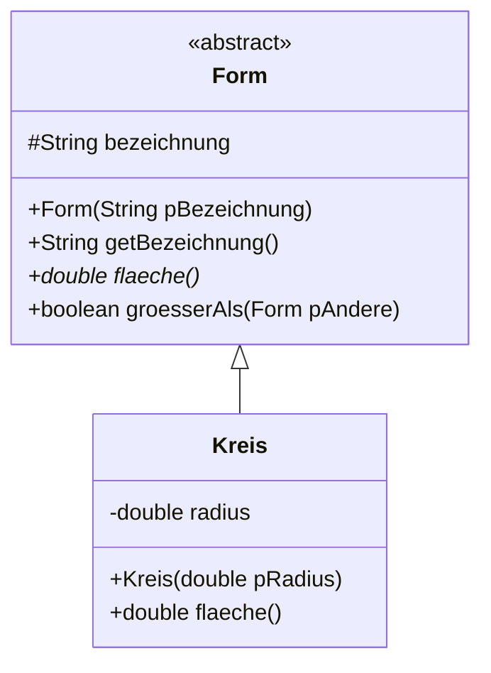
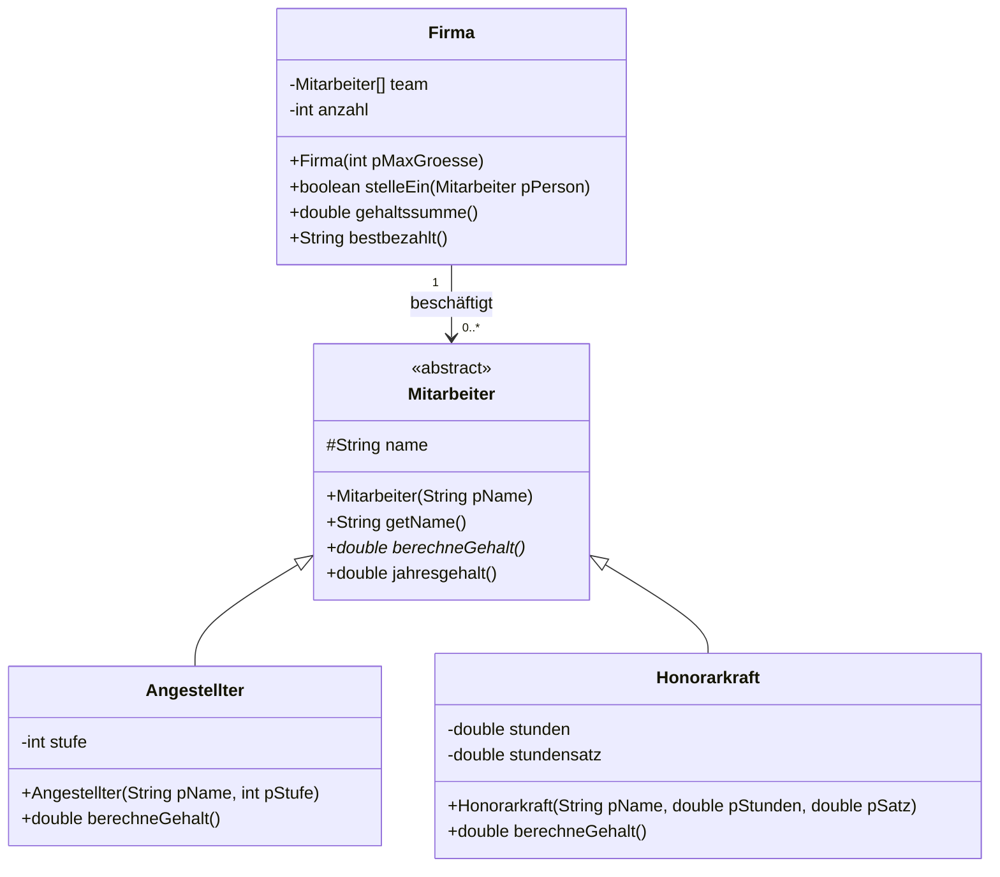
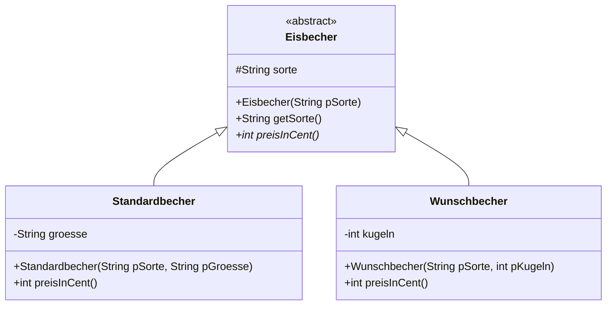

# Abstrakte Klassen

Die Klasse `Form` aus der letzten Lektion hatte eine Schwachstelle:

```java
public double flaeche() {
    return 0.0;
}
```

Das ist keine Antwort, sondern eine Notlüge. Eine „allgemeine Form" hat schlicht keinen Flächeninhalt – und wer eine neue Unterklasse schreibt und das Überschreiben vergisst, bekommt keinen Fehler, sondern lautlos falsche Zahlen.

<!-- KLP QPh, Daten und ihre Strukturierung: Vererbungsbeziehungen im Zusammenhang von Generalisierung, Spezialisierung, Polymorphie und abstrakten Klassen -->

## Zwei neue Schlüsselwörter

:::snippet{#definition}
Eine **abstrakte Klasse** kann nicht instanziiert werden – von ihr lässt sich **kein Objekt erzeugen**. Sie dient nur als gemeinsame Oberklasse.

Eine **abstrakte Methode** hat **keinen Rumpf**, sondern endet nach dem Kopf mit einem Semikolon. Sie legt fest, dass es die Methode geben **muss**, und verpflichtet jede nicht-abstrakte Unterklasse, sie zu überschreiben.
:::

:::onlineide{height="740px" speed="1000000"}

```java Main.java
void main() {
    Form[] formen = new Form[3];
    formen[0] = new Rechteck(4.0, 3.0);
    formen[1] = new Quadrat(5.0);
    formen[2] = new Kreis(2.0);

    for (int i = 0; i < formen.length; i++) {
        IO.println(formen[i].getBezeichnung() + ": " + formen[i].flaeche());
    }

    // Die folgende Zeile lässt sich nicht übersetzen.
    // Entferne die Schrägstriche und lies die Fehlermeldung.
    // Form f = new Form("irgendwas");
}
```

```java Form.java
/**
 * Gemeinsame Oberklasse aller geometrischen Formen.
 * Von ihr selbst kann kein Objekt erzeugt werden.
 */
public abstract class Form {

    protected String bezeichnung;

    public Form(String pBezeichnung) {
        bezeichnung = pBezeichnung;
    }

    public String getBezeichnung() {
        return bezeichnung;
    }

    /**
     * Liefert den Flächeninhalt.
     * Jede konkrete Form muss diese Methode selbst festlegen.
     */
    public abstract double flaeche();

    /** Liefert true, wenn diese Form flächengrößer ist als die andere. */
    public boolean groesserAls(Form pAndere) {
        return flaeche() > pAndere.flaeche();
    }
}
```

```java Rechteck.java
public class Rechteck extends Form {

    private double breite;
    private double hoehe;

    public Rechteck(double pBreite, double pHoehe) {
        super("Rechteck");
        breite = pBreite;
        hoehe = pHoehe;
    }

    public double flaeche() {
        return breite * hoehe;
    }
}
```

```java Quadrat.java
public class Quadrat extends Rechteck {

    public Quadrat(double pSeite) {
        super(pSeite, pSeite);
        bezeichnung = "Quadrat";
    }
}
```

```java Kreis.java
public class Kreis extends Form {

    private double radius;

    public Kreis(double pRadius) {
        super("Kreis");
        radius = pRadius;
    }

    public double flaeche() {
        return Math.PI * radius * radius;
    }
}
```

:::

:::snippet{#aufgabe}
**Aufgabe: Zwei Fehlermeldungen lesen**

Probier beides aus und lies jedes Mal die Fehlermeldung:

a) Entferne die Schrägstriche vor `Form f = new Form("irgendwas");`.

b) Mach die Zeile wieder zum Kommentar und kommentiere stattdessen in `Rechteck` die Methode `flaeche()` aus.

c) Beurteile: Was ist an beiden Meldungen besser als am Verhalten der Fassung aus der letzten Lektion?
:::

:::protect{password="java-q-1-5-1" description="Lösung. Erfrage das Passwort bei deiner Lehrkraft."}

a) Die IDE lehnt es ab, ein Objekt einer abstrakten Klasse zu erzeugen.

b) Die IDE verlangt, dass `Rechteck` die abstrakte Methode `flaeche()` umsetzt – sonst müsste `Rechteck` selbst als `abstract` gekennzeichnet werden.

c) Beide Fehler treten schon **beim Übersetzen** auf. In der Fassung aus der letzten Lektion hätte eine vergessene `flaeche()`-Methode lautlos 0.0 geliefert; die Gesamtfläche wäre falsch gewesen, ohne dass irgendetwas darauf hinweist.

Der Unterschied ist grundsätzlich: **Ein Fehler, den die Sprache dir abnimmt, ist ein Fehler, den du nicht suchen musst.** Je früher er auffällt, desto billiger ist er – beim Tippen billiger als beim Testen, beim Testen billiger als in der Klausur.

:::

:::snippet{#merken}
| | abstrakte Klasse | normale Klasse |
| --- | --- | --- |
| Objekte erzeugbar? | **nein** | ja |
| darf abstrakte Methoden haben? | **ja** | nein |
| darf normale Methoden mit Rumpf haben? | ja | ja |
| darf Attribute haben? | ja | ja |
| darf einen Konstruktor haben? | **ja** | ja |
| darf als Typ einer Variablen dienen? | **ja** | ja |

**Der Konstruktor bleibt sinnvoll**, obwohl man keine Objekte erzeugen kann: Die Unterklassen rufen ihn mit `super(...)` auf, und er setzt die geerbten Attribute.

**Der Typ bleibt sinnvoll**, obwohl es keine Objekte gibt: `Form[] formen` und `Form f = new Kreis(2.0)` sind erlaubt. Nur das `new Form(...)` ist es nicht.
:::

Im Diagramm wird der Name einer abstrakten Klasse und einer abstrakten Methode *kursiv* geschrieben. In der Schreibweise dieses Buches steht `<<abstract>>` über dem Klassennamen und ein Sternchen hinter der Methode.



## Wann abstrakt, wann konkret?

:::snippet{#merken}
Die Frage, die entscheidet, lautet: **Kann es davon ein sinnvolles einzelnes Objekt geben?**

- „Ein Fahrzeug, das kein Auto, Fahrrad oder LKW ist" – gibt es nicht. `Fahrzeug` wird abstrakt.
- „Ein Rechteck, das kein Quadrat ist" – gibt es massenhaft. `Rechteck` bleibt konkret.

Eine zweite Frage hilft, wenn die erste nicht weiterbringt: **Kann die Oberklasse für jede ihrer Methoden einen sinnvollen Rumpf angeben?** Wo sie das nicht kann, wird die Methode abstrakt – und damit die Klasse.
:::

---

## Teil 1: Lesen

### Aufgabe 1: Was meldet der Übersetzer?

:::snippet{#aufgabe}
*Ohne Rechner.* Gegeben ist die abstrakte Klasse `Sensor`. Entscheide für jeden der sechs Ausschnitte: **übersetzt er?** Wenn nein: **warum nicht**, und wie berichtigst du ihn?
:::

```java
public abstract class Sensor {

    private String ort;

    public Sensor(String pOrt) {
        ort = pOrt;
    }

    public String getOrt() {
        return ort;
    }

    public abstract int messwert();

    public String bericht() {
        return ort + ": " + messwert();
    }
}
```

```java
// 1
public class Thermometer extends Sensor {
    public Thermometer(String pOrt) {
        super(pOrt);
    }
    public int messwert() {
        return 21;
    }
}

// 2
Sensor s = new Thermometer("Flur");

// 3
Sensor s = new Sensor("Flur");

// 4
public class Hygrometer extends Sensor {
    public Hygrometer(String pOrt) {
        super(pOrt);
    }
}

// 5
Sensor[] anlage = new Sensor[3];

// 6
public abstract int messwert() {
    return 0;
}
```

::::collapsible{title="Tipp: zwei Verbote, sonst nichts"}

Eine abstrakte Klasse verbietet genau zwei Dinge:

1. `new` auf ihr selbst.
2. Eine nicht-abstrakte Unterklasse, die eine abstrakte Methode offen lässt.

Alles andere – Attribute, Konstruktoren, normale Methoden, Variablen und Felder von diesem Typ – ist erlaubt.

::::

:::protect{password="java-q-1-5-2" description="Lösung. Erfrage das Passwort bei deiner Lehrkraft."}

| # | übersetzt? | warum |
| --- | --- | --- |
| 1 | **ja** | `Thermometer` setzt die abstrakte Methode um und ist damit vollständig. |
| 2 | **ja** | Der Typ `Sensor` als **Variablentyp** ist erlaubt. Erzeugt wird ein Thermometer, nicht ein Sensor. |
| 3 | **nein** | `new` auf einer abstrakten Klasse. Berichtigung: eine konkrete Unterklasse erzeugen. |
| 4 | **nein** | `Hygrometer` setzt `messwert()` nicht um. Berichtigung: die Methode ergänzen – oder `Hygrometer` selbst als `abstract` kennzeichnen. |
| 5 | **ja** | Ein **Feld** vom Typ einer abstrakten Klasse ist erlaubt. Es enthält ja nur Verweise, und `new Sensor[3]` erzeugt keinen einzigen Sensor. |
| 6 | **nein** | Eine abstrakte Methode hat **keinen Rumpf**. Entweder `public abstract int messwert();` – oder ohne `abstract` mit Rumpf. |

Nummer 5 ist die lehrreichste Zeile. `new Sensor[3]` sieht aus wie `new Sensor(...)`, ist aber etwas ganz anderes: Es legt ein Feld mit drei **leeren Plätzen** an. Genau das braucht man, um Thermometer und Hygrometer gemeinsam zu verwalten – und wäre es verboten, wären abstrakte Klassen praktisch nutzlos.

:::

### Aufgabe 2: Abstrakt oder konkret?

:::snippet{#aufgabe}
*Ohne Rechner.* Entscheide für jede Oberklasse, ob sie abstrakt sein sollte. Begründe jedes Mal mit der Frage *„Kann es davon ein sinnvolles einzelnes Objekt geben?"*
:::

a) `Fahrzeug` mit den Unterklassen `Auto`, `Fahrrad`, `LKW`

b) `Rechteck` mit der Unterklasse `Quadrat`

c) `Mitarbeiter` mit den Unterklassen `Angestellter`, `Honorarkraft`

d) `Konto` mit den Unterklassen `Girokonto`, `Sparkonto`

e) `Medium` mit den Unterklassen `Buch`, `Dvd`, `Zeitschrift` – aus [1.3](./03-generalisierung-und-spezialisierung)

f) `Spielfigur` mit den Unterklassen `Spieler`, `Gegner`

:::protect{password="java-q-1-5-3" description="Lösung. Erfrage das Passwort bei deiner Lehrkraft."}

a) **abstrakt.** Ein Fahrzeug, das weder Auto noch Fahrrad noch LKW ist, gibt es nicht. Außerdem könnte `Fahrzeug` für Methoden wie `anzahlRaeder()` keinen sinnvollen Rumpf angeben.

b) **konkret.** Ein Rechteck ist ein vollwertiges Objekt für sich – nicht jedes Rechteck ist ein Quadrat.

c) **abstrakt.** Jede Person in der Firma ist entweder angestellt oder Honorarkraft. „Mitarbeiter" allein legt kein Gehalt fest – `berechneGehalt()` hätte in der Oberklasse keinen sinnvollen Rumpf.

d) **Auslegungssache, und beides ist zu begründen.** Wer ein einfaches Guthabenkonto ohne Sonderregeln anbieten will, macht `Konto` konkret. Wer möchte, dass jedes Konto eine der beiden Sorten ist, macht es abstrakt. Entscheidend ist nicht die Klasse, sondern die Fachlichkeit: *Gibt es in dieser Bank ein Konto ohne nähere Bestimmung?*

e) **Auslegungssache mit einer klaren Tendenz zu abstrakt.** In [1.3](./03-generalisierung-und-spezialisierung) war `Medium` konkret, weil es eine sinnvolle Standard-Leihdauer gab. Sobald aber jede Medienart eine eigene Signaturregel oder eine eigene Mahngebühr braucht, hat `Medium` nichts Sinnvolles mehr hinzuschreiben – dann wird es abstrakt. Man sieht daran: Die Entscheidung ist nicht ein für alle Mal getroffen, sie wandert mit dem Entwurf.

f) **abstrakt.** Eine Spielfigur, die weder vom Menschen noch vom Programm gesteuert wird, würde sich nie bewegen.

Solche Entscheidungen zu **begründen** ist genau das, was mit „objektorientierte Modellierungen beurteilen" gemeint ist. Bei d) und e) gibt es keine richtige Antwort – nur eine mit und eine ohne Begründung.

:::

---

## Teil 2: Schreiben

### Aufgabe 3: Die Firma

:::snippet{#aufgabe}
Eine Firma beschäftigt **Angestellte** (festes Monatsgehalt nach Gehaltsstufe: Stufe mal 1000 Euro) und **Honorarkräfte** (Stundenlohn mal geleistete Stunden).

Setze die Hierarchie so um, dass alle Tests grün werden. Beachte, dass `Firma` keine der beiden Beschäftigungsarten kennen darf.
:::



:::onlineide{height="800px" speed="1000000"}

```java Main.java
void main() {
    IO.println("Führe die Tests über den Reiter Testrunner aus.");
}
```

```java Mitarbeiter.java
/**
 * Gemeinsame Oberklasse aller Beschäftigten einer Firma.
 */
public abstract class Mitarbeiter {

    protected String name;

    public Mitarbeiter(String pName) {
        name = pName;
    }

    public String getName() {
        return name;
    }

    /**
     * Liefert das Monatsgehalt in Euro.
     * Jede Beschäftigungsart rechnet anders.
     */
    public abstract double berechneGehalt();

    /** Liefert das Jahresgehalt. Steht nur hier und gilt für alle. */
    public double jahresgehalt() {
        return 0.0; // ersetze diese Zeile
    }
}
```

```java Angestellter.java
public class Angestellter extends Mitarbeiter {

    private int stufe;

    public Angestellter(String pName, int pStufe) {
        super(pName);
        // Dein Code hier
    }

    public double berechneGehalt() {
        return 0.0; // ersetze diese Zeile
    }
}
```

```java Honorarkraft.java
public class Honorarkraft extends Mitarbeiter {

    private double stunden;
    private double stundensatz;

    public Honorarkraft(String pName, double pStunden, double pSatz) {
        super(pName);
        // Dein Code hier
    }

    public double berechneGehalt() {
        return 0.0; // ersetze diese Zeile
    }
}
```

```java Firma.java
public class Firma {

    private Mitarbeiter[] team;
    private int anzahl;

    public Firma(int pMaxGroesse) {
        team = new Mitarbeiter[pMaxGroesse];
        anzahl = 0;
    }

    /** Stellt eine Person ein, wenn noch Platz ist. */
    public boolean stelleEin(Mitarbeiter pPerson) {
        return false; // ersetze diese Zeile
    }

    /** Liefert die Summe aller Monatsgehälter. */
    public double gehaltssumme() {
        return 0.0; // ersetze diese Zeile
    }

    /** Liefert den Namen der bestbezahlten Person, bei leerer Firma die leere Zeichenkette. */
    public String bestbezahlt() {
        return ""; // ersetze diese Zeile
    }
}
```

```java FirmaTest.java
@Test
class FirmaTest {

    @Test
    void testAngestellter() {
        Angestellter a = new Angestellter("Ada", 4);
        assertEquals(4000.0, a.berechneGehalt(), "Stufe 4 ergibt 4000 Euro.");
        assertEquals("Ada", a.getName(), "Der Name wird geerbt.");
    }

    @Test
    void testHonorarkraft() {
        Honorarkraft h = new Honorarkraft("Alan", 20.0, 50.0);
        assertEquals(1000.0, h.berechneGehalt(), "20 Stunden zu 50 Euro sind 1000 Euro.");
    }

    @Test
    void testJahresgehaltNutztUeberschriebeneMethode() {
        Mitarbeiter m = new Angestellter("Grace", 5);
        assertEquals(60000.0, m.jahresgehalt(),
                     "Die geerbte Jahresrechnung nutzt die überschriebene Gehaltsmethode.");
        Mitarbeiter h = new Honorarkraft("Alan", 20.0, 50.0);
        assertEquals(12000.0, h.jahresgehalt(), "Auch bei der Honorarkraft.");
    }

    @Test
    void testGehaltssumme() {
        Firma f = new Firma(5);
        f.stelleEin(new Angestellter("Ada", 4));
        f.stelleEin(new Honorarkraft("Alan", 20.0, 50.0));
        f.stelleEin(new Angestellter("Grace", 5));
        assertEquals(10000.0, f.gehaltssumme(), "4000 plus 1000 plus 5000 sind 10000.");
    }

    @Test
    void testLeereFirma() {
        Firma f = new Firma(3);
        assertEquals(0.0, f.gehaltssumme(), "Ohne Personal ist die Summe 0.");
        assertEquals("", f.bestbezahlt(), "Ohne Personal gibt es keine bestbezahlte Person.");
    }

    @Test
    void testBestbezahlt() {
        Firma f = new Firma(5);
        f.stelleEin(new Angestellter("Ada", 4));
        f.stelleEin(new Honorarkraft("Alan", 20.0, 50.0));
        f.stelleEin(new Angestellter("Grace", 5));
        assertEquals("Grace", f.bestbezahlt(), "Grace verdient am meisten.");
    }

    @Test
    void testVollBesetzt() {
        Firma f = new Firma(2);
        assertTrue(f.stelleEin(new Angestellter("Ada", 4)), "Die erste passt.");
        assertTrue(f.stelleEin(new Angestellter("Alan", 3)), "Die zweite auch.");
        assertFalse(f.stelleEin(new Angestellter("Grace", 5)), "Die dritte nicht mehr.");
    }
}
```

:::

::::collapsible{title="Tipp 1: Warum kann das Feld beide Sorten aufnehmen?"}

Weil beide **Mitarbeiter sind**. Ein `Mitarbeiter[]` nimmt jedes Objekt auf, dessen Klasse von `Mitarbeiter` erbt – auch wenn `Mitarbeiter` abstrakt ist.

Und beim Aufruf `team[i].berechneGehalt()` greift die dynamische Bindung: Bei einer Angestellten rechnet Java mit der Gehaltsstufe, bei einer Honorarkraft mit den Stunden. Die Klasse `Firma` muss die beiden Sorten überhaupt nicht kennen.

::::

::::collapsible{title="Tipp 2: jahresgehalt"}

Eine Zeile, und sie steht nur in `Mitarbeiter`:

```java
return 12 * berechneGehalt();
```

Dass `berechneGehalt()` dort abstrakt ist, stört nicht – zur Laufzeit gibt es immer ein konkretes Objekt, und dessen Fassung wird genommen.

::::

::::collapsible{title="Tipp 3: bestbezahlt"}

Das Muster aus der Einführungsphase: Merk dir den **Index** der bisher bestbezahlten Person, nicht den Betrag – sonst kommst du am Ende nicht an den Namen.

Und denk an den Sonderfall `anzahl == 0`; der Test prüft ihn.

::::

:::protect{password="java-q-1-5-4" description="Lösung. Erfrage das Passwort bei deiner Lehrkraft."}

```java Mitarbeiter.java
    /** Liefert das Jahresgehalt. Steht nur hier und gilt für alle. */
    public double jahresgehalt() {
        return 12 * berechneGehalt();
    }
```

```java Angestellter.java
public class Angestellter extends Mitarbeiter {

    private int stufe;

    public Angestellter(String pName, int pStufe) {
        super(pName);
        stufe = pStufe;
    }

    public double berechneGehalt() {
        return stufe * 1000.0;
    }
}
```

```java Honorarkraft.java
public class Honorarkraft extends Mitarbeiter {

    private double stunden;
    private double stundensatz;

    public Honorarkraft(String pName, double pStunden, double pSatz) {
        super(pName);
        stunden = pStunden;
        stundensatz = pSatz;
    }

    public double berechneGehalt() {
        return stunden * stundensatz;
    }
}
```

```java Firma.java
public class Firma {

    private Mitarbeiter[] team;
    private int anzahl;

    public Firma(int pMaxGroesse) {
        team = new Mitarbeiter[pMaxGroesse];
        anzahl = 0;
    }

    public boolean stelleEin(Mitarbeiter pPerson) {
        if (anzahl < team.length) {
            team[anzahl] = pPerson;
            anzahl++;
            return true;
        }
        return false;
    }

    public double gehaltssumme() {
        double summe = 0.0;
        for (int i = 0; i < anzahl; i++) {
            summe = summe + team[i].berechneGehalt();
        }
        return summe;
    }

    public String bestbezahlt() {
        if (anzahl == 0) {
            return "";
        }
        int bester = 0;
        for (int i = 1; i < anzahl; i++) {
            if (team[i].berechneGehalt() > team[bester].berechneGehalt()) {
                bester = i;
            }
        }
        return team[bester].getName();
    }
}
```

Worauf es ankam:

- **In `Firma` kommt weder `Angestellter` noch `Honorarkraft` vor.** Käme morgen eine dritte Beschäftigungsart dazu, müsste an dieser Klasse nichts geändert werden. Das ist der Gewinn, den [1.4](./04-polymorphie) beschrieben hat – hier steht er als Quelltext da.
- **Die Schleifen laufen bis `anzahl`, nicht bis `team.length`.** Dahinter stehen leere Plätze; ein Aufruf darauf bräche das Programm ab.
- **`jahresgehalt()` ruft eine abstrakte Methode auf.** Das ist erlaubt und der eigentliche Sinn der Sache: Die Oberklasse legt den **Ablauf** fest, die Unterklassen die **Einzelheiten**.
- **`bestbezahlt()` merkt sich den Index.** Wer sich den Betrag merkt, hat am Ende die richtige Zahl und keinen Namen.

:::

### Aufgabe 4: Die Eisdiele

:::snippet{#aufgabe}
Eine Eisdiele verkauft zwei Sorten von Bechern:

- **Standardbecher** zu festen Preisen: klein 6 €, mittel 10 €, groß 15 €.
- **Wunschbecher**, bei denen man die Kugeln selbst wählt: 1,20 € pro Kugel.

Diesmal gibt es kein Gerüst. Entwirf selbst:

a) Modelliere die Hierarchie. Welche Klasse ist abstrakt, welche konkret? Was steht in der Oberklasse, was in den Unterklassen?

b) Zeichne das Implementationsdiagramm.

c) Setze es im Programmierbereich um und schreib eine Testklasse mit mindestens **sechs** Testfällen, darunter mindestens zwei **Sonderfälle**.
:::

:::onlineide{height="620px" speed="1000000"}

```java Main.java
void main() {
    IO.println("Führe die Tests über den Reiter Testrunner aus.");
}
```

```java Eisbecher.java
public abstract class Eisbecher {
    // Dein Entwurf hier
}
```

```java EisbecherTest.java
@Test
class EisbecherTest {

    @Test
    void testPlatzhalter() {
        assertTrue(true, "Ersetze diesen Test durch deine eigenen.");
    }
}
```

:::

::::collapsible{title="Tipp 1: Was gehört in die Oberklasse?"}

Alles, was für **jeden** Becher gilt: eine Bezeichnung vielleicht, der Name der Eissorte – und die abstrakte Methode `preis()`.

Die Frage, aus der man die Antwort ableitet, ist immer dieselbe: *Was ist bei allen gleich, was ist bei jedem anders?* Was anders ist und keinen sinnvollen Standardwert hat, wird abstrakt.

::::

::::collapsible{title="Tipp 2: Sonderfälle für die Tests"}

Zwei liegen auf der Hand: ein Wunschbecher mit **null** Kugeln, und ein Standardbecher mit einer Größe, die es nicht gibt.

Rechne in **Cent** statt in Euro. Dann arbeitest du mit `int` und brauchst dich nicht um Rundungsfehler zu kümmern – 1,20 € sind 120 Cent.

::::

:::protect{password="java-q-1-5-5" description="Lösung. Erfrage das Passwort bei deiner Lehrkraft."}

Eine mögliche Lösung – deine darf anders aussehen, solange die Begründung trägt.



```java Eisbecher.java
public abstract class Eisbecher {

    protected String sorte;

    public Eisbecher(String pSorte) {
        sorte = pSorte;
    }

    public String getSorte() {
        return sorte;
    }

    /** Der Preis in Cent. Jede Becherart rechnet anders. */
    public abstract int preisInCent();
}
```

```java Standardbecher.java
public class Standardbecher extends Eisbecher {

    private String groesse;

    public Standardbecher(String pSorte, String pGroesse) {
        super(pSorte);
        groesse = pGroesse;
    }

    public int preisInCent() {
        if (groesse.equals("klein")) {
            return 600;
        }
        if (groesse.equals("mittel")) {
            return 1000;
        }
        if (groesse.equals("gross")) {
            return 1500;
        }
        return 0;
    }
}
```

```java Wunschbecher.java
public class Wunschbecher extends Eisbecher {

    private int kugeln;

    public Wunschbecher(String pSorte, int pKugeln) {
        super(pSorte);
        if (pKugeln < 0) {
            kugeln = 0;
        } else {
            kugeln = pKugeln;
        }
    }

    public int preisInCent() {
        return kugeln * 120;
    }
}
```

Die Entscheidungen dazu:

- **`Eisbecher` ist abstrakt**, weil ein Becher ohne Größe und ohne Kugelzahl keinen Preis hat – `preisInCent()` hätte oben keinen sinnvollen Rumpf.
- **Die Preise stehen in den Unterklassen**, nicht in der Oberklasse. Die Oberklasse weiß nicht, wie ein Preis zustande kommt, und muss es nicht wissen.
- **Gerechnet wird in Cent.** Mit `double` wären 1,20 € nicht exakt darstellbar, und Beträge, die sich um einen Cent unterscheiden, wären bei Vergleichen unzuverlässig.
- **Die `if`-Kette in `Standardbecher` ist kein Widerspruch zu [1.4](./04-polymorphie).** Dort ging es um Fallunterscheidungen über **Klassen**; hier wird über einen **Wert** unterschieden. Wer die drei Größen auch als Klassen modellieren will, kann das tun – für drei feste Preise ist das aber viel Aufwand für wenig Gewinn.

Eine Testklasse mit den geforderten sechs Fällen:

```java EisbecherTest.java
@Test
class EisbecherTest {

    @Test
    void testStandardpreise() {
        assertEquals(600, new Standardbecher("Vanille", "klein").preisInCent(), "Klein kostet 600 Cent.");
        assertEquals(1000, new Standardbecher("Vanille", "mittel").preisInCent(), "Mittel kostet 1000 Cent.");
        assertEquals(1500, new Standardbecher("Vanille", "gross").preisInCent(), "Gross kostet 1500 Cent.");
    }

    @Test
    void testUnbekannteGroesse() {
        assertEquals(0, new Standardbecher("Vanille", "riesig").preisInCent(), "Eine unbekannte Groesse kostet 0.");
    }

    @Test
    void testWunschbecher() {
        assertEquals(360, new Wunschbecher("Erdbeere", 3).preisInCent(), "Drei Kugeln kosten 360 Cent.");
    }

    @Test
    void testNullKugeln() {
        assertEquals(0, new Wunschbecher("Erdbeere", 0).preisInCent(), "Null Kugeln kosten nichts.");
    }

    @Test
    void testNegativeKugeln() {
        assertEquals(0, new Wunschbecher("Erdbeere", -2).preisInCent(), "Negative Kugeln werden auf 0 gesetzt.");
    }

    @Test
    void testGemeinsameVerarbeitung() {
        Eisbecher[] bestellung = new Eisbecher[3];
        bestellung[0] = new Standardbecher("Vanille", "klein");
        bestellung[1] = new Wunschbecher("Erdbeere", 3);
        bestellung[2] = new Standardbecher("Nuss", "gross");

        int summe = 0;
        for (int i = 0; i < bestellung.length; i++) {
            summe = summe + bestellung[i].preisInCent();
        }
        assertEquals(2460, summe, "600 plus 360 plus 1500 sind 2460 Cent.");
    }
}
```

:::

---

## Zum Weiterdenken

### Vertiefung 1: Die Oberklasse gibt den Ablauf vor

:::snippet{#brain}
`jahresgehalt()` in Aufgabe 3 war ein kleines Beispiel für ein großes Muster: Die Oberklasse schreibt den **Ablauf** auf und lässt die **Einzelschritte** offen.

a) Sag voraus, was das Programm ausgibt.

b) Die Klasse `Auswertung` enthält den vollständigen Ablauf, ohne eine einzige Unterklasse zu kennen. Welche Schritte legt sie fest, welche nicht?

c) Was passierte, wenn `fuehreAus()` **nicht** in der Oberklasse stünde, sondern jede Unterklasse ihren Ablauf selbst schriebe? Nenne zwei Nachteile.

d) `fuehreAus()` ist bewusst **nicht** abstrakt und soll auch nicht überschrieben werden. Java kennt dafür das Schlüsselwort `final` vor einer Methode. Erkläre, warum das hier passt – und welchen Nachteil es hat.
:::

:::onlineide{height="680px" speed="1000000"}

```java Main.java
void main() {
    Auswertung[] laeufe = new Auswertung[2];
    laeufe[0] = new Notenschnitt();
    laeufe[1] = new Fehlzeiten();

    for (int i = 0; i < laeufe.length; i++) {
        IO.println(laeufe[i].fuehreAus());
        IO.println("---");
    }
}
```

```java Auswertung.java
/**
 * Legt den Ablauf jeder Auswertung fest.
 * Was in den einzelnen Schritten passiert, bestimmen die Unterklassen.
 */
public abstract class Auswertung {

    /** Der Ablauf. Steht nur hier und gilt für jede Auswertung. */
    public String fuehreAus() {
        String ergebnis = ueberschrift() + "\n";
        int summe = 0;
        for (int i = 0; i < werte().length; i++) {
            summe = summe + werte()[i];
        }
        ergebnis = ergebnis + "Summe: " + summe + "\n";
        ergebnis = ergebnis + "Anzahl: " + werte().length;
        return ergebnis;
    }

    public abstract String ueberschrift();

    public abstract int[] werte();
}
```

```java Notenschnitt.java
public class Notenschnitt extends Auswertung {

    public String ueberschrift() {
        return "Noten der Klasse";
    }

    public int[] werte() {
        int[] noten = {2, 3, 1, 4, 2};
        return noten;
    }
}
```

```java Fehlzeiten.java
public class Fehlzeiten extends Auswertung {

    public String ueberschrift() {
        return "Fehlstunden im Halbjahr";
    }

    public int[] werte() {
        int[] stunden = {0, 12, 4};
        return stunden;
    }
}
```

:::

:::protect{password="java-q-1-5-6" description="Lösung. Erfrage das Passwort bei deiner Lehrkraft."}

a)

```
Noten der Klasse
Summe: 12
Anzahl: 5
---
Fehlstunden im Halbjahr
Summe: 16
Anzahl: 3
---
```

b) `Auswertung` legt fest: **erst die Überschrift, dann die Summe, dann die Anzahl** – und dass die Summe durch Aufaddieren aller Werte entsteht. Offen lässt sie, **wie die Überschrift lautet** und **woher die Werte kommen**. Der Ablauf steht fest, die Einzelschritte nicht.

Dieses Muster heißt **Schablonenmethode** (englisch *template method*). Es ist der häufigste Grund, eine abstrakte Klasse einer Schnittstelle vorzuziehen: Eine Schnittstelle könnte den Ablauf gar nicht mitliefern, weil sie keine Methodenrümpfe hat.

c) Zwei Nachteile:

- **Der Ablauf stünde mehrfach da.** Wer ihn ändert – etwa den Mittelwert ergänzt –, muss jede Unterklasse anfassen und darf keine vergessen.
- **Die Abläufe könnten auseinanderlaufen.** Eine Unterklasse schreibt die Anzahl vor die Summe, eine andere lässt die Überschrift weg. Von außen sähen zwei Auswertungen dann verschieden aus, obwohl sie dasselbe tun sollten.

d) `final` vor `fuehreAus()` sagt: **Diese Methode darf nicht überschrieben werden.** Das passt, weil der feste Ablauf gerade der Zweck der Klasse ist – wer ihn überschreibt, hebt die Zusage auf, dass jede Auswertung gleich aufgebaut ist.

Der Nachteil ist derselbe wie bei jeder Festlegung: Eine Unterklasse, die wirklich einen anderen Ablauf braucht, hat keinen Weg mehr. Sie müsste die Klasse ändern – oder man hat sich beim Entwurf geirrt. `final` ist ein Versprechen an die Aufrufer und eine Beschränkung für die Erben; man gibt es bewusst, nicht aus Gewohnheit.

**Zum Ausprobieren:** Schreib `public final String fuehreAus()` und versuch dann, `fuehreAus` in `Fehlzeiten` zu überschreiben.

:::

### Vertiefung 2: Abstrakt heißt nicht leer

:::snippet{#brain}
Vier Behauptungen über abstrakte Klassen. Entscheide für jede: **stimmt sie?** Begründe, und gib bei den falschen an, was stattdessen gilt.

a) „Eine abstrakte Klasse darf keinen Konstruktor haben – man kann ja kein Objekt erzeugen."

b) „Eine abstrakte Klasse muss mindestens eine abstrakte Methode haben."

c) „Eine abstrakte Methode darf `private` sein."

d) „Eine Klasse darf gleichzeitig `abstract` und `final` sein."

e) Zusatz: In [1.3](./03-generalisierung-und-spezialisierung) hast du gesehen, dass eine Vererbungskette selten mehr als drei Ebenen tragen sollte. Wo in dieser Kette stehen abstrakte Klassen typischerweise – und warum?
:::

:::protect{password="java-q-1-5-7" description="Lösung. Erfrage das Passwort bei deiner Lehrkraft."}

a) **Falsch.** Sie darf einen haben und hat meistens einen. Aufgerufen wird er von den Unterklassen mit `super(...)` – er setzt die geerbten Attribute. `Mitarbeiter(String pName)` in Aufgabe 3 ist genau das. Ein Konstruktor erzeugt nicht selbst ein Objekt; er richtet den Teil des Objekts ein, der zu seiner Klasse gehört.

b) **Falsch.** Eine Klasse darf auch dann `abstract` sein, wenn jede ihrer Methoden einen Rumpf hat. Man tut das, wenn ein Objekt der Klasse fachlich keinen Sinn ergibt – auch wenn technisch nichts fehlt. Umgekehrt gilt die Regel aber: Sobald **eine** Methode abstrakt ist, **muss** die Klasse `abstract` sein.

c) **Falsch.** `private` heißt „nur in dieser Klasse sichtbar" – eine Unterklasse könnte die Methode also gar nicht umsetzen. Eine abstrakte Methode ist eine Aufforderung an die Unterklassen; sie muss für sie sichtbar sein, also mindestens `protected`.

d) **Falsch, und zwar ein Widerspruch.** `abstract` heißt „muss beerbt werden, damit etwas Brauchbares entsteht", `final` heißt „darf nicht beerbt werden". Eine solche Klasse könnte man weder erzeugen noch erweitern – sie wäre zu nichts zu gebrauchen. Der Übersetzer lehnt sie ab.

e) Abstrakte Klassen stehen **oben und in der Mitte**, konkrete Klassen unten an den Blättern. Der Grund folgt aus der Leitfrage: Je weiter oben eine Klasse steht, desto allgemeiner ist sie – und desto eher gibt es von ihr kein sinnvolles einzelnes Objekt. Ganz unten ist jede Klasse so bestimmt, dass sich ein Objekt davon anlegen lässt; wäre sie es nicht, fehlte darunter noch eine Ebene.

:::

---

## Selbsttest

::::multievent

**1. Was kann man mit einer abstrakten Klasse nicht?**

{r1{von ihr erben}}

{r1{!ein Objekt von ihr erzeugen}}

{r1{ihr Attribute geben}}

{r1{sie als Variablentyp verwenden}}

{h{Sie dient nur als gemeinsame Oberklasse.}}
{H{Richtig! Erben, Attribute, Konstruktoren und Variablentypen sind erlaubt.}}

**2. Was hat eine abstrakte Methode nicht?**

{r2{einen Namen}}

{r2{Parameter}}

{r2{!einen Rumpf}}

{r2{einen Rückgabetyp}}

{h{Sie legt nur fest, dass es die Methode geben muss.}}
{H{Richtig!}}

**3. Was passiert, wenn eine Unterklasse eine abstrakte Methode nicht überschreibt?**

{r3{sie liefert automatisch null}}

{r3{!die Klasse lässt sich nicht übersetzen, außer sie ist selbst abstrakt}}

{r3{sie wird beim Aufruf übersprungen}}

{h{Genau darin liegt der Vorteil gegenüber einem Rumpf, der 0 zurückgibt.}}
{H{Richtig! Der Fehler wird schon beim Übersetzen gefunden.}}

**4. Welche Frage hilft bei der Entscheidung, ob eine Klasse abstrakt sein sollte?**

{r4{Hat sie viele Unterklassen?}}

{r4{!Kann es davon ein sinnvolles einzelnes Objekt geben?}}

{r4{Hat sie mehr als drei Methoden?}}

{h{Ein Fahrzeug, das kein Auto, Fahrrad oder LKW ist, gibt es nicht.}}
{H{Richtig!}}

**5. Ist ein Feld vom Typ einer abstrakten Klasse erlaubt?**

{r5{!ja, denn es enthält nur Verweise}}

{r5{nein, weil man keine Objekte davon erzeugen kann}}

{r5{nur wenn es leer bleibt}}

{h{Das Anlegen des Feldes erzeugt keinen einzigen Sensor.}}
{H{Richtig - und ohne diese Möglichkeit wären abstrakte Klassen nutzlos.}}

**6. Warum kommt in der Klasse Firma weder Angestellter noch Honorarkraft vor?** (Mehrfachauswahl)

{c1{!weil das Feld vom Typ der abstrakten Oberklasse ist}}

{c1{!weil die dynamische Bindung die richtige Gehaltsrechnung auswählt}}

{c1{!weil eine neue Beschäftigungsart deshalb keine Änderung erfordert}}

{c1{weil abstrakte Klassen ihre Unterklassen nicht kennen dürfen}}

{h{Das Verbot gibt es nicht - es ist eine Entwurfsentscheidung.}}
{H{Richtig!}}

**7. Eine nicht abstrakte Methode der Oberklasse ruft eine abstrakte Methode auf. Ist das erlaubt?**

{r6{!ja, zur Laufzeit gibt es immer ein konkretes Objekt}}

{r6{nein, es gibt ja keinen Rumpf}}

{r6{nur wenn die Methode static ist}}

{h{Genau darauf beruht die Jahresgehaltsrechnung.}}
{H{Richtig - die Oberklasse legt den Ablauf fest, die Unterklasse die Einzelheiten.}}

::::
