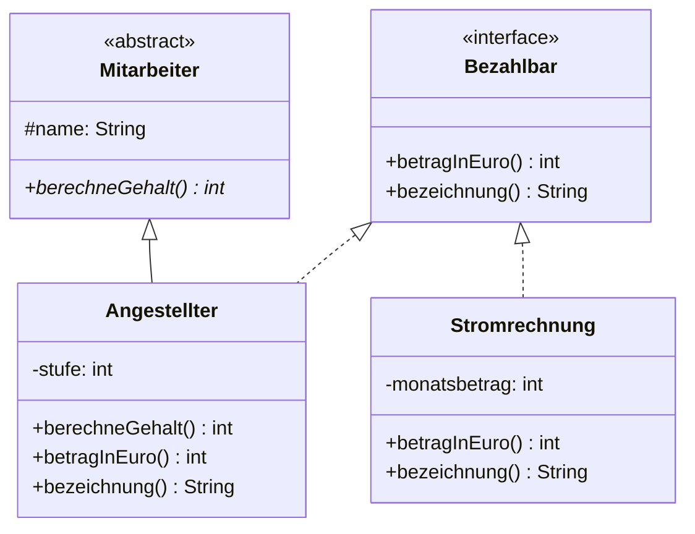

# Schnittstellen

:::alert{info}
**Nur Leistungskurs.** Diese Lektion gehört zu den zusätzlichen Anforderungen des Leistungskurses. Im Grundkurs kannst du sie überspringen – der [Rückblick](./07-rueckblick) kennzeichnet die Aufgaben, die sie voraussetzen.
:::

<!-- KLP QPh LK, Daten und ihre Strukturierung: Klassenbeziehungen ... Schnittstellen; modellieren objektorientierte Entwuerfe mit Klassen, Schnittstellen und ihren Beziehungen (M); implementieren Klassen und Schnittstellen (I) -->

## Das Problem

Eine abstrakte Klasse löst ein Problem: Sie erzwingt, dass alle Unterklassen eine bestimmte Methode anbieten. Aber sie hat eine harte Grenze.

:::snippet{#aufgabe}
**Aufgabe: Warum reicht eine abstrakte Klasse nicht?**

In deinem Spiel gibt es Klassen, die sich bewegen können: `Spieler`, `Gegner`, `Geschoss`. Sie alle erben bereits von `Sprite`.

Du möchtest zusätzlich erzwingen, dass jede von ihnen eine Methode `beschleunige(double pFaktor)` anbietet.

a) Warum kannst du dafür **keine** abstrakte Klasse `Beweglich` einsetzen?

b) Man könnte `Beweglich` zwischen `Sprite` und `Spieler` schieben. Unter welcher Bedingung geht das – und woran scheitert es, sobald eine Kamerafahrt beweglich sein soll, die kein Sprite ist?
:::

:::protect{password="java-q-1-6-1" description="Lösung. Erfrage das Passwort bei deiner Lehrkraft."}

a) Weil eine Klasse in Java nur von **einer** Oberklasse erben kann. `Spieler` erbt schon von `Sprite` – für `Beweglich` ist kein Platz mehr.

b) Es geht genau dann, wenn wirklich **alle** beweglichen Dinge auch Sprites sind. Dann ist `Beweglich` eine Zwischenebene in derselben Kette.

Sobald ein bewegliches Objekt kein Sprite ist – eine Kamerafahrt, ein Zeitverlauf, ein Diagrammbalken –, bricht der Entwurf: Man müsste die Kamerafahrt zu einem Sprite machen (und damit zu etwas, das sie nicht ist), oder eine zweite Kette daneben aufmachen und die Gemeinsamkeit aufgeben.

Das Muster dahinter kennst du aus [1.3](./03-generalisierung-und-spezialisierung): **Beweglichkeit ist eine Fähigkeit, keine Art.** Fähigkeiten liegen quer zur Vererbungshierarchie – und dafür ist eine Oberklasse das falsche Werkzeug.

:::

## Die Lösung

:::snippet{#definition}
Eine **Schnittstelle** (englisch *interface*) legt fest, welche Methoden eine Klasse anbieten muss – **ohne** etwas über deren Umsetzung zu sagen und **ohne** in die Vererbungshierarchie einzugreifen.

Eine Klasse kann von **einer** Klasse erben, aber **beliebig viele** Schnittstellen erfüllen.
:::

:::onlineide{height="740px" speed="1000000"}

```java Main.java
void main() {
    Bezahlbar[] posten = new Bezahlbar[3];
    posten[0] = new Angestellter("Ada", 4);
    posten[1] = new Stromrechnung(240);
    posten[2] = new Angestellter("Alan", 3);

    int summe = 0;
    for (int i = 0; i < posten.length; i++) {
        IO.println(posten[i].bezeichnung() + ": " + posten[i].betragInEuro() + " Euro");
        summe = summe + posten[i].betragInEuro();
    }
    IO.println("Monatliche Ausgaben: " + summe + " Euro");
}
```

```java Bezahlbar.java
/**
 * Etwas, das monatlich Geld kostet.
 */
public interface Bezahlbar {

    /** Liefert den monatlichen Betrag in vollen Euro. */
    int betragInEuro();

    /** Liefert eine kurze Bezeichnung des Postens. */
    String bezeichnung();
}
```

```java Mitarbeiter.java
public abstract class Mitarbeiter {

    protected String name;

    public Mitarbeiter(String pName) {
        name = pName;
    }

    public String getName() {
        return name;
    }

    public abstract int berechneGehalt();
}
```

```java Angestellter.java
public class Angestellter extends Mitarbeiter implements Bezahlbar {

    private int stufe;

    public Angestellter(String pName, int pStufe) {
        super(pName);
        stufe = pStufe;
    }

    public int berechneGehalt() {
        return stufe * 1000;
    }

    public int betragInEuro() {
        return berechneGehalt();
    }

    public String bezeichnung() {
        return "Gehalt " + name;
    }
}
```

```java Stromrechnung.java
public class Stromrechnung implements Bezahlbar {

    private int monatsbetrag;

    public Stromrechnung(int pBetrag) {
        monatsbetrag = pBetrag;
    }

    public int betragInEuro() {
        return monatsbetrag;
    }

    public String bezeichnung() {
        return "Strom";
    }
}
```

:::

:::snippet{#merken}
- `interface Bezahlbar` deklariert nur **Signaturen**. Alle Methoden sind automatisch öffentlich und abstrakt – man schreibt `public abstract` nicht dazu.
- `class Angestellter extends Mitarbeiter implements Bezahlbar` – **erst** die Oberklasse, **dann** die Schnittstellen.
- Eine Klasse darf mehrere Schnittstellen erfüllen: `implements Bezahlbar, Vergleichbar, Speicherbar`.
- **Eine Schnittstelle ist ein Typ.** Deshalb geht `Bezahlbar[] posten` – obwohl `Angestellter` und `Stromrechnung` sonst nichts miteinander zu tun haben und keine gemeinsame Oberklasse besitzen.

Im Diagramm schreibt man `<<interface>>` über den Namen und verbindet die erfüllende Klasse mit einem **gestrichelten** Pfeil mit leerem Dreieck.
:::



## Abstrakte Klasse oder Schnittstelle?

:::snippet{#merken}
| | abstrakte Klasse | Schnittstelle |
| --- | --- | --- |
| Attribute mit Zustand | ja | **nein** |
| Konstanten | ja | ja (`public static final`) |
| Konstruktor | ja | **nein** |
| Methodenrümpfe | ja | **nein** |
| wie viele pro Klasse? | genau eine | **beliebig viele** |
| Beziehung | „**ist ein**" | „**kann etwas**" |

**Faustregel:** Teilen die Klassen gemeinsamen Zustand und gemeinsames Verhalten? Dann abstrakte Klasse. Teilen sie nur eine **Fähigkeit**, sind aber sonst grundverschieden? Dann Schnittstelle.

Ein Angestellter **ist ein** Mitarbeiter. Eine Stromrechnung **ist kein** Mitarbeiter – aber beide **können bezahlt werden**.
:::

:::alert{info}
Eine Konstante in einer Schnittstelle muss in der Online-IDE ausdrücklich `public static final` heißen und wird in den erfüllenden Klassen **mit dem Schnittstellennamen davor** angesprochen: `Bezahlbar.WAEHRUNG`. In echtem Java genügt beides Mal weniger. Konstanten in Schnittstellen sind ohnehin selten – im Zweifel gehören sie in die Klasse, die sie braucht.
:::

---

## Teil 1: Lesen

### Aufgabe 1: Sechs Fälle entscheiden

:::snippet{#aufgabe}
*Ohne Rechner.* Entscheide für jeden Fall: **abstrakte Klasse** oder **Schnittstelle**? Begründe jedes Mal mit einem Kriterium aus der Vergleichstabelle – nicht mit dem Gefühl.
:::

a) `Fahrzeug` für `Auto`, `Fahrrad`, `LKW`

b) `Speicherbar` für alles, was sich in eine Datei schreiben lässt

c) `Konto` für `Girokonto` und `Sparkonto`

d) `Vergleichbar` für alles, was sich der Größe nach ordnen lässt

e) `Gegner` für `Zombie`, `Skelett`, `Drache` – alle haben Lebenspunkte und eine Position

f) `Fliegend` für `Drache`, `Pfeil` und `Kamerafahrt`

:::protect{password="java-q-1-6-2" description="Lösung. Erfrage das Passwort bei deiner Lehrkraft."}

| | Entscheidung | Kriterium |
| --- | --- | --- |
| a) | **abstrakte Klasse** | gemeinsamer **Zustand** (Geschwindigkeit, Position) und gemeinsame Methodenrümpfe |
| b) | **Schnittstelle** | Ein Bild, ein Spielstand und ein Adressbuch teilen **nur die Fähigkeit**, sonst nichts |
| c) | **abstrakte Klasse** | gemeinsamer Zustand (Kontostand, Besitzer) und gemeinsames Verhalten (einzahlen) |
| d) | **Schnittstelle** | Zahlen, Wörter, Personen und Termine haben außer der Vergleichbarkeit nichts gemeinsam |
| e) | **abstrakte Klasse** | gemeinsamer Zustand (Lebenspunkte, Position), den eine Schnittstelle gar nicht halten könnte |
| f) | **Schnittstelle** | `Drache` ist ein Gegner, `Kamerafahrt` nicht – die Fähigkeit liegt **quer** zur Hierarchie |

e) und f) zusammen sind der Kern: In **einem** Programm gibt es beides nebeneinander. `Drache extends Gegner implements Fliegend` – die abstrakte Klasse sagt, **was er ist**, die Schnittstelle sagt, **was er kann**. Die Frage lautet nie „welches von beiden nehme ich", sondern immer: *Ist das eine Art oder eine Fähigkeit?*

:::

### Aufgabe 2: Was steht so nicht in einer Schnittstelle?

:::snippet{#aufgabe}
*Ohne Rechner.* In der folgenden Schnittstelle stecken **vier** Fehler. Finde sie, sag zu jedem, warum er einer ist, und schreib die berichtigte Fassung auf.
:::

```java
public interface Druckbar {

    private int seitenzahl;

    public Druckbar(int pSeitenzahl) {
        seitenzahl = pSeitenzahl;
    }

    String kopfzeile();

    int seiten() {
        return seitenzahl;
    }

    void drucke();
}
```

::::collapsible{title="Tipp: eine Schnittstelle sagt nur, was sein muss"}

Geh die Vergleichstabelle Zeile für Zeile durch. Drei der vier Fehler stehen dort ausdrücklich mit **nein** in der rechten Spalte.

Der vierte hängt mit dem ersten zusammen: Wenn das eine nicht geht, kann das andere auch nicht gehen.

::::

:::protect{password="java-q-1-6-3" description="Lösung. Erfrage das Passwort bei deiner Lehrkraft."}

| # | Fehler | Warum |
| --- | --- | --- |
| 1 | `private int seitenzahl;` | Eine Schnittstelle hat **keinen Zustand**. Erlaubt wäre nur eine Konstante (`public static final int MAX_SEITEN = 100;`). |
| 2 | der Konstruktor | Eine Schnittstelle wird nie erzeugt – es gibt nichts zu initialisieren. |
| 3 | `int seiten()` hat einen **Rumpf** | Eine Schnittstelle deklariert nur Signaturen; jede Methode endet mit einem Semikolon. |
| 4 | der Rumpf greift auf `seitenzahl` zu | Folgefehler zu 1: Das Attribut gibt es nicht – und selbst wenn, hätte die Schnittstelle kein Objekt, in dem es steckte. |

Berichtigt:

```java
public interface Druckbar {

    String kopfzeile();

    int seiten();

    void drucke();
}
```

Wer die Seitenzahl speichern will, tut das in der **Klasse**, die `Druckbar` erfüllt:

```java
public class Referat implements Druckbar {

    private int seitenzahl;

    public Referat(int pSeitenzahl) {
        seitenzahl = pSeitenzahl;
    }

    public int seiten() {
        return seitenzahl;
    }

    // kopfzeile() und drucke() ebenfalls
}
```

Die Aufteilung ist immer dieselbe: **Die Schnittstelle sagt, was sein muss. Die Klasse sagt, wie.**

:::

---

## Teil 2: Schreiben

### Aufgabe 3: Vergleichbar

Diese Schnittstelle brauchst du im Kapitel über Bäume wieder – dort heißt sie in der NRW-Klassenbibliothek `ComparableContent`.

:::snippet{#aufgabe}
Setze die Schnittstelle und die beiden erfüllenden Klassen so um, dass alle Tests grün werden.

Die Sortiermethode in `Sortierer` soll **beliebige** vergleichbare Objekte sortieren können – ohne zu wissen, worum es sich handelt. Sie darf deshalb weder `Buch` noch `Person` erwähnen.
:::

:::onlineide{height="800px" speed="1000000"}

```java Main.java
void main() {
    IO.println("Führe die Tests über den Reiter Testrunner aus.");
}
```

```java Vergleichbar.java
/**
 * Etwas, das sich mit seinesgleichen der Größe nach vergleichen lässt.
 */
public interface Vergleichbar {

    /** Liefert true, wenn dieses Objekt größer als pAnderes ist. */
    boolean istGroesserAls(Vergleichbar pAnderes);
}
```

```java Buch.java
public class Buch implements Vergleichbar {

    private String titel;
    private int seiten;

    public Buch(String pTitel, int pSeiten) {
        titel = pTitel;
        seiten = pSeiten;
    }

    public String getTitel() {
        return titel;
    }

    public int getSeiten() {
        return seiten;
    }

    /** Ein Buch ist größer, wenn es mehr Seiten hat. */
    public boolean istGroesserAls(Vergleichbar pAnderes) {
        return false; // ersetze diese Zeile
    }
}
```

```java Person.java
public class Person implements Vergleichbar {

    private String name;
    private int alter;

    public Person(String pName, int pAlter) {
        name = pName;
        alter = pAlter;
    }

    public String getName() {
        return name;
    }

    public int getAlter() {
        return alter;
    }

    /** Eine Person ist größer, wenn sie älter ist. */
    public boolean istGroesserAls(Vergleichbar pAnderes) {
        return false; // ersetze diese Zeile
    }
}
```

```java Sortierer.java
public class Sortierer {

    /**
     * Sortiert das Feld aufsteigend durch Auswählen.
     * Funktioniert für alles, was die Schnittstelle Vergleichbar erfüllt.
     */
    public void sortiere(Vergleichbar[] pWerte) {
        // ergänze diese Methode
    }
}
```

```java VergleichbarTest.java
@Test
class VergleichbarTest {

    @Test
    void testBuchVergleich() {
        Buch a = new Buch("Kurz", 100);
        Buch b = new Buch("Lang", 500);
        assertTrue(b.istGroesserAls(a), "Das dickere Buch ist größer.");
        assertFalse(a.istGroesserAls(b), "Das dünnere nicht.");
        assertFalse(a.istGroesserAls(a), "Ein Buch ist nicht größer als es selbst.");
    }

    @Test
    void testPersonVergleich() {
        Person a = new Person("Ada", 30);
        Person b = new Person("Alan", 45);
        assertTrue(b.istGroesserAls(a), "Die ältere Person ist größer.");
        assertFalse(a.istGroesserAls(b), "Die jüngere nicht.");
    }

    @Test
    void testSortiereBuecher() {
        Buch[] buecher = new Buch[3];
        buecher[0] = new Buch("Mittel", 300);
        buecher[1] = new Buch("Lang", 500);
        buecher[2] = new Buch("Kurz", 100);

        new Sortierer().sortiere(buecher);

        assertEquals("Kurz", buecher[0].getTitel(), "Vorne steht das dünnste Buch.");
        assertEquals("Mittel", buecher[1].getTitel(), "Dann das mittlere.");
        assertEquals("Lang", buecher[2].getTitel(), "Hinten das dickste.");
    }

    @Test
    void testSortierePersonen() {
        Person[] leute = new Person[3];
        leute[0] = new Person("Alan", 45);
        leute[1] = new Person("Ada", 30);
        leute[2] = new Person("Grace", 60);

        new Sortierer().sortiere(leute);

        assertEquals("Ada", leute[0].getName(), "Vorne steht die jüngste Person.");
        assertEquals("Alan", leute[1].getName(), "Dann die mittlere.");
        assertEquals("Grace", leute[2].getName(), "Hinten die älteste.");
    }

    @Test
    void testSchonSortiert() {
        Buch[] buecher = new Buch[3];
        buecher[0] = new Buch("Kurz", 100);
        buecher[1] = new Buch("Mittel", 300);
        buecher[2] = new Buch("Lang", 500);

        new Sortierer().sortiere(buecher);

        assertEquals("Kurz", buecher[0].getTitel(), "Ein sortiertes Feld bleibt sortiert.");
        assertEquals("Lang", buecher[2].getTitel(), "Auch hinten.");
    }

    @Test
    void testSortiereSonderfaelle() {
        Sortierer s = new Sortierer();

        Vergleichbar[] leer = new Vergleichbar[0];
        s.sortiere(leer);
        assertEquals(0, leer.length, "Das leere Feld bleibt leer.");

        Buch[] eins = new Buch[1];
        eins[0] = new Buch("Einzeln", 42);
        s.sortiere(eins);
        assertEquals("Einzeln", eins[0].getTitel(), "Ein einzelnes Element bleibt stehen.");
    }
}
```

:::

::::collapsible{title="Tipp 1: Der Vergleich in Buch"}

Der Parameter ist vom Typ `Vergleichbar` – und die Schnittstelle kennt keine Seitenzahl. Du musst ihn also erst in ein `Buch` umwandeln:

```java
Buch anderes = (Buch) pAnderes;
return seiten > anderes.getSeiten();
```

Das ist eine der wenigen Stellen, an denen eine Typumwandlung nach unten sachlich richtig ist: Ein Buch kann sich sinnvollerweise nur mit einem anderen Buch vergleichen.

::::

::::collapsible{title="Tipp 2: Der Sortierer"}

Es ist genau das Sortieren durch Auswählen aus der Einführungsphase. Nur der Vergleich sieht anders aus: statt `pWerte[j] < pWerte[kleinstesIndex]` heißt es jetzt

```java
pWerte[kleinstesIndex].istGroesserAls(pWerte[j])
```

Und der Merker beim Tauschen hat den Typ `Vergleichbar` statt `int`.

::::

::::collapsible{title="Tipp 3: Warum funktioniert das für Bücher und Personen zugleich?"}

Weil `Sortierer` gar nicht wissen muss, was er sortiert. Er weiß nur: Jedes Element **kann** sich mit einem anderen vergleichen. Wie es das tut, ist Sache der jeweiligen Klasse.

Genau dafür sind Schnittstellen da.

::::

:::protect{password="java-q-1-6-4" description="Lösung. Erfrage das Passwort bei deiner Lehrkraft."}

```java Buch.java
    public boolean istGroesserAls(Vergleichbar pAnderes) {
        Buch anderes = (Buch) pAnderes;
        return seiten > anderes.getSeiten();
    }
```

```java Person.java
    public boolean istGroesserAls(Vergleichbar pAnderes) {
        Person andere = (Person) pAnderes;
        return alter > andere.getAlter();
    }
```

```java Sortierer.java
public class Sortierer {

    public void sortiere(Vergleichbar[] pWerte) {
        for (int i = 0; i < pWerte.length - 1; i++) {
            int kleinstesIndex = i;

            for (int j = i + 1; j < pWerte.length; j++) {
                if (pWerte[kleinstesIndex].istGroesserAls(pWerte[j])) {
                    kleinstesIndex = j;
                }
            }

            Vergleichbar merker = pWerte[i];
            pWerte[i] = pWerte[kleinstesIndex];
            pWerte[kleinstesIndex] = merker;
        }
    }
}
```

Drei Dinge, auf die es ankam:

- **Der Test übergibt ein `Buch[]` an eine Methode, die ein `Vergleichbar[]` erwartet.** Das geht, weil jedes Buch ein Vergleichbar ist. Und der Tausch innerhalb des Feldes funktioniert, weil dort weiterhin nur Bücher liegen.
- **Die Schleife läuft bis `pWerte.length - 1`.** Beim leeren Feld ist das `-1`, die Schleife läuft also null-mal – der Sonderfall erledigt sich von selbst.
- **`Sortierer` erwähnt weder `Buch` noch `Person`.** Genau das war verlangt, und genau das macht die Klasse für jeden künftigen vergleichbaren Typ brauchbar, ohne sie anzufassen.

Die Umwandlung in `istGroesserAls` ist die Schwachstelle des Entwurfs: Vergleicht jemand ein Buch mit einer Person, bricht das Programm zur Laufzeit ab. Sauber lösen lässt sich das erst mit **Generik** – nachzulesen in [2.3 Generische Klassen](../02-felder-referenzen-generik/03-generische-klassen). Genau deshalb heißt die NRW-Schnittstelle `ComparableContent<ContentType>` und nicht einfach `Vergleichbar`.

:::

---

## Zum Weiterdenken

### Vertiefung 1: Zwei Fähigkeiten auf einmal

:::snippet{#brain}
Eine Klasse darf beliebig viele Schnittstellen erfüllen – und wird dadurch in mehreren, voneinander unabhängigen Zusammenhängen verwendbar.

a) Sag voraus, was das Programm ausgibt.

b) `Notiz` steht in **zwei** Feldern verschiedenen Typs. Erkläre, warum dasselbe Objekt beide Male hineinpasst, und was in jedem Zusammenhang von ihm sichtbar ist.

c) Ergänze eine Klasse `Termin`, die nur `Speicherbar` erfüllt. Was ändert sich am Hauptprogramm? Was ändert sich an den beiden Feldern?

d) Beurteile: Warum ist es besser, zwei kleine Schnittstellen mit je einer Methode zu haben, als eine große mit beiden?
:::

:::onlineide{height="700px" speed="1000000"}

```java Main.java
void main() {
    Notiz kurz = new Notiz("Milch");
    Notiz lang = new Notiz("Hausaufgabe Informatik");

    Speicherbar[] ablage = new Speicherbar[2];
    ablage[0] = kurz;
    ablage[1] = lang;

    for (int i = 0; i < ablage.length; i++) {
        IO.println(ablage[i].alsZeile());
    }

    Vergleichbar[] zuSortieren = new Vergleichbar[2];
    zuSortieren[0] = kurz;
    zuSortieren[1] = lang;

    IO.println("lang ist groesser: " + zuSortieren[1].istGroesserAls(zuSortieren[0]));
}
```

```java Speicherbar.java
public interface Speicherbar {

    /** Liefert das Objekt als eine Zeile Text. */
    String alsZeile();
}
```

```java Vergleichbar.java
public interface Vergleichbar {

    boolean istGroesserAls(Vergleichbar pAnderes);
}
```

```java Notiz.java
public class Notiz implements Speicherbar, Vergleichbar {

    private String text;

    public Notiz(String pText) {
        text = pText;
    }

    public String getText() {
        return text;
    }

    public String alsZeile() {
        return "Notiz;" + text;
    }

    /** Eine Notiz ist größer, wenn ihr Text länger ist. */
    public boolean istGroesserAls(Vergleichbar pAnderes) {
        Notiz andere = (Notiz) pAnderes;
        return text.length() > andere.getText().length();
    }
}
```

:::

:::protect{password="java-q-1-6-5" description="Lösung. Erfrage das Passwort bei deiner Lehrkraft."}

a)

```
Notiz;Milch
Notiz;Hausaufgabe Informatik
lang ist groesser: true
```

b) Dasselbe Objekt hat **drei** Typen: `Notiz`, `Speicherbar` und `Vergleichbar`. Jede Schnittstelle, die eine Klasse erfüllt, ist ein zusätzlicher Typ, unter dem ihre Objekte angesprochen werden können.

Sichtbar ist jedes Mal nur, was der jeweilige Typ verspricht: Über `ablage[0]` darf man `alsZeile()` aufrufen, aber nicht `istGroesserAls(...)` – und über `zuSortieren[0]` genau umgekehrt. `getText()` ist über keinen der beiden erreichbar, nur über den Typ `Notiz` selbst.

c) Am Hauptprogramm ändert sich **nichts** außer der Zeile, die das Objekt erzeugt und ins Feld legt. `Termin` passt in `Speicherbar[]`, nicht in `Vergleichbar[]` – und zwar mit einer Fehlermeldung des Übersetzers, nicht mit einem Absturz. Die Typprüfung macht genau das, wofür sie da ist.

d) Weil eine Klasse dann nur das versprechen muss, was sie wirklich kann. Gäbe es nur eine große Schnittstelle `SpeicherbarUndVergleichbar`, müsste `Termin` eine Vergleichsmethode anbieten, obwohl Termine sich nicht der Größe nach ordnen lassen – und würde sie mit `return false;` oder einer Notlüge füllen. Genau das ist die Sorte Rumpf, die abstrakte Methoden in [1.5](./05-abstrakte-klassen) abschaffen sollten.

**Die Regel dahinter:** Lieber viele kleine Zusicherungen als eine große. Wer eine Schnittstelle erfüllt, soll jede ihrer Methoden auch sinnvoll ausfüllen können.

:::

### Vertiefung 2: Warum gibt es keine Mehrfachvererbung?

:::snippet{#brain}
Java erlaubt beliebig viele Schnittstellen, aber nur **eine** Oberklasse. C++ erlaubt beides. Der Grund für Javas Entscheidung heißt **Diamantproblem**.

a) Angenommen, `Angestellter` erbte von `Mitarbeiter` **und** von `Bezahlbar`, und beide wären Klassen mit einer Methode `zahle()` **mit Rumpf**. Welche Frage kann dann niemand beantworten?

b) Bei Schnittstellen stellt sich diese Frage nicht. Warum nicht? Was fehlt ihnen, das den Konflikt erst entstehen lässt?

c) Zwei Schnittstellen deklarieren beide `int wert();` – mit identischer Signatur. Eine Klasse erfüllt beide. Gibt es hier ein Problem?

d) Seit Java 8 dürfen Schnittstellen **Standardmethoden** mit Rumpf haben (`default int wert() { return 0; }`). Damit ist ein Teil des Diamantproblems zurück. Wie könnte Java das gelöst haben? Überlege selbst, bevor du nachschlägst.
:::

:::protect{password="java-q-1-6-6" description="Lösung. Erfrage das Passwort bei deiner Lehrkraft."}

a) *Welche der beiden geerbten Fassungen von `zahle()` gilt für einen `Angestellter`?* Es gibt keine sachliche Antwort: Beide sind gleich berechtigt, und jede Vorschrift („die erste in der `extends`-Liste") wäre willkürlich. Verschärft wird es, wenn beide Oberklassen ihrerseits von derselben Klasse erben – dann erbt die untere Klasse dasselbe Attribut möglicherweise zweimal. Von der Form dieser Vererbungsfigur hat das Problem seinen Namen.

b) Weil Schnittstellen **keine Rümpfe** haben. Es gibt nichts zu wählen: Beide sagen nur, dass es die Methode geben muss, und die Klasse liefert **eine** Umsetzung, die beide Zusagen zugleich erfüllt. Kein Zustand, kein Rumpf, kein Konflikt.

c) **Nein.** Die Klasse schreibt `int wert()` genau einmal hin und erfüllt damit beide Schnittstellen. Zwei identische Versprechen sind kein Widerspruch – man muss sie nur einmal halten.

Etwas anderes wäre es, wenn die Signaturen sich nur im **Rückgabetyp** unterschieden (`int wert()` und `String wert()`). Das ließe sich nicht erfüllen, und der Übersetzer lehnt es ab.

d) Die naheliegende Lösung ist auch Javas Lösung: **Bei einem Konflikt muss die Klasse selbst entscheiden.** Erbt eine Klasse zwei Standardmethoden mit gleicher Signatur, ist das ein Übersetzungsfehler, solange sie die Methode nicht selbst überschreibt. Sie darf dabei ausdrücklich eine der beiden auswählen (`Speicherbar.super.wert()`).

Das ist die allgemeine Linie, die sich durch dieses ganze Kapitel zieht: **Wo etwas mehrdeutig wäre, verlangt die Sprache eine Entscheidung – und zwar beim Übersetzen.** Lieber ein Fehler, der einen zwingt, sich zu erklären, als ein Programm, das eine Fassung errät.

:::

---

## Selbsttest

::::multievent

**1. Wie viele Schnittstellen kann eine Klasse erfüllen?**

{r1{genau eine}}

{r1{!beliebig viele}}

{r1{höchstens zwei}}

{h{Bei Oberklassen ist es genau eine - hier nicht.}}
{H{Richtig! Genau darin liegt der Hauptvorteil.}}

**2. Was darf eine Schnittstelle nicht haben?** (Mehrfachauswahl)

{c1{!Attribute mit veränderlichen Werten}}

{c1{!einen Konstruktor}}

{c1{Methodensignaturen}}

{c1{einen Namen}}

{h{Sie legt fest, was eine Klasse können muss - nicht, wie sie es tut.}}
{H{Richtig! Nur Konstanten sind erlaubt.}}

**3. In welcher Reihenfolge stehen extends und implements?**

{r2{!erst extends, dann implements}}

{r2{erst implements, dann extends}}

{r2{die Reihenfolge ist egal}}

{h{Die Oberklasse steht direkt hinter dem Klassennamen.}}
{H{Richtig!}}

**4. Welche Faustregel unterscheidet Schnittstelle von abstrakter Klasse?**

{r3{groß gegen klein}}

{r3{!ist ein gegen kann etwas}}

{r3{öffentlich gegen privat}}

{h{Ein Angestellter ist ein Mitarbeiter, eine Stromrechnung kann bezahlt werden.}}
{H{Richtig!}}

**5. Warum kann der Sortierer sowohl Bücher als auch Personen sortieren?**

{r4{weil beide von derselben Oberklasse erben}}

{r4{!weil beide dieselbe Schnittstelle erfüllen}}

{r4{weil Java das automatisch erkennt}}

{h{Bücher und Personen haben sonst nichts gemeinsam.}}
{H{Richtig! Der Sortierer weiß nur, dass sich die Elemente vergleichen können.}}

**6. Warum erlaubt Java mehrere Schnittstellen, aber nur eine Oberklasse?**

{r5{weil Schnittstellen kürzer sind}}

{r5{!weil Schnittstellen ohne Rümpfe auskommen und deshalb nichts mehrdeutig werden kann}}

{r5{weil Oberklassen abstrakt sein müssen}}

{h{Was wäre, wenn zwei Oberklassen dieselbe Methode mit Rumpf mitbrächten?}}
{H{Richtig - das nennt man das Diamantproblem.}}

**7. Eine Klasse erfüllt zwei Schnittstellen. Wie viele Typen hat ein Objekt davon?**

{r6{einen}}

{r6{zwei}}

{r6{!drei - die Klasse und beide Schnittstellen}}

{h{Jede erfüllte Schnittstelle ist ein zusätzlicher Typ.}}
{H{Richtig - und über jeden sieht man nur, was er verspricht.}}

::::
