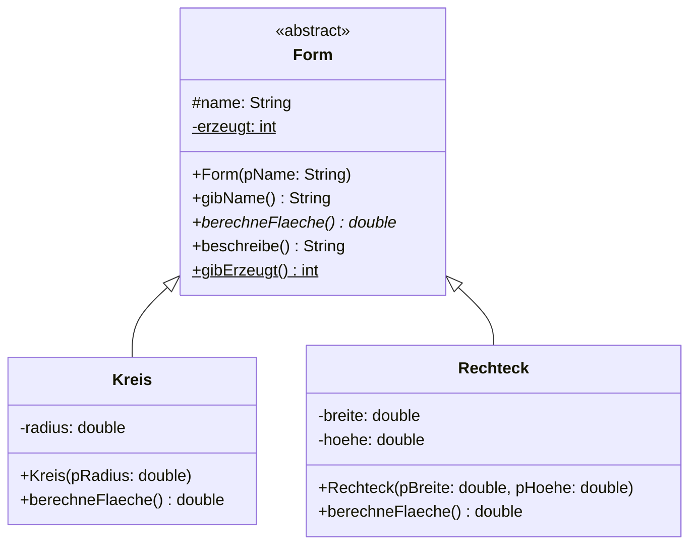
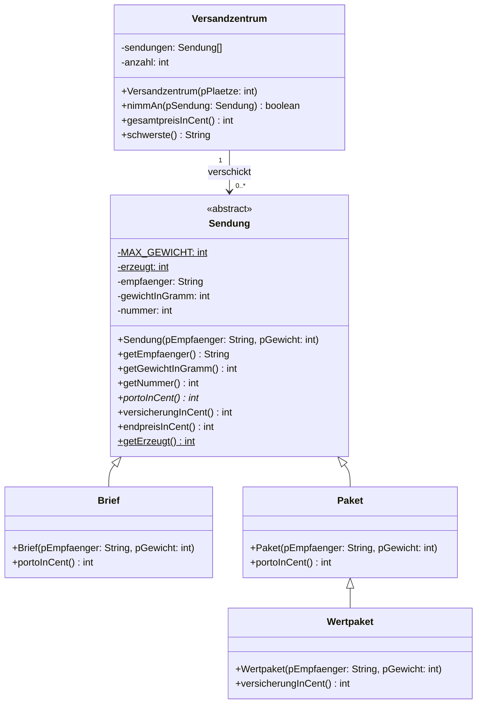
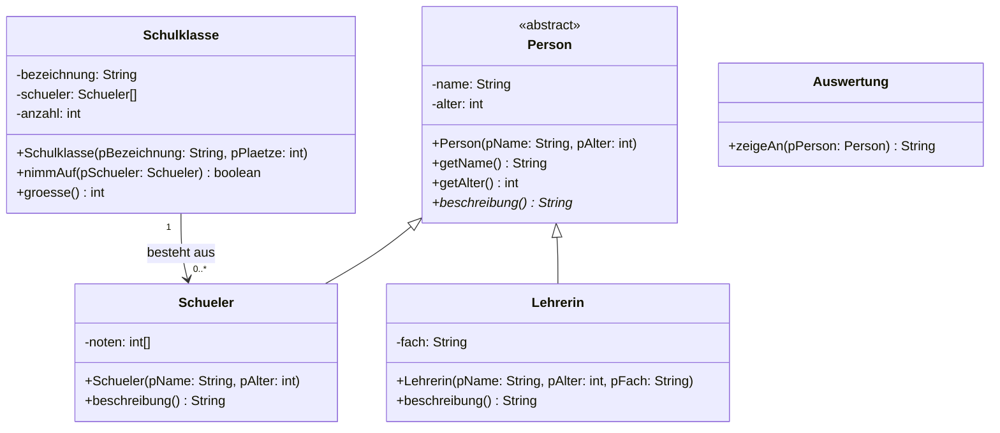

# Rückblick

In diesem Kapitel ging es nur zum kleineren Teil um neue Sprachmittel. Der größere Teil waren **Entwurfsentscheidungen**: Wann zieht man Gemeinsames nach oben? Wann genügt eine Zusicherung, wann braucht es eine gemeinsame Oberklasse? Wann ist `static` richtig und wann ein Warnzeichen?

Genau danach wird in der Qualifikationsphase gefragt – und zwar selten mit „setze um", sondern meistens mit **„begründe"** und **„beurteile"**.

## Das kann ich jetzt

- [ ] Ich kann ein **Implementationsdiagramm** lesen und in ein Klassengerüst übersetzen – und umgekehrt. ([1.1](./01-implementationsdiagramme))
- [ ] Ich kenne die Zeichen für die Sichtbarkeiten, die Notation für Beziehungen und weiß, was unterstrichen bedeutet. ([1.1](./01-implementationsdiagramme), [1.2](./02-klassenattribute-und-konstanten))
- [ ] Ich unterscheide **Objektattribut** und **Klassenattribut** *(LK: dazu die **Konstante**)* und kann jede Wahl begründen. ([1.2](./02-klassenattribute-und-konstanten))
- [ ] Ich entscheide mit dem **„ist ein"-Test**, ob eine Vererbung oder eine Assoziation richtig ist. ([1.3](./03-generalisierung-und-spezialisierung))
- [ ] Ich kann sagen, **was** beim Generalisieren nach oben gehört und was unten bleibt. ([1.3](./03-generalisierung-und-spezialisierung))
- [ ] Ich kann **Polymorphie** an einem Beispiel erklären und sagen, wann entschieden wird, welche Methode läuft. ([1.4](./04-polymorphie))
- [ ] Ich unterscheide **statischen** und **dynamischen Typ** und weiß, worüber jeder entscheidet. ([1.4](./04-polymorphie))
- [ ] Ich kann begründen, wann eine Klasse **abstrakt** sein sollte. ([1.5](./05-abstrakte-klassen))
- [ ] *(LK)* Ich kann eine **Schnittstelle** von einer abstrakten Klasse unterscheiden und beide einsetzen. ([1.6](./06-schnittstellen))

## Wo stehe ich?

Geh die Tabelle Zeile für Zeile durch und kreuze ehrlich an. Für jede Zeile, die du **nicht** ankreuzen kannst, steht rechts die Stelle, an der es steht.

| | Das kann ich | Wenn nicht: hier steht es |
| --- | --- | --- |
| ☐ | Ich schreibe aus einem Diagramm ein Klassengerüst, ohne etwas zu erfinden. | [1.1 Vom Diagramm zum Quelltext](./01-implementationsdiagramme) |
| ☐ | Ich zeichne aus einer Klasse ein Diagramm – **mit** den privaten Methoden. | [1.1 Aufgabe 1](./01-implementationsdiagramme) |
| ☐ | Ich weiß, was ein Diagramm grundsätzlich nicht ausdrücken kann. | [1.1 Vertiefung 1](./01-implementationsdiagramme) |
| ☐ | Ich erkenne, ob eine Angabe zum Objekt oder zur Klasse gehört. | [1.2 Ein Wert für die ganze Klasse](./02-klassenattribute-und-konstanten) |
| ☐ | *(LK)* Ich schreibe eine Konstante richtig hin und weiß, was `final` schützt. | [1.2 Konstanten](./02-klassenattribute-und-konstanten) |
| ☐ | Ich entscheide zwischen Vererbung und Assoziation. | [1.3 Der „ist ein"-Test](./03-generalisierung-und-spezialisierung) |
| ☐ | Ich weiß, was beim Zusammenziehen nach oben gehört und was nicht. | [1.3 Was gehört nach oben?](./03-generalisierung-und-spezialisierung) |
| ☐ | Ich kann begründen, warum `private` meist besser ist als `protected`. | [1.3 Wie weit macht man auf?](./03-generalisierung-und-spezialisierung) |
| ☐ | Ich sage voraus, welche Fassung einer überschriebenen Methode läuft. | [1.4 Aufgabe 1](./04-polymorphie) |
| ☐ | Ich sage voraus, welche Zeilen sich übersetzen lassen und welche nicht. | [1.4 Aufgabe 2](./04-polymorphie) |
| ☐ | Ich kann erklären, warum eine neue Unterklasse keine Änderung erzwingt. | [1.4 Der eigentliche Gewinn](./04-polymorphie) |
| ☐ | Ich weiß, was eine abstrakte Klasse verbietet – und was sie erlaubt. | [1.5 Aufgabe 1](./05-abstrakte-klassen) |
| ☐ | Ich begründe, ob eine Oberklasse abstrakt sein sollte. | [1.5 Wann abstrakt, wann konkret?](./05-abstrakte-klassen) |
| ☐ | *(LK)* Ich entscheide zwischen abstrakter Klasse und Schnittstelle. | [1.6 Abstrakte Klasse oder Schnittstelle?](./06-schnittstellen) |

Ein bis zwei nicht angekreuzte Zeilen aufzuarbeiten ist ein realistisches Programm für diese Woche. Bei mehr als vier lohnt es sich, mit [1.3](./03-generalisierung-und-spezialisierung) anzufangen – darauf bauen die übrigen auf.

:::alert{info}
Aufgabe 4 gehört zum **Leistungskurs**, weil sie Schnittstellen voraussetzt.
:::

---

## Gemischte Aufgaben

### Aufgabe 1: Diagramm lesen und schreiben

:::snippet{#aufgabe}
*Ohne Rechner.*
:::



a) Schreib das Klassengerüst zu `Form` und `Kreis` – ohne Methodenrümpfe, nur Köpfe, Sichtbarkeiten und Typen.

b) Warum ist `name` mit `#` gekennzeichnet und nicht mit `-`? Was wäre der Nachteil von `-`, und was der Nachteil von `#`?

c) `berechneFlaeche` ist abstrakt. Was folgt daraus für `Form`, und was für jede Unterklasse?

d) `beschreibe()` ist **nicht** abstrakt, obwohl sie die Fläche nennen soll. Wie kann das funktionieren, wenn `Form` gar nicht weiß, wie man die Fläche berechnet?

e) `erzeugt` und `gibErzeugt()` sind unterstrichen. Was heißt das, und wo im Quelltext wird `erzeugt` erhöht?

::::collapsible{title="Tipp zu d)"}

Eine nicht abstrakte Methode in der Oberklasse darf eine abstrakte Methode derselben Klasse aufrufen. Zur Laufzeit steht ja fest, welches Objekt gemeint ist – und damit auch, welche Fassung von `berechneFlaeche` gilt.

::::

:::protect{password="java-q-1-7-1" description="Lösung. Erfrage das Passwort bei deiner Lehrkraft."}

a)

```java Form.java
public abstract class Form {

    protected String name;

    private static int erzeugt = 0;

    public Form(String pName) {
        name = pName;
        erzeugt = erzeugt + 1;
    }

    public String gibName() {
        return name;
    }

    public abstract double berechneFlaeche();

    public String beschreibe() {
        return name + " hat die Flaeche " + berechneFlaeche();
    }

    public static int gibErzeugt() {
        return erzeugt;
    }
}
```

```java Kreis.java
public class Kreis extends Form {

    private double radius;

    public Kreis(double pRadius) {
        super("Kreis");
        radius = pRadius;
    }

    public double berechneFlaeche() {
        return Math.PI * radius * radius;
    }
}
```

b) `#` bedeutet `protected`: sichtbar in der Klasse **und in allen Unterklassen**, aber nicht von außen.

- Nachteil von `-`: Keine Unterklasse käme an `name` heran; sie müsste über `gibName()` gehen. Das ist umständlicher, aber nicht falsch.
- Nachteil von `#`: `Form` gibt die Kontrolle über ihr Attribut an **alle** künftigen Unterklassen ab und kann eigene Regeln darüber nicht mehr durchsetzen.

Die Frage „wie weit mache ich auf?" ist eine echte Entwurfsentscheidung, und die vorsichtige Antwort `private` ist im Zweifel die bessere.

c) Für `Form`: Von ihr lassen sich **keine Objekte** erzeugen; `new Form("x")` ist ein Übersetzungsfehler. Für jede Unterklasse: Sie **muss** `berechneFlaeche` umsetzen – sonst müsste sie selbst `abstract` sein.

d) `beschreibe()` ruft `berechneFlaeche()` auf, ohne zu wissen, welche Fassung das sein wird. Erst zur **Laufzeit** steht fest, ob das Objekt ein Kreis oder ein Rechteck ist – und dann läuft die passende Methode. Das ist **dynamische Bindung**, und `beschreibe()` muss deshalb nur einmal geschrieben werden statt in jeder Unterklasse.

e) Unterstrichen bedeutet `static`: Beides gehört zur **Klasse**, nicht zu einzelnen Objekten. Erhöht wird `erzeugt` im **Konstruktor von `Form`** – der wird über `super(...)` bei jedem Kreis und jedem Rechteck durchlaufen, also zählt eine einzige Zeile alle Formen zusammen.

:::

### Aufgabe 2: Wer wird aufgerufen?

:::snippet{#aufgabe}
*Ohne Rechner.* `Quadrat` ist dabei eine Unterklasse von `Rechteck`, und `Rechteck` erbt von der abstrakten Klasse `Form` aus Aufgabe 1.
:::

```java
Form[] formen = new Form[3];
formen[0] = new Kreis(2.0);
formen[1] = new Rechteck(3.0, 4.0);
formen[2] = new Quadrat(5.0);

for (int i = 0; i < formen.length; i++) {
    IO.println(formen[i].beschreibe());
}
```

a) Der Feldtyp ist `Form`, gespeichert sind drei verschiedene Klassen. Warum ist das erlaubt?

b) Welche `berechneFlaeche`-Fassung läuft in jedem der drei Durchläufe? Wann wird das entschieden?

c) Was passierte, wenn `Quadrat` die Methode `berechneFlaeche` **nicht** überschreibt?

d) Ergänze eine vierte Zeile `formen[3] = new Form("etwas");`. Nenne **zwei** Gründe, warum sie nicht übersetzt.

e) Jemand schreibt statt der Schleife eine `if`-Kette mit `instanceof`, die für jede Formart eigens rechnet. Nenne zwei Nachteile.

f) Formuliere in einem Satz, was du mit Polymorphie gewinnst – gemessen an dem, was du ohne sie schreiben müsstest.

:::protect{password="java-q-1-7-2" description="Lösung. Erfrage das Passwort bei deiner Lehrkraft."}

a) Weil jede Unterklasse **auch** vom Typ der Oberklasse ist: Ein Kreis *ist eine* Form. Eine Variable vom Typ `Form` darf deshalb auf jedes Objekt einer Unterklasse zeigen. Man nennt das *Zuweisungskompatibilität*. Dass `Form` abstrakt ist, ändert daran nichts – das Feld enthält nur Verweise.

b) Der Reihe nach die Fassungen aus `Kreis`, aus `Rechteck` und – falls vorhanden – aus `Quadrat`. Entschieden wird das zur **Laufzeit** anhand des tatsächlichen Objekts, nicht beim Übersetzen anhand des Variablentyps. Deshalb heißt es *dynamische Bindung*.

c) Dann erbt `Quadrat` die Fassung von `Rechteck`. Das ist kein Fehler, sondern der Normalfall – und bei einem Quadrat, dessen Konstruktor Breite und Höhe auf denselben Wert setzt, sogar richtig. Vererbt wird immer die nächstgelegene Fassung von unten nach oben.

d) Zwei Gründe:

1. `Form` ist **abstrakt**; von ihr lassen sich keine Objekte erzeugen.
2. Das Feld hat **drei** Plätze mit den Indizes 0 bis 2. `formen[3]` gibt es nicht – das wäre ein Zaunpfahlfehler, und zwar einer, der erst zur Laufzeit auffällt.

e) Zwei Nachteile:

- **Jede neue Formart erzwingt eine Änderung** an dieser Stelle – und an jeder weiteren `instanceof`-Kette im Programm.
- **Der Übersetzer hilft nicht.** Vergisst man einen Fall, gibt es keine Meldung; das Programm rechnet still falsch oder überspringt die Form.

Dazu kommt: Die Rechnung stünde dann außerhalb der Klasse, zu der sie gehört. Wer die Kreisformel ändern will, sucht sie in `Kreis` – und findet sie im Hauptprogramm.

f) Ohne Polymorphie bräuchte die Schleife eine Fallunterscheidung für jede Form – und **jede neue Form** verlangte eine Änderung an dieser Stelle. Mit Polymorphie bleibt die Schleife unverändert, ganz gleich, wie viele Formen dazukommen.

:::

### Aufgabe 3: Der Versand

:::snippet{#aufgabe}
Ein Versandzentrum verschickt **Briefe**, **Pakete** und **Wertpakete**. Setze die Hierarchie so um, dass alle Tests grün werden.

Diese Aufgabe verlangt alles aus diesem Kapitel zugleich: eine Konstante, ein Klassenattribut mit Klassenmethode, eine abstrakte Klasse mit abstrakter Methode, drei Vererbungsebenen und eine Verwaltungsklasse, die keine der Unterklassen kennt.

*(Im Grundkurs ersetzt du die Konstante `MAX_GEWICHT` durch eine feste Zahl im Quelltext – Konstanten gehören zum Leistungskurs. Alles andere an der Aufgabe bleibt unverändert.)*
:::



Was das Diagramm nicht sagen kann:

- `MAX_GEWICHT` ist 31500. Der Konstruktor deckelt schwerere Sendungen darauf; negative Gewichte werden zu 0.
- `erzeugt` zählt alle jemals erzeugten Sendungen. Jede Sendung bekommt beim Erzeugen die **nächste** Nummer.
- **Brief:** bis einschließlich 20 Gramm 85 Cent, darüber 160 Cent.
- **Paket:** 500 Cent Grundpreis plus 10 Cent je **volles** Kilogramm.
- **Wertpaket:** genau wie ein Paket, aber mit 250 Cent Versicherung.
- `versicherungInCent()` liefert für alle anderen Sendungen 0.
- `endpreisInCent()` ist Porto plus Versicherung und steht **nur** in `Sendung`.
- `schwerste()` liefert den Empfänger der schwersten Sendung, bei leerem Zentrum die leere Zeichenkette.

:::onlineide{height="820px" speed="1000000"}

```java Main.java
void main() {
    IO.println("Führe die Tests über den Reiter Testrunner aus.");
}
```

```java Sendung.java
/**
 * Gemeinsame Oberklasse aller Sendungen.
 */
public abstract class Sendung {

    // Ergänze hier die beiden unterstrichenen Einträge aus dem Diagramm:
    // die Konstante MAX_GEWICHT und das Klassenattribut erzeugt.

    private String empfaenger;
    private int gewichtInGramm;
    private int nummer;

    public Sendung(String pEmpfaenger, int pGewicht) {
        // Dein Code hier
    }

    public String getEmpfaenger() {
        return ""; // ersetze diese Zeile
    }

    public int getGewichtInGramm() {
        return 0; // ersetze diese Zeile
    }

    public int getNummer() {
        return 0; // ersetze diese Zeile
    }

    /** Das Porto in Cent. Jede Sendungsart rechnet anders. */
    public abstract int portoInCent();

    /** Die Versicherung in Cent. Die meisten Sendungen haben keine. */
    public int versicherungInCent() {
        return 0;
    }

    /** Porto plus Versicherung. Steht nur hier und gilt für alle. */
    public int endpreisInCent() {
        return 0; // ersetze diese Zeile
    }

    /** Die Zahl aller bisher erzeugten Sendungen. */
    public static int getErzeugt() {
        return 0; // ersetze diese Zeile
    }
}
```

```java Brief.java
public class Brief extends Sendung {

    public Brief(String pEmpfaenger, int pGewicht) {
        super(pEmpfaenger, pGewicht);
    }

    public int portoInCent() {
        return 0; // ersetze diese Zeile
    }
}
```

```java Paket.java
public class Paket extends Sendung {

    public Paket(String pEmpfaenger, int pGewicht) {
        super(pEmpfaenger, pGewicht);
    }

    public int portoInCent() {
        return 0; // ersetze diese Zeile
    }
}
```

```java Wertpaket.java
public class Wertpaket extends Paket {

    public Wertpaket(String pEmpfaenger, int pGewicht) {
        super(pEmpfaenger, pGewicht);
    }

    // Ergänze hier nur das, was ein Wertpaket von einem Paket unterscheidet.
}
```

```java Versandzentrum.java
public class Versandzentrum {

    private Sendung[] sendungen;
    private int anzahl;

    public Versandzentrum(int pPlaetze) {
        sendungen = new Sendung[pPlaetze];
        anzahl = 0;
    }

    /** Nimmt eine Sendung an, wenn noch Platz ist. */
    public boolean nimmAn(Sendung pSendung) {
        return false; // ersetze diese Zeile
    }

    /** Die Summe aller Endpreise in Cent. */
    public int gesamtpreisInCent() {
        return 0; // ersetze diese Zeile
    }

    /** Der Empfänger der schwersten Sendung, sonst die leere Zeichenkette. */
    public String schwerste() {
        return ""; // ersetze diese Zeile
    }
}
```

```java VersandTest.java
@Test
class VersandTest {

    @Test
    void testBriefporto() {
        assertEquals(85, new Brief("Ada", 20).portoInCent(), "Bis 20 Gramm 85 Cent.");
        assertEquals(160, new Brief("Ada", 21).portoInCent(), "Ab 21 Gramm 160 Cent.");
    }

    @Test
    void testPaketporto() {
        assertEquals(500, new Paket("Alan", 999).portoInCent(), "Unter einem Kilo nur der Grundpreis.");
        assertEquals(520, new Paket("Alan", 2500).portoInCent(), "500 plus zwei volle Kilo zu 10 Cent.");
    }

    @Test
    void testWertpaketErbtDasPorto() {
        assertEquals(520, new Wertpaket("Grace", 2500).portoInCent(),
                     "Ein Wertpaket kostet dasselbe Porto wie ein Paket.");
    }

    @Test
    void testEndpreis() {
        assertEquals(85, new Brief("Ada", 20).endpreisInCent(), "Ein Brief hat keine Versicherung.");
        assertEquals(520, new Paket("Alan", 2500).endpreisInCent(), "Ein Paket auch nicht.");
        assertEquals(770, new Wertpaket("Grace", 2500).endpreisInCent(), "520 Porto plus 250 Versicherung.");
    }

    @Test
    void testHoechstgewicht() {
        assertEquals(31500, new Paket("Ada", 50000).getGewichtInGramm(), "Schwerere Pakete werden gedeckelt.");
        assertEquals(0, new Brief("Ada", -5).getGewichtInGramm(), "Negative Gewichte werden zu 0.");
    }

    @Test
    void testZaehlerUndNummer() {
        int vorher = Sendung.getErzeugt();
        Sendung a = new Brief("Ada", 10);
        Sendung b = new Paket("Alan", 1000);
        assertEquals(vorher + 2, Sendung.getErzeugt(), "Zwei neue Sendungen, zwei mehr.");
        assertEquals(a.getNummer() + 1, b.getNummer(), "Die Nummern laufen fortlaufend.");
    }

    @Test
    void testVersandzentrum() {
        Versandzentrum z = new Versandzentrum(4);
        assertTrue(z.nimmAn(new Brief("Ada", 20)), "Die erste passt.");
        assertTrue(z.nimmAn(new Paket("Alan", 2500)), "Die zweite auch.");
        assertTrue(z.nimmAn(new Wertpaket("Grace", 2500)), "Die dritte auch.");
        assertEquals(85 + 520 + 770, z.gesamtpreisInCent(), "Die Endpreise summieren sich.");
        assertEquals("Alan", z.schwerste(), "Bei Gleichstand gewinnt die zuerst angenommene Sendung.");
    }

    @Test
    void testLeeresZentrum() {
        Versandzentrum z = new Versandzentrum(2);
        assertEquals(0, z.gesamtpreisInCent(), "Ohne Sendungen ist der Preis 0.");
        assertEquals("", z.schwerste(), "Ohne Sendungen gibt es keine schwerste.");
    }

    @Test
    void testZentrumVoll() {
        Versandzentrum z = new Versandzentrum(1);
        assertTrue(z.nimmAn(new Brief("Ada", 10)), "Die erste passt.");
        assertFalse(z.nimmAn(new Brief("Alan", 10)), "Die zweite nicht mehr.");
    }
}
```

:::

::::collapsible{title="Tipp 1: die volle Kilozahl"}

Ganzzahldivision: `gewichtInGramm / 1000` liefert bei 2500 den Wert 2 und bei 999 den Wert 0 – genau die vollen Kilogramm.

::::

::::collapsible{title="Tipp 2: Was steht in Wertpaket?"}

Eine einzige Methode. Das Porto erbt es von `Paket`, alles andere von `Sendung`. Wer dort `portoInCent()` noch einmal hinschreibt, hat dieselbe Rechnung zweimal im Programm.

::::

::::collapsible{title="Tipp 3: endpreisInCent"}

Eine Zeile, und sie steht nur in `Sendung`:

```java
return portoInCent() + versicherungInCent();
```

Beide Aufrufe werden dynamisch gebunden – beim Wertpaket also `Paket.portoInCent()` und `Wertpaket.versicherungInCent()`. Zwei Klassen, ein Aufruf.

::::

::::collapsible{title="Tipp 4: schwerste"}

Wie `bestbezahlt` in [1.5](./05-abstrakte-klassen): Merk dir den **Index** der bisher schwersten Sendung. Und benutze `>` und nicht `>=` – sonst gewinnt bei Gleichstand die spätere.

::::

:::protect{password="java-q-1-7-3" description="Lösung. Erfrage das Passwort bei deiner Lehrkraft."}

```java Sendung.java
public abstract class Sendung {

    /** Das höchste zulässige Gewicht in Gramm. */
    private static final int MAX_GEWICHT = 31500;

    /** Zählt alle jemals erzeugten Sendungen. */
    private static int erzeugt = 0;

    private String empfaenger;
    private int gewichtInGramm;
    private int nummer;

    public Sendung(String pEmpfaenger, int pGewicht) {
        empfaenger = pEmpfaenger;

        if (pGewicht < 0) {
            gewichtInGramm = 0;
        } else if (pGewicht > MAX_GEWICHT) {
            gewichtInGramm = MAX_GEWICHT;
        } else {
            gewichtInGramm = pGewicht;
        }

        erzeugt = erzeugt + 1;
        nummer = erzeugt;
    }

    public String getEmpfaenger() {
        return empfaenger;
    }

    public int getGewichtInGramm() {
        return gewichtInGramm;
    }

    public int getNummer() {
        return nummer;
    }

    /** Das Porto in Cent. Jede Sendungsart rechnet anders. */
    public abstract int portoInCent();

    /** Die Versicherung in Cent. Die meisten Sendungen haben keine. */
    public int versicherungInCent() {
        return 0;
    }

    /** Porto plus Versicherung. Steht nur hier und gilt für alle. */
    public int endpreisInCent() {
        return portoInCent() + versicherungInCent();
    }

    public static int getErzeugt() {
        return erzeugt;
    }
}
```

```java Brief.java
public class Brief extends Sendung {

    public Brief(String pEmpfaenger, int pGewicht) {
        super(pEmpfaenger, pGewicht);
    }

    public int portoInCent() {
        if (getGewichtInGramm() <= 20) {
            return 85;
        }
        return 160;
    }
}
```

```java Paket.java
public class Paket extends Sendung {

    public Paket(String pEmpfaenger, int pGewicht) {
        super(pEmpfaenger, pGewicht);
    }

    public int portoInCent() {
        return 500 + (getGewichtInGramm() / 1000) * 10;
    }
}
```

```java Wertpaket.java
public class Wertpaket extends Paket {

    public Wertpaket(String pEmpfaenger, int pGewicht) {
        super(pEmpfaenger, pGewicht);
    }

    public int versicherungInCent() {
        return 250;
    }
}
```

```java Versandzentrum.java
public class Versandzentrum {

    private Sendung[] sendungen;
    private int anzahl;

    public Versandzentrum(int pPlaetze) {
        sendungen = new Sendung[pPlaetze];
        anzahl = 0;
    }

    public boolean nimmAn(Sendung pSendung) {
        if (anzahl < sendungen.length) {
            sendungen[anzahl] = pSendung;
            anzahl++;
            return true;
        }
        return false;
    }

    public int gesamtpreisInCent() {
        int summe = 0;
        for (int i = 0; i < anzahl; i++) {
            summe = summe + sendungen[i].endpreisInCent();
        }
        return summe;
    }

    public String schwerste() {
        if (anzahl == 0) {
            return "";
        }
        int schwersteStelle = 0;
        for (int i = 1; i < anzahl; i++) {
            if (sendungen[i].getGewichtInGramm() > sendungen[schwersteStelle].getGewichtInGramm()) {
                schwersteStelle = i;
            }
        }
        return sendungen[schwersteStelle].getEmpfaenger();
    }
}
```

Die sechs Stellen, an denen sich dieses Kapitel zeigt:

| Stelle | Woher |
| --- | --- |
| `MAX_GEWICHT` als `static final` | [1.2](./02-klassenattribute-und-konstanten) |
| `erzeugt` als Klassenattribut, `nummer` als Objektattribut | [1.2](./02-klassenattribute-und-konstanten) |
| das Gemeinsame steht **einmal** in `Sendung` | [1.3](./03-generalisierung-und-spezialisierung) |
| `endpreisInCent()` ruft überschriebene Methoden auf | [1.4](./04-polymorphie) |
| `portoInCent()` ist abstrakt, weil `Sendung` nichts Sinnvolles hinschreiben könnte | [1.5](./05-abstrakte-klassen) |
| `Versandzentrum` erwähnt keine einzige Unterklasse | [1.4](./04-polymorphie) |

Und drei Fallen, in die man leicht tritt:

- **`Wertpaket` schreibt `portoInCent()` noch einmal hin.** Es erbt die Rechnung von `Paket` – das ist der Grund, warum es überhaupt von `Paket` erbt und nicht von `Sendung`.
- **`nummer` wird zu `static`.** Dann hätten alle Sendungen dieselbe Nummer; der Test `testZaehlerUndNummer` meldet es.
- **`schwerste()` merkt sich das Gewicht statt des Index.** Dann hat man am Ende die richtige Zahl und keinen Empfänger.

:::

### Aufgabe 4: Abstrakte Klasse oder Schnittstelle? *(LK)*

:::snippet{#aufgabe}
*Ohne Rechner.* Entscheide für jeden Fall und begründe mit einem Kriterium aus der Vergleichstabelle in [1.6](./06-schnittstellen).
:::

a) `Girokonto` und `Sparkonto` haben beide einen Kontostand, eine Kontonummer und die Methoden `einzahlen` und `abheben`. Nur die Zinsberechnung unterscheidet sich.

b) Ein Programm soll `Angestellter`, `Stromrechnung` und `Mietvertrag` in einer gemeinsamen Liste verarbeiten, um daraus die monatlichen Ausgaben zu addieren. Gemeinsam ist ihnen nur, dass jedes einen Betrag liefern kann.

c) Alle Objekte, die sich der Größe nach ordnen lassen sollen, brauchen eine Methode `istGroesserAls`.

d) In einem Spiel gibt es `Zombie`, `Skelett` und `Drache` – alle mit Lebenspunkten und Position. Der Drache und ein `Pfeil` sollen zusätzlich fliegen können.

e) Warum ist es in Java ausgeschlossen, dass `Angestellter` von `Mitarbeiter` **und** von `Bezahlbar` erbt, wenn beides Klassen wären? Und wieso ist das mit einer Schnittstelle kein Problem?

:::protect{password="java-q-1-7-4" description="Lösung. Erfrage das Passwort bei deiner Lehrkraft."}

a) **Abstrakte Klasse** `Konto`. Es gibt gemeinsame **Attribute** (Kontostand, Kontonummer) und gemeinsame **Methodenrümpfe** (`einzahlen`, `abheben` funktionieren überall gleich). Beides kann eine Schnittstelle nicht. Abstrakt ist die Klasse, weil ein „Konto ohne nähere Bestimmung" nicht vorkommen soll.

b) **Schnittstelle**, etwa `Bezahlbar` mit `int betragInEuro()`. Die drei Klassen haben inhaltlich nichts miteinander zu tun; eine gemeinsame Oberklasse wäre eine Erfindung ohne Bedeutung. Eine Schnittstelle ist trotzdem ein **Typ**, also geht `Bezahlbar[] posten` – und genau das war verlangt.

c) **Schnittstelle**, denn „vergleichbar sein" ist eine Zusicherung, die Klassen aus ganz verschiedenen Ecken abgeben können sollen. Genau nach diesem Muster ist die eingebaute Schnittstelle `ComparableContent` der NRW-Bibliothek gebaut, die im Kapitel über [Suchbäume](../05-nichtlineare-datenstrukturen/binaerer-suchbaum) gebraucht wird.

d) **Beides zugleich.** Eine abstrakte Klasse `Gegner` für die drei Gegner – sie teilen Zustand (Lebenspunkte, Position), den eine Schnittstelle gar nicht halten könnte. Dazu eine Schnittstelle `Fliegend`, die `Drache` und `Pfeil` erfüllen. Der Drache heißt dann `class Drache extends Gegner implements Fliegend`.

Das ist der Normalfall in einem größeren Entwurf: Die Oberklasse sagt, **was etwas ist**, die Schnittstellen sagen, **was es kann**.

e) Java erlaubt nur **eine** Oberklasse. Der Grund ist die Mehrdeutigkeit: Erbte eine Klasse von zweien, die beide eine Methode `zahle()` mit Rumpf mitbringen, wäre nicht entscheidbar, welche gilt – das **Diamantproblem**. Bei Schnittstellen gibt es keine Rümpfe, also auch nichts zu entscheiden: nur Signaturen, die erfüllt werden müssen. Deshalb sind beliebig viele Schnittstellen erlaubt.

**Die Faustregel:** Gemeinsame Daten und gemeinsames Verhalten → abstrakte Klasse. Gemeinsame **Zusicherung** über sonst unverwandte Klassen hinweg → Schnittstelle.

:::

---

## Zum Weiterdenken

### Vertiefung: Einen fremden Entwurf beurteilen

:::snippet{#brain}
Der folgende Entwurf für eine Schulverwaltung ist von jemandem, der das Kapitel nicht gelesen hat. Er übersetzt und läuft.

```java
public class Person {
    public String name;
    public static int alter;
    protected String[] noten;

    public String beschreibung() {
        return "eine Person";
    }
}

public class Schueler extends Person {
    public String beschreibung() {
        return "ein Schueler";
    }
}

public class Schulklasse extends Person {
    private Schueler[] schueler;

    public String beschreibung() {
        return "eine Klasse";
    }
}

public class Auswertung {
    public String zeigeAn(Person pPerson) {
        if (pPerson instanceof Schueler) {
            return "Schueler: " + pPerson.name;
        }
        if (pPerson instanceof Schulklasse) {
            return "Klasse mit Schuelern";
        }
        return "unbekannt";
    }
}
```

a) Finde **fünf** Entwurfsfehler. Benenne zu jedem, welche Regel aus diesem Kapitel verletzt wird.

b) Zwei der Fehler hängen zusammen: Der eine ist die Ursache, der andere die Folge. Welche sind es?

c) Zeichne das Implementationsdiagramm des **verbesserten** Entwurfs.

d) Beurteile: Welcher der fünf Fehler richtet auf lange Sicht den größten Schaden an? Begründe deine Reihenfolge.
:::

:::protect{password="java-q-1-7-5" description="Lösung. Erfrage das Passwort bei deiner Lehrkraft."}

a) Fünf Fehler:

| # | Fehler | verletzte Regel |
| --- | --- | --- |
| 1 | `public String name` | Geheimnisprinzip – jeder darf den Namen von außen überschreiben. Attribute gehören auf `private` mit Getter. |
| 2 | `public static int alter` | Ein Klassenattribut, das eine Objekteigenschaft ist: **Alle** Personen teilen sich ein Alter ([1.2](./02-klassenattribute-und-konstanten)). |
| 3 | `class Schulklasse extends Person` | Der „ist ein"-Test scheitert: Eine Schulklasse **ist keine** Person, sie **hat** Schülerinnen und Schüler. Hier gehört eine Assoziation hin ([1.3](./03-generalisierung-und-spezialisierung)). |
| 4 | `Person` ist konkret und `beschreibung()` liefert „eine Person" | Eine Notlüge in der Oberklasse: Es soll keine Person ohne nähere Bestimmung geben. `Person` gehört auf `abstract`, `beschreibung()` auf abstrakt ([1.5](./05-abstrakte-klassen)). |
| 5 | die `instanceof`-Kette in `Auswertung` | Hebelt die Polymorphie aus. `zeigeAn` müsste einfach `pPerson.beschreibung()` aufrufen ([1.4](./04-polymorphie)). |

Ein sechster wäre `protected String[] noten` – ein Feld, das jede Unterklasse frei verändern darf, und das bei einer Schulklasse ohnehin nichts zu suchen hat.

b) **Fehler 4 ist die Ursache, Fehler 5 die Folge.** Weil `beschreibung()` in der Oberklasse eine unbrauchbare Antwort liefert, kann sich `Auswertung` nicht darauf verlassen – und baut stattdessen die Fallunterscheidung nach. Repariert man 4, verschwindet 5 von selbst: Dann liefert jedes Objekt seine eigene richtige Beschreibung, und die Kette ist überflüssig.

Das ist ein Muster, das sich lohnt zu merken: **Eine `instanceof`-Kette ist fast nie der eigentliche Fehler. Sie ist das Symptom einer Oberklasse, der eine Methode fehlt** – oder die eine hat, die nichts taugt.

c)



`Auswertung.zeigeAn` schrumpft dabei auf eine Zeile:

```java
public String zeigeAn(Person pPerson) {
    return pPerson.beschreibung();
}
```

Man könnte an dieser Stelle fragen, ob die Klasse `Auswertung` dann überhaupt noch nötig ist. Das ist eine berechtigte Frage – und ein gutes Zeichen: Ein aufgeräumter Entwurf macht überflüssige Klassen sichtbar.

d) Eine vertretbare Reihenfolge, vom größten Schaden abwärts:

1. **Fehler 3** (`Schulklasse extends Person`). Eine falsche „ist ein"-Beziehung ist der teuerste Fehler, weil alles Weitere darauf aufbaut. Jede Methode, die eine `Person` erwartet, bekommt plötzlich eine Schulklasse hineingereicht – und jede Korrektur später zieht sich durch das ganze Programm.
2. **Fehler 2** (`static int alter`). Er ist still: Nichts stürzt ab, die Zahlen sind nur falsch. Und je länger er drin ist, desto mehr Stellen greifen darauf zu.
3. **Fehler 4** (konkrete Oberklasse mit Notlüge). Er lädt zu Fehler 5 ein und lässt vergessene Überschreibungen unbemerkt durchgehen.
4. **Fehler 5** (`instanceof`-Kette). Ärgerlich und wartungsintensiv, aber sichtbar und leicht zu beheben, sobald 4 behoben ist.
5. **Fehler 1** (`public`-Attribut). Der offensichtlichste – und deshalb der, den man am ehesten findet und am schnellsten behebt.

Die Reihenfolge ist nicht die einzig mögliche. Entscheidend ist das Kriterium: **Ein Fehler ist umso teurer, je stiller er ist und je mehr Quelltext auf ihm aufbaut.**

:::

<!--
Rueckblick zu KLP QPh, Daten und ihre Strukturierung: Implementationsdiagramme,
Klassenattribute und Konstanten, Generalisierung/Spezialisierung, Polymorphie,
abstrakte Klassen; Schnittstellen nur LK.

Aufgabe 3 ist die zusammenfassende Implementationsaufgabe (I), Aufgabe 4 und die
Vertiefung sind die Beurteilungsaufgaben (A). Die Vertiefung eignet sich als
Klausurvorbereitung: Sie verlangt genau die Formulierung, die im Erwartungs-
horizont steht - Fehler benennen, Regel nennen, Verbesserung begruenden.
-->

---

## Selbsttest

::::multievent

**1. Was bedeutet das Zeichen # vor einem Attribut im Implementationsdiagramm?**

{r1{private}}

{r1{public}}

{r1{!protected}}

{r1{static}}

{h{Sichtbar auch in den Unterklassen, aber nicht von außen.}}
{H{Richtig.}}

**2. Wann wird entschieden, welche Fassung einer überschriebenen Methode ausgeführt wird?**

{r2{beim Übersetzen, anhand des Variablentyps}}

{r2{!zur Laufzeit, anhand des tatsächlichen Objekts}}

{r2{beim Anlegen des Feldes}}

{r2{das ist zufällig}}

{h{Man nennt es dynamische Bindung.}}
{H{Richtig – deshalb funktioniert Polymorphie überhaupt.}}

**3. Was gilt für eine abstrakte Klasse?** (Mehrfachauswahl)

{c1{!Von ihr lassen sich keine Objekte erzeugen.}}

{c1{!Sie darf Attribute und einen Konstruktor haben.}}

{c1{!Sie darf Methoden mit Rumpf haben.}}

{c1{!Sie darf als Typ eines Feldes dienen.}}

{c1{Sie darf keine abstrakten Methoden haben.}}

{c1{Eine Klasse darf von beliebig vielen abstrakten Klassen erben.}}

{h{Zwei Aussagen kehren gerade das um, was eine abstrakte Klasse ausmacht.}}
{H{Richtig – erben kann eine Klasse nur von genau einer.}}

**4. Wovon gibt es einen Wert genau einmal, egal wie viele Objekte es gibt?**

{r3{von einem Objektattribut}}

{r3{!von einem Klassenattribut}}

{r3{von einem Parameter}}

{r3{von einer lokalen Variablen}}

{h{Im Diagramm ist es unterstrichen.}}
{H{Richtig!}}

**5. Welche Beziehung gehört zwischen Auto und Motor?**

{r4{Vererbung, denn beide fahren}}

{r4{!Assoziation, denn ein Auto hat einen Motor}}

{r4{gar keine}}

{h{Sag den ist-ein-Satz laut auf.}}
{H{Richtig!}}

**6. Was darf eine Schnittstelle NICHT enthalten? *(LK)***

{r5{Methodensignaturen}}

{r5{!Attribute mit veränderlichen Werten}}

{r5{Konstanten}}

{r5{den Namen der Schnittstelle}}

{h{Sieh in der Vergleichstabelle nach, was in der Spalte Schnittstelle mit nein steht.}}
{H{Richtig – Zustand gehört in eine Klasse, nicht in eine Schnittstelle.}}

**7. Eine Unterklasse überschreibt eine geerbte Methode nicht. Was passiert beim Aufruf?**

{r6{ein Fehler beim Übersetzen}}

{r6{!es läuft die geerbte Fassung der Oberklasse}}

{r6{es passiert nichts}}

{r6{die Methode muss immer überschrieben werden}}

{h{Vererbt wird die nächstgelegene Fassung von unten nach oben.}}
{H{Richtig – außer bei abstrakten Methoden, die muss die Unterklasse liefern.}}

**8. Eine instanceof-Kette im Programm ist meistens ein Zeichen wofür?**

{r7{für besonders sorgfältige Programmierung}}

{r7{!dafür, dass der Oberklasse eine Methode fehlt}}

{r7{dafür, dass zu viele Klassen abstrakt sind}}

{r7{für einen Fehler des Übersetzers}}

{h{Was hätte die Schleife über die Formen stattdessen aufrufen können?}}
{H{Richtig – sie ist fast immer ein Symptom, nicht der Fehler selbst.}}

**9. Was gewinnt man durch Polymorphie in einer Schleife über ein Feld vom Typ der Oberklasse?**

{r8{das Programm läuft schneller}}

{r8{!man braucht keine Fallunterscheidung, und neue Unterklassen erfordern keine Änderung der Schleife}}

{r8{man spart Speicherplatz}}

{r8{die Objekte werden automatisch sortiert}}

{h{Überleg, was du ohne Polymorphie in die Schleife schreiben müsstest.}}
{H{Richtig.}}

**10. Woran erkennt man, dass eine Vererbung falsch ist, obwohl der ist-ein-Satz stimmt?**

{r9{daran, dass die Unterklasse mehr Methoden hat}}

{r9{!daran, dass die Unterklasse eine Zusage bricht, auf die sich ein Aufrufer der Oberklasse verlässt}}

{r9{daran, dass die Oberklasse abstrakt ist}}

{r9{daran, dass die Hierarchie tief ist}}

{h{Denk an das Quadrat mit den Settern.}}
{H{Richtig – das ist das Ersetzbarkeitsprinzip.}}

::::
