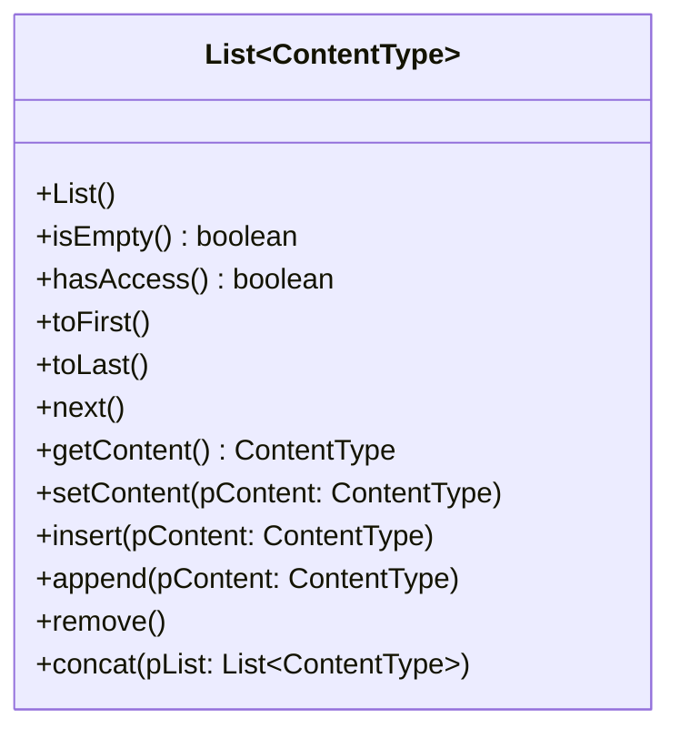

# Einstieg: Jeder kann drankommen

Schlange und Stapel können jeweils genau eine Sache: vorne beziehungsweise oben herausnehmen. Für einen Nachrichtenverlauf reicht das nicht. Dort will man **durchblättern**, eine bestimmte Nachricht löschen und eine neue an einer beliebigen Stelle einfügen.

Dafür gibt es die **Liste**. Bei ihr kommt nicht der Erste oder der Letzte dran, sondern **der, den man gerade ausgewählt hat**.

:::snippet{#definition}
Eine **Liste** (englisch *list*) ist eine lineare Datenstruktur, bei der man an **jeder** Stelle lesen, einfügen und entfernen kann.

Dazu gibt es ein **aktuelles Element**, auf das die Liste gerade zeigt. Man bewegt es mit

- `toFirst` an den Anfang, `toLast` ans Ende,
- `next` um ein Element weiter.

`hasAccess` sagt, ob es gerade ein aktuelles Element gibt. `getContent`, `setContent`, `insert` und `remove` beziehen sich immer auf das aktuelle Element. Nur `append` hängt unabhängig davon ans Ende an.
:::

:::snippet{#merken}
Die Liste hat **keine Nummern** wie ein Feld. Wer an das dritte Element will, geht vom ersten aus zweimal weiter – so wie man in einem Fotoalbum blättert, statt eine Seitenzahl aufzuschlagen.
:::

Von außen zeigt die Abiturklasse `List` diese Methoden:



## Erst einmal ausprobieren

:::snippet{#aufgabe}
a) Sage voraus, was das Programm ausgibt. Notiere nach jeder Zeile, welche Namen in der Liste stehen und welcher davon das aktuelle Element ist. Führe das Programm dann aus.

b) Welche Namen stehen am Ende in der Liste? Ergänze am Ende des Programms eine Schleife, die sie alle ausgibt.
:::

:::onlineide{libraries="nrw" height="460px" id="liste-ausprobieren"}

```java Main.java
void main() {
    List<String> liste = new List<String>();
    liste.append("Anna");
    liste.append("Ben");
    liste.append("Cem");

    liste.toFirst();
    IO.println(liste.getContent());
    liste.next();
    IO.println(liste.getContent());
    liste.insert("Dora");
    IO.println(liste.getContent());
    liste.remove();
    IO.println(liste.getContent());
    liste.next();
    IO.println(liste.hasAccess());
}
```

:::

:::snippet{#brain}
**Weiterdenken:** Nach dem letzten `next()` gibt es kein aktuelles Element mehr. Was liefert `getContent()` jetzt? Und was passiert bei `insert("Emil")`? Schlag in der [Dokumentation](./dokumentation) nach, bevor du es ausprobierst.
:::

::::protect{password="java-q-4-l-e-1" description="Auflösung. Erfrage das Passwort bei deiner Lehrkraft."}

a)

| Zeile | Liste (aktuelles Element **fett**) | Ausgabe |
| --- | --- | --- |
| `toFirst()` | **Anna**, Ben, Cem | Anna |
| `next()` | Anna, **Ben**, Cem | Ben |
| `insert("Dora")` | Anna, Dora, **Ben**, Cem | Ben |
| `remove()` | Anna, Dora, **Cem** | Cem |
| `next()` | Anna, Dora, Cem – kein aktuelles Element | false |

`insert` fügt **vor** dem aktuellen Element ein, das aktuelle Element bleibt dasselbe. Nach `remove` wird der Nachfolger zum aktuellen Element.

b) Anna, Dora, Cem.

```java
liste.toFirst();
while (liste.hasAccess()) {
    IO.println(liste.getContent());
    liste.next();
}
```

**Weiterdenken:** `getContent()` liefert `null`. `insert("Emil")` tut **nichts**: Die Liste ist nicht leer, aber es gibt kein aktuelles Element, vor dem eingefügt werden könnte. Ans Ende hängt nur `append` an.

::::

## Wer kommt als Nächstes dran?

:::snippet{#aufgabe}
Wähle für jeden Fall die passende Struktur – Schlange, Stapel oder Liste – und begründe.

a) Die Teilnehmerliste einer AG, in die jederzeit an beliebiger Stelle jemand eingefügt werden soll.

b) Die Rückgängig-Funktion eines Zeichenprogramms.

c) Eine Playlist, in der man Lieder überspringen, löschen und umsortieren kann.

d) Nachrichten, die ein Server in der Reihenfolge ihres Eintreffens beantwortet.
:::

::::protect{password="java-q-4-l-e-2" description="Auflösung. Erfrage das Passwort bei deiner Lehrkraft."}

a) **Liste.** Verlangt ist der Zugriff an **beliebiger** Stelle.

b) **Stapel.** Rückgängig nimmt den zuletzt gemachten Schritt zurück.

c) **Liste.** Überspringen ist `next`, Löschen ist `remove`, Umsortieren braucht Einfügen an beliebiger Stelle.

d) **Schlange.** Wer zuerst kam, wird zuerst beantwortet.

Die Leitfrage für alle drei Strukturen: **Wer kommt als Nächstes dran – der Erste, der Letzte oder der, den ich auswähle?**

::::

<!-- KLP QPh, Daten und ihre Strukturierung: lineare dynamische Datenstrukturen (Liste);
     "erläutern Operationen dynamischer Datenstrukturen (A)". -->

---

## Selbsttest

::::multievent

**1. Worauf beziehen sich getContent, insert und remove?**

{r1{auf das erste Element}}

{r1{!auf das aktuelle Element}}

{r1{auf das letzte Element}}

{h{Die Liste merkt sich, wo man gerade steht.}}
{H{Richtig!}}

**2. Wo fügt insert ein?**

{r2{hinter dem aktuellen Element}}

{r2{!vor dem aktuellen Element}}

{r2{am Ende der Liste}}

{h{Ans Ende hängt eine andere Methode an.}}
{H{Richtig! Das aktuelle Element bleibt dabei dasselbe.}}

**3. Welches Element ist nach remove das aktuelle?**

{r3{das erste der Liste}}

{r3{das vorherige}}

{r3{!der Nachfolger des entfernten}}

{h{Die Dokumentation legt das genau fest.}}
{H{Richtig! Gibt es keinen Nachfolger, liefert hasAccess danach false.}}

**4. Wie kommt man an das dritte Element einer Liste?**

{r4{über den Index 2}}

{r4{!mit toFirst und zweimal next}}

{r4{mit toLast}}

{h{Die Liste hat keine Nummern.}}
{H{Richtig!}}

::::
