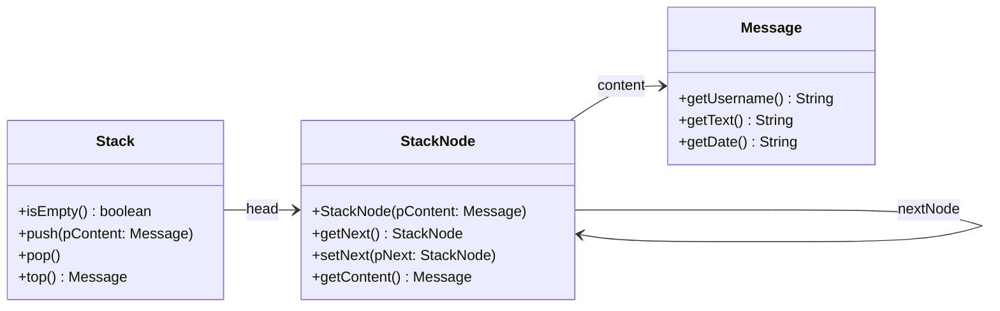

# Aufbau und Funktionsweise

Auch der Stapel besteht innen aus **Knoten**, die aneinanderhängen. Anders als die Schlange merkt er sich aber nur **einen** Knoten: den obersten (`head`). Von dort aus zeigt jeder Knoten auf den, der unter ihm liegt.

Auf dieser Seite schaust du hinein. Als Beispiel dient ein Messenger, der neue Nachrichten oben auf einen Stapel legt.

:::snippet{#merken}
| Teil | Was er sich merkt |
| --- | --- |
| `Stack` | `head` – den obersten Knoten |
| `StackNode` | `content` – das gespeicherte Objekt, `nextNode` – den Knoten darunter |

Der unterste Knoten hat keinen Nachfolger: Sein `nextNode` ist `null`. Einen leeren Stapel erkennt man daran, dass `head` auf `null` zeigt.
:::

Das Klassendiagramm zeigt alle drei beteiligten Klassen, die Pfeile tragen die Namen der Verweise aus den Objektdiagrammen.

## Nachrichten auflegen

Die Methode push soll eine neue Nachricht auf den Stapel legen.

::jmp{id="stapel-auflegen" src="auflegen.jmp"}

:::snippet{#aufgabe}
1. Setze die Schritte im Objektdiagramm um.
2. Entwirf zur Methode push der Klasse Stack einen Algorithmus in :t[Pseudocode].
3. Bereite dich darauf vor, deinen Algorithmus anhand des Objektdiagramms zu präsentieren.
:::

:::collapsible{title="Formulierungshilfe: Pseudocode" id="stapel-pseudocode-auflegen"}

- Erzeuge ...
- Setze das Attribut / die Variable ... auf die Referenz ...

:::

:::snippet{#brain}
**Weiterdenken:** In push kommt es auf die **Reihenfolge** der Zuweisungen an. Was geht verloren, wenn man `head` zuerst auf den neuen Knoten setzt?
:::

## Nachrichten lesen und entfernen

Die Methode top soll die oberste Nachricht zurückgeben. Die Methode pop soll die oberste Nachricht vom Stapel entfernen.

::jmp{id="stapel-abheben" src="abheben.jmp"}

:::snippet{#aufgabe}
1. Setze die Schritte im Objektdiagramm um.
2. Entwirf zu den Methoden pop und top einen Algorithmus in :t[Pseudocode].
3. Bereite dich darauf vor, deinen Algorithmus anhand des Objektdiagramms zu präsentieren.
:::

## Grenzfälle: der leere Stapel

Bei der Schlange brauchte das Einreihen in eine leere Schlange einen eigenen Fall. Wie ist das beim Stapel?

::jmp{id="stapel-grenzfaelle" src="grenzfaelle.jmp"}

:::snippet{#aufgabe}
1. Setze beide Schritte im Objektdiagramm um.
2. Prüfe deine Algorithmen von oben an diesen beiden Fällen. Brauchen sie eine zusätzliche Fallunterscheidung?
3. Was müssen top und pop tun, wenn der Stapel schon leer ist? Schlag in der [Dokumentation](./dokumentation) nach und ergänze deine Algorithmen.
:::

::::protect{password="java-q-4-st-a-2" description="Lösung. Erfrage das Passwort bei deiner Lehrkraft."}

**push(pContent)**

- Wenn pContent gleich null ist, tue nichts.
- Erzeuge einen neuen Knoten mit pContent als Inhalt.
- Setze nextNode des neuen Knotens auf head.
- Setze head auf den neuen Knoten.

**top()**

- Wenn der Stapel leer ist, gib null zurück.
- Sonst gib den Inhalt von head zurück.

**pop()**

- Wenn der Stapel leer ist, tue nichts.
- Sonst setze head auf den Nachfolger von head.

Worauf es ankam:

- **Die Reihenfolge in push.** Wer zuerst `head` auf den neuen Knoten setzt, hat danach keinen Verweis mehr auf den alten Stapel – er ist verloren.
- **Kein Sonderfall beim leeren Stapel.** Auf einen leeren Stapel zeigt `head` auf `null`. Der neue Knoten bekommt also `null` als Nachfolger – genau richtig für den untersten Knoten. Beim Entfernen des letzten Knotens wird `head` zu dessen Nachfolger, also `null`. Weil es keinen zweiten Verweis wie `tail` gibt, muss nichts nachgezogen werden.
- **Nur top und pop prüfen auf leer.** Laut Dokumentation liefert `top` dann `null` und `pop` tut nichts. Ohne die Prüfung bricht der Zugriff auf `head` mit einer `NullPointerException` ab.

::::

<!-- KLP QPh: "erläutern Operationen dynamischer Datenstrukturen (A)" - hier am Objektdiagramm. -->

---

## Selbsttest

::::multievent

**1. Welchen Verweis braucht ein Stapel mindestens?**

{r1{einen auf das unterste Element}}

{r1{!einen auf das oberste Element}}

{r1{je einen auf oben und unten}}

{h{Eingefügt und entfernt wird nur an einer Stelle.}}
{H{Richtig! Deshalb ist der Stapel einfacher als die Schlange.}}

**2. Was passiert beim Auflegen mit dem bisherigen obersten Knoten?**

{r2{er wird gelöscht}}

{r2{!der neue Knoten verweist auf ihn}}

{r2{er wandert nach unten ans Ende}}

{h{Der neue Knoten wird davorgehängt.}}
{H{Richtig!}}

**3. Woran erkennt man einen leeren Stapel?**

{r3{an einem Zähler}}

{r3{!daran, dass head null ist}}

{r3{daran, dass next des obersten Knotens null ist}}

{h{Man braucht dafür kein zusätzliches Attribut.}}
{H{Richtig!}}

**4. Welchen Aufwand haben push, pop und top?**

{r4{!konstant}}

{r4{linear}}

{r4{logarithmisch}}

{h{Es wird immer nur oben angesetzt, egal wie hoch der Stapel ist.}}
{H{Richtig!}}

::::
