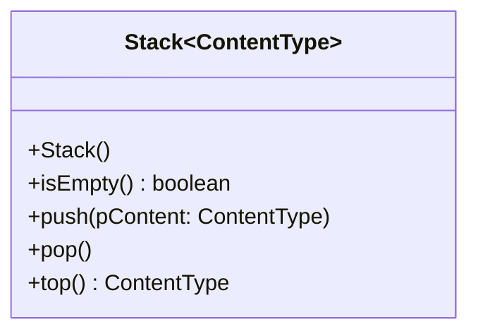

# Einstieg: Wer zuletzt kommt

Drück in einem beliebigen Programm zehnmal Strg+Z. Die Änderungen werden **rückwärts** zurückgenommen – die letzte zuerst, die erste zuletzt. Das Programm hat sie sich gemerkt wie einen Stapel Teller: Neues kommt oben drauf, und heruntergenommen wird auch von oben.

Das ist die zweite Zugriffsregel, die in der Informatik überall auftaucht – und sie ist genau die **Umkehrung** der [Warteschlange](../warteschlange/einstieg).

:::snippet{#definition}
Ein **Stapel** (englisch *stack*, auch *Kellerstapel*) ist eine lineare Datenstruktur mit nur **einer** Zugriffsstelle, dem oberen Ende:

- `push` legt oben auf,
- `top` liest das oberste Element,
- `pop` entfernt es.

Das Prinzip heißt **LIFO** – *Last In, First Out*: Was zuletzt hineinkommt, kommt zuerst wieder heraus.
:::

:::snippet{#merken}
Der Stapel ist die Struktur für alles, was **verschachtelt** ist und in umgekehrter Reihenfolge wieder aufgelöst werden muss:

| Wo | Was liegt auf dem Stapel |
| --- | --- |
| Rückgängig-Funktion | die letzten Änderungen |
| Methodenaufrufe | wohin zurückgesprungen werden muss – der **Aufrufstapel** |
| Klammerprüfung | die noch offenen Klammern |
| Zurück-Knopf im Browser | die zuletzt besuchten Seiten |

Alle vier haben dieselbe Form: Das zuletzt Begonnene muss als Erstes abgeschlossen werden.
:::

Von außen zeigt die Abiturklasse `Stack` nur diese Methoden. Wie sie innen aufgebaut ist, spielt für das Benutzen keine Rolle.

## Erst einmal ausprobieren

Unten liegt dieselbe Operationsfolge wie bei der Schlange – nur heißen die Methoden anders. Sage **zuerst** voraus, welche Ausgaben sie erzeugt, und lass sie dann ablaufen.

<oop-stapel-schlange id="stapel-spielwiese" modus="stapel" folge='push("Anna"); push("Ben"); top(); pop(); push("Cem"); top(); pop(); pop(); isEmpty()'></oop-stapel-schlange>

:::snippet{#aufgabe}
a) Notiere die erwarteten Ausgaben, trage sie ein und lass die Folge ablaufen.

b) Vergleiche mit der [Schlange](../warteschlange/einstieg): Dieselbe Folge, andere Ausgaben. Erkläre den Unterschied in einem Satz.

c) Lege danach von Hand drei Namen auf und hebe sie wieder ab. In welcher Reihenfolge kommen sie heraus?
:::

:::snippet{#brain}
**Weiterdenken:** Du legst die Buchstaben `L`, `A`, `G`, `E`, `R` nacheinander auf einen Stapel und hebst sie danach alle wieder ab. Welches Wort entsteht? Wofür könnte man diesen Effekt nutzen?
:::

::::protect{password="java-q-4-st-e-1" description="Auflösung. Erfrage das Passwort bei deiner Lehrkraft."}

a) `top()` liefert **Ben**, das zweite `top()` liefert **Cem**, `isEmpty()` liefert am Ende **true**.

b) Beim Stapel kommt der zuletzt aufgelegte Name zuerst wieder heraus, bei der Schlange der zuerst eingereihte.

c) In umgekehrter Reihenfolge – LIFO.

**Weiterdenken:** `REGAL`. Ein Stapel **dreht die Reihenfolge um**. Das braucht man immer dann, wenn etwas rückwärts abgearbeitet werden soll – etwa eine Zeichenkette umkehren oder einen Weg zurückgehen.

::::

## Wer kommt als Nächstes dran?

:::snippet{#aufgabe}
Entscheide jeweils, ob ein Stapel oder eine Schlange passt. Begründe mit LIFO oder FIFO.

a) Der Zurück-Knopf eines Browsers.

b) Ein Drucker im Schulnetz bekommt Aufträge von mehreren Rechnern.

c) Ein Zeichenprogramm soll die letzten Schritte rückgängig machen.

d) Ein Stapel Bewerbungen, von denen die Personalabteilung immer die oberste bearbeitet. Ist das gerecht?
:::

::::protect{password="java-q-4-st-e-2" description="Auflösung. Erfrage das Passwort bei deiner Lehrkraft."}

a) **Stapel.** Zurück führt zur zuletzt besuchten Seite.

b) **Schlange.** Wer zuerst druckt, bekommt zuerst sein Blatt.

c) **Stapel.** Rückgängig nimmt den **zuletzt** gemachten Schritt zurück.

d) **Stapel** – aber nicht gerecht: Wer sich früh beworben hat, rutscht immer weiter nach unten und wird womöglich nie bearbeitet. Wo es um Gerechtigkeit nach Ankunft geht, gehört eine Schlange hin.

::::

## Der Aufrufstapel

Der wichtigste Stapel ist einer, den du nie selbst anlegst: Java führt für jedes Programm einen mit, um Methodenaufrufe zu verwalten. Ihn kennst du schon aus [2.3 Kellerstapel und Halde](../../02-felder-referenzen-generik/03-kellerstapel-und-halde) – und aus [3.1 Rekursion](../../03-rekursion-und-problemloesestrategien/01-rekursion), wo du ihn beim Aufrufbaum in Aktion gesehen hast.

:::snippet{#aufgabe}
a) Erkläre mit den Begriffen dieser Seite, was beim Aufruf einer Methode auf den Aufrufstapel gelegt und was beim `return` wieder abgehoben wird.

b) Begründe, warum dafür ein **Stapel** die richtige Struktur ist und keine Warteschlange.
:::

:::snippet{#brain}
**Weiterdenken:** Eine Endlosrekursion bricht mit einem `StackOverflowError` ab. Erkläre den Namen dieses Fehlers.
:::

::::protect{password="java-q-4-st-a-1" description="Auflösung. Erfrage das Passwort bei deiner Lehrkraft."}

a) Bei jedem Aufruf wird ein **Kellerrahmen** aufgelegt: die Parameter, die lokalen Variablen und die Stelle, an die zurückgesprungen werden muss. Beim `return` wird genau dieser Rahmen wieder abgehoben, und das Programm läuft an der gemerkten Stelle weiter.

b) Weil Methodenaufrufe **verschachtelt** sind: Ruft `a()` die Methode `b()` auf und `b()` die Methode `c()`, dann muss `c()` als Erstes fertig werden. Das zuletzt Begonnene wird zuerst abgeschlossen – genau LIFO. Eine Warteschlange würde `a()` zuerst beenden wollen, obwohl `a()` noch mitten im Aufruf steckt.

**Weiterdenken:** Der Aufrufstapel hat eine feste Größe. Eine Rekursion ohne Abbruchbedingung legt Rahmen auf Rahmen, ohne je einen abzuheben – irgendwann läuft der Stapel über: *stack overflow*.

::::

<!-- KLP QPh, Daten und ihre Strukturierung: lineare dynamische Datenstrukturen (Stapel);
     "erläutern Operationen dynamischer Datenstrukturen (A)". -->

---

## Selbsttest

::::multievent

**1. In welcher Reihenfolge verlässt man einen Stapel?**

{r1{wer zuerst kam, geht zuerst}}

{r1{!wer zuletzt kam, geht zuerst}}

{r1{in zufälliger Reihenfolge}}

{h{Denk an einen Stapel Teller.}}
{H{Richtig! Man nennt das auch Last In, First Out.}}

**2. An welcher Stelle wird bei einem Stapel eingefügt und entfernt?**

{r2{vorne eingefügt, hinten entfernt}}

{r2{!an derselben Stelle, nämlich oben}}

{r2{an einer beliebigen Stelle}}

{h{Genau das macht den Stapel so einfach.}}
{H{Richtig!}}

**3. Wo begegnet dir ein Stapel im Rechner?** (Mehrfachauswahl)

{c1{!bei der Verwaltung von Methodenaufrufen}}

{c1{!bei der Rückgängig-Funktion eines Programms}}

{c1{!beim Auswerten von Klammerausdrücken}}

{c1{bei der Warteschlange an einem Drucker}}

{h{Beim Drucker kommt dran, wer zuerst da war.}}
{H{Richtig! Das ist eine Schlange, kein Stapel.}}

**4. Auf einen leeren Stapel kommen A, B und C. Was liefert danach top?**

{r3{A}}

{r3{B}}

{r3{!C}}

{h{Das zuletzt Gelegte liegt oben.}}
{H{Richtig!}}

::::
