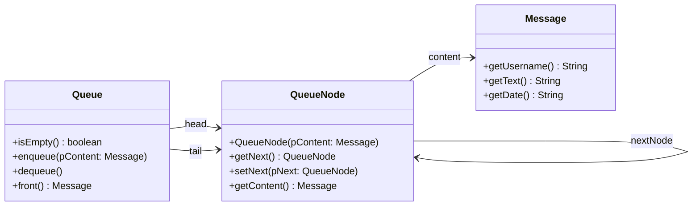

# Aufbau und Funktionsweise

Von außen sieht man der Schlange nur vier Methoden an. Innen besteht sie aus **Knoten**, die aneinanderhängen: Jeder Knoten hält einen Inhalt und kennt seinen Nachfolger. Die Schlange selbst merkt sich nur zwei Knoten – den vorderen (`head`) und den hinteren (`tail`).

Auf dieser Seite schaust du hinein. Als Beispiel dient ein Messenger, der eingehende Nachrichten der Reihe nach anzeigt.

:::snippet{#merken}
| Teil | Was er sich merkt |
| --- | --- |
| `Queue` | `head` – den vordersten Knoten, `tail` – den hintersten Knoten |
| `QueueNode` | `content` – das gespeicherte Objekt, `nextNode` – den Knoten dahinter |

Der hinterste Knoten hat keinen Nachfolger: Sein `nextNode` ist `null`. Eine leere Schlange erkennt man daran, dass `head` auf `null` zeigt.
:::

Im Messenger-Beispiel stehen Nachrichten in der Schlange. Das Klassendiagramm zeigt alle drei beteiligten Klassen, die Pfeile tragen die Namen der Verweise aus den Objektdiagrammen.

## Nachrichten einreihen

Die Methode enqueue soll eine neue Nachricht ans Ende der Warteschlange anhängen.

::jmp{id="schlange-einreihen" src="einreihen.jmp"}

:::snippet{#aufgabe}
1. Setze die Schritte im Objektdiagramm um.
2. Entwirf zur Methode enqueue der Klasse Queue einen Algorithmus in :t[Pseudocode].
3. Bereite dich darauf vor, deinen Algorithmus anhand des Objektdiagramms zu präsentieren.
:::

:::collapsible{title="Formulierungshilfe: Pseudocode" id="schlange-pseudocode-einreihen"}

- Erzeuge ...
- Setze das Attribut / die Variable ... auf die Referenz ...

:::

## Nachrichten lesen und entfernen

Die Methode front soll die erste Nachricht in der Warteschlange zurückgeben. Die Methode dequeue soll die erste Nachricht aus der Warteschlange entfernen.

::jmp{id="schlange-entnehmen" src="entnehmen.jmp"}

:::snippet{#aufgabe}
1. Setze die Schritte im Objektdiagramm um.
2. Entwirf zu den Methoden dequeue und front einen Algorithmus in :t[Pseudocode].
3. Bereite dich darauf vor, deinen Algorithmus anhand des Objektdiagramms zu präsentieren.
:::

:::snippet{#brain}
**Weiterdenken:** Was geschieht mit dem Knoten, der gerade entfernt wurde? Niemand verweist mehr auf ihn. Wer räumt ihn weg?
:::

## Grenzfälle: die leere Schlange

Bisher stand die Schlange schon voll da. Ein Algorithmus ist aber erst fertig, wenn er auch an den Rändern stimmt: beim ersten Einreihen in eine **leere** Schlange und beim Entfernen des **letzten** Knotens.

::jmp{id="schlange-grenzfaelle" src="grenzfaelle.jmp"}

:::snippet{#aufgabe}
1. Setze beide Schritte im Objektdiagramm um.
2. Prüfe deine Algorithmen von oben an diesen beiden Fällen. Wo würden sie scheitern?
3. Ergänze deine Algorithmen so, dass sie auch hier stimmen.
:::

:::snippet{#brain}
**Weiterdenken:** Warum braucht die Schlange überhaupt einen Verweis auf das Ende? Beschreibe, wie enqueue ohne `tail` funktionieren müsste und was das bei einer Schlange mit 10 000 Nachrichten bedeutet.
:::

:::protect{password="java-q-4-ws-a-1" description="Lösung. Erfrage das Passwort bei deiner Lehrkraft."}

**enqueue(pContent)**

- Wenn pContent gleich null ist, tue nichts.
- Erzeuge einen neuen Knoten mit pContent als Inhalt.
- Wenn die Schlange leer ist:
  - Setze head auf den neuen Knoten.
- Sonst:
  - Setze nextNode von tail auf den neuen Knoten.
- Setze tail auf den neuen Knoten.

**front()**

- Wenn die Schlange leer ist, gib null zurück.
- Sonst gib den Inhalt von head zurück.

**dequeue()**

- Wenn die Schlange leer ist, tue nichts.
- Setze head auf den Nachfolger von head.
- Wenn head jetzt null ist, setze auch tail auf null.

Worauf es ankam:

- **Die leere Schlange beim Einreihen.** Es gibt keinen hinteren Knoten, an den man anhängen könnte. Der neue Knoten wird zugleich `head` und `tail`.
- **Der letzte Knoten beim Entfernen.** Wer nur `head` weitersetzt, lässt `tail` auf den entfernten Knoten zeigen. Das nächste `enqueue` hängt dann an einen Knoten an, der gar nicht mehr zur Schlange gehört.
- **Keine Schleife.** Weil `head` und `tail` beide Enden kennen, braucht keine Methode die Schlange zu durchlaufen. Alle Operationen haben konstanten Aufwand.
- **Weiterdenken:** Den entfernten Knoten räumt die automatische Speicherbereinigung (englisch *garbage collector*) weg, sobald kein Verweis mehr auf ihn zeigt. Ohne `tail` müsste enqueue jedes Mal von `head` aus bis zum Ende laufen – bei 10 000 Nachrichten also 10 000 Schritte für ein einziges Einreihen.

:::

<!-- KLP QPh: "erläutern Operationen dynamischer Datenstrukturen (A)" - hier am Objektdiagramm. -->

---

## Selbsttest

::::multievent

**1. Worauf verweist head?**

{r1{auf den zuletzt eingereihten Knoten}}

{r1{!auf den vordersten Knoten}}

{r1{auf den Inhalt des vordersten Knotens}}

{h{Von head aus wird entnommen.}}
{H{Richtig!}}

**2. Warum braucht eine Schlange zwei Verweise?**

{r2{um schneller zu sein}}

{r2{!weil an beiden Enden gearbeitet wird}}

{r2{um die Länge zu kennen}}

{h{Ohne Verweis auf das Ende müsste jedes Einfügen die ganze Schlange durchlaufen.}}
{H{Richtig!}}

**3. Der einzige Knoten einer Schlange wird entfernt. Was muss danach gelten?**

{r3{nur head ist null}}

{r3{nur tail ist null}}

{r3{!head und tail sind null}}

{h{Eine leere Schlange hat weder einen vorderen noch einen hinteren Knoten.}}
{H{Richtig! Wer tail vergisst, zeigt auf einen Knoten, der nicht mehr dazugehört.}}

**4. Welchen Aufwand hat das Einreihen in eine Schlange mit tail-Verweis?**

{r4{!konstant}}

{r4{linear}}

{r4{logarithmisch}}

{h{Es wird immer direkt am hinteren Knoten angehängt.}}
{H{Richtig!}}

::::
