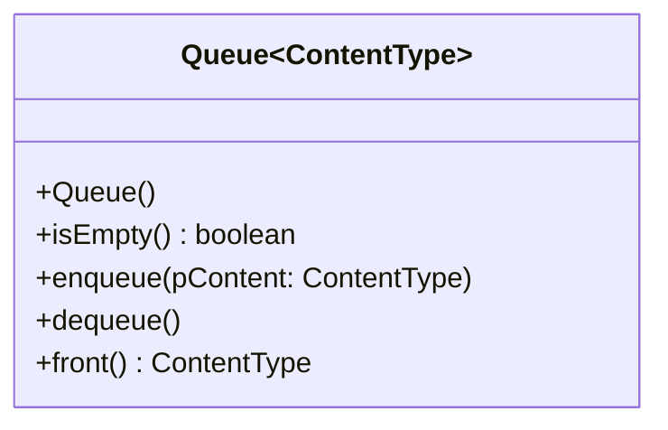

# Einstieg: Wer zuerst kommt

An der Supermarktkasse gilt eine Regel, die niemand aufschreiben muss: **Wer zuerst da war, ist zuerst dran.** Wer dazukommt, stellt sich hinten an. Bedient wird vorne. Dazwischen passiert nichts – man kann sich nicht in die Mitte stellen und auch niemanden aus der Mitte herausziehen.

Genau diese Regel – und genau diese Beschränkung – ist die **Warteschlange**.

:::snippet{#definition}
Eine **Warteschlange** (englisch *queue*) ist eine lineare Datenstruktur mit zwei Zugriffsstellen:

- **hinten** wird eingefügt (`enqueue`),
- **vorne** wird gelesen (`front`) und entfernt (`dequeue`).

Das Prinzip heißt **FIFO** – *First In, First Out*: Was zuerst hineinkommt, kommt zuerst wieder heraus.
:::

:::snippet{#merken}
Dass man **nicht** in die Mitte greifen kann, ist kein Mangel, sondern der Zweck. Eine Struktur, die nur zwei Operationen zulässt, kann man nicht falsch bedienen – und sie lässt sich so bauen, dass beide Operationen **gleich schnell** sind, egal wie lang die Schlange ist.

Wo dir das im Rechner begegnet: Druckaufträge, eingehende Netzwerkpakete, Tastatureingaben, Aufgaben in einer Warteliste.
:::

Von außen zeigt die Abiturklasse `Queue` nur diese Methoden. Wie sie innen aufgebaut ist, spielt für das Benutzen keine Rolle.

## Erst einmal ausprobieren

Unten liegt eine Operationsfolge bereit. Sage **zuerst** voraus, welche Ausgaben sie erzeugt, und lass sie dann ablaufen.

<oop-stapel-schlange id="schlange-spielwiese" modus="schlange" folge='enqueue("Anna"); enqueue("Ben"); front(); dequeue(); enqueue("Cem"); front(); dequeue(); dequeue(); isEmpty()'></oop-stapel-schlange>

:::snippet{#aufgabe}
a) Notiere die erwarteten Ausgaben, trage sie ein und lass die Folge ablaufen.

b) Nur `front()` und `isEmpty()` liefern überhaupt etwas. Erkläre, warum `dequeue()` keinen Rückgabewert braucht. Wie kommt man an das Element, das gleich entfernt wird?

c) Reihe danach von Hand drei Namen ein und nimm sie wieder heraus. In welcher Reihenfolge kommen sie heraus?
:::

:::snippet{#brain}
**Weiterdenken:** Die Schlange hat keine Methode, die sagt, wie viele Elemente in ihr stehen. Wie könntest du es trotzdem herausfinden – nur mit `enqueue`, `dequeue`, `front` und `isEmpty`? Und was ist danach mit der Schlange passiert?
:::

::::protect{password="java-q-4-ws-e-1" description="Auflösung. Erfrage das Passwort bei deiner Lehrkraft."}

a) `front()` liefert **Anna**, das zweite `front()` liefert **Ben**, `isEmpty()` liefert am Ende **true**. Cem wurde zwar nach Ben eingereiht, steht aber hinter ihm – und wird vom letzten `dequeue()` entfernt.

b) Wer das vorderste Element braucht, holt es sich **vorher** mit `front()` und entfernt es danach mit `dequeue()`. Die Abiturklasse trennt das Nachsehen vom Entfernen.

c) In derselben Reihenfolge, in der sie hineingekommen sind – FIFO.

**Weiterdenken:** Man nimmt so lange vorne heraus, bis die Schlange leer ist, und zählt dabei mit. Danach ist die Schlange allerdings **leer** – die Elemente sind verloren. Wie man zählt, ohne die Schlange zu zerstören, ist Thema der Seite [Mit der Schlange arbeiten](./handhabung).

::::

## Wer kommt als Nächstes dran?

:::snippet{#aufgabe}
Entscheide jeweils, ob eine Warteschlange passt. Begründe mit dem FIFO-Prinzip.

a) Ein Drucker im Schulnetz bekommt Aufträge von mehreren Rechnern.

b) Ein Textprogramm soll die letzte Änderung rückgängig machen.

c) Eine Arztpraxis ruft Patientinnen und Patienten in der Reihenfolge ihrer Ankunft auf.

d) Ein Server bekommt mehr Anfragen, als er gleichzeitig beantworten kann.
:::

:::snippet{#brain}
**Weiterdenken:** In der Notaufnahme wird nicht nach Ankunft, sondern nach Dringlichkeit behandelt. Wie könnte man das mit **mehreren** Warteschlangen lösen?
:::

::::protect{password="java-q-4-ws-e-2" description="Auflösung. Erfrage das Passwort bei deiner Lehrkraft."}

a) **Passt.** Wer zuerst druckt, bekommt zuerst sein Blatt.

b) **Passt nicht.** Rückgängig nimmt die **zuletzt** gemachte Änderung zurück – das Gegenteil von FIFO. Die passende Struktur lernst du beim [Stapel](../stapel) kennen.

c) **Passt.** Das ist die Supermarktkasse in einer anderen Umgebung.

d) **Passt.** Die Anfragen warten in einer Schlange und werden der Reihe nach abgearbeitet, sobald der Server frei ist.

**Weiterdenken:** Man legt eine Schlange **pro Dringlichkeitsstufe** an. Behandelt wird immer aus der dringendsten Schlange, die nicht leer ist. Innerhalb einer Stufe gilt weiter: Wer zuerst kam, ist zuerst dran.

::::

<!-- KLP QPh, Daten und ihre Strukturierung: lineare dynamische Datenstrukturen (Schlange);
     "erläutern Operationen dynamischer Datenstrukturen (A)". -->

---

## Selbsttest

::::multievent

**1. In welcher Reihenfolge verlässt man eine Schlange?**

{r1{!wer zuerst kam, geht zuerst}}

{r1{wer zuletzt kam, geht zuerst}}

{r1{in zufälliger Reihenfolge}}

{h{Wie an der Supermarktkasse.}}
{H{Richtig! Man nennt das auch First In, First Out.}}

**2. An welchen Stellen wird bei einer Schlange gearbeitet?**

{r2{nur vorne}}

{r2{!hinten eingefügt, vorne entfernt}}

{r2{nur hinten}}

{h{Neue stellen sich hinten an, bedient wird vorne.}}
{H{Richtig!}}

**3. Wo begegnet dir eine Schlange im Rechner?** (Mehrfachauswahl)

{c1{!bei Druckaufträgen}}

{c1{!bei Nachrichten, die der Reihe nach abgearbeitet werden}}

{c1{!bei Anfragen an einen Server}}

{c1{bei der Rückgängig-Funktion}}

{h{Rückgängig nimmt die zuletzt gemachte Änderung zurück.}}
{H{Richtig! Das ist ein Stapel, keine Schlange.}}

**4. Auf eine leere Schlange kommen A, B und C. Was liefert danach front?**

{r3{!A}}

{r3{B}}

{r3{C}}

{h{Wer zuerst kam, steht vorne.}}
{H{Richtig!}}

::::
