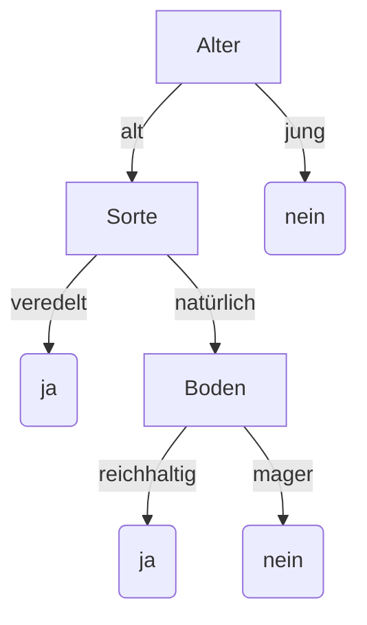
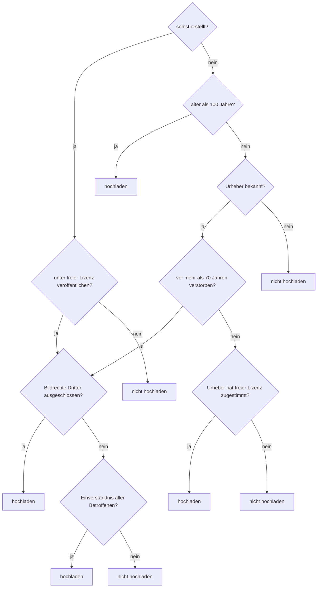

# Beispiel: Entscheidungsbaum

Entscheidungsbäume stellen Prozesse dar, die nach einer Reihe von Fragen zu einer Entscheidung
gelangen. Sie werden benutzt, um komplexe Entscheidungen für Menschen übersichtlich
darzustellen, und werden in der künstlichen Intelligenz verwendet. Eine künstliche Intelligenz
kann einen Entscheidungsbaum nach und nach durch Erfahrung erweitern und so mit der Zeit zu
besseren Entscheidungen gelangen.

Das abgebildete Beispiel zeigt die Vorhersage, ob ein
Apfelbaum wahrscheinlich Früchte tragen wird oder nicht.

Der Entscheidungsbaum besteht aus mehreren
„wenn, dann“ Fragen:
Wenn der Baum jung ist, dann wird er nicht tragen.
Andernfalls: wenn er veredelt ist, wird er tragen.
Wenn er nicht veredelt ist, kommt es auf den Boden an.
Wenn der Boden reichhaltig ist, wird er tragen, sonst nicht.

## Aufgabe

Wer einen Wikipedia-Artikel schreibt, möchte diesen in der Regel mit Bildern illustrieren.
Dabei muss man aber ein nicht ganz einfaches Regelwerk von Urheberrechten beachten.
Stelle dieses Regelwerk graphisch als Entscheidungsbaum dar.

- Hast du das Bild selbst erstellt?
    - Falls ja, willst du es unter einer in Wikipedia zulässigen Lizenz veröffentlichen?
        - Falls ja, sind Bildrechte Dritter auszuschließen?
            - Falls ja, lade es hoch
            - Falls nein, hast du das schriftliche Einverständnis aller Betroffenen?
                - Falls ja, dann lade es hoch
                - Falls nein, dann lade es nicht hoch
        - Falls nein, dann lade es nicht hoch
    - Falls nein, ist das Bild mehr als 100 Jahre alt?
        - Falls ja, dann lade es hoch
        - Falls nein, ist der Urheber des Bildes bekannt?
            - Falls ja, ist der Urheber vor mehr als 70 Jahren verstorben?
                - Falls ja, sind Bildrechte Dritter auszuschließen? (siehe oben)
                - Falls nein, hat der Urheber zugestimmt, das Bild unter eine freie Lizenz zu stellen?
                    - Falls ja, dann lade es hoch
                    - Falls nein, dann lade es nicht hoch
            - Falls nein, dann lade es nicht hoch

::::collapsible{title="Auflösung" id="entscheidungsbaum-aufloesung"}

Jede Frage ist eine Ja/Nein-Frage – der Entscheidungsbaum ist also ein **Binärbaum**. An den inneren Knoten stehen die Fragen, an den Blättern die beiden möglichen Ergebnisse.

Zwei Beobachtungen, die über das Beispiel hinausgehen:

- **Der Weg von der Wurzel zu einem Blatt ist die Begründung.** Wer erklären soll, warum ein Bild nicht hochgeladen werden darf, liest einfach die Fragen auf seinem Weg vor. Genau deshalb sind Entscheidungsbäume in der Medizin und im maschinellen Lernen so beliebt: Das Ergebnis lässt sich **nachvollziehen**, anders als bei einem neuronalen Netz.
- **Der Pfeil von „vor mehr als 70 Jahren verstorben?" zurück auf „Bildrechte Dritter ausgeschlossen?"** ist im Aufgabentext das „(siehe oben)". Streng genommen ist die Zeichnung damit **kein Baum mehr**, denn dieser Knoten hat zwei Vorgänger. Als Baum müsste man den Teilbaum ein zweites Mal hinzeichnen. In der Praxis spart man sich das – man muss nur wissen, dass man damit die Baumeigenschaft aufgibt.

::::

**Zur Präsentation:**
- Erläutere das Anwendungsbeispiel (Entscheidungsbaum allgemein).
- Zeichne den Entscheidungsbaum deiner Aufgabe.

In Anlehnung an Christian Pothmann unter CC BY-NC-SA 4.0

---

## Selbsttest

::::multievent

**1. Was steht in einem Entscheidungsbaum an den inneren Knoten?**

{r1{die Ergebnisse}}

{r1{!die Fragen oder Bedingungen}}

{r1{die Anzahl der Blätter}}

{h{Die Ergebnisse stehen an den Blättern.}}
{H{Richtig!}}

**2. Wie viele Fragen braucht ein ausgeglichener Entscheidungsbaum mit 16 möglichen Ergebnissen?**

{z{4}}

{h{Bei jeder Frage halbiert sich die Menge der möglichen Ergebnisse.}}
{H{Richtig! Das ist dasselbe Argument wie bei den Goldmünzen.}}

**3. Welche Aussagen über Bäume stimmen?** (Mehrfachauswahl)

{c1{!Ein Baum hat genau eine Wurzel.}}

{c1{!Ein Blatt ist ein Knoten ohne Nachfolger.}}

{c1{!Jeder Knoten hat höchstens einen Vorgänger.}}

{c1{Ein Baum kann Zyklen enthalten.}}

{h{Sobald es einen Zyklus gibt, ist es kein Baum mehr, sondern ein Graph.}}
{H{Richtig!}}

**4. Was ist die Höhe eines Baumes?**

{r2{die Anzahl aller Knoten}}

{r2{!die Länge des längsten Weges von der Wurzel zu einem Blatt}}

{r2{die Anzahl der Blätter}}

{h{Sie bestimmt, wie viele Schritte eine Suche höchstens braucht.}}
{H{Richtig!}}

::::
