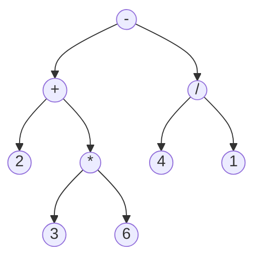
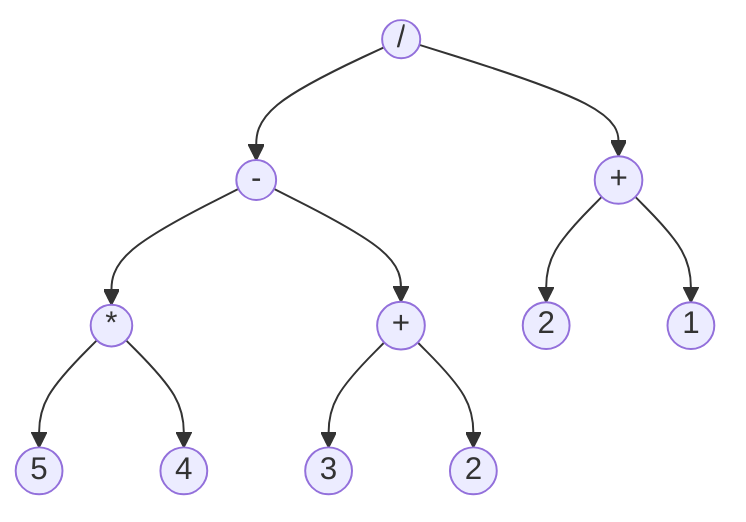
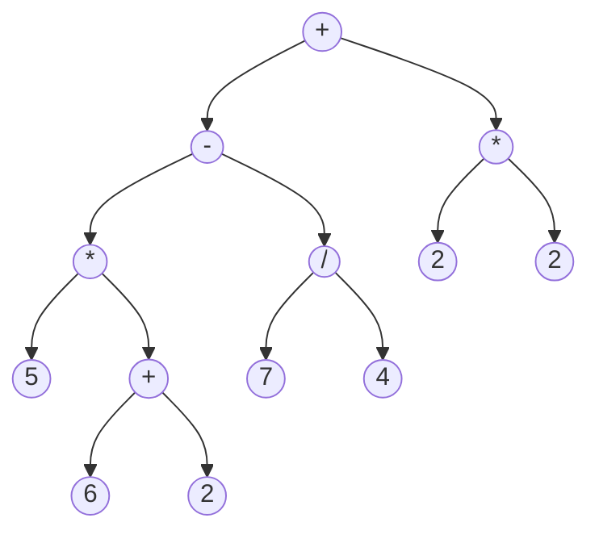

# Beispiel: Termbaum

Etwas vereinfacht ist ein „Term“ in der Mathematik ein Ausdruck, der eine Rechnung darstellt.
Man kann Rechenoperationen wie „plus“, „minus“, „mal“, „geteilt“, „hoch“ usw. verwenden.
Einfache Terme sind also zum Beispiel „5 + 8“ oder „3 / 4".

Man kann Terme kombinieren, indem man Klammern verwendet, zum Beispiel: (5 + 8) · (3 / 4).
Um die Schreibweise zu vereinfachen, hat sich eingebürgert, in bestimmten Fällen die Klammern
wegzulassen und zwei zusätzliche Regeln zur Reihenfolge der Auswertung festgelegt:

- Punkt-vor-Strich-Rechnung: Die folgenden Terme sind identisch: 9 · 2 + 8 · 3 und (9 · 2) + (8 · 3)
- Von links nach rechts auswerten (bei nur Punkt- oder nur Strich-Rechnung): Die folgenden Terme sind identisch: 8 – 7 + 4 und (8 – 7) + 4

Um einen Term auszuwerten, muss man zuerst die inneren Klammern berechnen.
Die Ergebnisse der inneren Klammern werden dann für die äußeren Rechnungen benutzt.
Im Beispiel (5 + 8) · (3 / 4) würde man also zuerst 5 + 8 und 3 / 4 ausrechnen, und die Ergebnisse
dann multiplizieren.

Da Terme durch ihre Klammerung hierarchisch
geordnet sind, kann man sie auch durch einen
Binärbaum darstellen, wie zum Beispiel den Term

$$
2+3\cdot6–4/1
$$

Wegen der Punkt-vor-Strich-Rechnung muss man
zuerst die Multiplikation 3 · 6 und die Division
4 / 1 berechnen, und verwendet die Ergebnisse
dann für die Addition bzw. Subtraktion.

## Aufgabe

:::snippet{#aufgabe}
*Ohne Rechner.*

a) Stelle den Term $ 5 \cdot (6 + 2) - 7 / 4 + 2 \cdot 2 $ als Termbaum dar. Denk an Punkt vor Strich und daran, dass bei gleichrangigen Operatoren von links nach rechts ausgewertet wird.

b) Stelle den Term zum folgenden Termbaum auf und berechne seinen Wert.
:::

::::collapsible{title="Auflösung" id="termbaum-aufloesung"}

**a)** Zuerst die Klammerung ergänzen: Punkt vor Strich macht daraus $((5 \cdot (6+2)) - (7/4)) + (2 \cdot 2)$. Der **zuletzt** ausgeführte Operator steht an der Wurzel – das ist hier das letzte `+`.

Die zweite Regel – von links nach rechts – entscheidet darüber, dass das `-` **unter** dem `+` hängt und nicht umgekehrt.

**b)** Der Term lautet $(5 \cdot 4 - (3 + 2)) / (2 + 1)$.

Ausgerechnet wird er von unten nach oben: $5 \cdot 4 = 20$, $3 + 2 = 5$, $20 - 5 = 15$, $2 + 1 = 3$ und schließlich $15 / 3 = \mathbf{5}$.

::::

**Zur Präsentation**:
- Erläutere das Anwendungsbeispiel (Terme).
- Zeichne einen Beispiel-Termbaum.
- Erläutere, wie ein Termbaum ausgewertet (also das Ergebnis des Terms berechnet) wird.

In Anlehnung an Christian Pothmann unter CC BY-NC-SA 4.0

---

## Selbsttest

::::multievent

**1. Was steht in einem Termbaum an den Blättern?**

{r1{die Rechenzeichen}}

{r1{!die Zahlen oder Variablen}}

{r1{die Klammern}}

{h{Die Rechenzeichen stehen an den inneren Knoten.}}
{H{Richtig!}}

**2. Wozu braucht ein Termbaum keine Klammern?**

{r2{weil Klammern in der Informatik verboten sind}}

{r2{!weil die Baumstruktur die Reihenfolge der Auswertung bereits festlegt}}

{r2{weil immer von links nach rechts gerechnet wird}}

{h{Was tiefer im Baum steht, wird zuerst ausgewertet.}}
{H{Richtig!}}

**3. Welche Traversierung liefert die übliche Schreibweise eines Terms?**

{r3{Pre-Order}}

{r3{!In-Order}}

{r3{Post-Order}}

{h{Dabei kommt erst der linke Teilbaum, dann die Wurzel, dann der rechte.}}
{H{Richtig!}}

**4. Wie berechnet man den Wert eines Termbaums?**

{r4{indem man die Blätter der Reihe nach addiert}}

{r4{!rekursiv: erst beide Teilbäume auswerten, dann das Rechenzeichen anwenden}}

{r4{indem man den Baum in eine Liste überfuehrt}}

{h{Ein Teilbaum ist selbst wieder ein Termbaum.}}
{H{Richtig!}}

::::
