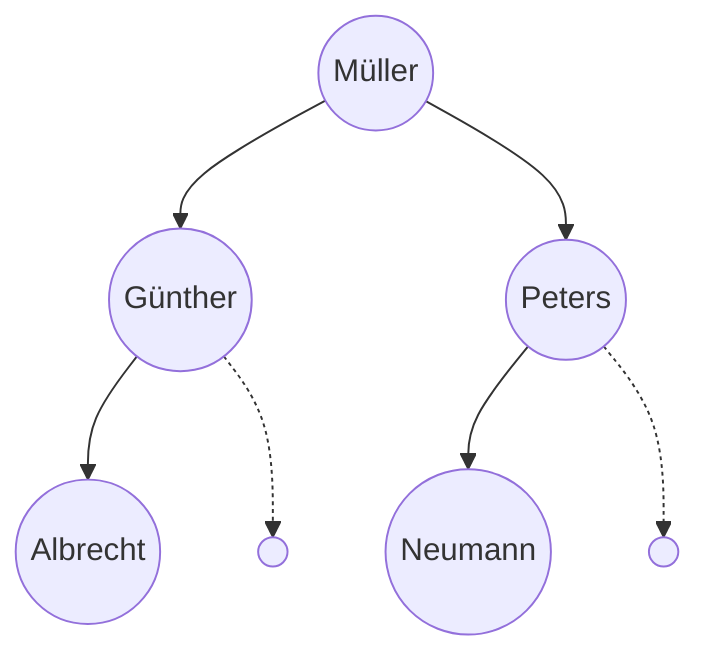

# Aufbau und Funktionsweise

Eine Liste hat für jedes Element **einen** Nachfolger. Damit lässt sich alles abbilden, was eine Reihenfolge hat – eine Warteschlange, ein Verlauf, ein Stapel.

Vieles hat aber keine Reihenfolge, sondern eine **Verzweigung**: Ein Dateisystem hat Ordner in Ordnern. Ein Turnier hat Sieger, die aus zwei Vorrunden kommen. Ein Rechenausdruck wie `2 + 3 · 6` hat einen Operator, der zwei Teilausdrücke verbindet. Für all das braucht man Elemente mit **mehreren** Nachfolgern.

:::snippet{#definition}
Ein **Binärbaum** besteht aus **Knoten**. Jeder Knoten hat

- genau ein **Inhaltsobjekt** und
- genau zwei Nachfolger: einen **linken** und einen **rechten Teilbaum**.

Der oberste Knoten heißt **Wurzel**. Ein Knoten ohne Inhalt heißt **leerer Knoten**; er hat auch keine Nachfolger. Knoten, deren beide Nachfolger leer sind, heißen **Blätter**.

Die entscheidende Eigenschaft: **Jeder Teilbaum ist selbst wieder ein Binärbaum.** Deshalb ist die Klasse `BinaryTree` gleichzeitig der ganze Baum und jeder einzelne Knoten darin – und deshalb arbeiten fast alle Baumalgorithmen rekursiv.
:::

## Objekte der Klasse BinaryTree

Wie `List` ist auch `BinaryTree` **generisch**. Welche Klasse die Inhalte haben, legst du bei der Deklaration fest, und innerhalb eines Baums sind alle Inhalte von derselben Klasse:

```java
BinaryTree<String> namen = new BinaryTree<String>();
```

:::snippet{#merken}
Zwei Regeln der Abiturklasse, die man leicht übersieht:

1. Ein **leerer Knoten** hat weder Inhalt noch Nachfolger. `isEmpty()` liefert dafür `true`.
2. Sobald ein Knoten einen Inhalt bekommt – durch den Konstruktor oder durch `setContent(...)` –, erzeugt er **automatisch zwei leere Knoten** als linken und rechten Nachfolger.

Regel 2 ist der Grund, warum man nie auf `null` prüfen muss, bevor man `getLeftTree()` aufruft: Unter einem gefüllten Knoten liegt immer etwas, notfalls ein leerer Knoten.
:::

## Aufgabe 1: Ein Knoten im Objektdiagramm

:::snippet{#aufgabe}
*Ohne Rechner.* Nimm die [Dokumentation](./dokumentation) dazu.

a) Lies die Beschreibung des Konstruktors `BinaryTree()`. Zeichne, wie der leere Knoten, den er erzeugt, im Objektdiagramm aussieht.

b) Lies die Beschreibung von `setContent(...)`. Zeichne denselben Knoten noch einmal, nachdem `setContent("Müller")` darauf aufgerufen wurde.

c) Erkläre den Unterschied zwischen den beiden Zeichnungen in einem Satz.
:::

::::collapsible{title="Auflösung" id="baum-aufloesung-knoten"}

a) Ein einzelnes Rechteck vom Typ `BinaryTree`, dessen drei Referenzen `content`, `left` und `right` alle auf `null` zeigen.

b) Jetzt zeigt `content` auf ein `String`-Objekt `"Müller"` – und `left` und `right` zeigen auf **zwei neue, leere** `BinaryTree`-Objekte. Aus einem Rechteck sind drei geworden.

c) Ein Knoten bekommt seine Nachfolger nicht dadurch, dass man sie anhängt, sondern **in dem Moment, in dem er einen Inhalt bekommt**.

::::

## Aufgabe 2: Einen Baum aufbauen

:::snippet{#aufgabe}
Das Programm unten baut einen Baum mit fünf Namen auf.

a) Setze die Schritte in der Vorlage unter dem Programm um.

b) Erläutere, wozu die drei Referenzen `wurzel`, `aktuell` und `neu` gebraucht werden. Welche davon muss ein **Attribut** sein und welche dürfen lokale Variablen sein?

c) Was würde am Ende von `fuellen()` passieren, wenn auch `wurzel` lokal deklariert wäre?
:::

```java
public class Beispiel {

    private BinaryTree<String> wurzel;

    public Beispiel() {
        wurzel = new BinaryTree<String>();
    }

    public void fuellen() {
        BinaryTree<String> aktuell, neu;

        wurzel.setContent("Müller");

        neu = new BinaryTree<String>("Günther");
        wurzel.setLeftTree(neu);

        neu = new BinaryTree<String>("Peters");
        wurzel.setRightTree(neu);

        aktuell = wurzel.getLeftTree();
        neu = new BinaryTree<String>("Albrecht");
        aktuell.setLeftTree(neu);

        aktuell = wurzel.getRightTree();
        neu = new BinaryTree<String>("Neumann");
        aktuell.setLeftTree(neu);
    }
}
```

::jmp{id="baum-vorlage" src="vorlage.jmp" height="750px"}

::::collapsible{title="Auflösung zu b) und c)" id="baum-aufloesung-referenzen"}

b) – **`wurzel`** hält den Einstieg in den Baum fest. Ohne sie käme man nach dem Ende der Methode an keinen einzigen Knoten mehr heran; sie muss deshalb ein **Attribut** sein.
 – **`aktuell`** ist der Finger, mit dem man im Baum nach unten zeigt, um dort etwas anzuhängen.
 – **`neu`** hält den gerade erzeugten Knoten so lange fest, bis er eingehängt ist.

`aktuell` und `neu` werden nur **während** des Aufbaus gebraucht und dürfen lokal sein.

c) Dann wäre der Baum nach dem Ende von `fuellen()` **nicht mehr erreichbar**. Alle fünf Knoten existierten noch im Speicher, aber keine Referenz zeigte mehr auf sie – die Speicherbereinigung räumt sie weg. Das ist genau der Unterschied zwischen Objekt und Referenz aus [2.2](../../02-felder-referenzen-generik/02-referenzen).

::::

:::snippet{#merken}
So sieht der Baum aus, den `fuellen()` erzeugt:



Die gestrichelten Knoten sind die **leeren** Nachfolger. Gezeichnet werden sie meistens nicht – vorhanden sind sie trotzdem.
:::

---

## Selbsttest

::::multievent

**1. Wie viele Nachfolger hat ein Knoten in einem Binärbaum höchstens?**

{z{2}}

{h{Der Name verrät es.}}
{H{Richtig!}}

**2. Was passiert, sobald ein BinaryTree-Objekt ein Inhaltsobjekt bekommt?**

{r1{nichts weiter}}

{r1{!es entstehen automatisch zwei leere Nachfolgerknoten}}

{r1{der Baum wird sortiert}}

{h{So kann man auf jedem Nachfolger wieder dieselben Methoden aufrufen.}}
{H{Richtig!}}

**3. Warum arbeiten die meisten Baumalgorithmen rekursiv?**

{r2{weil Rekursion schneller ist}}

{r2{!weil jeder Teilbaum selbst wieder ein Baum ist}}

{r2{weil Bäume keine Schleifen erlauben}}

{h{Die Datenstruktur ist selbst rekursiv aufgebaut.}}
{H{Richtig!}}

**4. Welche Aussagen über die Klasse BinaryTree stimmen?** (Mehrfachauswahl)

{c1{!Sie ist generisch.}}

{c1{!Jeder Knoten hat genau ein Inhaltsobjekt.}}

{c1{!Ein leerer Knoten hat weder Inhalt noch Nachfolger.}}

{c1{Ein Baum kann Inhalte verschiedener Klassen mischen.}}

{h{Wie bei der Liste legt man den Typ bei der Deklaration fest.}}
{H{Richtig!}}

::::
