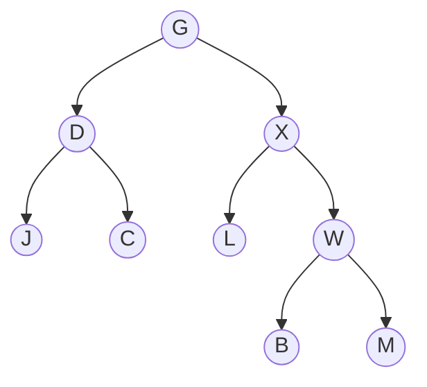

# Traversierung

Ein Baum ist verzweigt, eine Ausgabe ist es nicht. Wer alle Inhalte eines Baums ausgeben oder in eine Liste überführen will, muss sich also entscheiden: **In welcher Reihenfolge?**

Die Frage hat keine einzige richtige Antwort – aber vier nützliche. Sie unterscheiden sich nur darin, **wann die Wurzel an die Reihe kommt**.

:::snippet{#definition}
Beim **Traversieren** wird jeder Knoten eines Baums genau einmal besucht. Für Binärbäume gibt es vier gebräuchliche Reihenfolgen:

| Name | Reihenfolge | Merkhilfe |
| --- | --- | --- |
| **Pre-Order** | Wurzel, links, rechts | die Wurzel **vor** den Teilbäumen |
| **In-Order** | links, Wurzel, rechts | die Wurzel **zwischen** den Teilbäumen |
| **Post-Order** | links, rechts, Wurzel | die Wurzel **nach** den Teilbäumen |
| **Level-Order** | Ebene für Ebene von oben nach unten | quer statt in die Tiefe |

*Prä*, *in* und *post* beziehen sich also immer auf die **Wurzel**; die Teilbäume werden stets links vor rechts abgearbeitet. Die ersten drei laufen in die Tiefe und lassen sich rekursiv formulieren – Level-Order nicht, dafür braucht man eine Warteschlange.
:::

Sieh dir das Video an und bearbeite danach die Aufgaben.

::youtube{#5X8CkFBq_8k}

## Aufgabe 1: Die vier Reihenfolgen

:::snippet{#aufgabe}
a) Gib die vier Arten der Traversierung von Binärbäumen an.

b) Erkläre, worauf sich die Vorsilben *Pre-*, *In-* und *Post-* beziehen.

c) Warum lässt sich Level-Order nicht so einfach rekursiv formulieren wie die anderen drei?
:::

::::collapsible{title="Auflösung" id="traversierung-aufloesung-arten"}

a) **Pre-Order, In-Order, Post-Order und Level-Order.**

b) Auf den Zeitpunkt, zu dem die **Wurzel** besucht wird – vor, zwischen oder nach den beiden Teilbäumen. Schreibt man W für Wurzel, L für den linken und R für den rechten Teilbaum, dann ist Pre-Order **W L R**, In-Order **L W R** und Post-Order **L R W**. Der linke Teilbaum kommt immer vor dem rechten.

c) Weil die Rekursion in die **Tiefe** läuft: Ein rekursiver Aufruf steigt in einen Teilbaum hinab und arbeitet ihn vollständig ab, bevor der nächste drankommt. Level-Order braucht aber alle Knoten **einer Ebene** nacheinander, und die liegen in verschiedenen Teilbäumen. Dafür merkt man sich die noch offenen Knoten in einer **Warteschlange** aus [Kapitel 4](../../04-lineare-datenstrukturen/warteschlange).

::::

## Aufgabe 2: Die zeichnerische Hilfe

:::snippet{#aufgabe}
Erkläre, wie man die drei Traversierungsstrategien Pre-, In- und Post-Order zeichnerisch nachvollziehen kann.
:::

::::collapsible{title="Auflösung" id="traversierung-aufloesung-zeichnung"}

Man zeichnet den Binärbaum und darum herum eine Kurve, die an allen Knoten vorbeiläuft, ohne eine Kante zu kreuzen – wie ein Spaziergang um den Baum herum.

Dann zeichnet man an jeden Knoten drei kurze Striche: einen nach links, einen nach unten und einen nach rechts, jeweils bis zur Kurve.

Jetzt läuft man die Kurve einmal ab und notiert jeden Knoten, dessen passenden Strich man kreuzt:

- **Pre-Order**: der Strich nach **links**
- **In-Order**: der Strich nach **unten**
- **Post-Order**: der Strich nach **rechts**

Der Spaziergang ist derselbe – nur der Moment, in dem man den Knoten aufschreibt, ist ein anderer. Genau das ist der Unterschied zwischen den drei Strategien.

::::

## Aufgabe 3: Selbst traversieren

:::snippet{#aufgabe}
*Ohne Rechner.* Traversiere den folgenden Binärbaum mit Pre-, In- und Post-Order. Benutze dabei die Hilfe aus Aufgabe 2 und zähl am Ende nach, ob jede Ausgabe **alle neun** Knoten enthält.
:::

::::collapsible{title="Auflösung" id="traversierung-aufloesung-baum"}

| Strategie | Ausgabe |
| --- | --- |
| Pre-Order | `G D J C X L W B M` |
| In-Order | `J D C G L X B W M` |
| Post-Order | `J C D L B M W X G` |

Zwei Proben, die sich lohnen:

- **Jede Ausgabe hat neun Zeichen.** Wer beim Post-Order das `M` verliert, hat den rechten Teilbaum von `W` übersehen – ein häufiger Fehler, weil `W` selbst schon so weit rechts steht.
- **Pre-Order beginnt mit der Wurzel, Post-Order endet mit ihr.** Beides ist immer so, bei jedem Baum.

::::

## Aufgabe 4: Rückwärts

:::snippet{#aufgabe}
Ein Baum wurde Post-Order traversiert. Das Ergebnis lautet `G D V Z H K L Q W E R`.

a) Gib einen Baum an, der dieses Ergebnis liefert.

b) Untersuche, ob dieser Baum eindeutig ist. Begründe deine Antwort.

c) Welche **zusätzliche** Angabe bräuchtest du, damit der Baum eindeutig wäre?
:::

::::collapsible{title="Tipp: Wo steht die Wurzel?" id="traversierung-tipp-rueckwaerts"}

Post-Order besucht die Wurzel **zuletzt**. Der letzte Buchstabe der Ausgabe ist also die Wurzel des ganzen Baums.

Alles davor gehört zu den beiden Teilbäumen – erst der linke, dann der rechte. Nur: **Wo genau verläuft die Grenze?**

::::

::::collapsible{title="Auflösung" id="traversierung-aufloesung-rueckwaerts"}

a) Zum Beispiel eine reine **Linkskette**: `R` als Wurzel, darunter links `E`, darunter links `W`, dann `Q`, `L`, `K`, `H`, `Z`, `V`, `D` und ganz unten `G`. Post-Order steigt bis zum tiefsten Knoten hinab und arbeitet sich dann nach oben – das ergibt genau `G D V Z H K L Q W E R`.

b) **Nein, er ist nicht eindeutig.** Der Tipp sagt, warum: `R` ist zwar sicher die Wurzel, aber die Grenze zwischen linkem und rechtem Teilbaum ist frei wählbar. Nimmt man etwa `G D V Z H` als linken und `K L Q W E` als rechten Teilbaum, entsteht ein ganz anderer Baum – mit `H` links und `E` rechts unter der Wurzel – der dieselbe Post-Order-Ausgabe liefert.

Das gilt auf jeder Ebene erneut. Es gibt also sehr viele passende Bäume.

c) Die **In-Order-Ausgabe**. Post-Order verrät die Wurzel, und In-Order verrät dann, welche Knoten links und welche rechts von ihr liegen – damit ist die Grenze festgelegt, und der Baum lässt sich eindeutig rekonstruieren. Pre-Order zusammen mit In-Order funktioniert genauso.

::::

In Anlehnung an https://ddi.uni-wuppertal.de/archiv/madin/material/materialsammlung/oberstufe/datenstrukturen/baeume/ab_03_traversierung.pdf (CC-BY-NC-SA).

---

## Selbsttest

::::multievent

**1. Wie viele Arten der Traversierung wurden genannt?**

{z{4}}

{h{Level-Order, Pre-Order, In-Order und Post-Order.}}
{H{Richtig!}}

**2. In welcher Reihenfolge arbeitet die Post-Order-Traversierung?**

{r1{Wurzel, links, rechts}}

{r1{links, Wurzel, rechts}}

{r1{!links, rechts, Wurzel}}

{h{Post bedeutet, dass die Wurzel zuletzt kommt.}}
{H{Richtig!}}

**3. Welche Traversierung liefert bei einem binären Suchbaum die sortierte Reihenfolge?**

{r2{Pre-Order}}

{r2{!In-Order}}

{r2{Level-Order}}

{h{Links stehen die kleineren, rechts die größeren Inhalte.}}
{H{Richtig!}}

**4. Welche Traversierung geht Ebene für Ebene vor?**

{r3{!Level-Order}}

{r3{Pre-Order}}

{r3{Post-Order}}

{h{Sie braucht als einzige eine Schlange statt der Rekursion.}}
{H{Richtig!}}

::::
