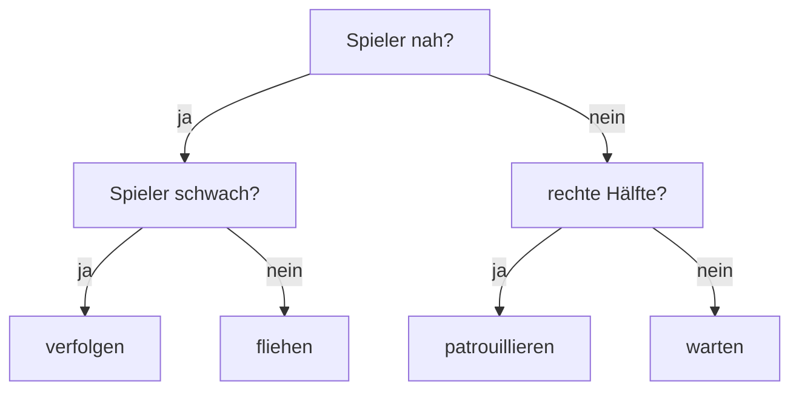

# Im Spiel: der Gegner entscheidet sich

:::alert{info}
**Optional.** Diese Seite ist ein Zusatzangebot am Ende des Kapitels. Sie führt nichts Neues ein, und weder der [Rückblick](./rueckblick) noch die späteren Kapitel setzen sie voraus.
:::

Auf der Seite [Beispiel: Entscheidungsbaum](./baumstrukturen/beispiel-entscheidungsbaum) hast du einen Entscheidungsbaum als **Bild** gesehen. Hier wird er zu einer Datenstruktur, die ein Gegner sechzigmal pro Sekunde durchläuft.

:::snippet{#scratch-kurz}
:::

<!-- KLP QPh: stellen Datenstrukturen grafisch dar und erlaeutern ihren Aufbau (A); implementieren Algorithmen unter Verwendung von Datenstrukturen (I). Wendet den Binaerbaum an, fuehrt nichts Neues ein. Optional. -->

## Woran es hakt

So sieht die Entscheidung eines Gegners aus, wenn man sie direkt hinschreibt:

```java
public void run() {
    if (this.distanceToSprite(spieler) < 120) {
        if (spieler.getLeben() < 3) {
            verfolge();
        } else {
            fliehe();
        }
    } else {
        if (this.getX() > 0) {
            patrouilliere();
        } else {
            warte();
        }
    }
}
```

Das funktioniert und ist sogar lesbar. Trotzdem hat es drei Eigenschaften, die ab einer gewissen Größe stören:

1. Die Entscheidung steht **im Code**. Wer sie ändern will, muss programmieren und neu übersetzen.
2. Jeder Gegnertyp braucht seine eigene `run`-Methode, auch wenn sich nur die Reihenfolge der Fragen unterscheidet.
3. Man kann die Entscheidung nicht **anschauen**, nicht ausgeben, nicht abspeichern und nicht vergleichen.

## Dieselbe Entscheidung als Baum

Sieh dir die `if`-Verschachtelung noch einmal an. Sie **ist** bereits ein Baum – man sieht ihn nur nicht:



:::snippet{#definition}
In einem **Entscheidungsbaum** trägt jeder innere Knoten eine **Frage** und jedes Blatt eine **Aktion**.

Die Auswertung ist immer dieselbe: Ist der Knoten ein Blatt, führe die Aktion aus. Sonst stelle die Frage und mache im linken Teilbaum weiter, wenn die Antwort *ja* lautet, sonst im rechten.

Das ist genau die Struktur aus [Binärbaum](./binaerbaum) – ein linker und ein rechter Teilbaum, mehr braucht es nicht.
:::

:::snippet{#merken}
Der entscheidende Unterschied zur `if`-Kaskade: Die Entscheidung ist nun **Daten**, nicht Programm.

Man kann sie zur Laufzeit umbauen, ausgeben, aus einer Datei laden, zwei Gegnern verschiedene Bäume geben – und alles davon, ohne eine Zeile der Auswertung anzufassen. Die Auswertung bleibt immer dieselben acht Zeilen.
:::

## Der Gegner im Spiel

Unten läuft es. Jeder der drei Gegner sagt, was er gerade entschieden hat. Lauf mit den Pfeiltasten auf sie zu und wieder weg, und sieh zu, wie sich die Antworten ändern.

Die beiden roten Gegner haben **denselben Baum**, der blaue einen anderen – bei gleichem Programmcode.

:::onlineide{libraries="nrw,scratch" height="780px"}

```java Main.java
void main() {
    new Spiel();
}
```

```java Spiel.java
public class Spiel extends Stage {

    private Spieler spieler;
    private Text anzeige;

    public Spiel() {
        anzeige = new Text("Pfeiltasten: bewegen", 0, 155, 460);
        this.add(anzeige);

        spieler = new Spieler();
        this.add(spieler);

        // Zwei Gegner mit demselben Bauplan ...
        this.add(new Gegner(-160, 60, baueWaechter()));
        this.add(new Gegner(160, 60, baueWaechter()));

        // ... und einer, der anders tickt.
        Gegner feigling = new Gegner(0, 120, baueFeigling());
        feigling.setTint(80, 120, 255);
        this.add(feigling);
    }

    public Spieler getSpieler() {
        return spieler;
    }

    /**
     * Nah und Spieler schwach: verfolgen. Nah und Spieler stark: fliehen.
     * Weit weg: je nach Seite patrouillieren oder warten.
     */
    public BinaryTree<Knoten> baueWaechter() {
        BinaryTree<Knoten> verfolgen = new BinaryTree<Knoten>(new Knoten("verfolgen"));
        BinaryTree<Knoten> fliehen = new BinaryTree<Knoten>(new Knoten("fliehen"));
        BinaryTree<Knoten> patrouille = new BinaryTree<Knoten>(new Knoten("patrouillieren"));
        BinaryTree<Knoten> warten = new BinaryTree<Knoten>(new Knoten("warten"));

        BinaryTree<Knoten> nah = new BinaryTree<Knoten>(
            new Knoten("schwach?", Knoten.FRAGE_SCHWACH), verfolgen, fliehen);
        BinaryTree<Knoten> fern = new BinaryTree<Knoten>(
            new Knoten("rechts?", Knoten.FRAGE_RECHTS), patrouille, warten);

        return new BinaryTree<Knoten>(
            new Knoten("nah?", Knoten.FRAGE_NAH), nah, fern);
    }

    /** Derselbe Aufbau, andere Antworten: Dieser flieht immer, wenn jemand kommt. */
    public BinaryTree<Knoten> baueFeigling() {
        BinaryTree<Knoten> fliehen = new BinaryTree<Knoten>(new Knoten("fliehen"));
        BinaryTree<Knoten> warten = new BinaryTree<Knoten>(new Knoten("warten"));

        return new BinaryTree<Knoten>(
            new Knoten("nah?", Knoten.FRAGE_NAH), fliehen, warten);
    }
}
```

```java Knoten.java
/**
 * Inhalt eines Baumknotens: entweder eine Frage oder eine Aktion.
 */
public class Knoten {

    public static final int KEINE_FRAGE = 0;
    public static final int FRAGE_NAH = 1;
    public static final int FRAGE_SCHWACH = 2;
    public static final int FRAGE_RECHTS = 3;

    private String bezeichnung;
    private int frage;

    /** Blatt: trägt nur eine Aktion. */
    public Knoten(String pAktion) {
        bezeichnung = pAktion;
        frage = KEINE_FRAGE;
    }

    /** Innerer Knoten: trägt eine Frage. */
    public Knoten(String pBezeichnung, int pFrage) {
        bezeichnung = pBezeichnung;
        frage = pFrage;
    }

    public boolean istBlatt() {
        return frage == KEINE_FRAGE;
    }

    public int getFrage() {
        return frage;
    }

    public String getBezeichnung() {
        return bezeichnung;
    }
}
```

```java Gegner.java
/**
 * Ein Gegner, dessen Verhalten in einem Entscheidungsbaum steht.
 */
public class Gegner extends Sprite {

    private BinaryTree<Knoten> baum;
    private int richtung;

    public Gegner(int pX, int pY, BinaryTree<Knoten> pBaum) {
        this.addCostume("enemyBlack1");
        this.setSize(50);
        this.setPosition(pX, pY);
        baum = pBaum;
        richtung = 1;
    }

    /**
     * Läuft den Baum von der Wurzel bis zu einem Blatt und liefert die Aktion.
     * Diese acht Zeilen ändern sich nie - egal, wie der Baum aussieht.
     */
    public String entscheide(BinaryTree<Knoten> pBaum) {
        Knoten k = pBaum.getContent();
        if (k.istBlatt()) {
            return k.getBezeichnung();
        }
        if (antwort(k.getFrage())) {
            return entscheide(pBaum.getLeftTree());
        }
        return entscheide(pBaum.getRightTree());
    }

    /** Beantwortet eine einzelne Frage. Hier steht das Wissen über die Welt. */
    public boolean antwort(int pFrage) {
        Spiel s = (Spiel) this.getStage();
        if (pFrage == Knoten.FRAGE_NAH) {
            return this.distanceToSprite(s.getSpieler()) < 120;
        }
        if (pFrage == Knoten.FRAGE_SCHWACH) {
            return s.getSpieler().getLeben() < 3;
        }
        if (pFrage == Knoten.FRAGE_RECHTS) {
            return this.getX() > 0;
        }
        return false;
    }

    public void run() {
        String aktion = entscheide(baum);
        this.say(aktion);

        Spiel s = (Spiel) this.getStage();

        if (aktion.equals("verfolgen")) {
            if (s.getSpieler().getX() > this.getX()) {
                this.changeX(2);
            } else {
                this.changeX(-2);
            }
        }
        if (aktion.equals("fliehen")) {
            if (s.getSpieler().getX() > this.getX()) {
                this.changeX(-3);
            } else {
                this.changeX(3);
            }
        }
        if (aktion.equals("patrouillieren")) {
            this.changeX(richtung);
            if (this.getX() > 210 || this.getX() < -210) {
                richtung = -richtung;
            }
        }
    }
}
```

```java Spieler.java
public class Spieler extends Sprite {

    private static final int TEMPO = 4;
    private int leben;

    public Spieler() {
        this.addCostume("bunny1_stand");
        this.setSize(50);
        this.setPosition(0, -120);
        leben = 3;
    }

    public int getLeben() {
        return leben;
    }

    public void run() {
        if (this.isKeyPressed(KeyCode.RIGHT)) {
            this.changeX(TEMPO);
        }
        if (this.isKeyPressed(KeyCode.LEFT)) {
            this.changeX(-TEMPO);
        }
        if (this.isKeyPressed(KeyCode.UP)) {
            this.changeY(TEMPO);
        }
        if (this.isKeyPressed(KeyCode.DOWN)) {
            this.changeY(-TEMPO);
        }
        // Taste 1 und 2 setzen die Leben - zum Ausprobieren der Frage "schwach?".
        if (this.isKeyPressed(KeyCode.DIGIT_1)) {
            leben = 1;
        }
        if (this.isKeyPressed(KeyCode.DIGIT_2)) {
            leben = 3;
        }
        this.ifOnEdgeBounce();
    }
}
```

:::

Drücke **1** und **2**: Damit änderst du die Leben des Spielers und beantwortest die Frage „schwach?" anders. Die Wächter wechseln daraufhin zwischen *verfolgen* und *fliehen* – ohne dass am Programm etwas geändert wurde.

:::snippet{#brain}
Sieh dir `entscheide` noch einmal an. Sie ist **rekursiv**, und sie ist es aus demselben Grund wie jeder Baumalgorithmus: Ein Teilbaum ist selbst wieder ein Baum.

Der Basisfall ist das Blatt. Der rekursive Fall reicht die Entscheidung an genau **einen** der beiden Teilbäume weiter – nicht an beide. Deshalb ist der Aufwand nicht die Zahl aller Knoten, sondern nur die **Höhe** des Baums.
:::

:::snippet{#aufgabe}
**Aufgabe 1: den Baum lesen und ändern**

a) Der Wächterbaum hat sieben Knoten. Wie viele davon sind Blätter, wie viele innere Knoten? Welche Höhe hat er?

b) Wie viele Fragen werden für **eine** Entscheidung höchstens gestellt? Begründe mit der Höhe.

c) Baue einen dritten Gegnertyp: Er verfolgt nur, wenn der Spieler nah **und** schwach ist, flieht sonst immer. Du darfst nur `baue...()` schreiben – `Gegner` bleibt unverändert.

d) Der `baueFeigling`-Baum hat nur drei Knoten. Warum stürzt `entscheide` trotzdem nicht ab, obwohl der Baum viel kleiner ist?
:::

:::protect{password="java-q-5-s-1" description="Lösung. Erfrage das Passwort bei deiner Lehrkraft."}

a) Vier Blätter (verfolgen, fliehen, patrouillieren, warten), drei innere Knoten. Die Höhe ist 2, wenn man die Wurzel mit 0 zählt – von der Wurzel bis zu jedem Blatt sind es zwei Kanten.

b) Höchstens so viele Fragen, wie der Baum hoch ist: zwei. Allgemein ist der Aufwand die **Höhe**, nicht die Zahl der Knoten – der Weg von der Wurzel zum Blatt berührt aus jeder Ebene genau einen Knoten.

c) Ein Baum mit einer Frage weniger genügt:

```java
public BinaryTree<Knoten> baueJaeger() {
    BinaryTree<Knoten> verfolgen = new BinaryTree<Knoten>(new Knoten("verfolgen"));
    BinaryTree<Knoten> fliehen = new BinaryTree<Knoten>(new Knoten("fliehen"));
    BinaryTree<Knoten> nah = new BinaryTree<Knoten>(
        new Knoten("schwach?", Knoten.FRAGE_SCHWACH), verfolgen, fliehen);
    return new BinaryTree<Knoten>(
        new Knoten("nah?", Knoten.FRAGE_NAH), nah, fliehen);
}
```

Der Teilbaum `fliehen` wird dabei **zweimal** eingehängt. Das ist erlaubt und spart Speicher – aber es ist streng genommen kein Baum mehr, sondern ein Graph: Ein Knoten hat zwei Vorgänger. Solange man nichts verändert, merkt man den Unterschied nicht. Wer später einen Teilbaum umhängt, ändert damit ungewollt beide Stellen – derselbe Referenzfehler wie in [2.2](../02-felder-referenzen-generik/02-referenzen).

d) Weil `entscheide` den Baum nicht kennt und nicht kennen muss. Sie fragt nur: Blatt oder nicht? Das gilt für einen Baum jeder Größe – **das** ist der Gewinn gegenüber der `if`-Kaskade.

:::

:::snippet{#aufgabe}
**Aufgabe 2: mit dem Baum arbeiten**

a) Schreibe eine Methode `zaehleBlaetter(BinaryTree<Knoten> pBaum)`: Wie viele verschiedene Aktionen kann dieser Gegner überhaupt zeigen?

b) Schreibe `hoehe(BinaryTree<Knoten> pBaum)`.

c) Gib den Baum als eingerückten Text aus – Wurzel, darunter der linke, darunter der rechte Teilbaum. Welche Traversierung ist das?

d) Beurteile: Ab wann lohnt sich der Baum gegenüber der `if`-Kaskade? Nenne eine Situation, in der die Kaskade die bessere Wahl bleibt.
:::

:::protect{password="java-q-5-s-2" description="Lösung. Erfrage das Passwort bei deiner Lehrkraft."}

a) und b) Beide folgen demselben Muster: leerer Baum bzw. Blatt als Basisfall, sonst beide Teilbäume abfragen und verrechnen.

```java
public int zaehleBlaetter(BinaryTree<Knoten> pBaum) {
    if (pBaum.getContent().istBlatt()) {
        return 1;
    }
    return zaehleBlaetter(pBaum.getLeftTree())
         + zaehleBlaetter(pBaum.getRightTree());
}
```

Bei der Höhe steht statt der Summe ein `Math.max(...) + 1`.

c) Wurzel zuerst, dann links, dann rechts: die **Preorder**-Traversierung aus [Traversierung](./binaerbaum/traversierung). Für die Ausgabe eines Baums ist sie die natürliche Wahl, weil die Einrückung dem Weg von oben nach unten folgt.

d) Der Baum lohnt sich, sobald die Entscheidung **veränderlich** sein soll: mehrere Gegnertypen mit derselben Auswertung, Verhalten aus einer Datei, ein Editor für Spieldesigner, gelernte Bäume. Bei **einer** festen Entscheidung mit drei Fällen ist die `if`-Kaskade kürzer, schneller zu lesen und ohne Umweg zu verstehen – dann ist der Baum nur zusätzlicher Aufbau. Die Frage ist nicht „was ist eleganter", sondern **„was ändert sich später?"**

:::

## Und ohne Spiel?

| Im Spiel | Derselbe Baum woanders |
| --- | --- |
| Gegner entscheidet sich | ärztliche Diagnose, Kreditvergabe, Fehlersuche im Handbuch |
| Frage im inneren Knoten | Merkmal in einem gelernten Entscheidungsbaum |
| Blatt trägt eine Aktion | Klasse, in die eingeordnet wird |
| Baum tauschen, Auswertung behalten | dasselbe Programm für andere Regeln |

Entscheidungsbäume sind eines der ältesten Verfahren des maschinellen Lernens: Dort wird der Baum nicht von Hand gebaut, sondern aus Daten **erzeugt** – die Auswertung bleibt genau die, die hier in acht Zeilen steht.

---

## Selbsttest

::::multievent

**1. Was trägt ein innerer Knoten, was ein Blatt?**

{r1{beide eine Aktion}}

{r1{!der innere Knoten eine Frage, das Blatt eine Aktion}}

{r1{der innere Knoten eine Zahl, das Blatt eine Frage}}

{h{Gefragt wird unterwegs, entschieden am Ende.}}
{H{Richtig!}}

**2. Wie viele Fragen werden für eine Entscheidung höchstens gestellt?**

{r2{so viele, wie der Baum Knoten hat}}

{r2{!so viele, wie der Baum hoch ist}}

{r2{immer genau zwei}}

{h{Der Weg geht von der Wurzel zu genau einem Blatt.}}
{H{Richtig!}}

**3. Was ist der eigentliche Gewinn gegenüber der if-Kaskade?**

{r3{das Programm läuft schneller}}

{r3{!die Entscheidung wird zu Daten, die man austauschen kann, ohne die Auswertung zu ändern}}

{r3{man braucht keine Rekursion mehr}}

{h{Zwei Gegner, ein Programm, verschiedene Bäume.}}
{H{Richtig!}}

**4. Warum ist die Auswertung rekursiv?**

{r4{weil Rekursion kürzer ist als eine Schleife}}

{r4{!weil jeder Teilbaum selbst wieder ein Baum ist}}

{r4{weil ein Baum keine Schleife erlaubt}}

{h{Das gilt für jeden Baumalgorithmus.}}
{H{Richtig!}}

**5. Wann bleibt die if-Kaskade die bessere Wahl?**

{r5{nie, Bäume sind immer besser}}

{r5{!wenn die Entscheidung fest ist, klein bleibt und sich nicht ändern soll}}

{r5{wenn es mehr als drei Aktionen gibt}}

{h{Die Frage ist, was sich später ändert.}}
{H{Richtig!}}

::::
