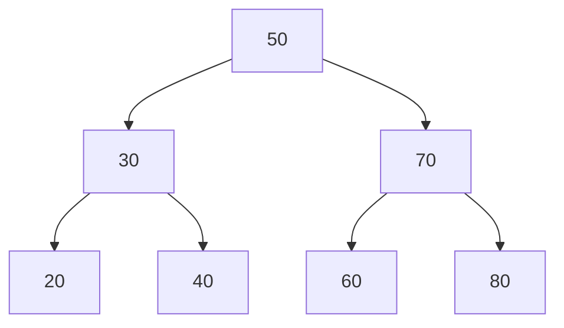
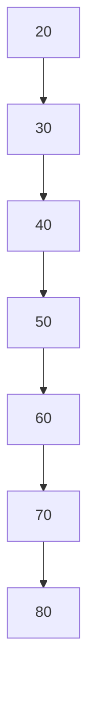

# Rückblick

Ein Baum ist die erste Struktur, bei der Rekursion nicht bloß möglich, sondern die **natürliche** Ausdrucksform ist: Jeder Teilbaum ist selbst wieder ein Baum. Wer das einmal gesehen hat, schreibt Baumalgorithmen fast von allein.

## Das kann ich jetzt

- [ ] Ich kann die Begriffe **Wurzel**, **Knoten**, **Blatt**, **Teilbaum**, **Höhe** und **Tiefe** an einem Baum zeigen. ([Baumstrukturen](./baumstrukturen))
- [ ] Ich kann einen **Binärbaum** in Preorder, Inorder und Postorder durchlaufen. ([Binärbaum](./binaerbaum))
- [ ] Ich kann die Suchbaumeigenschaft prüfen und einen **binären Suchbaum** aufbauen. ([Binärer Suchbaum](./binaerer-suchbaum))
- [ ] Ich kann erklären, warum ein Suchbaum entarten kann und was das kostet. ([Binärer Suchbaum](./binaerer-suchbaum))
- [ ] Ich kann sagen, was ein **AVL-Baum** zusätzlich leistet. ([AVL-Baum](./binaerer-suchbaum/avl-baum))

## Gemischte Aufgaben

:::snippet{#aufgabe}
**Aufgabe 1: Einen Baum lesen**

Die Werte 50, 30, 70, 20, 40, 60, 80 werden **in dieser Reihenfolge** in einen zunächst leeren binären Suchbaum eingefügt.

a) Zeichne den entstehenden Baum.

b) Gib die drei Durchläufe an: Preorder, Inorder, Postorder.

c) Welche Höhe hat der Baum? Wie viele Blätter hat er?

d) Warum ist die Inorder-Ausgabe eines binären Suchbaums immer sortiert? Begründe mit der Suchbaumeigenschaft.

e) Wie viele Vergleiche braucht die Suche nach der 40? Nach der 45?
:::

::::collapsible{title="Tipp zu b)"}

Die Namen sagen, **wann die Wurzel selbst ausgegeben wird**:

- **Pre**order: Wurzel, dann links, dann rechts.
- **In**order: links, Wurzel, rechts.
- **Post**order: links, rechts, dann Wurzel.

Der linke Teilbaum kommt immer vor dem rechten.

::::

:::protect{password="java-q-5-r-1" description="Lösung. Erfrage das Passwort bei deiner Lehrkraft."}

a)



b)

| Durchlauf | Ausgabe |
| --- | --- |
| Preorder | 50 30 20 40 70 60 80 |
| Inorder | 20 30 40 50 60 70 80 |
| Postorder | 20 40 30 60 80 70 50 |

c) Die **Höhe ist 3** – von der Wurzel bis zu einem Blatt liegen drei Knoten übereinander. Blätter sind 20, 40, 60 und 80, also **vier**.

d) Weil im linken Teilbaum jedes Knotens **nur kleinere** und im rechten **nur größere** Werte stehen. Der Inorder-Durchlauf besucht erst alles Kleinere, dann den Knoten, dann alles Größere – und zwar rekursiv auf jeder Ebene. Damit ist die Ausgabe zwangsläufig aufsteigend. Das ist zugleich ein Sortierverfahren: einfügen und einmal inorder ausgeben.

e) Nach der 40: **drei** Vergleiche (50 → 30 → 40). Nach der 45: ebenfalls drei – 50, 30, 40 –, und dann ist der rechte Teilbaum von 40 leer, also steht fest, dass 45 nicht vorkommt. Die Zahl der Vergleiche entspricht immer der **Tiefe**, in der man ankommt, und ist höchstens so groß wie die Höhe des Baums.

:::

:::snippet{#aufgabe}
**Aufgabe 2: Wenn der Baum entartet**

Dieselben sieben Werte werden nun in **aufsteigender** Reihenfolge eingefügt: 20, 30, 40, 50, 60, 70, 80.

a) Zeichne den entstehenden Baum.

b) Welche Höhe hat er jetzt? Wie viele Vergleiche braucht die Suche nach der 80?

c) Welcher linearen Datenstruktur entspricht dieser Baum? Was ist von der Suchbaum-Idee übrig geblieben?

d) Ein Baum mit `n` Knoten hat im günstigsten Fall die Höhe `log₂(n)`, im ungünstigsten `n`. Rechne beides für `n = 1000` aus und vergleiche.

e) Was leistet ein **AVL-Baum** an dieser Stelle, und was kostet es?

f) Nenne eine Situation aus der Praxis, in der Daten typischerweise **schon sortiert** ankommen – und erkläre, warum das den Fall aus b) gefährlich alltäglich macht.
:::

:::protect{password="java-q-5-r-2" description="Lösung. Erfrage das Passwort bei deiner Lehrkraft."}

a) Jeder neue Wert ist größer als alle bisherigen und hängt sich deshalb immer **rechts** an:



b) Die Höhe ist **7**, die Suche nach der 80 braucht **sieben** Vergleiche – jeden Knoten einzeln.

c) Er entspricht einer **verketteten Liste**. Von der Suchbaum-Idee ist nichts übrig: Der Vorteil des Suchbaums bestand darin, mit jedem Vergleich die Hälfte auszuschließen. Hier schließt jeder Vergleich genau **ein** Element aus.

d) log₂(1000) ≈ **10**, im ungünstigsten Fall **1000**. Der Unterschied ist der zwischen einem Wimpernschlag und einer spürbaren Wartezeit – und er wächst weiter: Bei einer Million Knoten stehen 20 gegen 1 000 000.

e) Ein AVL-Baum hält sich nach jedem Einfügen und Löschen **selbst im Gleichgewicht**, indem er Teilbäume rotiert. Damit ist die Höhe garantiert im Bereich von log₂(n), und der ungünstige Fall aus b) kann gar nicht erst eintreten. Der Preis: Bei jedem Einfügen ist die Balance zu prüfen und gegebenenfalls zu rotieren – das macht Einfügen und Löschen aufwendiger, das Suchen dafür verlässlich schnell.

f) Zum Beispiel Daten aus einer Datei, die nach Datum oder Nummer sortiert vorliegt, oder Datensätze, die man aus einer Datenbank mit `ORDER BY` geholt hat. Genau die naheliegende Vorgehensweise „Ich lese die sortierte Datei ein und baue daraus meinen Suchbaum" erzeugt den schlechtestmöglichen Baum. Das ist der Grund, warum in der Praxis fast nur balancierte Bäume benutzt werden.

:::

:::snippet{#aufgabe}
**Aufgabe 3: Rekursiv über Bäume**

Beantworte jede Teilaufgabe zuerst als **Satz** in der Form „Ein leerer Baum … / Sonst …", bevor du Code schreibst.

a) Wie bestimmt man die **Anzahl der Knoten** eines Binärbaums?

b) Wie bestimmt man seine **Höhe**?

c) Wie bestimmt man die **Anzahl der Blätter**?

d) Wie prüft man, ob ein Wert **enthalten** ist – einmal für einen beliebigen Binärbaum und einmal für einen Suchbaum? Worin unterscheiden sich die beiden Verfahren im Aufwand?

e) Warum ist bei Bäumen die Rekursion der Schleife klar überlegen – anders als bei den Aufgaben aus dem [Rekursionskapitel](../03-rekursion-und-problemloesestrategien/04-rueckblick)?
:::

::::collapsible{title="Tipp: Das Muster"}

Jede dieser Fragen hat dieselbe Form:

```
Ein leerer Baum: <trivialer Wert>
Sonst: <etwas aus der Wurzel> kombiniert mit
       <derselben Frage für links> und <derselben Frage für rechts>
```

Bei der Anzahl ist die Kombination ein Plus, bei der Höhe ein Maximum, beim Enthaltensein ein Oder.

::::

:::protect{password="java-q-5-r-3" description="Lösung. Erfrage das Passwort bei deiner Lehrkraft."}

a) Ein leerer Baum hat 0 Knoten. Sonst: 1 + Anzahl links + Anzahl rechts.

b) Ein leerer Baum hat die Höhe 0. Sonst: 1 + das **Maximum** der beiden Teilhöhen.

c) Ein leerer Baum hat 0 Blätter. Ein Knoten ohne Kinder ist selbst ein Blatt, also 1. Sonst: Blätter links + Blätter rechts.

d) **Beliebiger Binärbaum:** Ein leerer Baum enthält nichts. Sonst: Der Wert steht in der Wurzel **oder** links **oder** rechts. Man muss im ungünstigsten Fall **jeden** Knoten ansehen – Aufwand proportional zu `n`.

**Suchbaum:** Ist der gesuchte Wert kleiner als die Wurzel, genügt der linke Teilbaum, sonst der rechte. Der andere Teilbaum wird **gar nicht betreten**. Aufwand proportional zur Höhe, bei ausgeglichenem Baum also log₂(n). Genau darin liegt der Sinn der Suchbaumeigenschaft: Sie erlaubt, die Hälfte ungesehen wegzulassen.

e) Weil die **Struktur selbst** rekursiv ist: Ein Baum besteht aus einer Wurzel und zwei Bäumen. Ein rekursiver Algorithmus bildet diese Form eins zu eins ab. Iterativ ginge es zwar auch, aber nur mit einem **eigenen Stapel**, auf dem man sich die noch offenen Teilbäume merkt – man baut also von Hand nach, was die Rekursion umsonst mitbringt. Bei einer geraden Kette von Schritten wie der Fakultät gibt es diesen Vorteil nicht, deshalb ist Rekursion dort bloß Geschmackssache.

:::

<!--
Rückblick zum Inhaltsfeld Daten und ihre Strukturierung: Baum, Binärbaum,
binärer Suchbaum; Traversierungen (I), Beurteilung nach Speicherbedarf und
Zahl der Operationen (A). Graphen und AVL nur als Ausblick, LK-Inhalte
bleiben in den jeweiligen Lektionen markiert.
-->

---

## Selbsttest

::::multievent

**1. In welcher Reihenfolge besucht der Inorder-Durchlauf?**

{r1{Wurzel, links, rechts}}

{r1{!links, Wurzel, rechts}}

{r1{links, rechts, Wurzel}}

{r1{rechts, Wurzel, links}}

{h{Die Silbe in sagt, wo die Wurzel steht: in der Mitte.}}
{H{Richtig.}}

**2. Was gilt für die Inorder-Ausgabe eines binären Suchbaums?**

{r2{Sie beginnt mit der Wurzel.}}

{r2{!Sie ist aufsteigend sortiert.}}

{r2{Sie gibt zuerst alle Blätter aus.}}

{r2{Sie hängt von der Einfügereihenfolge ab.}}

{h{Links steht nur Kleineres, rechts nur Größeres – auf jeder Ebene.}}
{H{Richtig – damit ist der Suchbaum zugleich ein Sortierverfahren.}}

**3. Sieben Werte werden aufsteigend sortiert in einen leeren Suchbaum eingefügt. Welche Höhe hat er?**

{z{7}}

{h{Jeder neue Wert ist größer als alle bisherigen – wohin hängt er sich?}}
{H{Richtig – der Baum entartet zur Liste.}}

**4. Wie viele Vergleiche braucht die Suche in einem ausgeglichenen Baum mit 1000 Knoten ungefähr?**

{r3{1000}}

{r3{500}}

{r3{!10}}

{r3{100}}

{h{Jeder Vergleich halbiert die Menge – zweierlogarithmus von 1000.}}
{H{Richtig. Im entarteten Baum wären es 1000.}}

**5. Was leistet ein AVL-Baum gegenüber einem gewöhnlichen Suchbaum?**

{r4{Er speichert mehr Werte.}}

{r4{!Er hält sich selbst im Gleichgewicht, sodass die Höhe klein bleibt.}}

{r4{Er sortiert beim Ausgeben.}}

{r4{Er braucht weniger Speicher.}}

{h{Was war das Problem beim sortierten Einfügen?}}
{H{Richtig – erkauft mit mehr Aufwand beim Einfügen und Löschen.}}

**6. Wie lautet der Basisfall bei rekursiven Baumalgorithmen fast immer?**

{r5{ein Blatt}}

{r5{!der leere Baum}}

{r5{die Wurzel}}

{r5{ein Knoten mit genau einem Kind}}

{h{Welcher Fall ist so trivial, dass es nichts mehr zu tun gibt?}}
{H{Richtig – das Blatt wird dadurch mit erledigt, weil seine Kinder leer sind.}}

**7. Warum ist die Suche in einem beliebigen Binärbaum teurer als in einem Suchbaum?**

{r6{Weil Binärbäume größer sind.}}

{r6{!Weil man ohne Ordnung beide Teilbäume durchsuchen muss statt nur einen.}}

{r6{Weil die Rekursion langsamer ist.}}

{r6{Sie ist nicht teurer.}}

{h{Was erlaubt der Vergleich mit der Wurzel im Suchbaum?}}
{H{Richtig – er schließt einen ganzen Teilbaum aus.}}

::::
