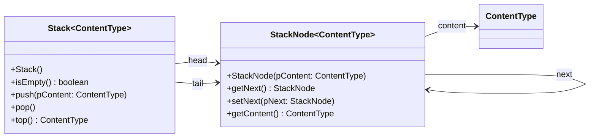

# Dokumentation der Abiturklasse Stack

Die Dokumentation, die du auch im Abitur bekommst, kannst du hier herunterladen: https://www.schulentwicklung.nrw.de/lehrplaene/upload/klp_SII/if/Dokumentation_ZA-IF_GK-LK_ab_2018_2021_12_22.pdf

Die Implementation der Klassen fürs Abitur kannst du hier herunterladen: https://www.schulentwicklung.nrw.de/lehrplaene/upload/klp_SII/if/MaterialZABI/2020-03-11_Implementationen_von_Klassen_fuer_das_Zentralabitur_ab_2018.zip

Zur Vereinfachung kannst du die Dokumentation der Klasse Stack im Folgenden finden, sodass du nicht immer auf das PDF zurückgreifen musst.

## Klassendiagramm

## Methoden

### Stack() (Konstruktor)
Ein leerer Stapel wird erzeugt. Objekte, die in diesem Stapel verwaltet werden, müssen vom
Typ ContentType sein.

### boolean isEmpty()
Die Anfrage liefert den Wert true, wenn der Stapel keine Objekte enthält, sonst liefert sie
den Wert false.

### void push(ContentType pContent)
Das Objekt pContent wird oben auf den Stapel gelegt. Falls pContent gleich null ist,
bleibt der Stapel unverändert.

### void pop()
Das zuletzt eingefügte Objekt wird von dem Stapel entfernt. Falls der Stapel leer ist, bleibt
er unverändert.

### ContentType top()
Die Anfrage liefert das oberste Stapelobjekt. Der Stapel bleibt unverändert. Falls der Stapel
leer ist, wird null zurückgegeben.