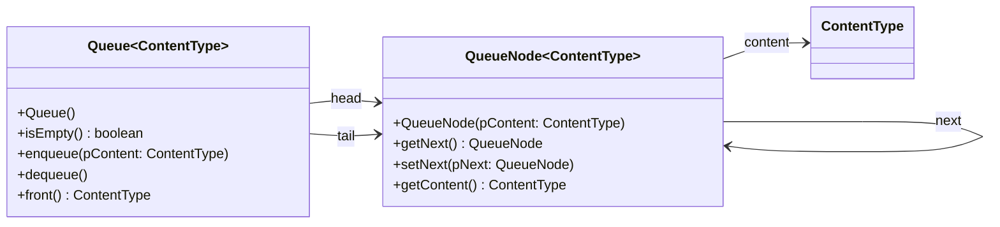

# Dokumentation der Abiturklasse Queue

Die Dokumentation, die du auch im Abitur bekommst, kannst du hier herunterladen: https://www.schulentwicklung.nrw.de/lehrplaene/upload/klp_SII/if/Dokumentation_ZA-IF_GK-LK_ab_2018_2021_12_22.pdf

Die Implementation der Klassen fürs Abitur kannst du hier herunterladen: https://www.schulentwicklung.nrw.de/lehrplaene/upload/klp_SII/if/MaterialZABI/2020-03-11_Implementationen_von_Klassen_fuer_das_Zentralabitur_ab_2018.zip

Zur Vereinfachung kannst du die Dokumentation der Klasse Queue im Folgenden finden, sodass du nicht immer auf das PDF zurückgreifen musst.

## Klassendiagramm

## Methoden

### Queue() (Konstruktor)
Eine leere Schlange wird erzeugt. Objekte, die in dieser Schlange verwaltet werden, müssen vom Typ ContentType sein.

### boolean isEmpty()
Die Anfrage liefert den Wert true, wenn die Schlange keine Objekte enthält, sonst liefert sie den Wert false.

### void enqueue(ContentType pContent)
Das Objekt pContent wird an die Schlange angehängt. Falls pContent gleich null ist, bleibt die Schlange unverändert.

### void dequeue()
Das erste Objekt wird aus der Schlange entfernt. Falls die Schlange leer ist, wird sie nicht verändert.

### ContentType front()
Die Anfrage liefert das erste Objekt der Schlange. Die Schlange bleibt unverändert. Falls die Schlange leer ist, wird null zurückgegeben.