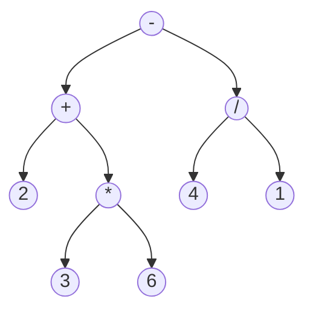
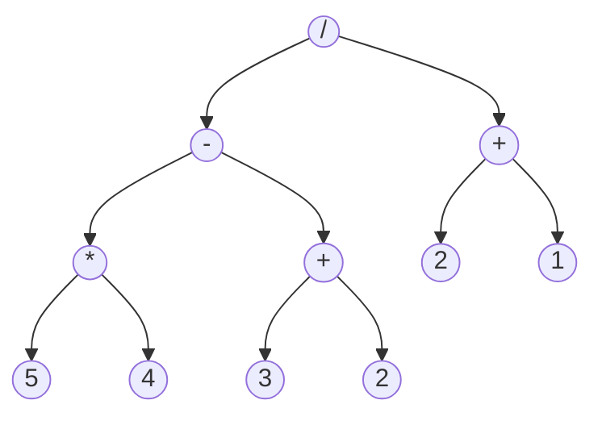

# Beispiel: Termbaum

Etwas vereinfacht ist ein „Term“ in der Mathematik ein Ausdruck, der eine Rechnung darstellt.
Man kann Rechenoperationen wie „plus“, „minus“, „mal“, „geteilt“, „hoch“ usw. verwenden.
Einfache Terme sind also zum Beispiel „5 + 8“ oder „3 / 4".

Man kann Terme kombinieren, indem man Klammern verwendet, zum Beispiel: (5 + 8) · (3 / 4).
Um die Schreibweise zu vereinfachen, hat sich eingebürgert, in bestimmten Fällen die Klammern
wegzulassen und zwei zusätzliche Regeln zur Reihenfolge der Auswertung festgelegt:

- Punkt-vor-Strich-Rechnung: Die folgenden Terme sind identisch: 9 · 2 + 8 · 3 und (9 · 2) + (8 · 3)
- Von links nach rechts auswerten (bei nur Punkt- oder nur Strich-Rechnung): Die folgenden Terme sind identisch: 8 – 7 + 4 und (8 – 7) + 4

Um einen Term auszuwerten, muss man zuerst die inneren Klammern berechnen.
Die Ergebnisse der inneren Klammern werden dann für die äußeren Rechnungen benutzt.
Im Beispiel (5 + 8) · (3 / 4) würde man also zuerst 5 + 8 und 3 / 4 ausrechnen, und die Ergebnisse
dann multiplizieren.

Da Terme durch ihre Klammerung hierarchisch
geordnet sind, kann man sie auch durch einen
Binärbaum darstellen, wie zum Beispiel den Term

$$
2+3\cdot6–4/1
$$

Wegen der Punkt-vor-Strich-Rechnung muss man
zuerst die Multiplikation 3 · 6 und die Division
4 / 1 berechnen, und verwendet die Ergebnisse
dann für die Addition bzw. Subtraktion.

## Aufgabe

- Stelle den Term $ 5 \cdot (6 + 2) - 7 / 4 + 2 \cdot 2 $ als Termbaum dar.
- Stelle den Term zu folgenden Termbaum auf:

**Zur Präsentation**:
- Erläutere das Anwendungsbeispiel (Terme).
- Zeichne einen Beispiel-Termbaum.
- Erläutere, wie ein Termbaum ausgewertet (also das Ergebnis des Terms berechnet) wird.

In Anlehnung an Christian Pothmann unter CC BY-NC-SA 4.0
