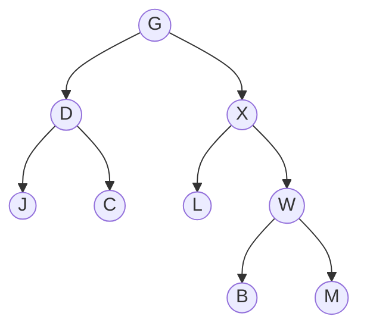

# Traversierung

Es gibt Fälle, in denen man alle Elemente eines Baumes ausgeben oder in eine lineare Liste überführen möchte. Dabei kommt es darauf an, in welcher Reihenfolge die Elemente im Baum ausgegeben oder in die lineare Liste eingefügt werden sollen. Die unterschiedlichen Reihenfolgen führen zu verschiedenen Arten der Traversierung.

Schau dir das folgende Video an und beantworte die nachstehenden Fragen:

::youtube{#5X8CkFBq_8k}

## Aufgaben

1. Gib vier Arten der Traversierung von Binärbäumen an.

:::collapsible{title="Lösung" id="sajfkjdjaskdvj"}
Level-Order, Pre-Order, Post-Order und In-Order
:::

2. Gib an wofür die Abkürzungen bei den Traversierungsstrategien Pre-, In- und Post-Order stehen.

:::collapsible{title="Lösung" id="sakjfsanvjshdfjkdsag"}

Die Abkürzungen W, L und R stehen für die Reihenfolge des Durchlaufs. Zum Beispiel wird bei der Post-Order-Traversierung zuerst der linke (L) und dann der rechte (R) Teilbaum durchlaufen. Zum Schluss wird die Wurzel (W) betrachtet.

:::

3. Erkläre wie man die drei Traversierungsstrategien Pre-, In- und Post-Order zeichnerisch nachvollziehen kann.

:::collapsible{title="Lösung" id="asfkjavnsajkjsdfj"}

Man zeichnet den Binärbaum. Danach zeichnet man eine Kurve um den Binärbaum, welche an allen Knoten vorbeigeht, aber nicht die Kanten kreuzt.

Anschließend zeichnet man von jedem Knoten einen Strich nach links, rechts und unten, sodass diese Striche die Kurve berühren.

Nun geht man die Kurve entlang und gibt die Knoten aus, die zur Traversierungsstrategie passen.

- Pre-Order: linker Strich
- In-Order: unterer Strich
- Post-Order: rechter Strich

:::

4. Traversiere den folgenden Binärbaum mit den drei Traversierungsarten (Pre-, In- und Post-Order).

:::collapsible{title="Lösung" id="sjfksakjfkjsdfsvsfkjfs"}

- Pre: GDJCXLWBM
- Post: JCDLBWXG
- In: JDCGLXBWM

:::

5. Ein Baum wurde Post-Order traversiert. Das Ergebnis lautet `G D V Z H K L Q W E R`. Gib einen Ursprungbaum an, der dieses Ergebnis liefert. Analysiere, ob du einen weiteren Ursprungbaum finden kannst oder ob dieser eindeutig ist.

:::collapsible{title="Lösung" id="jkdjfkkasfkjskfjsakjf"}

Für die Ausgabe gibt es mehrere Möglichkeiten, wie der Ausgangsbaum ausgesehen haben kann.

:::

In Anlehnung an https://ddi.uni-wuppertal.de/archiv/madin/material/materialsammlung/oberstufe/datenstrukturen/baeume/ab_03_traversierung.pdf (CC-BY-NC-SA).
