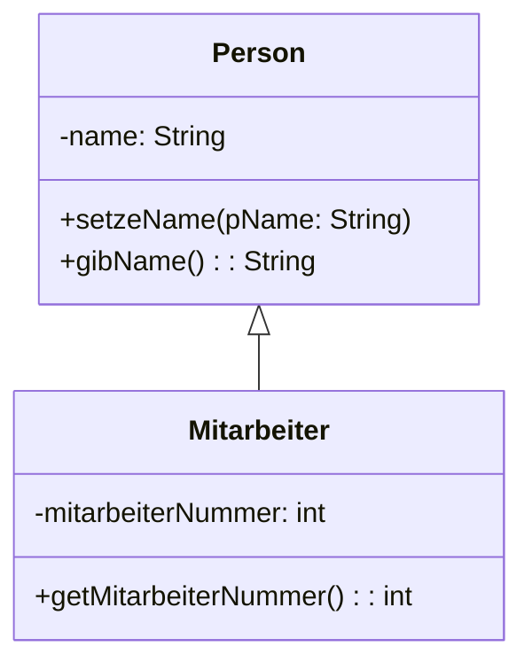

# Vererbung

:t[Vererbung]{#vererbung} ist ein mächtiges Konzept der objektorientierten Programmierung, das es ermöglicht, neue :t[Klassen]{#klasse} auf Basis bestehender Klassen zu erstellen. Die neue Klasse "erbt" Eigenschaften und Methoden der ursprünglichen Klasse.

:::snippet{#beispiel}

**Vergleich aus der Natur**: 
Alle Säugetiere haben gemeinsame Eigenschaften (Warmblüter, haben Fell, säugen ihre Jungen). Hunde sind eine spezielle Art von Säugetieren und haben zusätzlich eigene Eigenschaften (bellen, wedeln mit dem Schwanz).

In der Programmierung können wir das genauso machen: Eine allgemeine Klasse `Säugetier` und spezielle Klassen wie `Hund` oder `Katze`, die von `Säugetier` erben.

:::

## Grundkonzept der Vererbung

### Basisklasse und abgeleitete Klasse

- **Basisklasse** (auch Superklasse oder Elternklasse): Die ursprüngliche Klasse
- **Abgeleitete Klasse** (auch Unterklasse oder Kindklasse): Die Klasse, die erbt

Die Vererbungsbeziehung wird in Java mit dem Schlüsselwort `extends` beschrieben.



## Einfaches Vererbungsbeispiel

### Die Basisklasse: Person

:::onlineide{url="https://nrw.onlineide.openpatch.org"}
```java PersonVererbung.java
// Basisklasse
class Person {
    protected String name;  // protected = sichtbar für Unterklassen
    protected int alter;
    
    public Person(String name, int alter) {
        this.name = name;
        this.alter = alter;
    }
    
    public void stelleVor() {
        System.out.println("Hallo, ich bin " + name + " und " + alter + " Jahre alt.");
    }
    
    public void geburtstag() {
        alter++;
        System.out.println("Happy Birthday! " + name + " ist jetzt " + alter + " Jahre alt.");
    }
    
    public String getName() {
        return name;
    }
}

// Abgeleitete Klasse: Student
class Student extends Person {
    private String studiengang;
    private int semester;
    
    public Student(String name, int alter, String studiengang) {
        super(name, alter);  // Konstruktor der Basisklasse aufrufen
        this.studiengang = studiengang;
        this.semester = 1;
    }
    
    // Neue Methode, die nur Student hat
    public void naechstesSemester() {
        semester++;
        System.out.println(name + " ist jetzt im " + semester + ". Semester.");
    }
    
    // Überschriebene Methode
    @Override
    public void stelleVor() {
        System.out.println("Hi! Ich bin " + name + ", " + alter + " Jahre alt und studiere " + 
                         studiengang + " im " + semester + ". Semester.");
    }
}

// Test der Vererbung
Person person = new Person("Anna", 25);
person.stelleVor();
person.geburtstag();

System.out.println();

Student student = new Student("Max", 20, "Informatik");
student.stelleVor();
student.naechstesSemester();
student.geburtstag();  // Geerbte Methode
```
:::

## Wichtige Vererbungskonzepte

### super - Zugriff auf die Basisklasse

Das Schlüsselwort `super` ermöglicht den Zugriff auf Methoden und Konstruktoren der Basisklasse:

:::onlineide{url="https://nrw.onlineide.openpatch.org"}
```java SuperBeispiel.java
class Fahrzeug {
    protected String marke;
    protected int maxGeschwindigkeit;
    
    public Fahrzeug(String marke, int maxGeschwindigkeit) {
        this.marke = marke;
        this.maxGeschwindigkeit = maxGeschwindigkeit;
    }
    
    public void starten() {
        System.out.println(marke + " startet...");
    }
    
    public void info() {
        System.out.println("Fahrzeug: " + marke + ", Max: " + maxGeschwindigkeit + " km/h");
    }
}

class Auto extends Fahrzeug {
    private int anzahlTueren;
    
    public Auto(String marke, int maxGeschwindigkeit, int anzahlTueren) {
        super(marke, maxGeschwindigkeit);  // Basisklassen-Konstruktor
        this.anzahlTueren = anzahlTueren;
    }
    
    @Override
    public void starten() {
        System.out.println("Zündschlüssel umdrehen...");
        super.starten();  // Basisklassen-Methode aufrufen
        System.out.println("Motor läuft!");
    }
    
    @Override
    public void info() {
        super.info();  // Basisklassen-Info
        System.out.println("Türen: " + anzahlTueren);
    }
}

// Test
Auto meinAuto = new Auto("BMW", 250, 4);
meinAuto.starten();
meinAuto.info();
```
:::

### Zugriffsbereiche (Sichtbarkeit)

:::snippet{#merken}

**Zugriffsbereiche bei Vererbung**:
- `private`: Nur in der eigenen Klasse sichtbar
- `protected`: In der eigenen Klasse UND in Unterklassen sichtbar
- `public`: Überall sichtbar

:::

:::onlineide{url="https://nrw.onlineide.openpatch.org"}
```java Zugriffsbereiche.java
class Tier {
    private String art;           // Nur in Tier sichtbar
    protected String name;        // In Tier und Unterklassen sichtbar
    public int alter;            // Überall sichtbar
    
    public Tier(String art, String name, int alter) {
        this.art = art;
        this.name = name;
        this.alter = alter;
    }
    
    private void atmung() {
        System.out.println("Das Tier atmet");
    }
    
    protected void schlafen() {
        System.out.println(name + " schläft");
    }
    
    public void info() {
        System.out.println(name + " ist ein " + art + " und " + alter + " Jahre alt");
    }
}

class Hund extends Tier {
    private String rasse;
    
    public Hund(String name, int alter, String rasse) {
        super("Hund", name, alter);
        this.rasse = rasse;
    }
    
    public void verhalten() {
        System.out.println(name + " wedelt mit dem Schwanz");  // ✓ protected
        schlafen();  // ✓ protected
        // atmung();  // ✗ FEHLER: private nicht sichtbar
        // art;       // ✗ FEHLER: private nicht sichtbar
        System.out.println("Alter: " + alter);  // ✓ public
    }
    
    public void bellen() {
        System.out.println(name + " (" + rasse + ") bellt: Wuff!");
    }
}

// Test
Hund bello = new Hund("Bello", 5, "Golden Retriever");
bello.info();
bello.verhalten();
bello.bellen();
// bello.schlafen();  // ✗ protected nicht von außen sichtbar
```
:::

## Praktisches Beispiel: Formen

:::onlineide{url="https://nrw.onlineide.openpatch.org"}
```java FormenHierarchie.java
// Basisklasse für geometrische Formen
abstract class Form {
    protected String farbe;
    
    public Form(String farbe) {
        this.farbe = farbe;
    }
    
    public void setFarbe(String farbe) {
        this.farbe = farbe;
    }
    
    public String getFarbe() {
        return farbe;
    }
    
    // Abstrakte Methoden müssen in Unterklassen implementiert werden
    public abstract double berechneFlaeche();
    public abstract double berechneUmfang();
    public abstract void beschreibung();
}

class Rechteck extends Form {
    private double laenge;
    private double breite;
    
    public Rechteck(String farbe, double laenge, double breite) {
        super(farbe);
        this.laenge = laenge;
        this.breite = breite;
    }
    
    @Override
    public double berechneFlaeche() {
        return laenge * breite;
    }
    
    @Override
    public double berechneUmfang() {
        return 2 * (laenge + breite);
    }
    
    @Override
    public void beschreibung() {
        System.out.println("Rechteck (" + farbe + "): " + laenge + " x " + breite);
        System.out.println("Fläche: " + berechneFlaeche());
        System.out.println("Umfang: " + berechneUmfang());
    }
}

class Kreis extends Form {
    private double radius;
    
    public Kreis(String farbe, double radius) {
        super(farbe);
        this.radius = radius;
    }
    
    @Override
    public double berechneFlaeche() {
        return Math.PI * radius * radius;
    }
    
    @Override
    public double berechneUmfang() {
        return 2 * Math.PI * radius;
    }
    
    @Override
    public void beschreibung() {
        System.out.println("Kreis (" + farbe + "): Radius " + radius);
        System.out.println("Fläche: " + Math.round(berechneFlaeche() * 100) / 100.0);
        System.out.println("Umfang: " + Math.round(berechneUmfang() * 100) / 100.0);
    }
}

// Test
Rechteck rechteck = new Rechteck("blau", 5, 3);
rechteck.beschreibung();

System.out.println();

Kreis kreis = new Kreis("rot", 4);
kreis.beschreibung();
```
:::

## Übung: Vererbung verstehen

Gegeben sind die folgenden beiden Klassen. Beantworte die nachstehenden Fragen:

:::onlineide{url="https://nrw.onlineide.openpatch.org"}
```java VererbungsTest.java
class Fahrzeug {
    private String farbe;
    public int geschwindigkeit;
    protected String marke;

    public Fahrzeug(String marke, String farbe) {
        this.marke = marke;
        this.farbe = farbe;
        this.geschwindigkeit = 0;
    }

    public void setzeFarbe(String neueFarbe) {
        farbe = neueFarbe;
    }
    
    public String gibFarbe() {
        return farbe;
    }
    
    public void beschleunigen() {
        geschwindigkeit += 10;
        System.out.println(marke + " fährt jetzt " + geschwindigkeit + " km/h");
    }
}

class PKW extends Fahrzeug {
    private boolean hatKofferraum;

    public PKW(String marke, String farbe, boolean hatKofferraum) {
        super(marke, farbe);
        this.hatKofferraum = hatKofferraum;
    }
    
    public void kofferraumInfo() {
        if (hatKofferraum) {
            System.out.println(marke + " hat einen Kofferraum");
        } else {
            System.out.println(marke + " hat keinen Kofferraum");
        }
    }
}

// Test verschiedener Zugriffe
PKW meinAuto = new PKW("BMW", "schwarz", true);
meinAuto.beschleunigen();
meinAuto.kofferraumInfo();
System.out.println("Farbe: " + meinAuto.gibFarbe());
```
:::

**Fragen**:

1. Ist dieser Code gültig? `meinAuto.geschwindigkeit = 50;`

:::collapsible{title="Antwort 1" id="antwort1"}
Ja! Das Attribut `geschwindigkeit` ist `public` und wird vererbt.
:::

2. Ist dieser Code gültig? `meinAuto.marke = "Audi";`

:::collapsible{title="Antwort 2" id="antwort2"}
Nein! Das Attribut `marke` ist `protected` und kann nicht von außen zugegriffen werden.
:::

3. Ist dieser Code gültig? `meinAuto.hatKofferraum = false;`

:::collapsible{title="Antwort 3" id="antwort3"}
Nein! Das Attribut `hatKofferraum` ist `private` und nicht von außen sichtbar.
:::

## Teste-Dich-Projekt: Mitarbeiter-Hierarchie

:::snippet{#aufgabe}

Erstelle ein Mitarbeiter-Verwaltungssystem mit Vererbung:

1. **Basisklasse `Mitarbeiter`**:
   - Attribute: name, gehalt, mitarbeiterID
   - Methoden: arbeiten(), gehaltserhöhung(betrag)

2. **Unterklasse `Entwickler extends Mitarbeiter`**:
   - Zusätzliches Attribut: programmiersprache
   - Überschriebene Methode: arbeiten() (spezifischer für Entwickler)
   - Neue Methode: neueSpracheLernen(sprache)

3. **Unterklasse `Manager extends Mitarbeiter`**:
   - Zusätzliches Attribut: teamGroesse
   - Überschriebene Methode: arbeiten() (spezifischer für Manager)  
   - Neue Methode: teamMeeting()

:::

:::onlineide{url="https://nrw.onlineide.openpatch.org"}
```java MitarbeiterSystem.java
// Deine Lösung hier:

// Basisklasse Mitarbeiter


// Unterklasse Entwickler


// Unterklasse Manager


// Test der Klassen
Entwickler dev = new Entwickler("Anna", 4500, "E001", "Java");
Manager mgr = new Manager("Tom", 6000, "M001", 8);

dev.arbeiten();
dev.neueSpracheLernen("Python");

mgr.arbeiten();
mgr.teamMeeting();
```
:::

### Testfälle
- Entwickler kann arbeiten, neue Sprachen lernen und Gehaltserhöhung bekommen
- Manager kann arbeiten, Team-Meetings leiten und Gehaltserhöhung bekommen
- Alle Methoden der Basisklasse funktionieren bei beiden Unterklassen

## Expertenbereich

:::snippet{#brain}

**Erweiterte Aufgaben**:
- Erstelle eine Klassenhierarchie für verschiedene Tiere (Säugetiere, Vögel, Fische)
- Implementiere ein Spiel mit verschiedenen Charakter-Klassen (Krieger, Magier, Bogenschütze)
- Entwerfe ein Fahrzeug-System mit Auto, Motorrad, LKW als Unterklassen

:::onlineide{url="https://nrw.onlineide.openpatch.org"}
```java ExpertenAufgaben.java
// Hier kannst du die erweiterten Aufgaben bearbeiten

```
:::

:::

:::snippet{#merken}

**Wichtige Vererbungsregeln**:
- Eine Klasse kann nur von einer anderen Klasse erben (Einfachvererbung)
- Alle Klassen erben automatisch von der Klasse `Object`
- Private Attribute werden nicht vererbt (nicht sichtbar in Unterklassen)
- Konstruktoren werden nicht vererbt, aber können mit `super()` aufgerufen werden

:::
