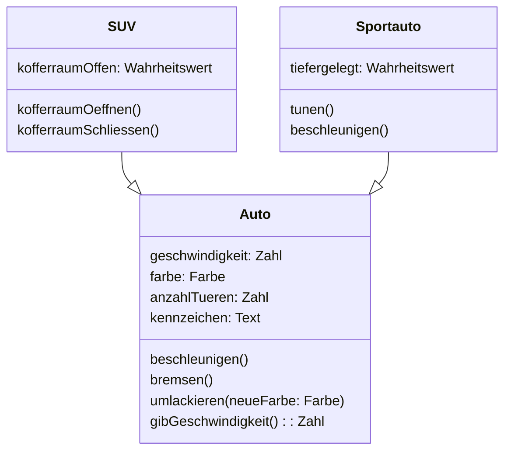
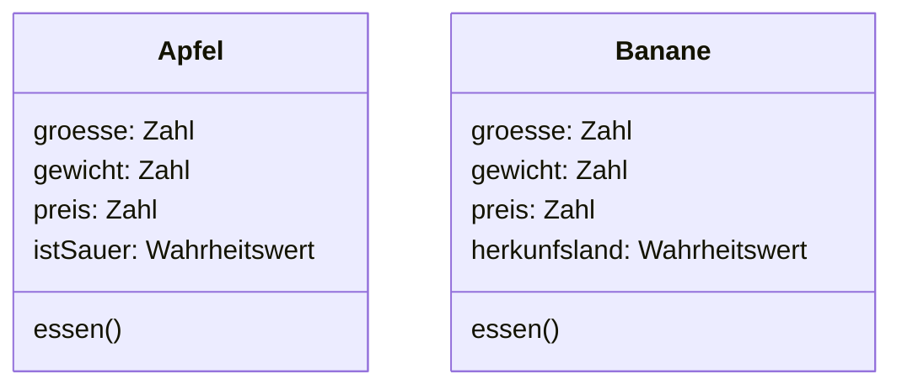
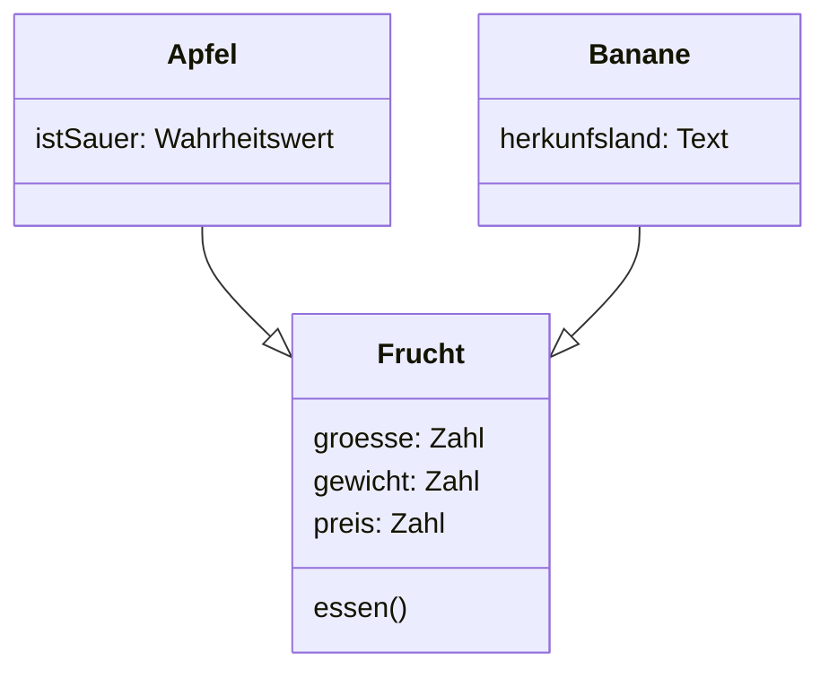

# Vererbungsbeziehung

Die Vererbung ist eines der grundlegenden Konzepte der Objektorientierung und hat große Bedeutung in der Softwareentwicklung. Die Vererbung dient dazu, aufbauend auf existierenden Klassen (Oberklasse) neue :t[Klassen]{#klasse} (Unterklassen) zu schaffen, wobei die Beziehung zwischen ursprünglicher und neuer Klasse dauerhaft ist. Die Vererbung dient der Dokumentation von Ähnlichkeiten zwischen Klassen, was insbesondere in den frühen Phasen des Softwareentwurfs von Bedeutung ist.

Das folgende :t[Entwurfsdiagramm] zeigt eine Vererbungssituation, bei der die Unterklasse Sportauto und SUV Erweiterungen einer Basisklasse Auto darstellen.

## Übernehmen, ergänzen und überschreiben

Bei der Vererbung übernimmt die Unterklasse die Attribute und Methoden der Oberklasse.

Eine übernommene Methode kann dabei neu definiert (überschrieben) werden. Im Klassendiagramm ist zum Beispiel gezeigt, dass die Klasse `Sportauto` die Methode `beschleunigen` neu definiert.

Die Unterklasse kann um zusätzliche Attribute und Methoden erweitert werden. Im Klassendiagramm ist zum Beispiel gezeigt, dass die Klasse `SUV` ein neues Attribut `kofferraumOffen` besitzt.

## Spezialisierung und Generalisierung

Wenn eine neue Oberklasse definiert wird, dann sprechen wir von einer Generalisierung.

Wird hingegen eine neue Unterklasse definiert, dann sprechen wir von einer Spezialisierung.

## Überprüfe dich

1. Gegeben ist folgendes Klassendiagramm ([Link zum Mermaid-Live Editor](https://mermaid.live/edit#pako:eNqtkU1LxDAQhv9KmJNCEetK3c1N8eppD8KSy9BON4E0KcmE_Sj976Yfoix4cy55efIO7zAzQO0bAgm1xRjfDR4DdsqJXDMRr31LVgwLmuoYPMVIUhxQ21-YTqbWfIv7QCbeQhN5j4mCFJ-ogybD8USBlfuxTBHu7n4B4_fPMtIbOnT0TzP9FQkFdBQ6NE1ezhylgDV1pEBm2VCLybIC5SYrJvb7i6tBckhUQOobZFrXCbJFGzPt0YEc4Ayyqgq4gCyfq4fd9rF6Kjebl-0ui7GAq_e5pZzth1mv7dQY9uFjvdf0jF8tZody)). Modifiziere das Klassendiagramm so, dass das Konzept der Vererbung sinnvoll genutzt ist.

:::collapsible{id="loesung1" title="Lösung"}

:::
 

2. Es existieren die Klassen Fussballer, Turnerin und Judoka. Eine neue Klasse Sportlerin wird angelegt. Handlet es sich um eine Spezialisierung oder Generalisierung?

:::collapsible{id="loesung2" title="Lösung"}
Generalisierung
:::
