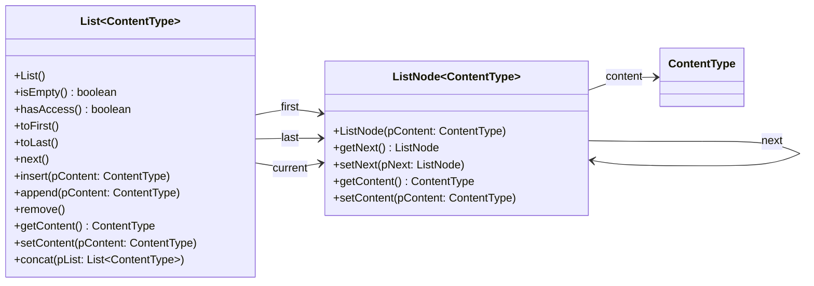

# Dokumentation der Abiturklasse List

Für das Abitur werden verschiedene Klassen bereitgestellt, mit denen du arbeiten musst. In Klausur wirst du zu den benötigten Klassen eine Dokumentation erhalten, jedoch bietet es sich an viele der Funktionalitäten der Klasse auswendig zu kennen und die Dokumentation nur als Unterstützung zu nutzen.

Die Dokumentation, die du auch im Abitur bekommst, kannst du hier herunterladen: https://www.schulentwicklung.nrw.de/lehrplaene/upload/klp_SII/if/Dokumentation_ZA-IF_GK-LK_ab_2018_2021_12_22.pdf

Die Implementation der Klassen fürs Abitur kannst du hier herunterladen: https://www.schulentwicklung.nrw.de/lehrplaene/upload/klp_SII/if/MaterialZABI/2020-03-11_Implementationen_von_Klassen_fuer_das_Zentralabitur_ab_2018.zip

Zur Vereinfachung kannst du die Dokumentation der Klasse List im Folgenden finden, sodass du nicht immer auf das PDF zurückgreifen musst.

## Klassendiagramm

## Methoden

### List() (Konstruktor)
Eine leere Liste wird erzeugt. D.h. first, last und current zeigen jeweils auf null.

### boolean isEmpty()
Gibt true zurück, falls es keine Elemente in der Liste gibt, sonst false.

### boolean hasAccess()
Gibt true zurück, falls current auf einen gültigen Knoten zeigt.
D.h. bei einer leeren List ist hasAccess() == false. Erst wenn es mindestens ein Element in der Liste gibt und
toFirst() aufgerufen wird, zeigt current auf einen Knoten, und hasAccess() gibt true zurück.

### void toFirst()
Setzt current auf das erste Element der Liste. Wenn die Liste leer ist, bleibt current = null.

### void next()
Falls current auf einen gültigen Knoten zeigt (hasAccess() == true), rückt current weiter auf seinen
Nachfolger. Sonst passiert nichts.
Falls current auf den letzten Knoten zeigt, zeigt er anschließend auf null, d.h. hasAccess() wird false.

### void insert(ContentType pContent)
Falls current auf einen gültigen Knoten zeigt (hasAccess() == true), wird ein neuer Knoten mit pContent vor
current eingefügt. Current zeigt weiterhin auf den Knoten, auf den es vorher gezeigt hat.
Falls die Liste leer ist, wird ebenfalls ein neuer Knoten eingefügt. Current bleibt dann null (wie bei append())
Falls die Liste nicht leer ist UND hasAccess() == false ist, passiert nichts (es wird kein Knoten eingefügt).
Sonderfall: Falls der Parameter pContent null ist, wird kein neuer Knoten eingefügt.

### void append(ContentType pContent)
Hängt ein neues Element ans Ende der Liste.
Current wird dadurch nicht beeinflusst (wenn current vorher den Wert null hatte, bleibt es weiterhin null).
Sonderfall: Falls der Parameter pContent null ist, wird kein neuer Knoten angehängt.

### void remove()
Falls current auf einen gültigen Knoten zeigt (hasAccess() == true), wird dieser Knoten gelöscht.
Current wandert dann zu dessen Nachfolger.
Falls es keinen Nachfolger gibt, ist anschließend hasAccess() == false.
Falls current nicht auf einen gültigen Knoten zeigt, passiert nichts.

### ContentType getContent()
Falls current auf einen gültigen Knoten zeigt (hasAccess() == true), wird das Objekt an diesem Knoten
zurückgegeben. Sonst wird null zurückgegeben.

### void setContent(ContentType pContent)
Falls current auf einen gültigen Knoten zeigt (hasAccess() == true), wird das Inhaltsobjekt an diesem Knoten
durch pContent ausgetauscht. Das Inhaltsobjekt, das vorher an diesem Knoten hing, wird gelöscht
(falls es nicht vorher an andere Stelle gesichert wurde).

### void concat(List<ContentType> pList)
Eine zweite Liste (pList) wird ans Ende dieser Liste angehängt. Die Liste muss den gleichen Typ von
Inhaltsobjekten haben. Auf diese Weise können zwei Listen miteinander verbunden werden.
Current bleibt davon unberührt (zeigt weiterhin auf den gleichen Knoten bzw. auf null).
Die Liste, auf die der Parameter pList zeigt, wird zu einer leeren Liste.
Das bedeutet dass man mit pList anschließend keinen Zugriff mehr auf die Elemente der Liste hat.
