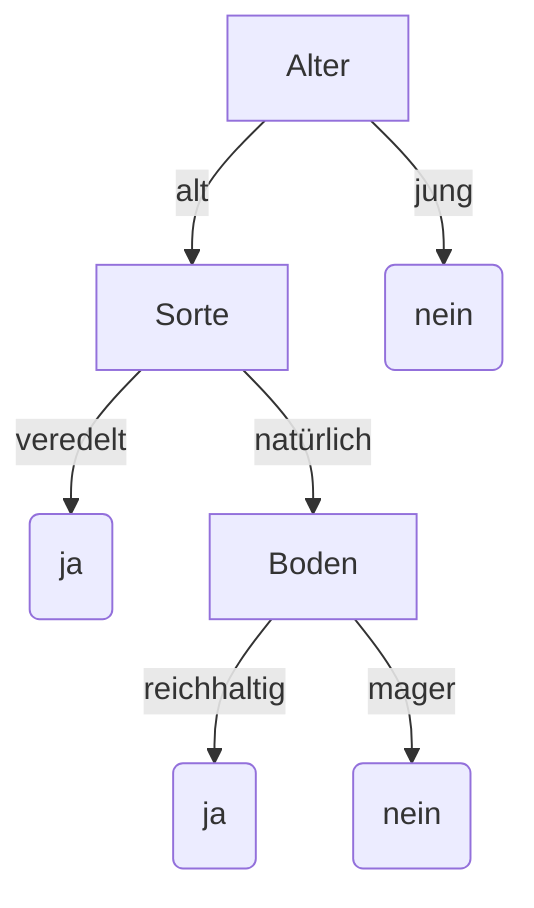

# Beispiel: Entscheidungsbaum

Entscheidungsbäume stellen Prozesse dar, die nach einer Reihe von Fragen zu einer Entscheidung
gelangen. Sie werden benutzt, um komplexe Entscheidungen für Menschen übersichtlich
darzustellen, und werden in der künstlichen Intelligenz verwendet. Eine künstliche Intelligenz
kann einen Entscheidungsbaum nach und nach durch Erfahrung erweitern und so mit der Zeit zu
besseren Entscheidungen gelangen.

Das abgebildete Beispiel zeigt die Vorhersage, ob ein
Apfelbaum wahrscheinlich Früchte tragen wird oder nicht.

Der Entscheidungsbaum besteht aus mehreren
„wenn, dann“ Fragen:
Wenn der Baum jung ist, dann wird er nicht tragen.
Andernfalls: wenn er veredelt ist, wird er tragen.
Wenn er nicht veredelt ist, kommt es auf den Boden an.
Wenn der Boden reichhaltig ist, wird er tragen, sonst nicht.

## Aufgabe

Wer einen Wikipedia-Artikel schreibt, möchte diesen in der Regel mit Bildern illustrieren.
Dabei muss man aber ein nicht ganz einfaches Regelwerk von Urheberrechten beachten.
Stelle dieses Regelwerk graphisch als Entscheidungsbaum dar.

- Hast du das Bild selbst erstellt?
    - Falls ja, willst du es unter einer in Wikipedia zulässigen Lizenz veröffentlichen?
        - Falls ja, sind Bildrechte Dritter auszuschließen?
            - Falls ja, lade es hoch
            - Falls nein, hast du das schriftliche Einverständnis aller Betroffenen?
                - Falls ja, dann lade es hoch
                - Falls nein, dann lade es nicht hoch
        - Falls nein, dann lade es nicht hoch
    - Falls nein, ist das Bild mehr als 100 Jahr alt?
        - Falls ja, dann lade es hoch
        - Falls nein, ist der Urheber des Bildes bekannt?
            - Falls ja, ist der Urheber vor mehr als 70 Jahren verstorben?
                - Falls ja, sind Bildrechte Dritter auszuschließen? (siehe oben)
                - Falls nein, hat der Urheber zugestimmt, das Bild unter eine freie Lizenz zu stellen?
                    - Falls ja, dann lade es hoch
                    - Falls nein, dann lade es nicht hoch
            - Falls nein, dann lade es nicht hoch

**Zur Präsentation:**
- Erläutere das Anwendungsbeispiel (Entscheidungsbaum allgemein).
- Zeichne den Entscheidungsbaum deiner Aufgabe.

In Anlehnung an Christian Pothmann unter CC BY-NC-SA 4.0
