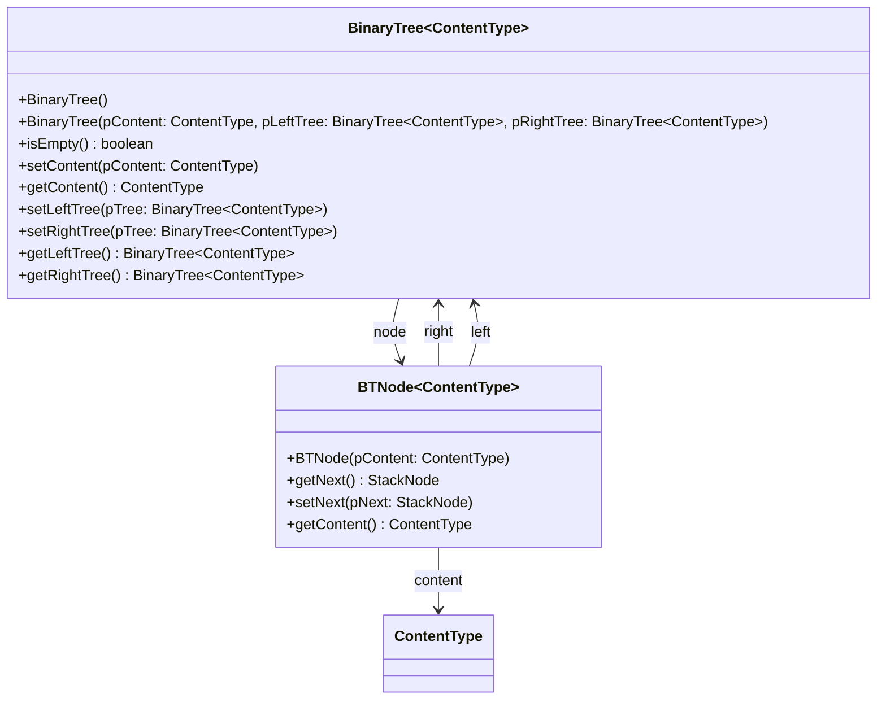

# Dokumentation der Abiturklasse BinaryTree

## Klassendiagramm

## Methoden

### BinaryTree()
Erzeugt einen leeren Knoten. Die Referenzen left, right und content werden auf null gesetzt.

### BinaryTree(ContentType pContent)
Erzeugt einen Knoten mit dem Inhalt „pContent“. Dieser Knoten ist also nicht leer.
Für die Referenzen left und right wird jeweils ein neuer leerer Knoten erzeugt.
Ausnahme: Falls pContent null ist, wird ein leerer Knoten erzeugt.

### BinaryTree(ContentType pContent, BinaryTree pLeft, BinaryTree pRight)
Erzeugt einen Knoten mit dem Inhalt „pContent“.
Zusätzlich werden zwei bereits bestehende Binärbäume (pLeft und pRight) als linker bzw. rechter Teilbaum
an den neuen Knoten gehängt.

Ausnahmen:
Falls pContent null ist, wird ein leerer Knoten erzeugt (und er erhält keine Verbindung zu pLeft/pRight).
Falls pLeft und/oder pRight null sind, wird stattdessen ein neuer leerer Knoten als Nachfolger erzeugt.

### boolean isEmpty()
Gibt true zurück, falls dieser Knoten keinen Inhalt enthält (content = null).
Gibt false zurück, falls er einen Inhalt (und damit auch einen linken und rechten Nachfolger) enthält.

### void setContent(ContentType pContent)
Falls dieser Knoten leer ist, wird „pContent“ als Inhalt gesetzt.
In diesem Fall werden zwei leere Knoten als linker / rechter Nachfolger erzeugt
(wie beim Konstruktor BinaryTree(ContentType pContent) )
Falls der Knoten nicht leer ist, wird der aktuelle Inhalt durch „pContent“ ersetzt.

### ContentType getContent()
Gibt das Inhalts-Objekt dieses Knotens zurück (null, falls der Knoten leer ist).

### void setLeftTree(BinaryTree pTree)
Setzt den Binärbaum pTree als linken Teilbaum dieses Knotens (d.h. die Referenz left).
Falls bereits ein linker Teilbaum existiert (und keine weitere Referenz auf ihn zeigt), wird dieser gelöscht.

### void setRightTree(BinaryTree pTree)
Setzt den Binärbaum pTree als rechten Teilbaum dieses Knotens (d.h. die Referenz right).
Falls bereits ein rechter Teilbaum existiert (und keine weitere Referenz auf ihn zeigt), wird dieser gelöscht.

### BinaryTree getLeftTree()
Gibt eine Referenz auf den linken Nachfolger dieses Knotens (d.h. den linken Teilbaum) zurück
(null falls der Knoten leer ist).

### BinaryTree getRightTree()
Gibt eine Referenz auf den rechten Nachfolger dieses Knotens (d.h. den rechten Teilbaum) zurück
(null falls der Knoten leer ist).
