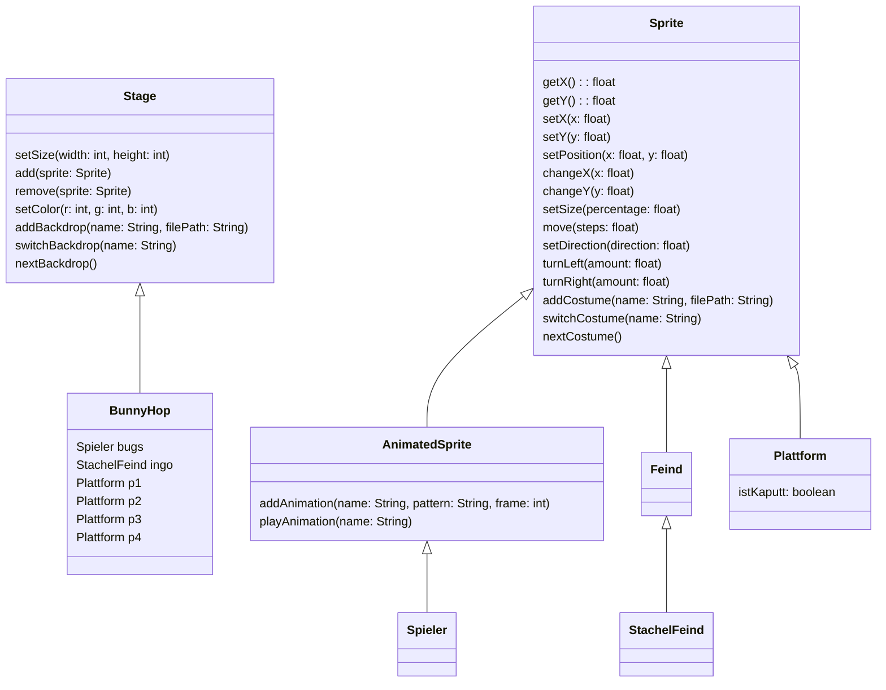

# Alles bewegt sich

Nun wollen wir, dass sich alle Objekte bewegen.

Die Plattformen und der StachelFeind sollen sich nach links bewegen. Der Spieler soll eine Bewegungsanimation bekommen.


## Objekte bewegen

Da unsere Klassen `Spieler`, `StachelFeind` und `Plattform` alle von der Oberklasse `Sprite` erben, können wir viele hilfreiche Methoden benutzen.

Damit sich die Objekte bewegen können wir z.B. die Methode `void changeX(steps)` verwenden. Diese Methode bekommt die Anzahl der Schritte übergeben, die das Objekt sich in x-Richtung bewegen soll.

Zum Beispiel wurde `this.changeX(1)` das aktuelle Objekt um eine Einheit nach rechts bewegen.

Da wir diesen Befehl kontinuierlich in jedem Durchlauf des Game-Loops ausführen möchten, müssen wird eine spezielle Methode schreiben.

```java
public class Plattform extends Sprite {
    ...
    public void run() {
        // 60-mal in der Sekunde
    }
    ...
}
```

Besitzt eine Klasse die Methode `run`, dann wird diese Methode 60-mal in der Sekunde ausgeführt.

### Aufgabe

1. Füge die Methode `public void run()` der Klasse Plattform hinzu.
2. Bearbeitet die Methode `public void run()` so, dass sich die Plattform kontinuierlich (60-mal in der Sekunde) kleine Schritte nach links bewegt.
3. Erweitere die Klasse StachelFeind so, dass sie sich ähnlich zur Klasse Plattform bewegt.


## Objekte animieren

Unser Spieler-Objekt Bugs bleibt in unserem Spiel auf der Stelle stehen, dennoch soll der Eindruck entstehen, dass er sich bewegt.

Zum Glück bietet die Scratch for Java Bibliothek eine einfache Möglichkeit. Wir können die Klasse `AnimatedSprite` aus dem Paket `org.openpatch.scratch.extensions.animation.*` nutzen. AnimatedSprite ist eine Unterklasse der Klasse Sprite. Daher besitzt sich alle öffentlichen Methoden, die auch in der Klasse Sprite vorhanden waren.



Um eine Animation hinzuzufügen, kann die Methode `addAnimation(name, pattern, frames)` verwendet werden.

| Parameter | Datentyp | Beschreibung |
| -- | -- | -- |
| name | String | Der Name der Animation, welche z.B. für `playAnimation` benutzt werden kann |
| pattern | String | Ein Muster zum Finden von Dateien, die zur Animation gehören. |
| frames | String | Die Anzahl der Frames die für die Animation geladen werden sollen |

Zum Beispiel würde der Aufruf `addAnimation("gehen", "assets/Player/bunny1_walk%d.png", 2)`

die Bilder
- "assets/Player/bunny1_walk1.png"
- "assets/Player/bunny1_walk2.png"

der Animation "gehen" hinzufügen.

Animationen können dann durch den Aufruf der Methode `playAnimation(name)` ausgeführt werden.

### Aufgabe

1. Modifiziere die Klasse `Spieler` so, dass diese von der Klasse `AnimatedSprite` erbt.
2. Füge der Klasse `Spieler` im Konstruktor eine Animation `gehen` hinzu. Schaue dir dazu den Ordner `assets` an, um passende Bilder zu finden.
3. Implementiere die Methode `public void run()` und spiele die Animation ab.
