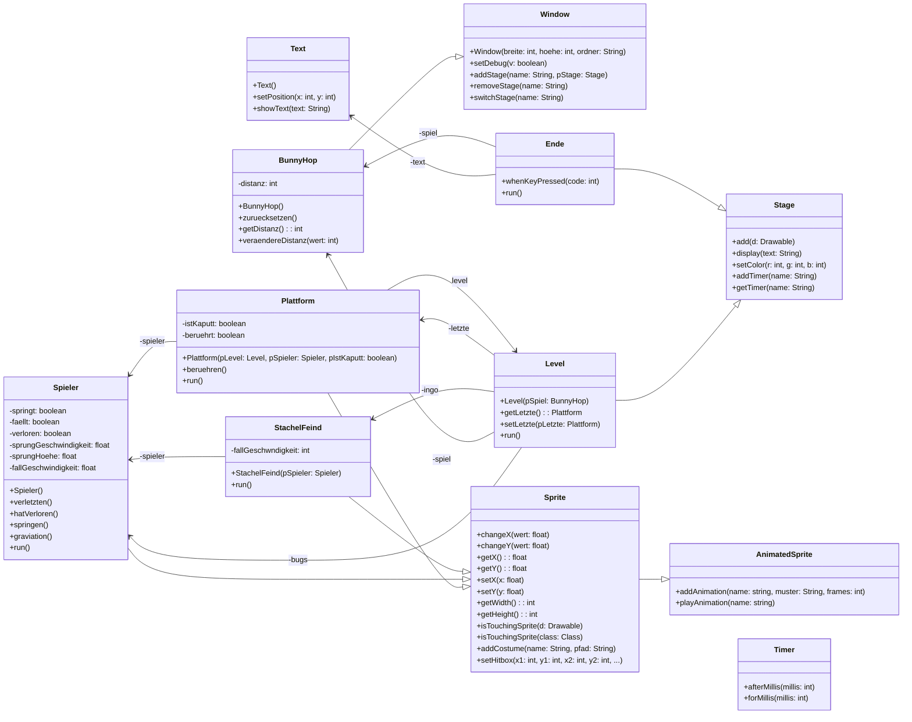

# Ideen sammeln

Ihr habt jetzt die Grundlagen der Scratch for Java Bibliothek und der Spieleentwicklung gelernt. Nun sollt ihr eure eigenen Ideen in das Spiel einbringen. Vielleicht wollt ihr:

- neue Grafiken
- verschiedene Feinde
- Power Ups
- Lücken im Boden
- ...

Damit alle auf dem gleichen Stand sind, könnt ihr das Bugs-Starter-Projekt benutzen.

::archive[Bugs Starter]{name="bunny-hop-bugs-starter"}

In dem Bug-Starter-Projekte sind noch weitere Features implementiert, die euch auch zur Inspiration dienen sollen. Das folgende Klassendiagram zeigt die Klassen und Beziehungen im Bugs-Starter-Projekt.

## Aufgaben

### Programmverständnis

1. Ladet das Bugs-Starter-Projekt herunter.
2. Bearbeitet die folgenden Fragen zum Quelltext:
    1. Gebt die Quelltextzeilen an, in denen die Methode `veraendereDistanz` der BunnyHop-Klasse aufgerufen wird.
    2. Beschreibt in eigenen Worten was die Methode `zuruecksetzen` der BunnyHop-Klasse tut.
    3. Beschreibt, was in der for-Schleife im Konstruktor der Level-Klasse passiert. 
    4. Erklärt was passieren muss, damit ein Objekt der Klasse Ende zu sehen ist.
3. Schaut in den restlichen Quelltext des Bugs-Starter-Projekts und sammelt Quelltextzeilen, die ihr nicht nachvollziehen könnt.
4. Spielt das Spiel und sammelt auf eurem Kanbandboard (siehe Taskcards eurer Gruppe) Ideen, die ihr umsetzen möchtet.
